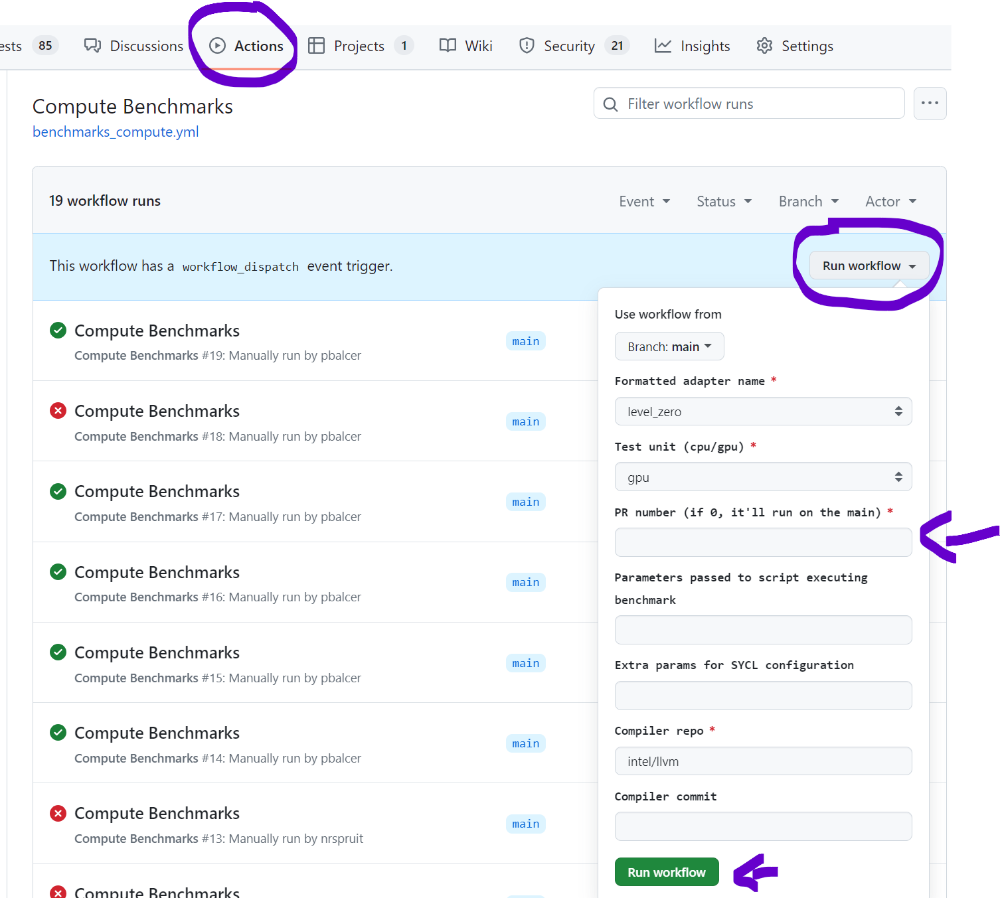

# Unified Runtime Benchmark Runner

Scripts for running performance tests on SYCL and Unified Runtime.

## Benchmarks

- [Velocity Bench](https://github.com/oneapi-src/Velocity-Bench)
- [Compute Benchmarks](https://github.com/intel/compute-benchmarks/)
- [LlamaCpp Benchmarks](https://github.com/ggerganov/llama.cpp)
- [SYCL-Bench](https://github.com/unisa-hpc/sycl-bench)

## Running

`$ ./main.py ~/benchmarks_workdir/ --sycl ~/llvm/build/ --ur ~/ur --adapter adapter_name`

This will download and build everything in `~/benchmarks_workdir/` using the compiler in `~/llvm/build/`, UR source from `~/ur` and then run the benchmarks for `adapter_name` adapter. The results will be stored in `benchmark_results.md`.

The scripts will try to reuse the files stored in `~/benchmarks_workdir/`, but the benchmarks will be rebuilt every time. To avoid that, use `--no-rebuild` option.

## Running in CI

The benchmarks scripts are used in a GitHub Actions worflow, and can be automatically executed on a preconfigured system against any Pull Request.

To execute the benchmarks in CI, navigate to the `Actions` tab and then go to the `Compute Benchmarks` action. Here, you will find a list of previous runs and a "Run workflow" button. Upon clicking the button, you will be prompted to fill in a form to customize your benchmark run. The only mandatory field is the `PR number`, which is the identifier for the Pull Request against which you want the benchmarks to run.

You can also include additional benchmark parameters, such as environment variables or filters. For a complete list of options, refer to `$ ./main.py --help`.

Once all the required information is entered, click the "Run workflow" button to initiate a new workflow run. This will execute the benchmarks and then post the results as a comment on the specified Pull Request.

You must be a member of the `oneapi-src` organization to access these features.

## Comparing results

By default, the benchmark results are not stored. To store them, use the option `--save <name>`. This will make the results available for comparison during the next benchmark runs.

You can compare benchmark results using `--compare` option. The comparison will be presented in a markdown output file (see below). If you want to calculate the relative performance of the new results against the previously saved data, use `--compare <previously_saved_data>` (i.e. `--compare baseline`). In case of comparing only stored data without generating new results, use `--dry-run --compare <name1> --compare <name2> --relative-perf <name1>`, where `name1` indicates the baseline for the relative performance calculation and `--dry-run` prevents the script for running benchmarks. Listing more than two `--compare` options results in displaying only execution time, without statistical analysis.

Baseline_L0, as well as Baseline_L0v2 (for the level-zero adapter v2) is updated automatically during a nightly job. The results
are stored [here](https://oneapi-src.github.io/unified-runtime/performance/).

## Output formats
You can display the results in the form of a HTML file by using `--ouptut-html` and a markdown file by using `--output-markdown`. Due to character limits for posting PR comments, the final content of the markdown file might be reduced. In order to obtain the full markdown output, use `--output-markdown full`.

## Requirements

### Python

dataclasses-json==0.6.7
PyYAML==6.0.2
Mako==1.3.0

### System

Sobel Filter benchmark:

`$ sudo apt-get install libopencv-dev`

### Compute-runtime and IGC

The scripts have an option to build compute-runtime and all related components from source:

`$ ./main.py ~/benchmarks_workdir/ --compute-runtime [tag] --build-igc`

For this to work, the system needs to have the appropriate dependencies installed.

compute-runtime (Ubuntu):

`$ sudo apt-get install cmake g++ git pkg-config`

IGC (Ubuntu):

`$ sudo apt-get install flex bison libz-dev cmake libc6 libstdc++6 python3-pip`
