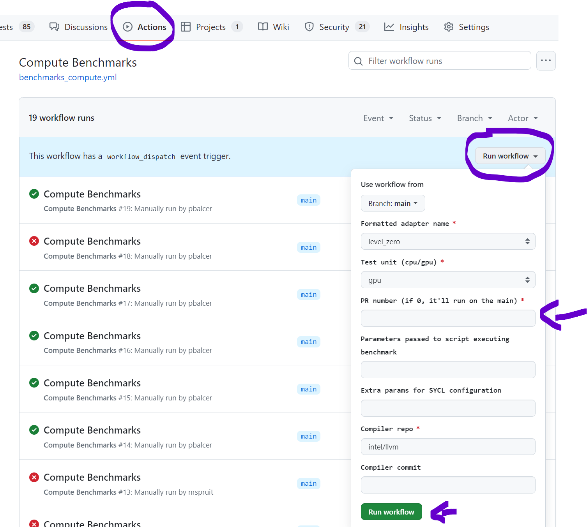

# Unified Runtime Benchmark Runner

Scripts for running performance tests on SYCL and Unified Runtime.

## Benchmarks

- [Velocity Bench](https://github.com/oneapi-src/Velocity-Bench)
- [Compute Benchmarks](https://github.com/intel/compute-benchmarks/)

## Running

`$ ./main.py ~/benchmarks_workdir/ ~/llvm/build/ ~/ur adapter_name`

This will download and build everything in `~/benchmarks_workdir/` using the compiler in `~/llvm/build/`, UR source from `~/ur` and then run the benchmarks for `adapter_name` adapter. The results will be stored in `benchmark_results.md`.

The scripts will try to reuse the files stored in `~/benchmarks_workdir/`, but the benchmarks will be rebuilt every time. To avoid that, use `-no-rebuild` option.

## Running in CI

The benchmarks scripts are used in a GitHub Actions worflow, and can be automatically executed on a preconfigured system against any Pull Request.

To execute the benchmarks in CI, navigate to the `Actions` tab and then go to the `Compute Benchmarks` action. Here, you will find a list of previous runs and a "Run workflow" button. Upon clicking the button, you will be prompted to fill in a form to customize your benchmark run. The only mandatory field is the `PR number`, which is the identifier for the Pull Request against which you want the benchmarks to run.

You can also include additional benchmark parameters, such as environment variables or filters. For a complete list of options, refer to `$ ./main.py --help`.

Once all the required information is entered, click the "Run workflow" button to initiate a new workflow run. This will execute the benchmarks and then post the results as a comment on the specified Pull Request.

By default, all benchmark runs are compared against `baseline`, which is a well-established set of the latest data.

You must be a member of the `oneapi-src` organization to access these features.

## Comparing results

By default, the benchmark results are not stored. To store them, use the option `--save <name>`. This will make the results available for comparison during the next benchmark runs.

To compare a benchmark run with a previously stored result, use the option `--compare <name>`. You can compare with more than one result.

If no `--compare` option is specified, the benchmark run is compared against a previously stored `baseline`.

Baseline, as well as baseline-v2 (for the level-zero adapter v2) is updated automatically during a nightly job. The results
are stored [here](https://oneapi-src.github.io/unified-runtime/benchmark_results.html).

## Requirements

### Python

dataclasses-json==0.6.7

### System

libopencv-dev
