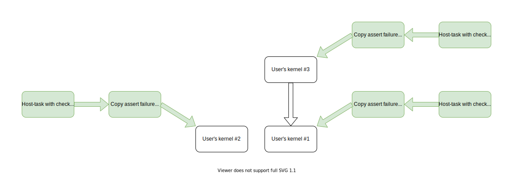

# Assert feature

**IMPORTANT**: This document is a draft.

Using the standard C++ `assert` API ("assertions") is an important debugging
technique widely used by developers. This document describes the design of
supporting assertions within SYCL device code.
The basic approach we chose is delivering device-side assertions as call to
`std::abort()` at host-side.

As usual, device-side assertions can be disabled by defining `NDEBUG` macro at
compile time.

## Use-case example

```c++
#include <cassert>
#include <sycl/sycl.hpp>

using namespace sycl;

void user_func(item<2> Item) {
  assert((Item[0] % 2) && “Nil”);
}

int main() {
  queue Q;
  Q.submit([&] (handler& CGH) {
    CGH.parallel_for<class TheKernel>(range<2>{N, M}, [=](item<2> It) {
      do_smth();
      user_func(It);
      do_smth_else();
    });
  });
  Q.wait();
  std::cout << “One shouldn’t see this message.“;
  return 0;
}
```

In this use-case every work-item with even index along 0 dimension will trigger
assertion failure. Assertion failure should trigger a call to `std::abort()` at
host as described in
[extension](extensions/Assert/SYCL_INTEL_ASSERT.asciidoc).
Even though multiple failures of the same or different assertions can happen in
multiple work-items, implementation is required to deliver at least one
assertion. The assertion failure message is printed to `stderr` by DPCPP
Runtime or underlying backend.

When multiple kernels are enqueued and more than one fail at assertion, at least
one assertion should be reported.


## User requirements

From user's point of view there are the following requirements:

| # | Title | Description | Importance |
| - | ----- | ----------- | ---------- |
| 1 | Abort DPC++ application | Abort host application when assert function is called and print a message about assertion | Must have |
| 2 | Print assert message | Assert function should print message to stderr at host | Must have |
| 3 | Stop under debugger | When debugger is attached, break at assertion point | Highly desired |
| 4 | Reliability | Assert failure should be reported regardless of kernel deadlock | Highly desired |

Implementations without enough capabilities to implement fourth requirement are
allowed to realize the fallback approach described below, which does not
guarantee assertion failure delivery to host, but is still useful in many
practical cases.


## Terms

 - Device-side Runtime - runtime library supplied by the Native Device Compiler
   and running on the device.
 - Native Device Compiler - compiler which generates device-native binary image
   based on input SPIR-V image.
 - Low-level Runtime - the backend/runtime behind DPCPP Runtime attached via the
   Plugin Interface.


## How it works?

`assert(expr)` macro ends up in call to `__devicelib_assert_fail`. This function
is part of [Device library extension](extensions/C-CXX-StandardLibrary/DeviceLibExtensions.rst#cl_intel_devicelib_cassert).

The format of the assert message is unspecified, but it will always include the
text of the failing expression, the values of the standard macros `__FILE__` and
`__LINE__`, and the value of the standard variable `__func__`. If the failing
assert comes from an `nd_range` `parallel_for` it will also include the global
ID and the local ID of the failing work item.

Implementation of this function is supplied by Native Device Compiler for
safe approach or by DPCPP Compiler for fallback one.

In order to distinguish which implementation to use, DPCPP Runtime checks for
`PI_INTEL_DEVICELIB_CASSERT` extension. If the extension isn't available, then
fallback implementation is used.


## Safe approach

This is the preferred approach and implementations should use it when possible.
It guarantees assertion failure notification delivery to the host regardless of
kernel behavior which hit the assertion. If backend suports the safe approach,
it must report this capability to DPCPP Runtime via the
`PI_INTEL_DEVICELIB_CASSERT` extension query.

The Native Device Compiler is responsible for providing implementation of
`__devicelib_assert_fail` which completely hides details of communication
between the device code and the Low-Level Runtime from the SYCL device compiler
and runtime. The Low-Level Runtime is responsible for:
 - detecting if assert failure took place;
 - flushing assert message to `stderr` on host.

The following sequence of events describes how user code gets notified:
 - Device side:
   1. Assert fails in device-code in kernel
      // It's not defined if GPU thread stops execution
      // Other GPU threads are left untouched
   2. Specialized version of `__devicelib_assert_fail` is called
   3. Device immediately signals to host (Low-Level Runtime)
 - Host side:
   1. The assert failure gets detected by Low-Level Runtime
   2. Low-Level Runtime prints assert failure message to `stderr`
   3. Low-Level Runtime calls `abort()`


## Fallback approach

If Device-side Runtime doesn't support `__devicelib_assert_fail` (as reported
via `PI_INTEL_DEVICELIB_CASSERT` extension query) then a fallback approach comes
in place. The approach doesn't require any support from Device-side Runtime and
Native Device Compiler. Neither it does from Low-level Runtime.

Within this approach, a mutable program scope variable is introduced. This
variable stores a flag which says if an assert failure was encountered. Fallback
implementation of `__devicelib_assert_fail` atomically raises the flag so that
DPCPP Runtime is able to detect assert failure after kernel finishes.

The following sequence of events describes how user code gets notified:
 - Device side:
   1. Assert fails in device-code in kernel
   2. Fallback version of `__devicelib_assert_fail` is called
   3. Assert information is stored into program-scope variable
   4. Kernel continues running
 - Host side:
   1. A copy 'kernel' is enqueued as the one depending on user's kernel to get
      the value of assert failure flag.
   2. A host-task is enqueued to check value of assert failure flag.
   3. The host task calls abort whenever assert failure flag is set.

DPCPP Runtime will automatically check if assertions are enabled in the kernel
being run, and won't enqueue the auxiliary kernels if assertions are not
enabled. So there is no host-side runtime overhead when assertion are not
enabled.

Illustrating this with an example, lets assume the user enqueues three kernels:
 - `Kernel #1`, uses assert
 - `Kernel #2`, uses assert
 - `Kernel #3`, uses assert and depends on `Kernel #1`

The resulting graph will look like this: 

### Interface to program scope variable

Multiple translation units could be compiled/linked into a single device binary
image. All of them should have `extern` declaration of program scope variable
available. Definition of the variable is only available within devicelib in the
same binary image where fallback `__devicelib_assert_fail` resides.

<a name="prog-scope-var-decl">The variable has the following structure and
declaration:</a>

```c++
namespace cl {
namespace sycl {
namespace detail {
struct AssertHappened {
  int Flag = 0;
};
}
}
}

#ifdef __SYCL_DEVICE_ONLY__
extern SYCL_GLOBAL_VAR AssertHappened AssertHappenedMem;
#endif
```

Here, `SYCL_GLOBAL_VAR` is a macro which wraps special attribute to allow for
mutable program-scope variable.

The reference to extern variable is resolved within online-linking against
fallback devicelib.

### Online-linking fallback `__devicelib_assert_fail`

Online linking against fallback implementation of `__devicelib_assert_fail` is
performed only when assertion is enabled and Device-side Runtime doesn't provide
implementation of `__devicelib_assert_fail`.

In DPCPP headers one can see if assert is enabled with status of `NDEBUG` macro
with `#ifdef`'s. When in DPCPP Runtime Library this knowledge is obtained from
device binary image descriptor's property sets.

Each device image is supplied with an array of property sets. For description
of property sets see `struct pi_device_binary_struct` in
[`pi.h`](https://github.com/intel/llvm/blob/sycl/sycl/include/CL/sycl/detail/pi.h#L692)

A distinct property set `SYCL/assert used` is added. In this set a property
with the name of the kernel is added whenever the kernel uses assert. The use of
assert is detected by a specific LLVM IR pass invoked by the `sycl-post-link`
tool which runs on linked device code, i.e. after linking with the `libsycl-crt`
library which defines the assert function. The pass builds complete call graph
for a kernel, and sees if there's a call to `__devicelib_assert_fail` anywhere
in the graph. If found, `sycl-post-link` adds the property for the kernel.

The same is done for all indirect callable functions (marked with specific
attribute) found in the linked device code. Those are functions whose pointers
can be taken and passed around in device code. If a callgraph for any such
function has a call to `__devicelib_assert_fail`, then all kernels in the module
are conservatively marked as using asserts.

The added property is used for:
 - deciding if online-linking against fallback devicelib is required;
 - if there's a need to enqueue program scope variable copier kernel and checker
   host-task.

Suppose the following example user code:
```c++
void user_func(int X) {
  assert(X && “X is nil”);
}

int main() {
  queue Q(...);
  Q.submit([&] (handler& CGH) {
    CGH.single_task([=] () {
      do_smth();
      user_func(0);
      do_smth_else();
    });
  });
  ...
}
```

The following LLVM IR pseudo code will be generated after linking against
fallback implementation of devicelib:
```
@AssertHappenedMem = global AssertHappened

/// user's code
void user_func(int X) {
if (!(X && “X is nil")) {
    __assert_fail(...);
  }
}

kernel(...) {
  do_smth()
  user_func(0);
  do_smth_else();
}

/// __assert_fail belongs to Linux version of devicelib
void __assert_fail(...) {
  ...
  __devicelib_assert_fail(...);
}

void __devicelib_assert_fail(Expr, File, Line, GlobalID, LocalID) {
  ...
  volatile int *Ptr = (volatile int *)AssertHappenedMem.Flag;
  int Expected = 0;
  int Desired = 1;

  if (atomic_CAS(&AssertHappenedMem.Flag, Expected, Desired))
    printf("Assertion `%s' failed in %s at line %i. GlobalID: %i, LocalID: %i",
           Expr, File, Line, GlobalID, LocalID);
}
```

#### Compiling with assert enabled/disabled

Consider the following example sources:
```c++
// impl.cpp
using namespace sycl;
int calculus(int X) {
  assert(X && "Invalid value");
  return X * 2;
}

void enqueueKernel(queue &Q, buffer &B) {
  Q.submit([](handler &H) {
    auto Acc = B.get_access<read_write>(H);
    H.parallel_for(/* range */, [](item It) {
      assert(Acc[It]);
      // ...
    });
  });
}

// main.cpp
// ...
using namespace sycl;

SYCL_EXTERNAL int calculus(int);
void enqueueKernel(queue&, buffer&);

void workload() {
  queue Q;
  buffer B;

  Q.submit([](handler &H) {
    auto Acc = B.get_access<read_write>(H);
    H.parallel_for(/* range */, [](item It) {
      int X = calculus(0); // should fail assertion
      assert(X && "Nil in result");
      Acc[It] = X;
    });
  });

  enqueueKernel(Q, B);
  ...
}
```

These two files are compiled into a single binary application. There are four
states of definition of `NDEBUG` macro available:

| # | `impl.cpp` | `main.cpp` |
| - | ---------- | ---------- |
| 1 | defined    | defined    |
| 2 | defined    | undefined  |
| 3 | undefined  | defined    |
| 4 | undefined  | undefined  |

States of definition of `NDEBUG` macro defines the set of assertions which can
fail.

### Raising assert failure flag and reading it on host

In DPCPP headers one can see if assert is enabled with status of `NDEBUG` macro
with `#ifdef`'s. Though, in order to support for multi translation unit use-case
it's not allowed to rely on definition of `NDEBUG` macro.

*Note: Multi translation unit use-case here is the one with `SYCL_EXTERNAL`
function compiled with assertions enabled and used in a kernel  but the kernel
is compiled with assertions disabled.*

There're two commands used for reading assert failure flag: copy kernel and
checker host task. The copy kernel will copy `AssertHappenedMem` to host and
host-task will check the `Flag` value and `abort()` as needed. The kernel and
host task are enqueued together with a kernel only when the corresponding device
binary image for this kernel tells that it may use (maybe indirectly) the
`assert` in its code.

All translation units provided by the user should have a declaration of the
assert flag read function available:
```c++
int __devicelib_assert_read(void);
```
Also, the [AssertHappened](#prog-scope-var-decl) structure type should be
available for the copier kernel.

The definition is only provided within devicelib along with
`__devicelib_assert_fail` function which raises the flag.

Reading of assert failure flag is performed with the help of auxiliary kernel
which is enqueued as dependent on user's one. The flag state is checked later
in host-task. This is achieved with approximately the following changes:

```c++
class AssertFlagCopier;
#ifdef __SYCL_DEVICE_ONLY__
int __devicelib_assert_read(void);
#endif

class queue {
  template <typename T> event submit(T CGF) {
    event Event = submit_impl(CGF);
    std::string KernelName = /* get kernel name from calls to parallel_for, etc. */;
    // assert required
    if (!get_device()->assert_fail_supported() && isAssertUsed(KernelName)) {
      // __devicelib_assert_fail isn't supported by Device-side Runtime
      // Linking against fallback impl of __devicelib_assert_fail is performed
      // by program manager class
      AssertHappened *AH = new AssertHappened;
      buffer<AssertHappened, 1> *Buffer = new buffer<AssertHappened, 1>{1, AH};

      // read flag value
      event CopierEv = submit_impl([&](handler &CGH) {
        CGH.depends_on(Event);

        auto Acc = Buffer->get_access<access::mode::write>(CGH);

        CGH.single_task<AssertFlagCopier>([=] {
#ifdef __SYCL_DEVICE_ONLY__
          Acc[0].Flag = __devicelib_assert_read();
#endif
        });
      });

      // check flag state
      submit_impl([=](handler &CGH) {
        CGH.depends_on(CopierEv);

        CGH.codeplay_host_task([=] {
          if (AH->Flag)
            abort();

          free(Buffer);
          free(AH);
        });
      });
    }
    return Event;
  }
};
```

