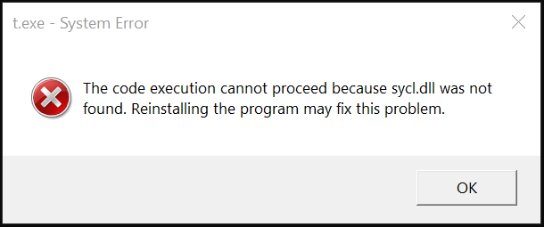

# Frequently Asked Questions

**Table of contents**

1. [Developing with DPC++](#developing-with-dpc)
1. [Using applications built with DPC++](#using-applications-built-with-dpc)
1. [Common issues](#common-issues)
1. [Device specific questions and issues](#device-specific-questions-and-issues)


## Developing with DPC++

### Q: What do I need to start developing with DPC++?
**A:** To get the full DPC++ experience you need oneAPI DPC++ compiler. DPC++
compiler provides you with both host and device side compilation. Another
requirement for code offloading to specialized devices is a compatible OpenCL
runtime. Our [Get Started Guide](GetStartedGuide.md) will help you
set up a proper environment. To learn more about using the DPC++ compiler,
please refer to [Users Manual](UsersManual.md). If using a special compiler
is not an option for you and/or you would like to experiment without offloading
code to non-host devices, you can exploit SYCL's host device feature. This
gives you the ability to use any C++17 compiler. You will need to link your
application with the DPC++ Runtime library and provide a path to the SYCL
headers directory. Please, refer to your compiler manual to learn about
specific build options.

### Q: How are DPC++ compilation phases different from those of a usual C++ compiler? Can I customize this flow for my applications?
**A:** Due to the fact that both host and device code need to be compiled and
linked into the final binary, the compilation steps sequence is more
complicated compared to the usual C++ flow.

In general, we encourage our users to rely on the DPC++ Compiler for
handling all of the compilation phases "under the hood". However,
certain use-cases may involve third-party compiler usage for host-side
compilation. The DPC++ compiler provides the
`-fsycl-host-compiler=<compiler_name>` option, which allows one to
specify the desired third-party compiler name. Usage example:

```
clang++ -fsycl -fsycl-host-compiler=g++
-fsycl-host-compiler-options="-g" test.cpp
```


Implicitly, the above command would:
1. turn to the DPC++ compiler for compiling the device code for the
needed target(s) and generating dependencies ("integration files") for
the host side;
2. detect your preferred host compiler (`g++`, in this case), then use
it to compile your host code and the dependency files from 1) into
host object file(s);
3. link the device image(s) from 1) and the host object(s) from 2)
into the final executable.

To learn more about the compiler options mentioned, and the DPC++
compiler command-line interface in general, please refer to the
[DPC++ Compiler User Manual](UsersManual.md).
To learn more about the concepts behind this flow, and the DPC++
Compiler internals as such, we welcome you to study our
[DPC++ Compiler and Runtime architecture design](
CompilerAndRuntimeDesign.md) document.


## Using applications built with DPC++

### Q: What happens if I run my application on a machine without OpenCL?
**A:** If you use the default SYCL device selector (or any other selector that
allows host device), then a fallback to the host device will take place.
Otherwise, an exception will be thrown.


## Common issues

### Q: DPC++ application complains about missing libsycl.so (or sycl.dll) library.
Linux:
```
$ ./app
$ ./app: error while loading shared libraries: libsycl.so: cannot open shared object file: No such file or directory
```
Windows:



*The code execution cannot proceed because sycl.dll was not found. Reinstalling
the program may fix this problem.*

**A:** The DPC++ Runtime library is required to run DPC++ applications.
While compiler driver is able to find the library and link against it, your
operating system may struggle. Make sure that the location of the DPC++ Runtime
library is listed in the correct environment variable: `LD_LIBRARY_PATH`
(for Linux) or `LIB` (for Windows).

### Q: DPC++ Compiler fails to compile device code that uses STD functions.
Example error message:
```
In file included from example.cpp:1:
In file included from C:\compiler\lib\clang\10.0.0\include\CL/sycl.hpp:11:
In file included from C:\compiler\lib\clang\10.0.0\include\CL/sycl/accessor.hpp:13:
In file included from C:\compiler\lib\clang\10.0.0\include\CL/sycl/buffer.hpp:10:
In file included from C:\compiler\lib\clang\10.0.0\include\CL/sycl/detail/buffer_impl.hpp:14:
In file included from C:\compiler\lib\clang\10.0.0\include\CL/sycl/detail/aligned_allocator.hpp:16:
C:\Program Files (x86)\Microsoft Visual Studio\2019\Professional\VC\Tools\MSVC\14.22.27905\include\algorithm(4493,9): error: SYCL kernel cannot call a
      dllimport function
        _STL_ASSERT(!(_Left < _Right), "invalid comparator");
        ^
C:\Program Files (x86)\Microsoft Visual Studio\2019\Professional\VC\Tools\MSVC\14.22.27905\include\yvals.h(193,33): note: expanded from macro '_STL_ASSERT'
#define _STL_ASSERT(cond, mesg) _STL_VERIFY(cond, mesg)
                                ^
C:\Program Files (x86)\Microsoft Visual Studio\2019\Professional\VC\Tools\MSVC\14.22.27905\include\yvals.h(186,13): note: expanded from macro '_STL_VERIFY'
            _STL_REPORT_ERROR(mesg);                                \
            ^
C:\Program Files (x86)\Microsoft Visual Studio\2019\Professional\VC\Tools\MSVC\14.22.27905\include\yvals.h(178,9): note: expanded from macro
      '_STL_REPORT_ERROR'
        _RPTF0(_CRT_ASSERT, mesg);           \
        ^
C:\Program Files (x86)\Windows Kits\10\include\10.0.18362.0\ucrt\crtdbg.h(760,37): note: expanded from macro '_RPTF0'
    #define _RPTF0(rptno, msg)      _RPT_BASE(rptno, __FILE__, __LINE__, NULL, "%s", msg)
                                    ^
C:\Program Files (x86)\Windows Kits\10\include\10.0.18362.0\ucrt\crtdbg.h(747,23): note: expanded from macro '_RPT_BASE'
        (void) ((1 != _CrtDbgReport(__VA_ARGS__)) || \
                      ^
C:\Program Files (x86)\Windows Kits\10\include\10.0.18362.0\ucrt\crtdbg.h(607,26): note: '_CrtDbgReport' declared here
    _ACRTIMP int __cdecl _CrtDbgReport(
```

**A:** Section 6.3 of the SYCL specification says:
>  Implementations are not required to support any library routines in kernels
>  beyond those explicitly mentioned as usable in kernels in this spec.

Replace usage of STD built-ins with SYCL-defined math built-ins. Please, note
that you have to explicitly specify built-in namespace (i.e. `cl::sycl::fmin`).
The full list of SYCL math built-ins is provided in section 4.13.3 of the
specification.


## Device specific questions and issues

### Q: What devices are supported by DPC++ compiler?
**A:** By design, DPC++ and SYCL are closely connected to OpenCL, which is used
to offload code to specialized devices. DPC++ compiler currently makes use of
SPIR-V, a portable intermediate representation format. It is a core feature of
OpenCL 2.1, so any device, capable of OpenCL 2.1, should be supported.
Otherwise, your OpenCL device must support `cl_khr_il_program` extension.

Apart from that, there's also the so-called host device, which can be used when
no suitable OpenCL device is found. The host device will use your host CPU as
the offload target for kernel execution. Since the device code is also compiled
for the host CPU and no JIT is required, you can easily use any classic C++
debugging tools of your choice for the host device code.

Furthermore, developers can extend capabilities of the DPC++ Runtime to
non-OpenCL devices by writing correspondent plugins. To learn more, please
check out our [Plugin Interface Guide](PluginInterface.md).

### Q: DPC++ applications hang on Intel GPUs while working well on other devices
**A:** One of the common reasons is Intel GPUs feature called "hang check".
If your workload runs for more than a certain amount of time, it will be killed
by hardware. From the application point of view this looks like a hang. To
allow heavy kernels to be executed, disable hang check. **Please, note that
other apps on your system may contain bugs, and disabling "hang check" may lead
to real hangs.**

You can find out more about hang check and how to disable it on
[this page](https://software.intel.com/en-us/articles/installation-guide-for-intel-oneapi-toolkits).
