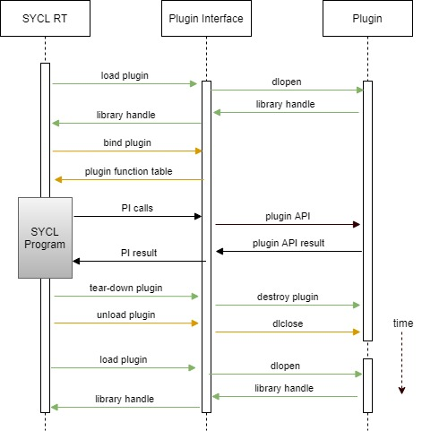

# Global objects in DPC++ runtime

## Intro

C++ standard does not specify the order in which global objects are constructed
or destroyed. If global objects somehow interact with each other, there's a
chance, that one of the objects has not been initialized or has been destroyed
by the time of interaction. This problem is also refered to as 
[static initialization order fiasco].

The only two things C++ guarantees is that global objects are constructed before
program enters `main` and within one translation unit objects will be 
constructed in the same order as they occur in code. Initialization order 
between translation units is undefined.

At the same time, SYCL users may want to construct some SYCL objects globally,
like in example below:

```
#include <CL/sycl.hpp>

sycl::queue Queue;

int main() {
  Queue = sycl::queue{sycl::default_selector{}.select_device()};

  return 0;
}
```

While the above piece of code is syntactically correct, it is still an undefined
behavior from C++ standard point of view. There are a few places in the runtime,
where global objects arise: scheduler, program manager, plugins, low-level
runtimes. To prevent crashes in such scenarios, the DPC++ runtime must ensure
global objects lifetime is long enough.

## DPC++ runtime

### General idea

Different platforms may handle global initialization and deinitialization
differently (for example, see [Itanium ABI]). So, handling global objects
lifetime is platform-dependent. However, there's a common idea behind those
approaches.

DPC++ wraps all complex global objects in a special structure, called 
`GlobalHandler`. The runtime stores a global pointer to that structure, and
initializes it on first call to `GlobalHandler::instance()` method (singleton
pattern). The `GlobalHandler` provides getter methods to access different
objects. Those objects are stored in `std::unique_ptr`s, that are initialized
on first call to getter member function. This way DPC++ runtime ensures, that
no unwanted initialization happens before object is requested.

Deinitialization is platform-specific. Upon application shutdown, the DPC++
runtime frees memory pointed by `GlobalHandler` global pointer, which triggers
destruction of nested `std::unique_ptr`s.

### Linux

On Linux DPC++ runtime uses `__attribute__((destructor))` property with low
priority value 110. This approach does not guarantee, that `GlobalHandler`
destructor is the last thing to run, as user code may contain a similar function
with the same priority value. At the same time, users may specify priorities
within [101, 109] range in order to run destructor after SYCL runtime has been
de-initialized. A destructor without specific priority value is going to be
executed before runtime shutdown mechanisms.

Another approach would be to leak global objects. This would guarantee user,
that global objects live long enough. But some global objects allocate heap
memory. If user application uses `dlopen` and `dlclose` on `libsycl.so` many
times, the memory leak may impact code performance.

### Windows

To identify shutdown moment on Windows, DPC++ runtime uses default `DllMain`
function with `DLL_PROCESS_DETACH` reason. This guarantees, that global objects
deinitialization happens right before `sycl.dll` is unloaded from process
address space.

### Recommendations for DPC++ runtime developers

There are a few things to keep in mind, when developing DPC++ runtime:

- It is fine to have global objects with trivial constructor and destructor.
These objects can be zero initialized, and there's no deinitialization procedure
for such objects. This is why `int`, `bool`, and other objects of trivial types
are not wrapped with `GlobalHandler`.
- `std::mutex` is not guaranteed to be trivial. Either wrap it with
`GlobalHandler` or consider using `sycl::detail::SpinLock`, which has trivial
constructor and destructor.

## Plugins

Plugin lifetime is managed by utilizing piPluginInit() and piTearDown().
GlobalHandler::shutdown() will tear down all registered globals before SYCL RT
library is unloaded. It will invoke piTearDown() and unload() for each
plugin. piTearDown() is going to perform any necessary tear-down process at the
plugin PI level. These two APIs allow on-demand plugin lifetime management. SYCL
RT can control the beginning and the end of the plugin. 



## Low-level runtimes

Generally, DPC++ runtime has no control over its dependencies. Such libraries
can have global objects of their own. If you observe problems with dependency
library, please, report it to library maintainers.

[static initialization order fiasco]: https://isocpp.org/wiki/faq/ctors#static-init-order
[Itanium ABI]: https://itanium-cxx-abi.github.io/cxx-abi/abi.html#dso-dtor
