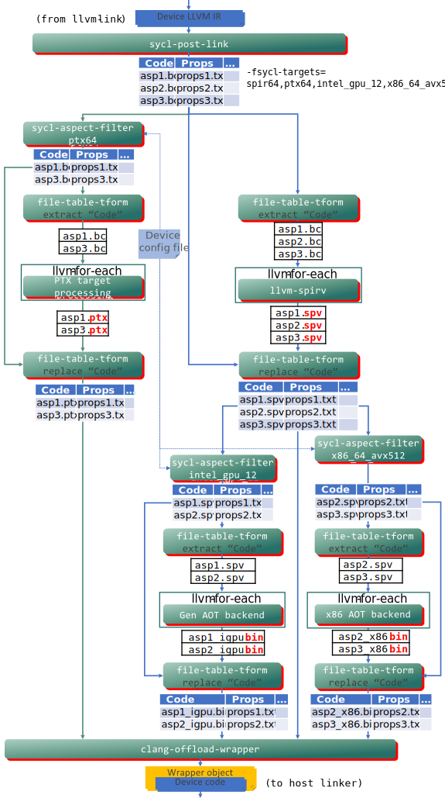

# Behavior for optional kernel features

This design document describes the changes that are needed in DPC++ in order to
conform to the SYCL 2020 specification regarding the behavior of applications
that use optional kernel features.  An optional kernel feature is any feature
that is supported by some devices and not by others.  For example, not all
devices support 16-bit floating point operations, so the `sycl::half` data type
is an optional kernel feature.  Some DPC++ extensions like AMX are also
optional kernel features.

The requirements for this design come mostly from the SYCL 2020 specification
[section 5.7 "Optional kernel features"][1] but they also encompass the C++
attribute `[[sycl::requires()]]` that is described in [section 5.8.1 "Kernel
attributes"][2] and [section 5.8.2 "Device function attributes"][3].

[1]: <https://www.khronos.org/registry/SYCL/specs/sycl-2020/html/sycl-2020.html#sec:optional-kernel-features>
[2]: <https://www.khronos.org/registry/SYCL/specs/sycl-2020/html/sycl-2020.html#sec:kernel.attributes>
[3]: <https://www.khronos.org/registry/SYCL/specs/sycl-2020/html/sycl-2020.html#_device_function_attributes>


## Requirements

There are several categories of requirements covered by this design.  Each of
these is described in more detail in the sections that follow:

* The front-end compiler must issue a diagnostic in some cases when a kernel or
  device function uses an optional feature.  However, the front-end compiler
  must **not** generate a diagnostic in other cases.

* The runtime must raise an exception when a kernel using optional features
  is submitted to a device that does not support those features.  This
  exception must be raised synchronously from the kernel invocation command
  (e.g. `parallel_for()`).

* The runtime must not raise an exception (or otherwise fail) merely due to
  speculative compilation of a kernel for a device, when the application does
  not specifically submit the kernel to that device.


### Clarification of a kernel's static call graph

Some of the requirements below refer to the "static call graph" of a kernel.
In standard SYCL, device code is not allowed to contain function pointers,
virtual functions, or indirect function calls.  It is therefore easy to compute
the static call graph of a kernel.  By starting at the kernel function itself
(e.g.  the function passed to `parallel_for`), the compiler can identify all
functions called by that function, then it can find all functions called by
those functions, etc.  Depending on the tool which does the analysis, the
"static call graph" could include only those functions that reside in the same
translation unit as the kernel, or it could include all functions that reside
in the same executable image (or shared library) as the kernel.  In the
sections below, we try to make the distinction clear whenever we refer to a
kernel's static call graph.

We are contemplating a DPC++ extension that would allow some limited use of
function pointers in device code.  This feature is not yet fully defined or
supported.  We expect that the semantics of this feature will include some way
for the compiler to deduce a limited set of possible targets for each indirect
function call.  Therefore, it is still possible for the compiler to construct a
"static call graph" for each kernel, the only difference is that each call site
now adds a set of possible target functions to a kernel's static call graph.
The details about how this will work are expected to be included in the DPC++
extension specification that enables indirect function calls.


### Diagnostics from the front-end compiler

By "front-end compiler", we mean the DPC++ compiler which parses DPC++ source
code, not the JIT compiler that translates SPIR-V into native code.

In general, the front-end compiler does not know which kernels the application
will submit to which devices.  Therefore, the front-end compiler does not
generally know which optional features a kernel can legally use.  Thus, in
general, the front-end compiler must not issue any diagnostic simply because a
kernel uses an optional feature.

The only exception to this rule occurs when the application uses the C++
attribute `[[sycl::requires()]]`.  When the application decorates a kernel or
device function with this attribute, it is an assertion that the kernel or
device function is allowed to use only those optional features which are listed
by the attribute.  Therefore, the front-end compiler must issue a diagnostic if
the kernel or device function uses any other optional kernel features.

The SYCL 2020 specification only mandates this diagnostic when a kernel or
device function that is decorated with `[[sycl::requires()]]` uses an optional
kernel feature (not listed in the attribute), **and** when that use is in the
kernel's static call graph as computed for the translation unit that contains
the kernel function.  Thus, the compiler is not required to issue a diagnostic
if the use is in a `SYCL_EXTERNAL` function that is defined in another
translation unit.

It turns out, though, that DPC++ can diagnose this case at link time, when we
have visibility into device functions that are defined in other translation
units.  Since the design proposed below allows this diagnostic to be checked
with minimal extra effort, it is desirable to do so.

Note that this behavior does not change when the compiler runs in AOT mode.
Even if the user specifies a target device via "-fsycl-targets", that does not
necessarily mean that the user expects all the code in the application to be
runnable on that device.  Consider an application that uses some middleware
library, where the library's header contains kernels optimized for different
devices.  An application should be able to compile in AOT mode with this
library without getting errors.  Therefore the AOT compiler must not fail
simply because the middleware header contains device code for devices that
are not being compiled for.


### Runtime exception if device doesn't support feature

When the application submits a kernel to a device via one of the kernel
invocation commands (e.g. `parallel_for()`), the runtime must check if the
kernel uses optional features that are not supported on that device.  If the
kernel uses an unsupported feature, the runtime must throw a synchronous
`errc::kernel_not_supported` exception.

When doing these checks, the runtime must consider all uses of optional
features in the kernel's static call graph, regardless of whether those uses
are in the same translation unit as the kernel and regardless of whether those
uses come from device code in a shared library.

This exception, however, is only required for features that are exposed via a
C++ type or function.  Examples of this include `sycl::half` or instantiating
`sycl::atomic_ref` for a 64-bit type.  If the kernel relies on optional
features that are more "notional" such as sub-group independent forward
progress (`info::device::sub_group_independent_forward_progress`), no exception
is required.

To further clarify, this exception must be thrown in the following
circumstances:

* For a kernel that is not decorated with `[[sycl::requires()]]`, the exception
  must be thrown if the kernel uses a feature that the device does not support.

* For a kernel that is decorated with `[[sycl::requires()]]`, the exception
  must be thrown if the device does not have the aspects listed in that
  attribute.  Note that the exception must be thrown even if the kernel does
  not actually use a feature corresponding to the aspect, and it must be
  thrown even if the aspect does not correspond to any optional feature.

* For a kernel that is decorated with `[[sycl::requires()]]`, the compiler will
  mostly check (at compile time) whether the kernel uses any features that are
  not listed in the attribute.  However, this check only results in a warning,
  so the runtime is still responsible for throwing the exception if any of the
  functions called by the kernel uses an optional feature that the device does
  not support.

* For a kernel that is decorated with the `[[sycl::reqd_work_group_size(W)]]`
  or `[[sycl::reqd_sub_group_size(S)]]` attribute, the exception must be thrown
  if the device does not support the work group size `W` or the sub-group size
  `S`.

Note that the exception must be thrown synchronously, not delayed and thrown on
the queue's asynchronous handler.


### No runtime exception for speculative compilation

It is currently common for the runtime to speculatively compile some kernels.
For example, DPC++ may bundle all kernels from the same translation unit
together into a single device image.  When the application submits one kernel
*K* to a device *D*, the runtime actually compiles all kernels in *K*'s device
image for device *D*.  Let's assume in this example that the kernel *K* uses
only features that are supported by *D*.  It would be illegal for the runtime
to throw an exception in such a case just because some other kernel in the same
device image uses a feature that is not supported by device *D*.


## Design

### Changes to DPC++ headers

With the exception of the `[[sycl::reqd_work_group_size()]]` and
`[[sycl::reqd_sub_group_size()]]` attributes, all kernel optional features
are associated with some device aspect.  For example, the `sycl::half` type
is an optional feature which is only supported on devices that have the
`aspect::fp16` aspect.  We can therefore use device aspects as a way to
describe the set of optional features that a kernel uses (with the exception
of the required work-group or sub-group size).

As we will see later, it is helpful to decorate all APIs in DPC++ headers that
correspond to optional kernel features with a C++ attribute that identifies the
associated aspect.  We cannot use the `[[sycl::requires()]]` attribute for this
purpose, though, because that attribute is allowed only for functions.
Instead, we invent a new internal attribute `[[sycl_detail::uses_aspects()]]`
that can be used to decorate both functions and types.  This attribute is not
documented for user code; instead it is an internal implementation detail of
DPC++.

Like all use of C++ attributes in the DPC++ headers, the headers should spell
the attribute using initial and trailing double underscores
(`[[__sycl_detail__::__uses_aspects__()]]`).  We show that form in the code
samples below, but this design document uses the form without the underbars
elsewhere.  Both forms refer to the same attribute.

To illustrate, the type `sycl::half` is an optional feature whose associated
aspect is `aspect::fp16`.  We therefore decorate the declaration like this:

```
using half [[__sycl_detail__::__uses_aspects__(has(aspect::fp16))]] =
  cl::sycl::detail::half_impl::half;
```

If an optional feature is expressed as a class type, it can be similarly
decorated (here illustrating a hypothetical AMX type):

```
class [[__sycl_detail__::__uses_aspects__(has(aspect::ext_intel_amx))]] amx_type {
  /* ... */
};
```

This attribute is also used to decorate function declarations that correspond
to optional features.  Again, illustrating a hypothetical AMX extension:

```
[[__sycl_detail__::__uses_aspects__(has(aspect::ext_intel_amx))]]
void amx_multiply();
```

This attribute can also be used to decorate class templates where only certain
instantiations correspond to optional features.  See ["Appendix: Adding an
attribute to 8-byte `atomic_ref`"][4] for an illustration of how this attribute
can be used in conjunction with partial specialization to mark only certain
instantiations of `sycl::atomic_ref` as an optional feature.

[4]: <#appendix-adding-an-attribute-to-8-byte-atomic_ref>

As you can see from the examples above, the syntax for the parameter to the
`[[sycl_detail::uses_aspects()]]` attribute is identical to the syntax for the
standard `[[sycl::requires()]]` attribute.

Unfortunately, the fundamental type `double` is also an optional kernel
feature.  Since there is no type alias for `double`, there is no convenient
place to add an attribute.  Instead, the front-end device compiler must behave
as though there was an implicit
`[[sycl_detail::uses_aspects(has(aspect::fp64))]]` attribute for any device
code that uses the `double` type.


### New LLVM IR metadata

In order to communicate the information from `[[sycl::requires()]]` and
`[[sycl_detail::uses_aspects()]]` attributes to the DPC++ post-link tool, we
introduce two new LLVM IR metadata that can be attached to a function
definition, similar to the existing `!intel_reqd_sub_group_size`.

These new metadata are named `!intel_allowed_aspects` and
`!intel_used_aspects`.  In each case, the parameter is an (unnamed) metadata
node, and the value of the metadata node is a list of `i32` constants, where
each constant is a value from `enum class aspect`.  For example, the following
illustrates the IR that corresponds to a function `foo` that is decorated with
`[[sycl::requires()]]` where the required aspects have the numerical values
`8` and `9`.  In addition, the function uses an optional feature that
corresponds to an aspect with numerical value `8`.

```
define void @foo() !intel_allowed_aspects !1 !intel_used_aspects !2 {}
!1 = !{i32 8, i32 9}
!2 = !{i32 8}
```


### Changes to the DPC++ front-end

The front-end of the device compiler is responsible for parsing the
`[[sycl::requires()]]` and `[[sycl_detail::uses_aspects()]]` attributes and
transferring the information to the LLVM IR `!intel_allowed_aspects` and
`!intel_used_aspects` metadata.  Processing the `[[sycl::requires()]]`
attribute is straightforward.  When a device function is decorated with
this attribute, the front-end emits an `!intel_allowed_aspects` metadata
on the function definition with the numerical values of the aspects in
the attribute.

The front-end also emits an `!intel_uses_aspects` metadata for a function *F*
listing all the aspects that the function "uses".  A function "uses" an aspect
in the following cases:

* The function *F* contains a potentially evaluated expression that makes a
  direct call (i.e. not through a function pointer) to some other function *C*
  that is decorated with the `[[sycl_detail::uses_aspects()]]` attribute, and
  that expression is not in a statement that is discarded through
  `constexpr if`.  In this case, the function *F* uses all of the aspects named
  in that attribute.

* The function *F* contains a potentially evaluated expression that does any of
  the following with a type *T* that is decorated with the
  `[[sycl_detail::uses_aspects()]]` attribute, and that expression is not in a
  statement that is discarded through `constexpr if`.  In this case, the
  function *F* uses all of the aspects named in that attribute:

  - Defines an object (including a temporary object) of type *U*.
  - Calls a "new expression" of type *U*.
  - Throws an expression of type *U*.
  - Contains a cast to type *U*.
  - References a literal of type *T*.

  Where the type *U* is any of the following:

  - The type *T*.
  - A cv-qualified version of type *T*.
  - An array of, pointer to, or reference to type *T*.
  - A type that derives from type *T*.
  - A class type that contains a non-static member object of type *T*.
  - Any type that applies these rules recursively to type *T* (e.g. array of
    pointers to type *T*, etc.)

  When applying these rules, the front-end treats any use of the `double` type
  as though it was implicitly decorated with
  `[[sycl_detail::uses_aspects(has(aspect::fp64))]]`.

If the `[[sycl_detail::uses_aspects()]]` attribute decorates a base class
member function and a derived class overrides the member function, the
overriding member function does not automatically inherit the attribute.
Therefore, when the front-end considers the set of aspects used by a call to a
member function, it need not consider any `[[sycl_detail::uses_aspects()]]`
attributes that decorate overridden versions of the function.

As noted earlier, standard SYCL does not allow indirect function calls or
virtual functions in device code, although a DPC++ extension that adds some
limited form of indirect function call is being contemplated.  If this
extension allows virtual functions, we expect that when
`[[sycl_detail::uses_aspects()]]` decorates a virtual function, it applies only
to the static type of the class.  Therefore, when the front-end considers the
set of aspects used by a virtual function call like the following:

```
void foo(Base *b) {
  b->bar();
}
```

It considers only the `[[sycl_detail::uses_aspects()]]` attribute that may
decorate the definition of `Base::foo()` even though the application may pass a
pointer to a derived class which decorates `foo()` differently.


### Changes to other phases of clang

Any clang phases that do function inlining will need to be changed, so that the
`!intel_allowed_aspects` and `!intel_uses_aspects` metadata are transferred
from the inlined function to the function that receives the inlined function
body.  Presumably, there is already similar logic for the existing
`!reqd_work_group_size` metadata, which already decorates device functions.


### Changes to the post-link tool

As noted in the requirements section above, DPC++ currently bundles kernels
together regardless of the optional features they use, and this can lead to
problems resulting from speculative compilation.  To illustrate, consider
kernel *K1* that uses no optional features and kernel *K2* that uses a feature
corresponding to aspect *A*, and consider the case when *K1* and *K2* are
bundled together in the same device image.  Now consider an application that
submits *K1* to a device that does not have aspect *A*.  The application should
expect this to work, but DPC++ currently fails because JIT-compiling *K1*
causes the entire bundle to be compiled, and this fails when trying to compile
*K2* for a device that does not have aspect *A*.

We solve this problem by changing the post-link tool to bundle kernels
according to the aspects that they use.

The post-link tool is also a convenient place to issue a diagnostic when a
function uses aspects that it is not allowed to use (i.e. the function is
decorated with `[[sycl::requires()]]` and it uses some optional feature that
corresponds to an aspect that is not in the `[[sycl::requires()]]` list).

The post-link tool achieves this by examining the static call graph of each
kernel and each exported device function.  When this tool computes the static
call graph, it considers all code in any of the translation units that are
being linked together.  This may not be the complete call graph, however, in
cases where a kernel calls out to a device function that is defined in a
different shared library.

**NOTE**: In this context, "exported device function" means a device function
that is exported from a shared library as defined by [Device Code Dynamic
Linking][5].

[5]: <https://github.com/intel/llvm/blob/sycl/sycl/doc/SharedLibraries.md>

#### Pass to identify aspects used by each device function

This pass operates on the static call graph for each kernel and each exported
device function, propagating the aspects from the `!intel_used_aspects` and
`!intel_allowed_aspects` metadata from the leaves of the call graph up to their
callers.  The result of this pass is that each device function is labeled with
a *Used* set of aspects which is computed as the union of the following:

* The aspects in the function's `!intel_used_aspects` metadata (if any).
* The aspects in the function's `!intel_allowed_aspects` metadata (if any).
* The aspects in the *Used* set of all functions called by this function.

Once the *Used* set of aspects is known for each function, the post-link tool
compares this set of aspects with the aspects from any `!intel_allowed_aspects`
metadata.  If the function has this metadata and if the *Used* set contains
aspects not in that set, it issues a warning indicating that the function uses
aspects that are not in the `[[sycl::requires()]]` list.  Unfortunately, the
post-link tool is unable to include the source position of the code that uses
the aspect in question.  To compensate, the warning message must include
instructions telling the user how to run the clang static analyzer which
provides a better diagnostic.  This analysis phase is described in more detail
below.

#### Changes to the device code split algorithm

The algorithm for splitting device functions into images must be changed to
account for the *Used* aspects of each kernel or exported device function.  The
goal is to ensure that two kernels or exported device functions are only
bundled together into the same device image if their *Used* sets are identical.

We must also split two kernels into different device images if they have
different `[[sycl::reqd_sub_group_size()]]` or different
`[[sycl::reqd_work_group_size()]]` values.  The reasoning is similar as the
aspect case.  The JIT compiler currently raises an error if it tries to compile
a kernel that has a required sub-group size if the size isn't supported by the
target device.  The behavior for required work-group size is less clear.  The
Intel implementation does not raise a JIT compilation error when compiling a
kernel that uses an unsupported work-group size, but other backends might.
Therefore, it seems safest to split device code based required work-group size
also.

Therefore, two kernels or exported device functions are only bundled together
into the same device image if all of the following are true:

* They share the same set of *Used* aspects,
* They either both have no required sub-group size or both have the same
  required sub-group size, and
* They either both have no required work-group size or both have the same
  required work-group size.

These criteria are an additional filter applied to the device code split
algorithm after taking into account the `-fsycl-device-code-split` command line
option.  If the user requests `per_kernel` device code split, then each kernel
is already in its own device image, so no further splitting is required.  If
the user requests any other option, device code is first split according to
that option, and then another split is performed to ensure that each device
image contains only kernels or exported device functions that meet the criteria
listed above.

#### Create the "SYCL/image-requirements" property set

The DPC++ runtime needs some way to know about the *Used* aspects, required
sub-group size, and required work-group size of an image.  Therefore, the
post-link tool provides this information in a new property set named
"SYCL/image-requirements".

The following table lists the properties that this set may contain and their
types:

Property Name             | Property Type
-------------             | -------------
"aspect"                  | `PI_PROPERTY_TYPE_BYTE_ARRAY`
"reqd\_sub\_group\_size"  | `PI_PROPERTY_TYPE_BYTE_ARRAY`
"reqd\_work\_group\_size" | `PI_PROPERTY_TYPE_BYTE_ARRAY`

There is an "aspect" property if the image's *Used* set is not empty.  The
value of the property is an array of `uint32` values, where each `uint32` value
is the numerical value of an aspect from `enum class aspect`.  The size of the
property (which is always divisible by `4`) tells the number of aspects in the
array.

There is a "reqd\_sub\_group\_size" property if the image contains any kernels
with a required sub-group size.  The value of the property is a `uint32` value
that tells the required size.  (The device code split algorithm ensures that
there are never two kernels with different required sub-group sizes in the same
image.)

There is a "reqd\_work\_group\_size" property if the image contains any kernels
with a required work-group size.  The value of the property is a `BYTE_ARRAY`
with the following layout:

```
<dim_count (uint32)> <dim0 (uint32)> ...
```

Where `dim_count` is the number of work group dimensions (i.e. 1, 2, or 3), and
`dim0 ...` are the values of the dimensions from the
`[[reqd_work_group_size()]]` attribute, in the same order as they appear in the
attribute.

**NOTE**: One may wonder why the type of the "reqd\_sub\_group\_size" property
is not `PI_PROPERTY_TYPE_UINT32` since its value is always 32-bits.  The
reason is that we may want to expand this property in the future to contain a
list of required sub-group sizes.  Likewise, the "reqd\_work\_group\_size"
property may be expanded in the future to contain a list of required work-group
sizes.


### Changes specific to AOT mode

In AOT mode, for each AOT target specified by the `-fsycl-targets` command
line option, DPC++ normally invokes the AOT compiler for each device IR module
resulting from the sycl-post-link tool. For example, this is `ocloc` command
for Intel Gen AOT target and `opencl-aot` command for the x86 AOT target with
SPIR-V as the input, or other specific tools for the PTX target with LLVMIR
bitcode input. This causes a problem, though, for IR modules that use optional
features because these commands could fail if they attempt to compile IR using
an optional feature that is not supported by the target device.  We therefore
need some way to avoid calling these commands in these cases.

The overall design is as follows.  The DPC++ installation includes a
configuration file that has one entry for each device that it supports. Each
entry lists the set of aspects that the device supports and a list of the
sub-group sizes that it supports.  DPC++ then consults this configuration
file to decide whether to invoke a particular AOT compiler on each device IR
module, using the information from the module's "SYCL/image-requirements"
property set.

#### Device configuration file

The configuration file uses a simple YAML format where each top-level key is
a name of a device architecture. These names correspond to SYCL aspect enum
identifiers as defined in the [TBD] API header. There are sub-keys under each
device for the supported aspects, sub-group sizes and AOT compiler ID.  For
example:

```
gen11_1:
  aspects: [1, 2, 3]
  sub-group-sizes: [8, 16]
  aot-compiler-id: gen-spir64
gen_icl:
  aspects: [2, 3]
  sub-group-sizes: [8, 16]
  aot-compiler-id: gen-spir64
x86_64_avx512:
  aspects: [1, 2, 3, 9, 11]
  sub-group-sizes: [8, 32]
  aot-compiler-id: x86-spir64
```

The values of the aspects in this configuration file can be the numerical
values from the `enum class aspect` enumeration or the enum identifer itself.
For each valid AOT compiler ID the driver has a built-in rule how to construct
an AOT compilation command line based on given architecture name. For example,
for the `gen11_1` and `gen_icl` architectures, the driver sees `gen-spir64`
as the AOT compiler ID, so it knows that the `ocloc` tool must be used, and it
also knows how to translate the `gen11_1` or `gen_icl` to proper `ocloc`
architecture specification option.

*NOTE: new kinds of AOT compilers are expected to appear very rarely, so
developing some kind of "AOT compiler plugin" mechanism is impractical, and
hardcoding AOT compiler types in the driver is resonable.*

One advantage to encoding this information in a textual configuration file is
that customers can update the file if necessary.  This could be useful, for
example, if a new device is released before there is a new DPC++ release.  In
fact, the DPC++ driver supports a command line option which allows the user
to select an alternate configuration file.

**TODO**: 
* The names of the devices in the configuration file.
* Location of the default device configuration file

#### New features in clang compilation driver and tools

NOTE: the term *device binary image* or *image* is used to refer to a device
code form consumable by the SYCL runtime. Earlier device code forms are referred
to as *device code module* or *device IR module*. In case of AOT, device binary
image is a natively compiled binary, and IR module - either a SPIR-V or LLVMIR
bitcode module.

##### Overview
After the `sycl-post-link` performs necessary aspect usage analysis and splits
the incoming monolythic device code module into pieces - smaller device code
modules - it outputs a file table as a result. Each row in the table corresponds
to an individual output module, and each element of a row is a name of a file
containing necessary information about the module, such as the code itself, its
properties.

At the action graph building stage for each requested AOT compilation target -
SPIR-V-based (such as Gen targets) and/or non-SPIR-V-based (such as PTX) - the
driver adds an `aspect-filter` action which filters out input file table rows
with device code modules using features unsupported on current target. Then the
output table goes as input into the AOT stage, and the prior filtering
guarantees that the AOT compiler will not encounter device code it can't
compile. In the extreme case when all device code
modules use unsupported aspects, the input file table will be empty. The picture
below illustrates the action graph built by the clang driver along with file
lists and tables generated and consumed by various nodes of the graph. The
example set of targets used for the illustration is 4 targets
- spir64 (runtime JITted SPIR-V)
- AOT targets
    - non-SPIR-V based
        - nvptx (PTX)
    - SPIR-V based
        - gen_11 (Intel Gen)
        - x86_64_avx512 (AVX512)
<br>
<br>



##### Aspect filter tool

This tool transforms an input file table by removing rows with device code files
that use features unsupported for the target architecture given as tool's
argument.

*Input*:
- file table, normally coming out of `sycl-post-link` or `file-table-tform`
  tools

*Command line arguments*
- target device architecture to filter for
- path to the device configuration file

*Output*
- the input file table filtered as needed

In more details, the tool performs the following actions:
1) Checks if the input file table contains "Properties" column. If not, copies
   the input file table to output and exits without error.
1) Reads in the device configuration file and finds some entry `E` corresponding
   to the architecture given on the command line. If there is no such entry -
   reports and error and exits.
1) For each row in the input file table:
   - loads the properties file from the "Properties" column
   - checks if there is the `SYCL/image-requirements` property
   - if no, copies current row to the output file table and goes to the next
   - if yes, checks if all the requirements listed in the property are supported
     by the target architecture as specified in the device configuration file
       - if yes, copies current row to the output file table and goes to the
         next
       - otherwise skips this row

##### Configuration file location and driver option

A default device configuration file is supplied as a part of OneAPI SDK. It is
located in the TBD directory. Users may override the defalt using the
```
-fsycl-device-config-file=<path>
```
option.

### Changes to the DPC++ runtime

The DPC++ runtime must be changed to check if a kernel uses any optional
features that the device does not support.  If this happens, the runtime must
raise a synchronous `errc::kernel_not_supported` exception.

When the application submits a kernel to a device, the runtime identifies all
the other device images that export device functions that are needed by the
kernel as described in [Device Code Dynamic Linking][5].  Before the runtime
actually links these images together, it compares each image's
"SYCL/image-requirements" against the features provided by the target
device.  If any of the following checks fail, the runtime throws
`errc::kernel_not_supported`:

* The "aspect" property contains an aspect that is not provided by the device,
  or
* The "reqd\_sub\_group\_size" property contains a sub-group size that the
  device does not support.

There is no way currently for the runtime to query the work-group sizes that a
device supports, so the "reqd\_work\_group\_size" property is not checked.  We
include this property in the set nonetheless for possible future use.

If the runtime throws an exception, it happens even before the runtime tries to
access the contents of the device image.

### Clang static analyzer to diagnose unexpected aspect usage

When a device function is decorated with the `[[sycl::requires()]]` attribute,
it is an assertion that the function (and all of the functions it calls) do not
use any optional features beyond those listed in the attribute.  The post-link
tool diagnoses a warning if the function does use additional aspects, but this
diagnostic is not user-friendly for two reasons:

* It does not contain the source position of the offending code, so it is
  difficult for the user to identify the location of the problem.

* The diagnostic happens at link time instead of compile-time, so the user
  doesn't learn about it until late in the build process.

Ideally, we would diagnose these cases in the compiler front-end, but we
believe this is contrary to the clang design principles because
inter-procedural analysis is required to identify these cases, and the clang
front-end does not normally do inter-procedural analysis.  Instead, clang
normally uses a static analyzer phase to diagnose cases like this which require
deeper analysis.

The downside is that clang does not execute the static analyzer by default, so
the user won't see these diagnostics unless they ask for the analysis.  This is
one reason we issue these diagnostics in the post-link tool, which is always
run for SYCL applications.

If this static analyzer phase is enabled, it operates on a single translation
unit, analyzing the static call graph of any device function that is decorated
with `[[sycl::requires()]]`.

**TODO**: More information here about how it works.  Presumably, the static
analyzer operates on LLVM IR, but the IR we generate in the front end doesn't
have information about source location of "used" aspects.


## Appendix: Adding an attribute to 8-byte `atomic_ref`

As described above under ["Changes to DPC++ headers"][6], we need to decorate
any SYCL type representing an optional device feature with the
`[[sycl_detail::uses_aspects()]]` attribute.  This is somewhat tricky for
`atomic_ref`, though, because it is only an optional feature when specialized
for a 8-byte type.  However, we can accomplish this by using partial
specialization techniques.  The following code snippet demonstrates (best read
from bottom to top):

[6]: <#changes-to-dpc-headers>

```
namespace sycl {
namespace detail {

template<typename T>
class atomic_ref_impl_base {
 public:
  atomic_ref_impl_base(T x) : x(x) {}

  // All the member functions for atomic_ref go here

 private:
  T x;
};

// Template class which can be specialized based on the size of the underlying
// type.
template<typename T, size_t S>
class atomic_ref_impl : public atomic_ref_impl_base<T> {
 public:
  using atomic_ref_impl_base<T>::atomic_ref_impl_base;
};

// Explicit specialization for 8-byte types.  Only this specialization has the
// attribute.
template<typename T>
class [[__sycl_detail__::__uses_aspects__(has(aspect::atomic64))]]
    atomic_ref_impl<T, 8> : public atomic_ref_impl_base<T> {
 public:
  using atomic_ref_impl_base<T>::atomic_ref_impl_base;
};

} // namespace detail

// Publicly visible atomic_ref class.
template<typename T>
class atomic_ref : public detail::atomic_ref_impl<T, sizeof(T)> {
 public:
  atomic_ref(T x) : detail::atomic_ref_impl<T, sizeof(T)>(x) {}
};

} // namespace sycl
```
