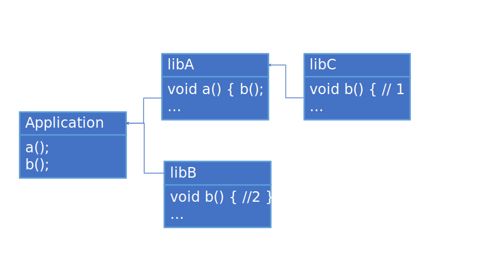
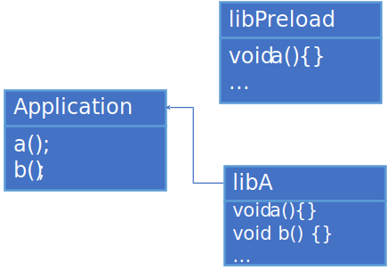

# Dynamic linking of device code

This document describes purpose and design of dynamic linking of device code
feature.

## Background
Sometimes users want to link device code dynamically at run time. One possible
use case for such linkage - providing device functions via shared libraries.
Example:
```
// app.cpp
SYCL_EXTERNAL int LibDeviceFunc(int i);
class KernelName;
/* ... */
Q.submit([&](cl::sycl::handler &CGH) {
CGH.parallel_for<KernelName>(/* ... */ [=](sycl::item i) {
  out[i] = LibDeviceFunc(i);
}); /* ... */
std::cout << out[i] << “ “;

// lib.cpp
int SYCL_EXTERNAL LibDeviceFunc(int i) {
  return i * 2;
}

// Commands
clang++ -fsycl lib.cpp -shared -o helpers.so
clang++ -fsycl app.cpp -lhelpers -o a.out
./a.out
Output: 0 2 4 6…

```
It is possible to manually create `sycl::program` in both app and shared
library, then use `link` SYCL API to get a single program and launch kernels
using it. But it is not user-friendly and it is very different from regular
C/C++ workflow.

Another possible scenario - use functions defined in pre-compiled device image
provided by user. Example:
```
// a.cpp
SYCL_EXTERNAL void foo();
...
Q.submit([&](cl::sycl::handler &CGH) {
CGH.parallel_for([]() { foo(); });
});

// b.cpp
/*no SYCL_EXTERNAL*/ void foo() { ... }
```
We have a `SYCL_EXTERNAL` function `foo` called from a kernel, but the
application defined only host version of this function. Then user adds device
image with definition of `foo` to the fat object via special option.

The main purpose of this feature is to provide a mechanism which allows to
link device code dynamically at runtime.

## Requirements:
User's device code that consists of some device API (`SYCL_EXTERNAL` functions),
is compiled into some form and it is not linked statically with device code of
application. It can be a shared library that contains some device code or a
separate device image supplied with property information. This code is linked
dynamically at run time with device code of a user's application in order to
resolve dependencies.
For this combination the following statements must be true:

- `SYCL_EXTERNAL` functions defined in dynamically linked code can be called
  (directly or indirectly) from device code of the application.
- Function pointers taken in application should work inside the dynamically
  linked code.
- Specific code changes are not required, i.e. the mechanism of linking works
  as close as possible to regular shared libraries.

## Design
The overall idea:

- Each device image is supplied with a list of imported and exported symbol
  names through device image properties mechanism
- Before compiling a device image DPC++ RT will check if device image has a list
  of imported symbols and if it has, then RT will search for device images which
  define required symbols using lists of exported symbols.
  - Besides symbol names, additional attributes are taken into account (like
    device image format: SPIR-V or device asm)
- Actual linking is performed by underlying backend (OpenCL/L0/etc.)

Next sections describe details of changes in each component.

### DPC++ front-end changes

Now during device code split process `SYCL_EXTERNAL` functions are
considered as entry points (as well as kernels).
For this purpose DPC++ front-end generates `module-id` attribute on each
`SYCL_EXTERNAL` function.

### sycl-post-link changes

To support dynamic linking of device code , `sycl-post-link` performs 2 main
tasks:
- Supplies device images containing exports with an information about exported
  symbols
- Supplies device images with an information about imported symbols

In addition, `SYCL_EXTERNAL` functions as well as kernels are considered as entry
points during device code split.
If device code split is enabled `SYCL_EXTERNAL` functions defined in shared
libraries and used within it can be duplicated.
Example:
```
// Shared library

// A.cpp
SYCL_EXTERNAL int LibDeviceFunc(int i) {
  return i * 2;
}

// B.cpp
class LibKernel;
/* ... */ 
Q.submit([&](cl::sycl::handler &CGH) {
CGH.parallel_for<LibKernel>(/* ... */ [=](sycl::item i) {
  out[i] = LibDeviceFunc(i);
} /* ... */ 
```
And if user requested per-source device code split, then for this shared library
`sycl-post-link` will create two device images and both of them will define
`LibDeviceFunc` function. However `LibDeviceFunc` won't be exported from device
image that corresponds to source file `B.cpp` and it will be exported only from
device image that corresponds to source file where `LibDeviceFunc` was defined,
i.e. `A.cpp`.

Such duplication is needed for two reasons:
- We aim to make device images with kernels self-contained so no JIT linker
  invocations would be needed if we have definitions of all called functions.
- We could export `SYCL_EXTERNAL` functions from device images with kernels,
  but it would mean that when user's app calls `SYCL_EXTERNAL` function, it has
  to link a whole kernel and all its dependencies - so we leave a possibility
  for user to arrange code on per-source basis.

Non-`SYCL_EXTERNAL` functions used by `SYCL_EXTERNAL` functions are copied to
device images corresponding to those `SYCL_EXTERNAL` functions to make them
self-contained.
In case one `SYCL_EXTERNAL` function uses another `SYCL_EXTERNAL` function
with different value in `sycl-module-id` attribute, the second one is not copied
to the device image with the first function, but dependency between those device
images is recorded instead.

After device code split, all non-`SYCL_EXTERNAL` functions and copied
`SYCL_EXTERNAL` functions left in device images with kernels marked with
internal linkage to avoid multiple definition errors during runtime linking.
After that `sycl-post-link` records list of names of exported functions, i.e.
functions with `sycl-module-id` attribute and external linkage.

In order to collect information about imported symbols `sycl-post-link` looks
through LLVM IR and for each declared but not defined symbol and  records its
name, except the following cases:
- Declarations with `__` prefix in demangled name are not recorded as imported
  functions
  - Declarations with `__spirv_*` prefix should not be recorded as dependencies
  since they represent SPIR-V operations and will be transformed to SPIR-V
  instructions during LLVM->SPIR-V translation.
- Based on some attributes (which could be defined later) we may want to avoid
  listing some functions as imported ones
  - This is needed to have possibility to call device-specific builtins not
    starting with `__` by forward-declaring them in DPC++ code

**NOTE**: If device code split is enabled, imports collection is performed after
split and it is performed on separated images.

All collected information is attached to a device image via properties
mechanism.

Each device image is supplied with an array of property sets:
```
struct pi_device_binary_struct {
...
  // Array of property sets
  pi_device_binary_property_set PropertySetsBegin;
  pi_device_binary_property_set PropertySetsEnd;
};

```
Each property set is represent by the following struct:
```
// Named array of properties.
struct _pi_device_binary_property_set_struct {
  char *Name;                                // the name
  pi_device_binary_property PropertiesBegin; // array start
  pi_device_binary_property PropertiesEnd;   // array end
};
```
It contains name of property set and array of properties. Each property is
represented by the following struct:
```
struct _pi_device_binary_property_struct {
  char *Name;       // null-terminated property name
  void *ValAddr;    // address of property value
  uint32_t Type;    // _pi_property_type
  uint64_t ValSize; // size of property value in bytes
};
```

List of imported symbols is represented as a single property set with name
`SYCL/imported symbols` recorded in the `Name` field of property set.
Each property in this set holds name of the particular imported symbol recorded
in the `Name` field of the property.
List of exported symbols is represented in the same way, except the
corresponding set has the name `SYCL/exported symbols`.

### DPC++ runtime changes

DPC++ RT performs *device images collection* task by grouping all device
images required to execute a kernel based on the list of exports/imports and
links them together using PI API.

#### Device images collection

DPC++ Runtime class named ProgramManager stores device images using following
data structure:
```
/// Keeps all available device executable images added via \ref addImages.
/// Organizes the images as a map from a kernel set id to the vector of images
/// containing kernels from that set.
/// Access must be guarded by the \ref Sync::getGlobalLock()
std::unordered_map<SymbolSetId,
                   std::unique_ptr<std::vector<RTDeviceBinaryImageUPtr>>>
    m_DeviceImages;

using StrToKSIdMap = std::unordered_map<string_class, SymbolSetId>;
/// Maps names of kernels from a specific OS module (.exe .dll) to their set
/// id (the sets are disjoint).
std::unordered_map<OSModuleHandle, SymbolSetId> m_SymbolSets;
```
Assume each device image represents some combination of symbols and different
device images may contain only exactly the same or not overlapping combination
of symbols. If it is not so, there can be two cases:
  - Symbols are the same. In this case it doesn't matter which device image is
  taken to use duplicated symbol
  - Symbols are not the same. In this case ODR violation takes place, such
  situation leads to undefined behaviour. For more details refer to
  [ODR violations](#ODR-violations) section.

Each combination of symbols is assigned with an Id number - symbol set Id.
A combination of symbols can exist in different formats (i.e. SPIR-V/AOT
compiled binary and etc).
`m_DeviceImages` maps an Id number to an array with device images which represent
the same combination of symbols in different formats.
`m_SymbolSets` contains mapping from symbol name to symbol set Id for each OS
module (.exe/.so/.dll).
`std::unordered_map` allows to search and access its elements with constant-time
complexity.

Before compilation of device image, to execute a kernel RT checks if the image
contains any import information in its properties and if it does, then RT
performs device images collection in order to resolve dependencies.

Ids of all needed symbol sets are found by iterating through
`m_SymbolSets` map, i.e. iterating through all available OS modules without
predefined order and searching for first unresolved symbol in list of imports
of target device image. Once device image that contains first symbol is
met, remaining exported symbols are checked in found image. If
they match some imported symbols then these matched symbols will be marked as
resolved. The procedure repeats until all imported symbols are marked as
resolved.

#### Program caching

Existing support for device code caching can be re-used to cache
dynamically linked programs with slight changes.

##### In-memory cache

The existing mechanism of caching can be re-used in presence of dynamic
linking. Example:
```
// Application
SYCL_EXTERNAL void LibFunc1();
SYCL_EXTERNAL void LibFunc2();

Q.submit([&](cl::sycl::handler &CGH) {
CGH.parallel_for<InternalKernel>( ... )
}); // 1. Device Image is compiled and linked into a program and saved in cache
    // 2. Prepared program is used to enqueue kernel

Q.submit([&](cl::sycl::handler &CGH) {
handler.parallel_for([] { LibFunc1(); }); // Prepared program is used to enqueue kernel
});

// Library
SYCL_EXTERNAL void LibFunc1() {
// ...
}

```
In current cache structure the programs map's key consists of four components:
kernel set id, specialization constants values, the device this program is built
for, build options id. In this example Id of kernel set where application's
kernels can be used to access program cache. However when shared library
defines kernels and these kernels are run by the application unchanged cache
structure may lead to double compilation of the same code. Example:
```
// Application
SYCL_EXTERNAL void LibFunc();

Q.submit([&](cl::sycl::handler &CGH) {
handler.parallel_for([] { LibFunc(); });  // Device image for library is compiled
                                          // and linked together with device
                                          // image for application, i.e.
                                          // LibFunc1 and ExternalKernel exist
                                          // in prepared state
});
// ...
EnqueueLibraryKernel(Q); // If cache mechanism is not changed, this line will
                         // lead to second compilation of ExternalKernel and
                         // LibFunc1

// Library
SYCL_EXTERNAL void LibFunc1() {
// ...
}

EnqueueLibraryKernel(queue) {
  queue.submit(parallel_for<ExternalKernel>(...));
}
```
Such case can be optimized by bringing nesting into cache keys structure.
Kernel set id can be found for each kernel using its name and OS module it is
coming from. In presence of dynamic linking resulting program can be combined
out of device images which come from different OS modules. So, it should be
possible to find needed program by kernel name and any OS module that was
involved in this program. The new mapping structure is:
```
{kernel name} =>
  {OSModuleHandle, spec const, opts, dev} => program
```
I.e. each kernel name is mapped to a set of tuples that consists of OS module,
spec constant values, JIT compiler options, device. Then concrete tuple is
mapped to a program object.
Example:
```
// Application
// OSModule = 1

SYCL_EXTERNAL void LibFunc();
queue.submit(parallel_for<InternalKernel>( ... ));

Q.submit([&](cl::sycl::handler &CGH) {
CGH.parallel_for([] { LibFunc(); });
});

EnqueueLibraryKernel(q);

// Library
// OSModule = 2

SYCL_EXTERNAL lib1_func();

EnqueueLibraryKernel(queue) {
  queue.submit(parallel_for<ExternalKernel>(...));
}

Program cache will have the following structure:
 "InternalKernel" =>
   {1, ...} => program 1
 "ExternalKernel" =>
   {1, ...} => program 1
   {2, ...} => program 1
```
However the library code will be compiled twice if kernel from the library
was enqueued before kernels from the application, i.e. in such case:
```
// Application
SYCL_EXTERNAL void LibFunc();

EnqueueLibraryKernel(Q); // First, library code is compiled alone since it
                         // doesn't have any dependencies
// ...
Q.submit([&](cl::sycl::handler &CGH) {
handler.parallel_for([] { LibFunc(); });  // Second, library code is compiled
                                          // and linked together with code of
                                          // the application
});
```

The program caching mechanism is re-used without changes.

##### Persistent cache

The documented approach to persistent cache needs to be expanded in presence
of dynamic linking support. One of the identifiers for built image hash is
hash made out of device image used as input for the JIT compilation.
In case when "main" image have imports information, device image hash should be
created from all device images that are necessary to build it, i.e. hash out
of "main" device image and set of images that define all
symbols imported by "main" device image.

## Corner cases and limitations

It is not guaranteed that behaviour of host shared libraries and device shared
libraries will always match. There are several cases when it can occur, the
next sections will cover details of such cases.

### ODR violations

C++ standard defines One Definition Rule as:
> Every program shall contain exactly one definition of every non-inline
  function or variable that is odr-used in that program outside of a discarded
  statement; no diagnostic required.
  The definition can appear explicitly in the program, it can be found in the
  standard or a user-defined library, or (when appropriate) it is implicitly
  defined.


Here is an example:



Both libraries libB and libC provide two different definitions of function
`b()`, so this example illustrates ODR violation. Technically this case has
undefined behaviour, however it is possible to run and compile this example on
Linux and Windows. Whereas on Linux only function `b()` from library libB is
called, on Windows both versions of function `b()` are used.
Most of backends online linkers act like static linkers, i.e. just merge
device images with each other, so it is not possible to correctly imitate
Windows behaviour in device code linking because attempts to do it will result
in multiple definition errors.

Given that, it is not guaranteed that behaviour of shared host libraries and
shared device libraries will always match in case of such ODR violations.

#### LD_PRELOAD

Another way to violate ODR is `LD_PRELOAD` environment variable on Linux. It
allows to load specified shared library before any other shared libraries so it
will be searched for symbols before other shared libraries. It allows to
substitute functions from regular shared libraries by functions from preloaded
library.
Device code registration is implemented using global constructors. Order of
global constructors calling is not defined across different translation units,
so with current design of device shared libraries and device code registration
mechanism it is not possible to understand which device code comes from
preloaded library and which comes from regular shared libraries.

Here is an example:



"libPreload" library is preloaded using `LD_PRELOAD` environment variable.
In this example, device code from "libPreload" might be registered after
device code from "libA".

To implement basic support, for each device image we can record name of the
library where this device image comes from and parse content of `LD_PRELOAD`
environment variable to choose the proper images. However such implementation
will only allow to substitute a whole device image and not an arbitrary
function (unless it is the only function in a device image), because partial
substitution will cause multiple definition errors during runtime linking.

### Run-time libraries loading

It is possible to load shared library during run-time. Both Linux and Windows
provide a way to do so (for example `dlopen()` on Linux or `LoadLibrary` on
Windows).
In case run-time loading is used to load some shared library, the symbols from
this shared library do not appear in the namespace of the main program. It means
that even though shared library is loaded successfully in run-time, it is not
possible to use symbols from it directly. The symbols from run-time loaded
library can be accessed by address which can be obtained using corresponding
OS-dependent API (for example `dlsym()` on Linux).

The problem here is that even though symbols from run-time loaded shared
library are not part of application's namespace, the library is loaded through
standard mechanism, i.e. its global constructors are invoked which means that
device code from it is registered, so it is not possible to
understand whether device code comes from run-time loaded library or not.
If such run-time loaded library exports device symbols and they
somehow match with symbols that actually directly used in device code
somewhere, it is possible that symbols from run-time loaded library
will be unexpectedly used.

To resolve this problem we need to ensure that device code registered from
run-time loaded library appears at the end of symbols search list, however
having that device code registration is triggered by global constructors, it
doesn't seem possible.

One more possible mitigation would be to record name of the library from which
each symbol should be imported, but it still won't resolve all potential
issues with run-time library loading, because user can load the library with the
same name as one of the explicitly linked libraries.
