# Command-Graph Extension

This document describes the implementation design of the
[SYCL Graph Extension](../extensions/experimental/sycl_ext_oneapi_graph.asciidoc).

## Resources

* A recording of a presentation on the extension can be found
  [on Youtube](https://www.youtube.com/watch?v=aOTAmyr04rM).
* A blog post introducing the extension can be found
  [on Codeplay.com](https://codeplay.com/portal/blogs/2024/01/22/sycl-graphs).

## Requirements

An efficient implementation of a lazy command-graph execution and its replay
requires extensions to the Unified Runtime (UR) layer. Such an extension is
the command-buffer experimental feature, where a command-buffer object
represents a series of operations to be enqueued to the backend device and
their dependencies. A single command-graph can be partitioned into more
than one command-buffer by the runtime. The SYCL Graph extension
distinguishes between backends that support the command-buffer extension
and those that do not, and only reports support for the extension via the
`aspect::ext_oneapi_graph` aspect on backends that do support command-buffers.

See the [Backend Implementation](#backend-implementation) section of this
document for details of support of different SYCL backends.

### UR Command-Buffer Experimental Feature

The command-buffer concept has been introduced to UR as an
[experimental feature](https://oneapi-src.github.io/unified-runtime/core/api.html#command-buffer-experimental)
with the following entry-points:

| Function                                     | Description |
| -------------------------------------------- | ----------- |
| `urCommandBufferCreateExp`                   | Create a command-buffer. |
| `urCommandBufferRetainExp`                   | Incrementing reference count of command-buffer. |
| `urCommandBufferReleaseExp`                  | Decrementing reference count of command-buffer. |
| `urCommandBufferFinalizeExp`                 | No more commands can be appended, makes command-buffer ready to enqueue on a command-queue. |
| `urCommandBufferAppendKernelLaunchExp`       | Append a kernel execution command to command-buffer. |
| `urCommandBufferAppendUSMMemcpyExp`          | Append a USM memcpy command to the command-buffer. |
| `urCommandBufferAppendUSMFillExp`            | Append a USM fill command to the command-buffer. |
| `urCommandBufferAppendMemBufferCopyExp`      | Append a mem buffer copy command to the command-buffer. |
| `urCommandBufferAppendMemBufferWriteExp`     | Append a memory write command to a command-buffer object. |
| `urCommandBufferAppendMemBufferReadExp`      | Append a memory read command to a command-buffer object. |
| `urCommandBufferAppendMemBufferCopyRectExp`  | Append a rectangular memory copy command to a command-buffer object. |
| `urCommandBufferAppendMemBufferWriteRectExp` | Append a rectangular memory write command to a command-buffer object. |
| `urCommandBufferAppendMemBufferReadRectExp`  | Append a rectangular memory read command to a command-buffer object. |
| `urCommandBufferAppendMemBufferFillExp`      | Append a memory fill command to a command-buffer object. |
| `urCommandBufferEnqueueExp`                  | Submit command-buffer to a command-queue for execution. |
| `urCommandBufferUpdateKernelLaunchExp`       | Updates the parameters of a previous kernel launch command. |

See the [UR EXP-COMMAND-BUFFER](https://oneapi-src.github.io/unified-runtime/core/EXP-COMMAND-BUFFER.html)
specification for more details.

## Design

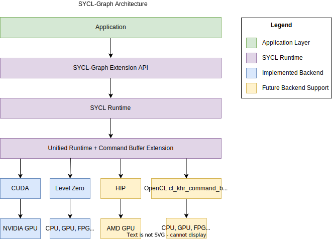

There are two sets of user facing interfaces that can be used to create a
command-graph object: Explicit and Record & Replay API. Within the runtime they
share a common infrastructure.

## Nodes & Edges

A node in a graph is a SYCL [command-group](https://registry.khronos.org/SYCL/specs/sycl-2020/html/sycl-2020.html#command-group)
(CG) that is defined by a [command-group function](https://registry.khronos.org/SYCL/specs/sycl-2020/html/sycl-2020.html#command-group-function-object)
(CGF).

Internally, a node is represented by the `detail::node_impl` class, and a command-group
by the `sycl::detail::CG` class. An instance of `detail::node_impl` stores a
`sycl::detail::CG` object for the command-group that the node represents.

A [command-group handler](https://registry.khronos.org/SYCL/specs/sycl-2020/html/sycl-2020.html#handler)
lets the user define the operations that are to be performed in the command-group,
e.g. kernel execution, memory copy, host-task. In DPC++ an internal "finalization"
operation is done inside the `sycl::handler` implementation, which constructs a
CG object of a specific type. During normal operation, `handler::finalize()`
then passes the CG object to the scheduler, and a `sycl::event` object
representing the command-group is returned.

However during graph construction, inside `hander::finalize()` the CG object is
not submitted for execution as normal, but stored in the graph as a new node
instead.

When a user adds a node to a graph using the explicit
`command_graph<modifiable>::add()` API passing a CGF, in our graph runtime
implementation a `sycl::handler` object is constructed with a graph parameter
telling it to not submit the CG object to the scheduler on finalization.
This handler finalizes the CGF, and after finalization the CG object from the
handler is moved to the node.

For creating a node in the graph using queue recording mode. When the
`sycl::handler` from a queue submission is finalized, if the queue the
handler was created from is in the recording mode, then the handler knows
not to submit the CG object to the scheduler. Instead, the CG object is
added to the graph associated with the queue as a new node.

Edges are stored in each node as lists of predecessor and successor nodes.

## Execution Order

The current way graph nodes are linearized into execution order is using a
reversed depth-first sorting algorithm. Alternative algorithms, such as
breadth-first, are possible and may give better performance on certain
workloads/hardware. In the future there might be options for allowing the
user to control this implementation detail.

## Scheduler Integration

When there are no requirements from accessors in a command-graph submission,
the scheduler is bypassed and the underlying UR command-buffer is directly
enqueued to a UR queue. If there are accessor requirements, the UR
command-buffer for the executable graph needs to be enqueued by the scheduler.

When individual graph nodes have requirements from SYCL accessors, the
underlying `sycl::detail::CG` object stored in the node is copied and passed to
the scheduler for adding to the UR command-buffer, otherwise the node can
be appended directly as a command in the UR command-buffer. This is in-keeping
with the existing behavior of the handler with normal queue submissions.

Scheduler commands for adding graph nodes differ from typical command-group
submission in the scheduler, in that they do not launch any asynchronous work
which relies on their dependencies, and are considered complete immediately
after adding the command-group node to the graph.

This presents problems with device allocations which create both an allocation
command and a separate initial copy command of data to the new allocation.
Since future command-graph execution submissions will only receive
dependencies on the allocation command (since this is all the information
available), this could lead to situations where the device execution of the
initial copy command is delayed due to device occupancy, and the command-graph
and initial copy could execute on the device in an incorrect order.

To solve this issue, when the scheduler enqueues command-groups to add as nodes
in a command-graph, it will perform a blocking wait on the dependencies of the
command-group first. The user will experience this wait as part of graph
finalization.

## Graph Partitioning

To handle dependencies from other devices, the graph can be partitioned during
the finalization process. A partition is a set of one or more nodes intended
to run on the same device. Each partition instantiates a command-buffer
(or equivalent) which contains all the commands to be executed on the device.
Therefore, the partitioning only impacts graphs in the executable state and
occurs during finalization. Synchronization between partitions is managed
by the runtime unlike internal partition dependencies that are handled directly
by the backend.

Since runtime synchronization and multiple command-buffer involves
extra latency, the implementation ensures to minimize the number of partitions.
Currently, the creation of a new partition is triggered by a node containing
a host-task.
When a host-task is encountered the predecessors of this host-task node
are assigned to one partition, the host-task is assigned to another partition,
and the successors are assigned to a third partition as shown below:

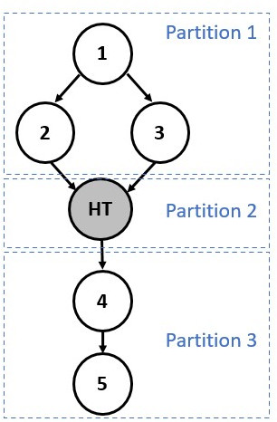

Partition numbers are allocated in order. Hence, the runtime must ensure that
Partition `n` complete before starting execution of Partition `n+1`.

Note that partitioning can only happen during the finalization stage due to
potential backward dependencies that could be created using
the `make_edge` function.

### Example

The partitioning process is achieved is two main stages:

1 - Nodes are assigned to a temporary group/partition.

2 - Once all the nodes have been annotated with a group number, actual
partitions are created based on these annotations.

The following diagrams show the annotation process:

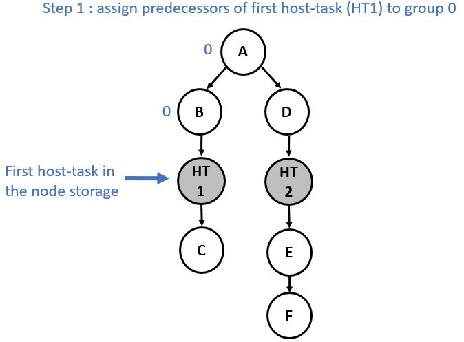
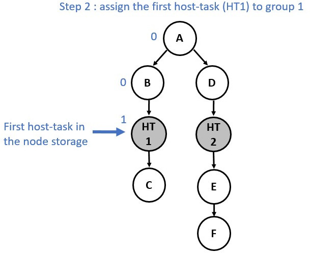
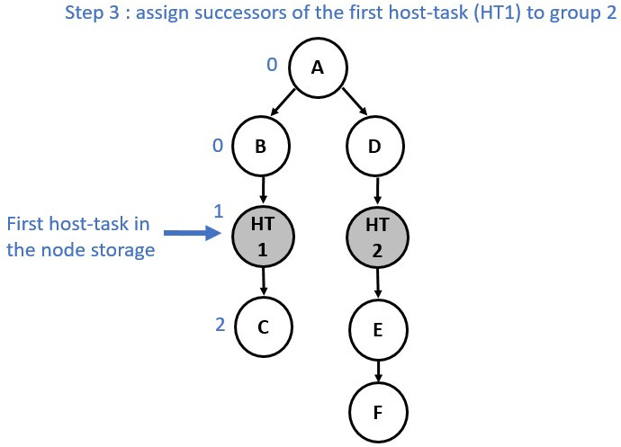
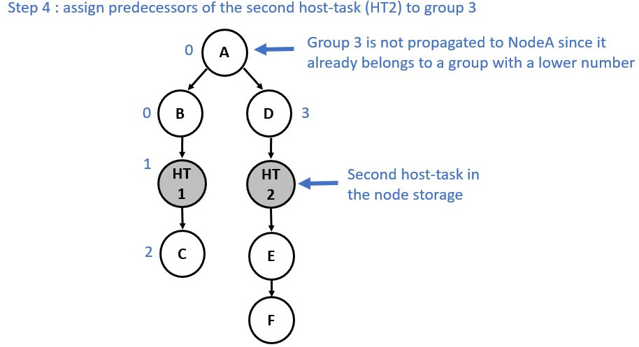
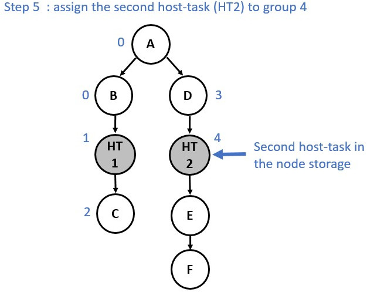
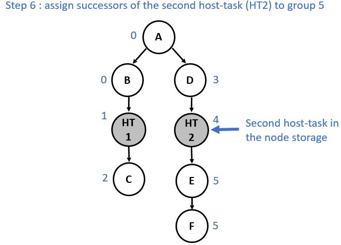

Now consider a slightly different graph. We used the `make_edge` function to
create a dependency between Node E and Node HT1. The first 5 steps are identical.
However, from the step 6 the process changes and a group merge is needed as
illustrated in the following diagrams:

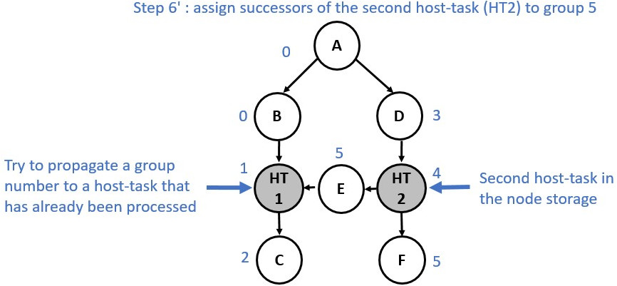
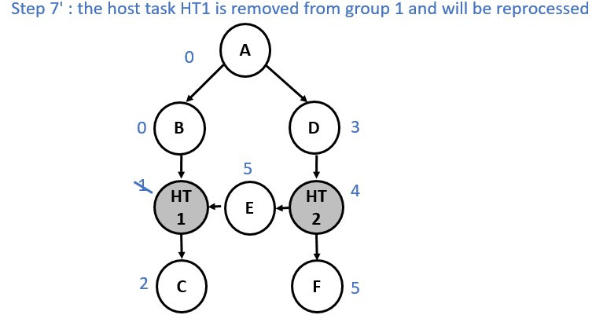
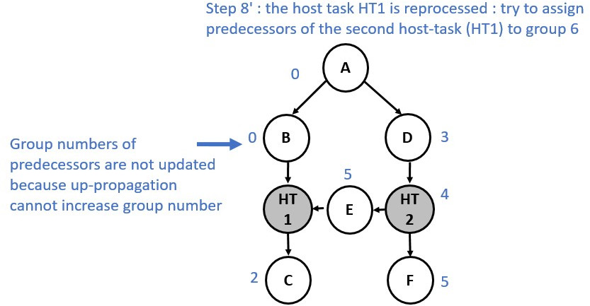
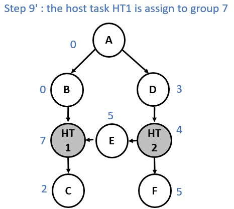
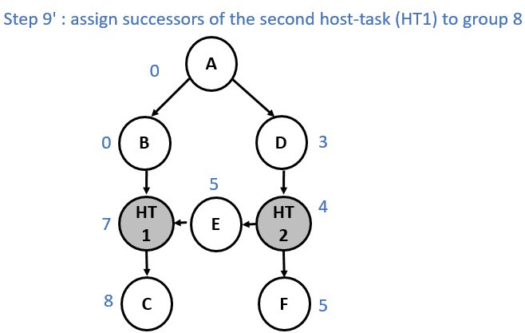
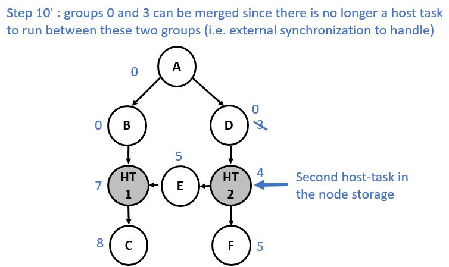

### Multiple Roots Execution Flow

The following diagram shows the partitions of a graph with two roots and a
host-task in each branch.

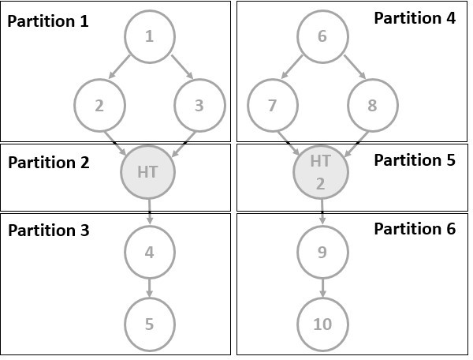

When executing this graph, the partitions were enqueued one after the other,
with each partition waiting for the previous one to complete (see top of the
following diagram). However, for a multi-root graph, this behavior adds
unnecessary dependencies between partitions, slowing down the execution of the
whole graph. Now, we keep track of the actual predecessors of each partition
and only enforce dependencies between partitions when necessary.
In our example, the extra dependency is therefore removed and both branches can
be executed concurrently. But as we can see on this diagram, this new approach
can involve multiple execution tails, which leads to difficulties when we want
to know when the graph execution has finished. To cope with this issue, the
events associated to the completion of each partition are linked to the event
returned to users. Hence, when the returned event is complete, we can guarantee
that all work associated with the graph has been completed.

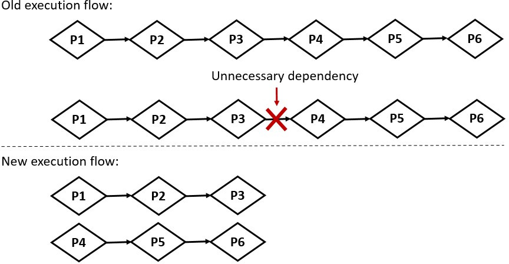

## Memory handling: Buffer and Accessor

There is no extra support for graph-specific USM allocations in the current
proposal. Memory operations will be supported subsequently by the current
implementation starting with `memcpy`.

Buffers and accessors are supported in a command-graph. There are
[spec restrictions](../extensions/experimental/sycl_ext_oneapi_graph.asciidoc#storage-lifetimes)
on buffer usage in a graph so that their lifetime semantics are compatible with
a lazy work execution model. However these changes to storage lifetimes have not
yet been implemented.

## Graph Update

### Design Challenges

#### Explicit Update

Explicit updates of individual nodes faces significant design challenges in SYCL:

* Lambda capture order is explicitly undefined in C++, so the user cannot reason
  about the indices of arguments captured by kernel lambdas.
* Once arguments have been captured the actual type information is lost in the
  transition through the integration header and extracting arguments in the SYCL
  runtime, therefore we cannot automatically match new argument values by
  querying the captured arguments without significant possibility for
  collisions. For example, if a kernel captures two USM pointers and the user
  wishes to update one, we cannot reason about which pointer they actually want
  to update when we only know that: they are pointer args of a certain size.

The current approach is to limit graph update to the explicit APIs and where the
user is using `handler::set_arg()` or some equivalent to manually set kernel
arguments using indices. Therefore when updating we can use indices to avoid
collisions. In practice there are only a few current scenarios where `set_arg()`
can be used:

* The proposed ["Free Function Kernel"
  extension](../extensions/proposed/sycl_ext_oneapi_free_function_kernels.asciidoc)
* OpenCL interop kernels created from SPIR-V source at runtime.

A workaround for the lambda capture issues is the "Whole-Graph Update" feature.
Since the lambda capture order is the same across two different recordings, we
can match the parameter order when updating.

#### Whole-Graph Update

The current implementation of the whole-graph update feature relies on the
assumption that both graphs should have a similar topology. Currently, the
implementation only checks that both graphs have an identical number of nodes
and that each node contains the same number of edges. Further investigation
should be done to see if it is possible to add extra checks (e.g. check that the
nodes and edges were added in the same order).

### Scheduler Integration

Graph updates in the runtime are synchronous calls however they can optionally
be done through the scheduler using a new command,
`sycl::detail::UpdateCommandBufferCommand`. This is needed when dealing with
accessor updates. Since a new buffer which the user creates for updating may not
yet have been lazily initialized on device we schedule a new command which has
requirements for these new accessors to correctly trigger allocations before
updating. This is similar to how individual graph commands are enqueued when
accessors are used in a graph node.

## Optimizations
### Interactions with Profiling

Enabling profiling on a graph may disable optimizations from being performed on
the graph if they are incompatible with profiling. For example, enabling
profiling prevents the in-order optimization since the removal of events would
prevent collecting profiling information.

### In-Order Graph Partitions

On finalization graph partitions are checked to see if they are in-order, i.e.
the graph follows a single path where each node depends on the previous node. If
so a hint is provided to the backend that it may create the command-buffers in
an in-order fashion. Support for this is backend specific but it may provide
benefits through the removal of the need for synchronization primitives between
kernels.

This optimization is only performed in this very limited case where it can be
safely assumed to be more performant. It is not likely we'll try to allow
in-order execution in more scenarios through a complicated (and imperfect)
heuristic but rather expose this as a hint the user can provide.

## Backend Implementation

Implementation of UR command-buffers for each of the supported SYCL 2020
backends.

Backends which are implemented currently are: [Level Zero](#level-zero),
[CUDA](#cuda), [HIP](#hip) and partial support for [OpenCL](#opencl).

### Level Zero

The UR `urCommandBufferEnqueueExp` interface for submitting a command-buffer
takes a list of events to wait on, and returns an event representing the
completion of that specific submission of the command-buffer.

However, in the equivalent Level Zero function
[zeCommandQueueExecuteCommandLists](https://spec.oneapi.io/level-zero/latest/core/api.html#zecommandqueueexecutecommandlists)
there are no parameters to take a wait-list, and the only sync primitive
returned is blocking on host.

In order to achieve the expected UR command-buffer enqueue semantics with Level
Zero, the adapter implementation needs extra commands.

* Prefix - Commands added **before** the graph workload.
* Suffix - Commands added **after** the graph workload.

These extra commands operate on L0 event synchronization primitives, used by
the command-list to interact with the external UR wait-list and UR return event
required for the enqueue interface. Unlike the graph workload (i.e. commands
needed to perform the graph workload) the external UR wait-list and UR return
event are submission dependent, which mean they can change from one submission
to the next.

For performance concerns, the command-list that will execute the graph workload
is made only once (during the command-buffer finalization stage). This allows
the adapter to save time when submitting the command-buffer, by executing only
this command-list (i.e. without enqueuing any commands of the graph workload).

#### Prefix

The prefix's commands aim to:
1. Handle the list of events to wait on, which is passed by the runtime
when the UR command-buffer enqueue function is called. As mentioned above, this
list of events changes from one submission to the next. Consequently, managing
this mutable dependency in the graph-workload command-list implies rebuilding
the command-list for each submission (note that this can change with mutable
command-list). To avoid the significant time penalty of rebuilding this
potentially large command-list each time, we prefer to add an extra command
handling the wait list into another command-list (*wait command-list*). This
command-list consists of a single L0 command: a barrier that waits for
dependencies passed by the wait-list and signals a signal called *WaitEvent*
when the barrier is complete. This *WaitEvent* is defined in the
`ur_exp_command_buffer_handle_t` class. In the front of the graph workload
command list, an extra barrier command waiting for this event is added (when
the command-buffer is created). This ensures that the graph workload does not
start running before the dependencies to be completed. The *WaitEvent* event is
reset in the suffix.

2. Reset events associated with the command-buffer except the *WaitEvent* event.
Indeed, L0 events needs to be explicitly reset by an API call  (L0 command in
our case). Since a command-buffer is expected to be submitted multiple times,
we need to ensure that L0 events associated with graph commands have not been
signaled by a previous execution. These events are therefore reset to the
non-signaled state before running the graph-workload command-list. Note that
this reset is performed in the prefix and not in the suffix to avoid additional
synchronization w.r.t profiling data extraction. We use a new command list
(*reset command-list*) for performance concerns.
Indeed:
   * This allows the *WaitEvent* to be signaled directly on the host if the
   waiting list is empty, thus avoiding the need to submit a command list.
   * Enqueuing a reset L0 command for all events in the command-buffer is time
   consuming, especially for large graphs. However, this task is not needed for
   every submission, but only once, when the command-buffer is fixed, i.e. when
   the command-buffer is finalized. The decorrelation between the reset
   command-list and the wait command-list allow us to create and enqueue the
   reset commands when finalizing the command-buffer, and only create the wait
   command-list at submission.

This command list consists of a reset command for each of the graph commands
and another reset command for resetting the signal we use to signal the
completion of the graph workload. This signal is called *SignalEvent* and is
defined in the `ur_exp_command_buffer_handle_t` class.

#### Suffix

The suffix's commands aim to:
1) Handle the completion of the graph workload and signal a UR return event.
Thus, at the end of the graph workload command-list a command, which signals
the *SignalEvent*, is added (when the command-buffer is finalized). In an
additional command-list (*signal command-list*), a barrier waiting for this
event is also added. This barrier signals, in turn, the UR return event that
has be defined by the runtime layer when calling the
`urCommandBufferEnqueueExp` function.

2) Manage the profiling. If a command-buffer is about to be submitted to a
queue with the profiling property enabled, an extra command that copies
timestamps of L0 events associated with graph commands into a dedicated memory
which is attached to the returned UR event. This memory stores the profiling
information that corresponds to the current submission of the command-buffer.

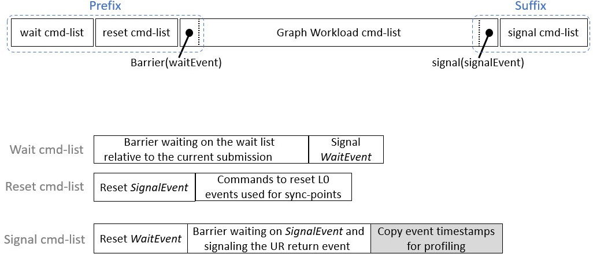

For a call to `urCommandBufferEnqueueExp` with an `event_list` *EL*,
command-buffer *CB*, and return event *RE* our implementation has to submit three
new command-lists for the above approach to work. Two before the command-list
with extra commands associated with *CB*, and the other after *CB*. These new
command-lists are retrieved from the UR queue, which will likely reuse existing
command-lists and only create a new one in the worst case.

#### Drawbacks

There are three drawbacks of this approach to implementing UR command-buffers for
Level Zero:

1. 3x the command-list resources are used, if there are many UR command-buffers in
   flight, this may exhaust L0 driver resources. A trivial graph requires 3 L0
   command-lists and if we implement partitioning a graph into multiple UR
   command-buffers, then each partition will contain 3 L0 command-lists.

2. Each L0 command-list is submitted individually with a
   `ur_queue_handle_t_::executeCommandList` call which introduces serialization
   in the submission pipeline that is heavier than having a barrier or a
   `waitForEvents` on the same command-list. Resulting in additional latency when
   executing a UR command-buffer.

3. Dependencies between multiple submissions must be handled by the runtime.
   Indeed, when a second submission is performed the signal conditions of
   *WaitEvent* are redefined by this second submission. Therefore, this can
   lead to an undefined behavior and potential hangs especially if the
   conditions of the first submissions were not yet satisfied and the event has
   not yet been signaled.

Future work will include exploring L0 API extensions to improve the mapping of
UR command-buffer to L0 command-list.

#### Copy Engine

For performance considerations, the Unified Runtime Level Zero adapter uses
different Level Zero command-queues to submit compute kernels and memory
operations when the device has a dedicated copy engine. To take advantage of the
copy engine when available, the graph workload can also be split between memory
operations and compute kernels. To achieve this, two graph workload
command-lists live simultaneously in a command-buffer.

When the command-buffer is finalized, memory operations (e.g. buffer copy,
buffer fill, ...) are enqueued in the *copy* command-list while the other
commands are enqueued in the compute command-list. On submission, if not empty,
the *copy* command-list is sent to the main copy command-queue while the compute
command-list is sent to the compute command-queue.

Both are executed concurrently. Synchronization between the command-lists is
handled by Level Zero events.

### CUDA

The SYCL Graph CUDA backend relies on the
[CUDA Graphs feature](https://docs.nvidia.com/cuda/cuda-c-programming-guide/index.html#cuda-graphs),
which is the CUDA public API for batching series of operations, such as kernel
launches, connected by dependencies.

UR commands (e.g. kernels) are mapped as graph nodes using the
[CUDA Driver API](https://docs.nvidia.com/cuda/cuda-driver-api/group__CUDA__GRAPH.html#group__CUDA__GRAPH).
The CUDA Driver API is preferred over the CUDA Runtime API to implement the
SYCL Graph backend to remain consistent with other UR functions.
Synchronization between commands (UR sync-points) is implemented using graph
dependencies.

Executable CUDA Graphs can be submitted to a CUDA stream in the same way as
regular kernels. The CUDA backend enables enqueuing events to wait for into a
stream. It also allows signaling the completion of a submission with an event.
Therefore, submitting a UR command-buffer consists only of submitting to a
stream the executable CUDA Graph that represent this series of operations.

An executable CUDA Graph, which contains all commands and synchronization
information, is saved in the UR command-buffer to allow for efficient graph
resubmission.

### HIP

The HIP backend offers a graph management API very similar to CUDA Graph
feature for batching series of operations. The SYCL Graph HIP backend
implementation is therefore very similar to that of CUDA.

The minimum version of ROCm required to support `sycl_ext_oneapi_graph` is 5.5.1.

UR commands (e.g. kernels) are mapped as graph nodes using the
[HIP Management API](https://rocm.docs.amd.com/projects/HIP/en/docs-5.5.1/doxygen/html/group___graph.html).
Synchronization between commands (UR sync-points) is implemented using graph
dependencies. Executable HIP Graphs can be submitted to a HIP stream in the
same way as regular kernels. The HIP backend enables enqueuing events to wait
for into a stream. It also allows signaling the completion of a submission
with an event. Therefore, submitting a UR command-buffer consists only of
submitting to a stream the executable HIP Graph that represent this series of
operations.

An executable HIP Graph, which contains all commands and synchronization
information, is saved in the UR command-buffer to allow for efficient
graph resubmission.

### OpenCL

SYCL-Graph is only enabled for an OpenCL backend when the
[cl_khr_command_buffer](https://registry.khronos.org/OpenCL/specs/3.0-unified/html/OpenCL_Ext.html#cl_khr_command_buffer)
extension is available, however this information isn't available until runtime
due to OpenCL implementations being loaded through an ICD.

The `ur_exp_command_buffer` string is conditionally returned from the OpenCL
command-buffer UR backend at runtime based on `cl_khr_command_buffer` support
to indicate that the graph extension should be enabled. This is information
is propagated to the SYCL user via the
`device.get_info<info::device::graph_support>()` query for graph extension
support.

#### Limitations

Due to the API mapping gaps documented in the following section, OpenCL as a
SYCL backend cannot fully support the graph API. Instead, there are
limitations in the types of nodes which a user can add to a graph, using
an unsupported node type will cause a SYCL exception to be thrown in graph
finalization with error code `sycl::errc::feature_not_supported` and a message
mentioning the unsupported command. For example,

```
terminate called after throwing an instance of 'sycl::_V1::exception'
what():  USM copy command not supported by graph backend
```

The types of commands which are unsupported, and lead to this exception are:
* `handler::copy(src, dest)` - Where `src` is an accessor and `dest` is a pointer.
   This corresponds to a memory buffer read command.
* `handler::copy(src, dest)` - Where `src` is an pointer and `dest` is an accessor.
  This corresponds to a memory buffer write command.
* `handler::copy(src, dest)` or `handler::memcpy(dest, src)` - Where both `src` and
   `dest` are USM pointers. This corresponds to a USM copy command.
* `handler::memset(ptr, value, numBytes)` - This corresponds to a USM memory
  fill command.
* `handler::prefetch()`.
* `handler::mem_advise()`.

Note that `handler::copy(src, dest)` where both `src` and `dest` are an accessor
is supported, as a memory buffer copy command exists in the OpenCL extension.

#### UR API Mapping

There are some gaps in both the OpenCL and UR specifications for Command
Buffers shown in the list below. There are implementations in the UR OpenCL
adapter where there is matching support for each function in the list.

| UR | OpenCL | Supported |
| --- | --- | --- |
| urCommandBufferCreateExp | clCreateCommandBufferKHR | Yes |
| urCommandBufferRetainExp | clRetainCommandBufferKHR | Yes |
| urCommandBufferReleaseExp | clReleaseCommandBufferKHR | Yes |
| urCommandBufferFinalizeExp | clFinalizeCommandBufferKHR | Yes |
| urCommandBufferAppendKernelLaunchExp | clCommandNDRangeKernelKHR | Yes |
| urCommandBufferAppendUSMMemcpyExp |  | No |
| urCommandBufferAppendUSMFillExp |  | No |
| urCommandBufferAppendMembufferCopyExp | clCommandCopyBufferKHR | Yes |
| urCommandBufferAppendMemBufferWriteExp |  | No |
| urCommandBufferAppendMemBufferReadExp |  | No |
| urCommandBufferAppendMembufferCopyRectExp | clCommandCopyBufferRectKHR | Yes |
| urCommandBufferAppendMemBufferWriteRectExp |  | No |
| urCommandBufferAppendMemBufferReadRectExp |  | No |
| urCommandBufferAppendMemBufferFillExp | clCommandFillBufferKHR | Yes |
| urCommandBufferAppendUSMPrefetchExp |  | No |
| urCommandBufferAppendUSMAdviseExp |  | No |
| urCommandBufferEnqueueExp | clEnqueueCommandBufferKHR | Yes |
|  | clCommandBarrierWithWaitListKHR | No |
|  | clCommandCopyImageKHR | No |
|  | clCommandCopyImageToBufferKHR | No |
|  | clCommandFillImageKHR | No |
|  | clGetCommandBufferInfoKHR | No |
|  | clCommandSVMMemcpyKHR | No |
|  | clCommandSVMMemFillKHR | No |
| urCommandBufferUpdateKernelLaunchExp | clUpdateMutableCommandsKHR | Yes[1] |

We are looking to address these gaps in the future so that SYCL-Graph can be
fully supported on a `cl_khr_command_buffer` backend.

[1] Support for `urCommandBufferUpdateKernelLaunchExp` used to update the
configuration of kernel commands requires an OpenCL implementation with the
[cl_khr_command_buffer_mutable_dispatch](https://registry.khronos.org/OpenCL/specs/3.0-unified/html/OpenCL_Ext.html#cl_khr_command_buffer_mutable_dispatch)
extension. The optional capabilities that are reported by this extension must
include all of of `CL_MUTABLE_DISPATCH_GLOBAL_OFFSET_KHR`,
`CL_MUTABLE_DISPATCH_GLOBAL_SIZE_KHR`, `CL_MUTABLE_DISPATCH_LOCAL_SIZE_KHR`,
`CL_MUTABLE_DISPATCH_ARGUMENTS_KHR`, and `CL_MUTABLE_DISPATCH_EXEC_INFO_KHR`.

#### UR Command-Buffer Implementation

Many of the OpenCL functions take a `cl_command_queue` parameter which is not
present in most of the UR functions. Instead, when a new command buffer is
created in `urCommandBufferCreateExp` we also create and maintain a new
internal `ur_queue_handle_t` with a reference stored inside of the
`ur_exp_command_buffer_handle_t_` struct. The internal queue is retained and
released whenever the owning command buffer is retained or released.

With command buffers being an OpenCL extension, each function is accessed by
loading a function pointer to its implementation. These are defined in a common
header file in the UR OpenCL adapter. The symbols for the functions are however
defined in [OpenCL-Headers](https://github.com/KhronosGroup/OpenCL-Headers/blob/main/CL/cl_ext.h)
but it is not known at this time what version of the headers will be used in
the UR GitHub CI configuration, so loading the function pointers will be used
until this can be verified. A future piece of work would be replacing the
custom defined symbols with the ones from OpenCL-Headers.

#### Available OpenCL Command-Buffer Implementations

Publicly available implementations of `cl_khr_command_buffer` that can be used
to enable the graph extension in OpenCL:

- [OneAPI Construction Kit](https://github.com/codeplaysoftware/oneapi-construction-kit)
  (must enable `OCL_EXTENSION_cl_khr_command_buffer` when building)
- [PoCL](http://portablecl.org/)
- [Command-Buffer Emulation Layer](https://github.com/bashbaug/SimpleOpenCLSamples/tree/efeae73139ddf064fafce565cc39640af10d900f/layers/10_cmdbufemu)

