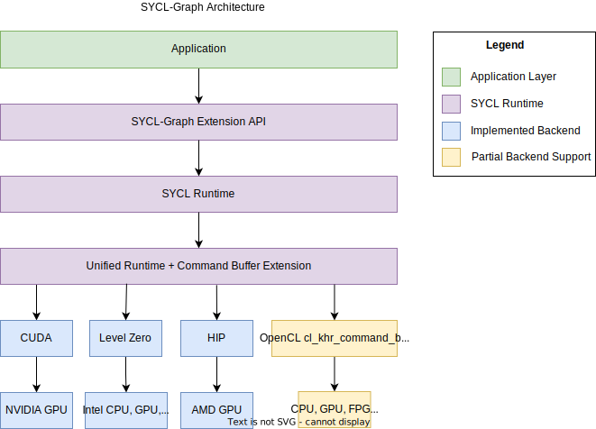

# Command-Graph Extension

This document describes the implementation design of the
[SYCL Graph Extension](../extensions/experimental/sycl_ext_oneapi_graph.asciidoc).

A related presentation can be found
[here](https://www.youtube.com/watch?v=aOTAmyr04rM).

## Requirements

An efficient implementation of a lazy command-graph execution and its replay
requires extensions to the Unified Runtime (UR) layer. Such an extension is
the command-buffer experimental feature, where a command-buffer object
represents a series of operations to be enqueued to the backend device and
their dependencies. A single command-graph can be partitioned into more
than one command-buffer by the runtime. The SYCL Graph extension
distinguishes between backends that support the command-buffer extension
and those that do not. Currently command-buffer extensions are only supported
by Level Zero. All other backends would fall back to an emulation mode, or not
be reported as supported.

The emulation mode targets support of functionality only, without potentially
resulting performance improvements, i.e. execution of a closed Level Zero
command-list multiple times.

### UR Command-Buffer Experimental Feature

The command-buffer concept has been introduced to UR as an
[experimental feature](https://oneapi-src.github.io/unified-runtime/core/api.html#command-buffer-experimental)
with the following entry-points:

| Function                                     | Description |
| -------------------------------------------- | ----------- |
| `urCommandBufferCreateExp`                   | Create a command-buffer. |
| `urCommandBufferRetainExp`                   | Incrementing reference count of command-buffer. |
| `urCommandBufferReleaseExp`                  | Decrementing reference count of command-buffer. |
| `urCommandBufferFinalizeExp`                 | No more commands can be appended, makes command-buffer ready to enqueue on a command-queue. |
| `urCommandBufferAppendKernelLaunchExp`       | Append a kernel execution command to command-buffer. |
| `urCommandBufferAppendUSMMemcpyExp`          | Append a USM memcpy command to the command-buffer. |
| `urCommandBufferAppendUSMFillExp`            | Append a USM fill command to the command-buffer. |
| `urCommandBufferAppendMemBufferCopyExp`      | Append a mem buffer copy command to the command-buffer. |
| `urCommandBufferAppendMemBufferWriteExp`     | Append a memory write command to a command-buffer object. |
| `urCommandBufferAppendMemBufferReadExp`      | Append a memory read command to a command-buffer object. |
| `urCommandBufferAppendMemBufferCopyRectExp`  | Append a rectangular memory copy command to a command-buffer object. |
| `urCommandBufferAppendMemBufferWriteRectExp` | Append a rectangular memory write command to a command-buffer object. |
| `urCommandBufferAppendMemBufferReadRectExp`  | Append a rectangular memory read command to a command-buffer object. |
| `urCommandBufferAppendMemBufferFillExp`      | Append a memory fill command to a command-buffer object. |
| `urCommandBufferEnqueueExp`                  | Submit command-buffer to a command-queue for execution. |

See the [UR EXP-COMMAND-BUFFER](https://oneapi-src.github.io/unified-runtime/core/EXP-COMMAND-BUFFER.html)
specification for more details.

## Design



There are two sets of user facing interfaces that can be used to create a
command-graph object: Explicit and Record & Replay API. Within the runtime they
share a common infrastructure.

## Nodes & Edges

A node in a graph is a SYCL [command-group](https://registry.khronos.org/SYCL/specs/sycl-2020/html/sycl-2020.html#command-group)
(CG) that is defined by a [command-group function](https://registry.khronos.org/SYCL/specs/sycl-2020/html/sycl-2020.html#command-group-function-object)
(CGF).

Internally, a node is represented by the `detail::node_impl` class, and a command-group
by the `sycl::detail::CG` class. An instance of `detail::node_impl` stores a
`sycl::detail::CG` object for the command-group that the node represents.

A [command-group handler](https://registry.khronos.org/SYCL/specs/sycl-2020/html/sycl-2020.html#handler)
lets the user define the operations that are to be performed in the command-group,
e.g. kernel execution, memory copy, host-task. In DPC++ an internal "finalization"
operation is done inside the `sycl::handler` implementation, which constructs a
CG object of a specific type. During normal operation, `handler::finalize()`
then passes the CG object to the scheduler, and a `sycl::event` object
representing the command-group is returned.

However during graph construction, inside `hander::finalize()` the CG object is
not submitted for execution as normal, but stored in the graph as a new node
instead.

When a user adds a node to a graph using the explicit
`command_graph<modifiable>::add()` API passing a CGF, in our graph runtime
implementation a `sycl::handler` object is constructed with a graph parameter
telling it to not submit the CG object to the scheduler on finalization.
This handler finalizes the CGF, and after finalization the CG object from the
handler is moved to the node.

For creating a node in the graph using queue recording mode. When the
`sycl::handler` from a queue submission is finalized, if the queue the
handler was created from is in the recording mode, then the handler knows
not to submit the CG object to the scheduler. Instead, the CG object is
added to the graph associated with the queue as a new node.

Edges are stored in each node as lists of predecessor and successor nodes.

## Execution Order

The current way graph nodes are linearized into execution order is using a
reversed depth-first sorting algorithm. Alternative algorithms, such as
breadth-first, are possible and may give better performance on certain
workloads/hardware. In the future there might be options for allowing the
user to control this implementation detail.

## Scheduler Integration

When there are no requirements from accessors in a command-graph submission,
the scheduler is bypassed and the underlying UR command-buffer is directly
enqueued to a UR queue. If there are accessor requirements, the UR
command-buffer for the executable graph needs to be enqueued by the scheduler.

When individual graph nodes have requirements from SYCL accessors, the
underlying `sycl::detail::CG` object stored in the node is copied and passed to
the scheduler for adding to the UR command-buffer, otherwise the node can
be appended directly as a command in the UR command-buffer. This is in-keeping
with the existing behaviour of the handler with normal queue submissions.

Scheduler commands for adding graph nodes differ from typical command-group
submission in the scheduler, in that they do not launch any asynchronous work
which relies on their dependencies, and are considered complete immediately
after adding the command-group node to the graph.

This presents problems with device allocations which create both an allocation
command and a separate initial copy command of data to the new allocation.
Since future command-graph execution submissions will only receive
dependencies on the allocation command (since this is all the information
available), this could lead to situations where the device execution of the
initial copy command is delayed due to device occupancy, and the command-graph
and initial copy could execute on the device in an incorrect order.

To solve this issue, when the scheduler enqueues command-groups to add as nodes
in a command-graph, it will perform a blocking wait on the dependencies of the
command-group first. The user will experience this wait as part of graph
finalization.

## Graph Partitioning

To handle dependencies from other devices, the graph can be partitioned during
the finalization process. A partition is a set of one or more nodes intended
to run on the same device. Each partition instantiates a command-buffer
(or equivalent) which contains all the commands to be executed on the device.
Therefore, the partitioning only impacts graphs in the executable state and
occurs during finalization. Synchronization between partitions is managed
by the runtime unlike internal partition dependencies that are handled directly
by the backend.

Since runtime synchronization and multiple command-buffer involves
extra latency, the implementation ensures to minimize the number of partitions.
Currently, the creation of a new partition is triggered by a node containing
a host-task.
When a host-task is encountered the predecessors of this host-task node
are assigned to one partition, the host-task is assigned to another partition,
and the successors are assigned to a third partition as shown below:


Partition numbers are allocated in order. Hence, the runtime must ensure that
Partition `n` complete before starting execution of Partition `n+1`.

Note that partitioning can only happen during the finalization stage due to
potential backward dependencies that could be created using
the `make_edge` function.

### Example
The partitioning process is achieved is two main stages:

1 - Nodes are assigned to a temporary group/partition.

2 - Once all the nodes have been annotated with a group number, 
actual partitions are created based on these annotations.

The following diagrams show the annotation process:


Now consider a slightly different graph. 
We used the `make_edge` function to create a dependency between Node E and 
Node HT1. The first 5 steps are identical.
However, from the step 6 the process changes and a group merge is needed as 
illustrated in the following diagrams:


## Memory handling: Buffer and Accessor

There is no extra support for graph-specific USM allocations in the current
proposal. Memory operations will be supported subsequently by the current
implementation starting with `memcpy`.

Buffers and accessors are supported in a command-graph. There are
[spec restrictions](../extensions/experimental/sycl_ext_oneapi_graph.asciidoc#storage-lifetimes)
on buffer usage in a graph so that their lifetime semantics are compatible with
a lazy work execution model. However these changes to storage lifetimes have not
yet been implemented.

## Backend Implementation

Implementation of UR command-buffers
for each of the supported SYCL 2020 backends.

Backends which are implemented currently are: [Level Zero](#level-zero),
[CUDA](#cuda), and partial support for [OpenCL](#opencl).

### Level Zero

The UR `urCommandBufferEnqueueExp` interface for submitting a command-buffer
takes a list of events to wait on, and returns an event representing the
completion of that specific submission of the command-buffer.

However, in the equivalent Level Zero function
[zeCommandQueueExecuteCommandLists](https://spec.oneapi.io/level-zero/latest/core/api.html#zecommandqueueexecutecommandlists)
there are no parameters to take a wait-list, and the only sync primitive
returned is blocking on host.

In order to achieve the expected UR command-buffer enqueue semantics with Level
Zero, the adapter implementation adds extra commands to the Level Zero
command-list representing a UR command-buffer.

* Prefix - Commands added to the start of the L0 command-list by L0 adapter.
* Suffix - Commands added to the end of the L0 command-list by L0 adapter.

These extra commands operate on L0 event synchronisation primitives, used by the
command-list to interact with the external UR wait-list and UR return event
required for the enqueue interface.

The `ur_exp_command_buffer_handle_t` class for this adapter contains a
*SignalEvent* which signals the completion of the command-list in the suffix,
and is reset in the prefix. This signal is detected by a new UR return event
created on UR command-buffer enqueue.

There is also a *WaitEvent* used by the `ur_exp_command_buffer_handle_t` class
in the prefix to wait on any dependencies passed in the enqueue wait-list.
This WaitEvent is reset in the suffix.

A command-buffer is expected to be submitted multiple times. Consequently,
we need to ensure that L0 events associated with graph commands have not
been signaled by a previous execution. These events are therefore reset to the
non-signaled state before running the actual graph associated commands. Note
that this reset is performed in the prefix and not in the suffix to avoid
additional synchronization w.r.t profiling data extraction.

If a command-buffer is about to be submitted to a queue with the profiling
property enabled, an extra command that copies timestamps of L0 events
associated with graph commands into a dedicated memory which is attached to the
returned UR event. This memory stores the profiling information that
corresponds to the current submission of the command-buffer.


For a call to `urCommandBufferEnqueueExp` with an `event_list` *EL*,
command-buffer *CB*, and return event *RE* our implementation has to submit two
new command-lists for the above approach to work. One before
the command-list with extra commands associated with *CB*, and the other
after *CB*. These two new command-lists are retrieved from the UR queue, which
will likely reuse existing command-lists and only create a new one in the worst
case.

The L0 command-list created on `urCommandBufferEnqueueExp` to execute **before**
*CB* contains a single command. This command is a barrier on *EL* that signals
*CB*'s *WaitEvent* when completed.

The L0 command-list created on `urCommandBufferEnqueueExp` to execute **after**
*CB* also contains a single command. This command is a barrier on *CB*'s
*SignalEvent* that signals *RE* when completed.

#### Drawbacks

There are two drawbacks of this approach to implementing UR command-buffers for
Level Zero:

1. 3x the command-list resources are used, if there are many UR command-buffers in
   flight, this may exhaust L0 driver resources. A trivial graph requires 3 L0
   command-lists and if we implement partitioning a graph into multiple UR
   command-buffers, then each partition will contain 3 L0 command-lists.

2. Each L0 command-list is submitted individually with a
   `ur_queue_handle_t_::executeCommandList` call which introduces serialization
   in the submission pipeline that is heavier than having a barrier or a
   `waitForEvents` on the same command-list. Resulting in additional latency when
   executing a UR command-buffer.

3. Dependencies between multiple submissions must be handled by the runtime.
   Indeed, when a second submission is performed the signal conditions 
   of *WaitEvent* are redefined by this second submission. 
   Therefore, this can lead to an undefined behavior and potential
   hangs especially if the conditions of the first submissions were not yet 
   satisfied and the event has not yet been signaled.

Future work will include exploring L0 API extensions to improve the mapping of
UR command-buffer to L0 command-list.

### CUDA

The SYCL Graph CUDA backend relies on the
[CUDA Graphs feature](https://docs.nvidia.com/cuda/cuda-c-programming-guide/index.html#cuda-graphs),
which is the CUDA public API for batching series of operations,
such as kernel launches, connected by dependencies.

UR commands (e.g. kernels) are mapped as graph nodes using the
[CUDA Driver API](https://docs.nvidia.com/cuda/cuda-driver-api/group__CUDA__GRAPH.html#group__CUDA__GRAPH).
The CUDA Driver API is preferred over the CUDA Runtime API to implement
the SYCL Graph backend to remain consistent with other UR functions.
Synchronization between commands (UR sync-points) is implemented
using graph dependencies.

Executable CUDA Graphs can be submitted to a CUDA stream
in the same way as regular kernels.
The CUDA backend enables enqueuing events to wait for into a stream.
It also allows signaling the completion of a submission with an event.
Therefore, submitting a UR command-buffer consists only of submitting to a stream
the executable CUDA Graph that represent this series of operations.

An executable CUDA Graph, which contains all commands and synchronization
information, is saved in the UR command-buffer to allow for efficient
graph resubmission.

### OpenCL

SYCL-Graph is only enabled for an OpenCL backend when the
[cl_khr_command_buffer](https://registry.khronos.org/OpenCL/specs/3.0-unified/html/OpenCL_Ext.html#cl_khr_command_buffer)
extension is available, however this information isn't available until runtime
due to OpenCL implementations being loaded through an ICD.

The `ur_exp_command_buffer` string is conditionally returned from the OpenCL
command-buffer UR backend at runtime based on `cl_khr_command_buffer` support
to indicate that the graph extension should be enabled. This is information
is propagated to the SYCL user via the
`device.get_info<info::device::graph_support>()` query for graph extension
support.

#### Limitations

Due to the API mapping gaps documented in the following section, OpenCL as a
SYCL backend cannot fully support the graph API. Instead, there are
limitations in the types of nodes which a user can add to a graph, using
an unsupported node type will cause a sycl exception to be thrown in graph
finalization with error code `sycl::errc::feature_not_supported` and a message
mentioning the unsupported command. For example,

```
terminate called after throwing an instance of 'sycl::_V1::exception'
what():  USM copy command not supported by graph backend
```

The types of commands which are unsupported, and lead to this exception are:
* `handler::copy(src, dest)` - Where `src` is an accessor and `dest` is a pointer.
   This corresponds to a memory buffer read command.
* `handler::copy(src, dest)` - Where `src` is an pointer and `dest` is an accessor.
  This corresponds to a memory buffer write command.
* `handler::copy(src, dest)` or `handler::memcpy(dest, src)` - Where both `src` and
   `dest` are USM pointers. This corresponds to a USM copy command.
* `handler::memset(ptr, value, numBytes)` - This corresponds to a USM memory
  fill command.
* `handler::prefetch()`.
* `handler::mem_advise()`.

Note that `handler::copy(src, dest)` where both `src` and `dest` are an accessor
is supported, as a memory buffer copy command exists in the OpenCL extension.

#### UR API Mapping

There are some gaps in both the OpenCL and UR specifications for Command
Buffers shown in the list below. There are implementations in the UR OpenCL
adapter where there is matching support for each function in the list.

| UR | OpenCL | Supported |
| --- | --- | --- |
| urCommandBufferCreateExp | clCreateCommandBufferKHR | Yes |
| urCommandBufferRetainExp | clRetainCommandBufferKHR | Yes |
| urCommandBufferReleaseExp | clReleaseCommandBufferKHR | Yes |
| urCommandBufferFinalizeExp | clFinalizeCommandBufferKHR | Yes |
| urCommandBufferAppendKernelLaunchExp | clCommandNDRangeKernelKHR | Yes |
| urCommandBufferAppendUSMMemcpyExp |  | No |
| urCommandBufferAppendUSMFillExp |  | No |
| urCommandBufferAppendMembufferCopyExp | clCommandCopyBufferKHR | Yes |
| urCommandBufferAppendMemBufferWriteExp |  | No |
| urCommandBufferAppendMemBufferReadExp |  | No |
| urCommandBufferAppendMembufferCopyRectExp | clCommandCopyBufferRectKHR | Yes |
| urCommandBufferAppendMemBufferWriteRectExp |  | No |
| urCommandBufferAppendMemBufferReadRectExp |  | No |
| urCommandBufferAppendMemBufferFillExp | clCommandFillBufferKHR | Yes |
| urCommandBufferAppendUSMPrefetchExp |  | No |
| urCommandBufferAppendUSMAdviseExp |  | No |
| urCommandBufferEnqueueExp | clEnqueueCommandBufferKHR | Yes |
|  | clCommandBarrierWithWaitListKHR | No |
|  | clCommandCopyImageKHR | No |
|  | clCommandCopyImageToBufferKHR | No |
|  | clCommandFillImageKHR | No |
|  | clGetCommandBufferInfoKHR | No |
|  | clCommandSVMMemcpyKHR | No |
|  | clCommandSVMMemFillKHR | No |

We are looking to address these gaps in the future so that SYCL-Graph can be
fully supported on a `cl_khr_command_buffer` backend.

#### UR Command-Buffer Implementation

Many of the OpenCL functions take a `cl_command_queue` parameter which is not
present in most of the UR functions. Instead, when a new command buffer is
created in `urCommandBufferCreateExp` we also create and maintain a new
internal `ur_queue_handle_t` with a reference stored inside of the
`ur_exp_command_buffer_handle_t_` struct. The internal queue is retained and
released whenever the owning command buffer is retained or released.

With command buffers being an OpenCL extension, each function is accessed by
loading a function pointer to its implementation. These are defined in a common
header file in the UR OpenCL adapter. The symbols for the functions are however
defined in [OpenCL-Headers](https://github.com/KhronosGroup/OpenCL-Headers/blob/main/CL/cl_ext.h)
but it is not known at this time what version of the headers will be used in
the UR GitHub CI configuration, so loading the function pointers will be used
until this can be verified. A future piece of work would be replacing the
custom defined symbols with the ones from OpenCL-Headers.

#### Available OpenCL Command-Buffer Implementations

Publicly available implementations of `cl_khr_command_buffer` that can be used
to enable the graph extension in OpenCL:

- [OneAPI Construction Kit](https://github.com/codeplaysoftware/oneapi-construction-kit) (must enable `OCL_EXTENSION_cl_khr_command_buffer` when building)
- [PoCL](http://portablecl.org/)
- [Command-Buffer Emulation Layer](https://github.com/bashbaug/SimpleOpenCLSamples/tree/efeae73139ddf064fafce565cc39640af10d900f/layers/10_cmdbufemu)

