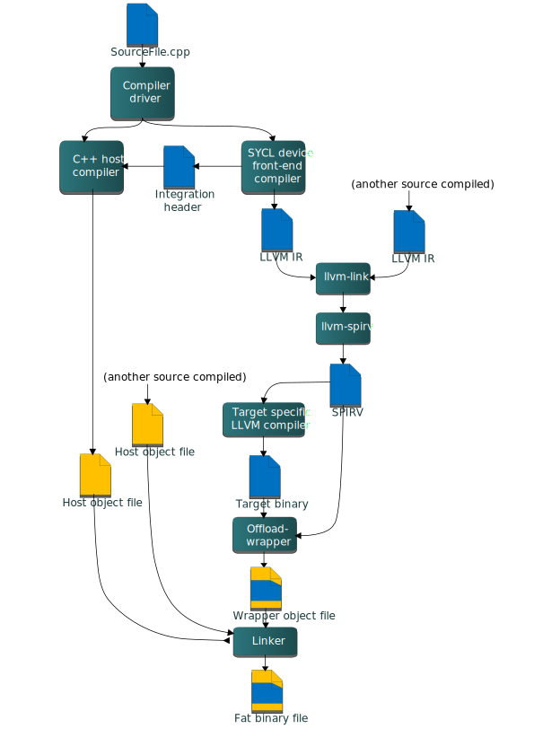
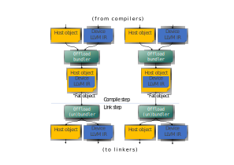
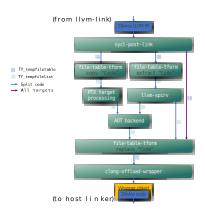
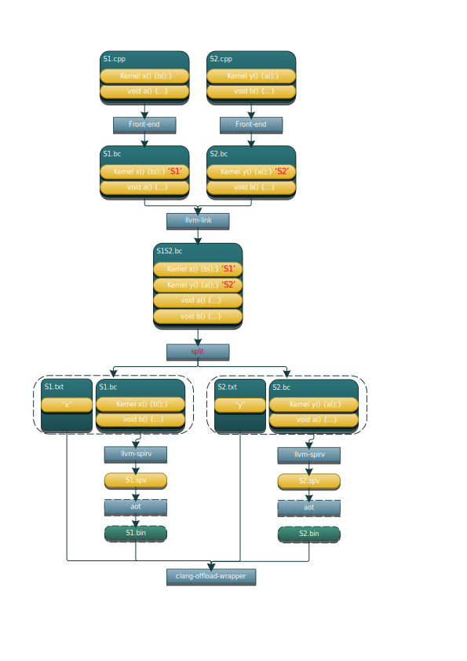
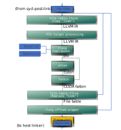

# oneAPI DPC++ Compiler and Runtime architecture design

## Introduction

This document describes the architecture of the DPC++ compiler and runtime
library. For DPC++ specification see
[spec](https://spec.oneapi.com/versions/latest/elements/dpcpp/source/index.html).

## DPC++ Compiler architecture

DPC++ application compilation flow:



*Diagram 1. Application build flow.*  

DPC++ compiler logically can be split into the host compiler and a number of
device compilers—one per each supported target. Clang driver orchestrates the
compilation process, it will invoke the device compiler once per each requested
target, then it will invoke the host compiler to compile the host part of a
SYCL source. In the simplest case, when compilation and linkage are done in one
compiler driver invocation, once compilation is finished, the device object
files (which are really LLVM IR files) are linked with the `llvm-link` tool.
The resulting LLVM IR module is then translated into a SPIR-V module using the
`llvm-spirv` tool and wrapped in a host object file using the
`clang-offload-wrapper` tool. Once all the host object files and the wrapped
object with device code are ready, the driver invokes the usual platform linker
and the final executable called "fat binary" is produced. This is a host
executable or library with embedded linked images for each target specified at
the command line.

There are many variations of the compilation process depending on whether user
chose to do one or more of the following:

- perform compilation separately from linkage
- compile the device SPIR-V module ahead-of-time for one or more targets
- perform device code splitting so that device code is distributed across
  multiple modules rather than enclosed in a single one
- perform linkage of static device libraries
Sections below provide more details on some of those scenarios.

SYCL sources can be also compiled as a regular C++ code, in this mode there is
no "device part" of the code — everything is executed on the host.

Device compiler is further split into the following major components:

- **Front-end** - parses input source, "outlines" device part of the code,
applies additional restrictions on the device code (e.g. no exceptions or
virtual calls), generates LLVM IR for the device code only and "integration
header" which provides information like kernel name, parameters order and data
type for the runtime library.
- **Middle-end** - transforms the initial LLVM IR to get consumed by the
back-end. Today middle-end transformations include just a couple of passes:
  - Optionally: Address space inference pass
  - TBD: potentially the middle-end optimizer can run any LLVM IR
  transformation with only one limitation: back-end compiler should be able to
  handle transformed LLVM IR.
  - Optionally: LLVM IR → SPIR-V translator.
- **Back-end** - produces native "device" code. It is shown as
"Target-specific LLVM compiler" box on Diagram 1. It is invoked either at
compile time (in ahead-of-time compilation scenario) or at runtime
(in just-in-time compilation scenario).

*Design note: in current design we use SYCL device front-end compiler to produce the
integration header for two reasons. First, it must be possible to use any host
compiler to produce SYCL heterogeneous applications. Second, even if the
same clang compiler is used for the host compilation, information provided in the
integration header is used (included) by the SYCL runtime implementation, so the
header must be available before the host compilation starts.*

### SYCL support in Clang front-end

SYCL support in Clang front-end can be split into the following components:

- Device code outlining. This component is responsible for identifying and
outlining "device code" in the single source.
- SYCL kernel function object (functor or lambda) lowering. This component
creates an OpenCL kernel function interface for SYCL kernels.
- Device code diagnostics. This component enforces language restrictions on
device code.
- Integration header generation. This component emits information required for
binding host and device parts of the SYCL code via OpenCL API.

#### Device code outlining

Here is a code example of a SYCL program that demonstrates compiler outlining
work:

```C++
int foo(int x) { return ++x; }
int bar(int x) { throw std::exception{"CPU code only!"}; }
...
using namespace sycl;
queue Q;
buffer<int, 1> a{range<1>{1024}};
Q.submit([&](handler& cgh) {
      auto A = a.get_access<access::mode::write>(cgh);
      cgh.parallel_for<init_a>(range<1>{1024}, [=](id<1> index) {
        A[index] = index[0] * 2 + foo(42);
      });
    }
...
```

In this example, the compiler needs to compile the lambda expression passed
to the `sycl::handler::parallel_for` method, as well as the function `foo`
called from the lambda expression for the device.

The compiler must also ignore the `bar` function when we compile the
"device" part of the single source code, as it's unused inside the device
portion of the source code (the contents of the lambda expression passed to the
`sycl::handler::parallel_for` and any function called from this lambda
expression).

The current approach is to use the SYCL kernel attribute in the runtime to
mark code passed to `sycl::handler::parallel_for` as "kernel functions".
The runtime library can't mark foo as "device" code - this is a compiler
job: to traverse all symbols accessible from kernel functions and add them to
the "device part" of the code marking them with the new SYCL device attribute.

#### Lowering of lambda function objects and named function objects

All SYCL memory objects shared between host and device (buffers/images,
these objects map to OpenCL buffers and images) must be accessed through special
`accessor` classes. The "device" side implementation of these classes contains
pointers to the device memory. As there is no way in OpenCL to pass structures
with pointers inside as kernel arguments all memory objects shared between host
and device must be passed to the kernel as raw pointers.

SYCL also has a special mechanism for passing kernel arguments from host to
the device. In OpenCL kernel arguments are set by calling `clSetKernelArg`
function for each kernel argument, meanwhile in SYCL all the kernel arguments
are fields of "SYCL kernel function" which can be defined as a lambda function
or a named function object and passed as an argument to SYCL function for
invoking kernels (such as `parallel_for` or `single_task`). For example, in the
previous code snippet above `accessor` `A` is one such captured kernel argument.

To facilitate the mapping of SYCL kernel data members to OpenCL
kernel arguments and overcome OpenCL limitations we added the generation of an
OpenCL kernel function inside the compiler. An OpenCL kernel function contains
the body of the SYCL kernel function, receives OpenCL-like parameters and
additionally does some manipulation to initialize SYCL kernel data members
with these parameters. In some pseudo code the OpenCL kernel function for the
previous code snippet above looks like this:

```C++
// SYCL kernel is defined in SYCL headers:
template <typename KernelName, typename KernelType/*, ...*/>
__attribute__((sycl_kernel)) void sycl_kernel_function(KernelType KernelFuncObj) {
  // ...
  KernelFuncObj();
}

// Generated OpenCL kernel function
__kernel KernelName(global int* a) {
  KernelType KernelFuncObj; // Actually kernel function object declaration
  // doesn't have a name in AST.
  // Let the kernel function object have one captured field - accessor A.
  // We need to init it with global pointer from arguments:
  KernelFuncObj.A.__init(a);
  // Body of the SYCL kernel from SYCL headers:
  {
    KernelFuncObj();
  }
}
```

OpenCL kernel function is generated by the compiler inside the Sema using AST
nodes. Additional details of kernel parameter passing may be found in the
document
[SYCL Kernel Parameter Handling and Array Support](KernelParameterPassing.md).

### SYCL support in the driver

SYCL offload support in the driver is based on the clang driver concepts and
defines:

- target triple and a native tool chain for each target (including "virtual"
targets like SPIR-V).
- SYCL offload action based on generic offload action.

SYCL compilation pipeline has a peculiarity compared to other compilation
scenarios - some of the actions in the pipeline may output multiple "clusters"
of files, consumed later by other actions. For example, each device binary maybe
accompanied by a symbol table and a specialization constant map - additional
information used by the SYCL runtime library - and it needs to be stored into
the device binary descriptor by the offload wrapper tool. With device code
splitting feature enabled, there can be multiple such sets (clusters) of files -
one per each separate device binary.

Current design of clang driver doesn't allow to model that, namely:

1. Multiple inputs/outputs in the action graph.
2. Logical grouping of multiple inputs/outputs. For example, an input or output
can consist of multiple pairs of files, where each pair represents information
for a single device code module: [a file with device code, a file with exported
symbols].

To support this, SYCL introduces the `file-table-tform` tool. This tool can
transform file tables following commands passed as input arguments. Each row
in the table represents a file cluster, each column - a type of data associated
with a cluster. The tool can replace and extract columns. For example, the
`sycl-post-link` tool can output two file clusters and the following file
table referencing all the files in the clusters:

```
  [Code|Symbols|Properties]
  a_0.bc|a_0.sym|a_0.props
  a_1.bc|a_1.sym|a_1.props
```

When participating in the action graph this tool inputs a file table
(`TY_Tempfiletable` clang input type) and/or a file list (`TY_Tempfilelist`),
performs requested transformations and outputs a file table or list. From the
clang design standpoint there is still single input and output, even though in
reality there are multiple.

For example, depending on compilation options, files from the "Code" column
above may need to undergo AOT compilation after the device code splitting step,
performed as a part of the code transformation sequence done by the
`sycl-post-link` tool. The driver will then:

- Use the `file-table-tform` to extract the code files and produce a file
  list:

```
a_0.bc
a_1.bc
```

- Pass this file list to the `llvm-foreach` tool along with AOT compilation
command to invoke it on every file in the list. This will result in another
file list

```
a_0.bin
a_1.bin
```

- Then `file-table-tform` is invoked again to replace `.bc` with `.bin` in
the filetable to get a new filetable:

```
  [Code|Symbols|Properties]
  a_0.bin|a_0.sym|a_0.props
  a_1.bin|a_1.sym|a_1.props
```

- Finally, this filetable is passed to the `clang-offload-wrapper` tool to
construct a wrapper object which embeds all those files.

Note that the graph does not change when more rows (clusters) or columns
(e.g. a "manifest" file) are added to the table.

#### Enable SYCL offload

To enable compilation following single-source multiple compiler-passes (SMCP)
technique which is described in the SYCL specification, a special option
must be passed to the clang driver:

`-fsycl`

With this option specified, the driver will invoke the host compiler and a
number of SYCL device compilers for targets specified in the `-fsycl-targets`
option. If `-fsycl-targets` is not specified, then single SPIR-V target is
assumed, and single device compiler for this target is invoked.

The option `-sycl-std` allows specifying which version of
the SYCL standard will be used for the compilation.
The default value for this option is `1.2.1`.

#### Ahead of time (AOT) compilation

Ahead-of-time compilation is the process of invoking the back-end at compile
time to produce the final binary, as opposed to just-in-time (JIT) compilation
when final code generation is deferred until application runtime time.

AOT compilation reduces application execution time by skipping JIT compilation
and final device code can be tested before deploying.

JIT compilation provides portability of device code and target specific
optimizations.

#### List of native targets

The ahead-of-time compilation mode implies that there must be a way to specify
a set of target architectures for which to compile device code. By default, the
compiler generates SPIR-V and OpenCL device JIT compiler produces native target
binary.

To produce binaries for target architectures identified by target triples
`triple1` and `triple2`, the following SYCL compiler options are used:

`-fsycl-targets=triple1,triple2`

will produce binaries from SYCL kernels for devices identified by the two
target triples. This basically tells the driver which device compilers must be
invoked to compile the SYCL kernel code. By default, the JIT compilation
approach is assumed and device code is compiled for a single target triple -
`[spir,spir64]-*-*`.

#### Device code formats

Each target may support a number of code forms, each device compiler defines
and understands mnemonics designating a particular code form, for example
"`visa:3.3`" could designate virtual ISA version 3.3 for Intel GPU target (Gen
architecture). User can specify desired code format using the target-specific
option mechanism, similar to OpenMP.

`-Xsycl-target-backend=<triple> "arg1 arg2 ..."`

For example, to support offload to Gen9/vISA3.3, the following options would be
used:

`-fsycl -fsycl-targets=spir64_gen -Xsycl-target-backend "-device skl"`

The driver passes the `-device skl` parameter directly to the Gen device backend
compiler `ocloc` without parsing it.

`ocloc` is also capable of offline compilation for several ISA
versions/Gen architectures. For example, to make the device binary
compatible with all Intel Gen9 GPU platforms, one could use:

`-fsycl -fsycl-targets=spir64_gen -Xsycl-target-backend "-device gen9"`

For more details on supported platforms and argument syntax, refer to
the GPU offline compiler manual by detecting your local `ocloc`
installation and running `ocloc compile --help`.

#### Separate Compilation and Linking

The compiler supports such features as

- linking of device code obtained from different source files before generating
  the final SPIR-V to be fed to the back-end.
- splitting application build into separate compile and link steps.

Overall build flow changes compared to the one shown on the Diagram 1
above in the following way.
**Compilation step** ends with engaging the offload
bundler to generate so-called "fat object" for each
<host object, device code IR> pair produced from the same heterogeneous source.
The fat object files become the result of compilation similar to object
files with usual non-offload compiler.
**Link step** starts with breaking the input fat objects back into their
constituents, then continue the same way as on the Diagram 1 - link host code
and device code separately and finally produce a "fat binary".

The diagram below illustrates the changes in the build flow. The offload
bundler/unbundler actions are basically inserted between the `llvm-link` and
the `linker` invocations as shown on the Diagram 1.


*Diagram 2. Split compilation and linkage.*  

*Current implementation uses LLVM IR as a default device binary format for `fat
objects` and translates "linked LLVM IR" to SPIR-V. One of the reasons for this
decision is that SPIR-V doesn't support linking template functions, which could
be defined in multiple modules and linker must resolve multiple definitions.
LLVM IR uses function attributes to satisfy "one definition rule", which have
no counterparts in SPIR-V.*

#### Fat binary creation details

"Fat binary" is a result of the final host linking step - this is a host binary
with device binary(s) embedded. When run, it automatically registers
all available device binaries within the SYCL runtime library. This section
describes how this is achieved.

The output fat binary is created with usual linker - e.g. `ld` on Linux and
`link.exe` on Windows. For the linker to be able to embed the device binaries,
they are first "wrapped" into a host object file called "wrapper object". Then
this wrapper object is linked normally with the rest of host objects and/or
libraries.

The wrapper object is created by the `clang-offload-wrapper` tool, or simply
"offload wrapper". The created wrapper object has two main components:

1. Global symbol - offload descriptor - pointing to a special data structure
put into in the object's data section. It encompasses all needed information
about the wrapped device binaries - number of binaries, symbols each binary
defines, etc. - as well as the binaries themselves.
2. Registration/unregistration functions. The first one is put into a special
section so that it is invoked when the parent fat binary is loaded into a
process at runtime, the second one is put into another section to be invoked
when the parent fat binary is unloaded. The registration function basically
takes the pointer to the offload descriptor and invokes SYCL runtime library's
registration function passing it as a parameter.

The offload descriptor type hierarchy is described in the `pi.h` header. The
top-level structure is `pi_device_binaries_struct`.

#### Device Link

The -fsycl-link flag instructs the compiler to fully link device code without
fully linking host code. The result of such a compile is a fat object that
contains a fully linked device binary. The primary motivation for this flow
is to allow users to save re-compile time when making changes that only affect
their host code. In the case where device image generation takes a long time
(e.g. FPGA), this savings can be significant.

For example, if the user separated source code into four files: dev_a.cpp,
dev_b.cpp, host_a.cpp and host_b.cpp where only dev_a.cpp and dev_b.cpp contain
device code, they can divide the compilation process into three steps:

1. Device link: dev_a.cpp dev_b.cpp -> dev_image.o (contain device image)
2. Host Compile (c): host_a.cpp -> host_a.o; host_b.cpp -> host_b.o
3. Linking: dev_image.o host_a.o host_b.o -> executable

Step 1 can take hours for some targets. But if the user wishes to recompile
after modifying only host_a.cpp and host_b.cpp, they can simply run steps 2 and
3 without rerunning the expensive step 1.

The compiler is responsible for verifying that the user provided all the
relevant files to the device link step. There are 2 cases that have to be
checked:

1. Missing symbols referenced by the kernels present in the device link step
(e.g. functions called by or global variables used by the known kernels).
2. Missing kernels.

Case 1 can be identified in the device binary generation stage (step 1) by
scanning the known kernels. Case 2 must be verified by the driver by checking
for newly introduced kernels in the final link stage (step 3).

#### Device Link during compilation

The `-fno-sycl-rdc` flag can be used in combination with the `-c` option
when generating fat objects. This option combination informs the compiler to
perform a full device link stage against the device object, creating a fat
object that contains the corresponding host object and a fully compiled device
binary. It is expected that usage of `-fno-sycl-rdc` coincide with
ahead of time compiling.

When using the generated fat object in this case, the compiler will recognize
the fat object that contains the fully linked device binary. The device binary
will be unbundled and linked during the final host link and will not be sent
through any additional device linking steps.

1. Generation of fat object: a.cpp -> a_fat.o (contains host object and full
device image)
2. Linking: a_fat.o -> executable

The generation of the full device image during the compilation (-c) step of
creating the object allows for library creation that does not require full
device linking steps which can be a burden to the user.  Providing these early
device linking steps give the provider of the archives/objects a better user
experience.

#### Device code post-link step

At link time all the device code is linked into
a single LLVM IR module unless `-fno-sycl-rdc` is specified.
`sycl-post-link` tool performs a number of final transformations on this LLVM IR
module before handing it off to the offload wrapper. Those include:

- device code splitting
- symbol table generation
- specialization constants lowering

Depending on options, `sycl-post-link` can output either a single LLVM IR file,
or multiple files plus a file table referencing all of them. See the
"SYCL support in the driver" section for overall description of file table. The
diagram below shows possible clang action graphs which compilation process will
follow from the single linked LLVM IR module to creating the wrapper object.
There are multiple possible variants of the graph depending on:

- specific target requirements
- device code splitting
- AOT compilation



*Diagram 3. Device code link flows.*  

Colors of the graph's edges show which paths are taken depending on the above
factors. Each edge is also annotated with the input/output file type.
The diagram does not show the `llvm-foreach` tool invocations for clarity.
This tool invokes given command line over each file in a file list. In this
diagram the tool is applied to `llvm-spirv` and AOT backend whenever the
input/output type is `TY_tempfilelist` and the target is not PTX.
Following this, `file-table-tform` takes two inputs - the file table and a file
list coming either from `llvm-spirv` or from the AOT backend.
Targeting PTX currently only accepts a single input file for processing, so
`file-table-tform` is used to extract the code file from the file table, which
is then processed by the
["PTX target processing" step](#device-code-post-link-step-for-cuda).
The resulting device binary is inserted back into the file table in place of the
extracted code file using `file-table-tform`. If `-fno-sycl-rdc` is specified,
all shown tools are invoked multiple times, once per translation unit rather than
once total. See [Non-Relocatable Device Code](NonRelocatableDeviceCode.md) for
more information.

##### Device code splitting

Putting all device code into a single SPIR-V module does not work well in the
following cases:

1. There are thousands of kernels defined and only small part of them is used at
run-time. Having them all in one SPIR-V module significantly increases JIT time.
2. Device code can be specialized for different devices. For example, kernels
that are supposed to be executed only on FPGA can use extensions available for
FPGA only. This will cause JIT compilation failure on other devices even if this
particular kernel is never called on them.

To resolve these problems the compiler can split a single module into smaller
ones. The following features is supported:

- Emitting a separate module for source (translation unit)
- Emitting a separate module for each kernel

If the device code does not use `SYCL_EXTERNAL` functions, device code splitting
can be combined with the `-fno-sycl-rdc` option for improved compiler performance.

The current approach is:

- Generate special meta-data with translation unit ID for each kernel in SYCL
front-end. This ID will be used to group kernels on per-translation unit basis
- Link all device LLVM modules using llvm-link
- Perform split on a fully linked module, unless `-fno-sycl-rdc` is specified,
  where splits are performed on a module containing only current translation unit and
  linked device libraries
- Generate a symbol table (list of kernels) for each produced device module for
proper module selection in runtime
- Perform SPIR-V translation and AOT compilation (if requested) on each produced
module separately
- Add information about presented kernels to a wrapping object for each device
image

Device code splitting process:


The `llvm-link` box does not occur when `-fno-sycl-rdc` is specified. Rather,
all subsequent boxes occur per-source.

The "split" box is implemented as functionality of the dedicated tool
`sycl-post-link`. The tool runs a set of LLVM passes to split input module and
generates a symbol table (list of kernels) for each produced device module.

To enable device code split, a special option must be passed to the clang
driver:

`-fsycl-device-code-split=<value>`

There are three possible values for this option:

- `per_source` - enables emitting a separate module for each source (translation
unit)
- `per_kernel` - enables emitting a separate module for each kernel
- `off` - disables device code split. If `-fno-sycl-rdc` is specified, the behavior is
   the same as `per_source`

##### Symbol table generation

TBD

##### Specialization constants lowering

See corresponding documentation

#### CUDA support

The driver supports compilation to NVPTX when the `nvptx64-nvidia-cuda` is
passed to `-fsycl-targets`.

Unlike other AOT targets, the bitcode module linked from intermediate compiled
objects never goes through SPIR-V. Instead it is passed directly in bitcode form
down to the NVPTX Back End. All produced bitcode depends on two libraries,
`libdevice.bc` (provided by the CUDA SDK) and `libspirv-nvptx64--nvidiacl.bc` variants
(built by the libclc project). `libspirv-nvptx64--nvidiacl.bc` is not used directly. 
Instead it is used to generate remangled variants 
`remangled-l64-signed_char.libspirv-nvptx64--nvidiacl.bc` and
`remangled-l32-signed_char.libspirv-nvptx64--nvidiacl.bc` to handle primitive type
differences between Linux and Windows.

##### Device code post-link step for CUDA

During the "PTX target processing" in the device linking step [Device
code post-link step](#device-code-post-link-step), the llvm bitcode
objects for the CUDA target are linked together during the common
`llvm-link` step and then split using the `sycl-post-link` tool.
For each temporary bitcode file, clang is invoked for the temporary file to link
`libspirv-nvptx64--nvidiacl.bc` and `libdevice.bc` and compile the resulting
module to PTX using the NVPTX backend. The resulting PTX file is assembled
into a cubin using the `ptxas` tool (part of the CUDA SDK). The PTX file and
cubin are assembled together using `fatbinary` to produce a CUDA fatbin.
The produced CUDA fatbins then replace the llvm bitcode files in the file table generated
by `sycl-post-link`. The resulting table is passed to the offload wrapper tool.



##### Checking if the compiler is targeting NVPTX

When the SYCL compiler is in device mode and targeting the NVPTX backend,
the compiler defines `__SYCL_DEVICE_ONLY__` and `__NVPTX__` macros. This
macro combination can safely be used to enable NVPTX specific code
path in SYCL kernels.

*Note: these macros are defined only during the device compilation phase.*

##### NVPTX Builtins

Builtins are implemented in OpenCL C within libclc. OpenCL C treats `long` 
types as 64 bit and has no `long long` types while Windows DPC++ treats `long`
types like 32-bit integers and `long long` types like 64-bit integers. 
Differences between the primitive types can cause applications to use 
incompatible libclc built-ins. A remangler creates multiple libspriv files 
with different remangled function names to support both Windows and Linux. 
When building a SYCL application targeting the CUDA backend the driver 
will link the device code with 
`remangled-l32-signed_char.libspirv-nvptx64--nvidiacl.bc` if the host target is
Windows or it will link the device code with
`remangled-l64-signed_char.libspirv-nvptx64--nvidiacl.bc` if the host target is
Linux.

When the SYCL compiler is in device mode and targeting the NVPTX backend, the
compiler exposes NVPTX builtins supported by clang.

*Note: this enable NVPTX specific features which cannot be supported by other
targets or the host.*

Example:

```cpp
double my_min(double x, double y) {
#if defined(__NVPTX__) && defined(__SYCL_DEVICE_ONLY__)
  // Only available if in device mode and
  // while compiling for the NVPTX target.
  return __nvvm_fmin_d(x, y);
#else
  return x < y ? x : y;
#endif
}
```

##### Local memory support

In CUDA, users can only allocate one chunk of host allocated shared memory
(which maps to SYCL's local accessors). This chunk of memory is allocated as an
array `extern __shared__ <type> <name>[];` which LLVM represents as an external
global symbol to the CUDA shared memory address space. The NVPTX backend then
lowers this into a `.extern .shared .align 4 .b8` PTX instruction.

In SYCL, users can allocate multiple local accessors and pass them as kernel
parameters. When the SYCL frontend lowers the SYCL kernel invocation into an
OpenCL compliant kernel entry, it lowers local accessors into a pointer to
OpenCL local memory (CUDA shared memory) but this is not legal for CUDA kernels.

To legalize the SYCL lowering for CUDA, a SYCL for CUDA specific pass will do
the following:

- Create a global symbol to the CUDA shared memory address space
- Transform all pointers to CUDA shared memory into a 32 bit integer
  representing the offset in bytes to use with the global symbol
- Replace all uses of the transformed pointers by the address to global symbol
  offset by the value of the integer passed as parameter

As an example, the following kernel:

```LLVM
define void @SYCL_generated_kernel(i64 addrspace(3)* nocapture %local_ptr, i32 %arg, i64 addrspace(3)* nocapture %local_ptr2) {
  %0 = load i64, i64 addrspace(3)* %local_ptr
  %1 = load i64, i64 addrspace(3)* %local_ptr2
}
```

Is transformed into this kernel when targeting CUDA:

```LLVM
@SYCL_generated_kernel.shared_mem = external dso_local local_unnamed_addr addrspace(3) global [0 x i8], align 4

define void @SYCL_generated_kernel(i32 %local_ptr_offset, i32 %arg, i32 %local_ptr_offset2) {
  %new_local_ptr = getelementptr inbounds [0 x i8], [0 x i8] addrspace(3)* @SYCL_generated_kernel.shared_mem, i32 0, i32 %local_ptr_offset
  %new_local_ptr2 = getelementptr inbounds [0 x i8], [0 x i8] addrspace(3)* @SYCL_generated_kernel.shared_mem, i32 0, i32 %local_ptr_offset2
  %0 = load i32, i32 addrspace(3)* %new_local_ptr
  %1 = load i64, i64 addrspace(3)* %new_local_ptr2
}
```

On the runtime side, when setting local memory arguments, the CUDA PI
implementation will internally set the argument as the offset with respect to
the accumulated size of used local memory. This approach preserves the existing
PI interface.

##### Global offset support

The CUDA API does not natively support the global offset parameter
expected by the SYCL.

In order to emulate this and make generated kernel compliant, an intrinsic
`llvm.nvvm.implicit.offset` (clang builtin `__builtin_ptx_implicit_offset`) was
introduced materializing the use of this implicit parameter for the NVPTX
backend. AMDGCN uses the same approach with `llvm.amdgpu.implicit.offset` and
`__builtin_amdgcn_implicit_offset`. The intrinsic returns a pointer to `i32`
referring to a 3 elements array.

Each non-kernel function reaching the implicit offset intrinsic in the
call graph is augmented with an extra implicit parameter of type
pointer to `i32`. Kernels calling one of these functions using
this intrinsic are cloned:

- the original kernel initializes an array of 3 `i32` to 0 and passes
  the pointer to this array to each function with the implicit
  parameter;
- the cloned function type is augmented with an implicit parameter of
  type array of 3 `i32`. The pointer to this array is then passed each
  function with the implicit parameter.

The runtime will query both kernels and call the appropriate one based
on the following logic:

- If the 2 versions exist, the original kernel is called if global
  offset is 0 otherwise it will call the cloned one and pass the
  offset by value (for CUDA backend), or by ref for AMD;
- If only 1 function exist, it is assumed that the kernel makes no use
  of this parameter and therefore ignores it.

As an example, the following code:

```LLVM
declare i32* @llvm.nvvm.implicit.offset()

define weak_odr dso_local i64 @other_function() {
  %1 = tail call i32* @llvm.nvvm.implicit.offset()
  %2 = getelementptr inbounds i32, i32* %1, i64 2
  %3 = load i32, i32* %2, align 4
  %4 = zext i32 %3 to i64
  ret i64 %4
}

define weak_odr dso_local void @other_function2() {
  ret
}

define weak_odr dso_local void @example_kernel() {
entry:
  %0 = call i64 @other_function()
  call void @other_function2()
  ret void
}
```

Is transformed into this:

```LLVM
define weak_odr dso_local i64 @other_function(i32* %0) {
  %2 = getelementptr inbounds i32, i32* %0, i64 2
  %3 = load i32, i32* %2, align 4
  %4 = zext i32 %3 to i64

  ret i64 %4
}

define weak_odr dso_local void @example_kernel() {
entry:
  %0 = alloca [3 x i32], align 4
  %1 = bitcast [3 x i32]* %0 to i8*
  call void @llvm.memset.p0i8.i64(i8* nonnull align 4 dereferenceable(12) %1, i8 0, i64 12, i1 false)
  %2 = getelementptr inbounds [3 x i32], [3 x i32]* %0, i32 0, i32 0
  %3 = call i64 @other_function(i32* %2)
  call void @other_function2()
  ret void
}

define weak_odr dso_local void @example_kernel_with_offset([3 x i32]* byval([3 x i32]) %0) {
entry:
  %1 = bitcast [3 x i32]* %0 to i32*
  %2 = call i64 @other_function(i32* %1)
  call void @other_function2()
  ret void
}
```

Note: Kernel naming is not fully stable for now.

##### Kernel Fusion Support

The [experimental kernel fusion
extension](../extensions/experimental/sycl_ext_codeplay_kernel_fusion.asciidoc)
also supports the CUDA and HIP backends. However, as the CUBIN, PTX and AMD assembly
are not suitable input formats for the [kernel fusion JIT compiler](KernelFusionJIT.md), a
suitable IR has to be added as an additional device binary.

Therefore, in case kernel fusion should be performed for the CUDA or HIP backends, the
user needs to specify the additional flag `-fsycl-embed-ir` during compilation,
to add LLVM IR as an additional device binary. When the flag `-fsycl-embed-ir`
is specified, the LLVM IR produced by Clang for the CUDA/HIP backend device
compilation is added to the fat binary file. To this end, the resulting
file-table from `sycl-post-link` is additionally passed to the
`clang-offload-wrapper`, creating a wrapper object with target `llvm_nvptx64`
for the CUDA backend and `llvm_amdgcn` for the HIP backend.

This device binary in LLVM IR format can be retrieved by the SYCL runtime and
used by the kernel fusion JIT compiler. For the CUDA backend, the resulting fused
kernel is compiled to PTX assembly by the kernel fusion JIT compiler at runtime.
For the HIP backend, the resulting fused kernel is compiled to an AMDGCN binary
by the kernel fusion JIT compiler at runtime, however this output requires
finalization by `lld`. Rather than adding another dependancy to the fusion jit,
a `Requires finalization` property is added the binary. The HIP
PI plugin/UR adapter will then use the AMD Compiler Object Manager library
(`comgr`, part of the ROCm package) in order to finalize it into
a loadable format.

Note that the device binary in LLVM IR does not replace the device binary in
target format, but is embed in addition to it.

### Integration with SPIR-V format

This section explains how to generate SPIR-V specific types and operations from
C++ classes and functions.

Translation of SYCL C++ programs to the code executable on heterogeneous
systems can be considered as three step process:

1) translation of SYCL C++ programs into LLVM IR
1) translation from LLVM IR to SPIR-V
1) translation from SPIR-V to machine code

LLVM-IR to SPIR-V translation is performed by a dedicated tool -
[translator](https://github.com/KhronosGroup/SPIRV-LLVM-Translator).
This tool correctly translates most of regular LLVM IR types/operations/etc to
SPIR-V.

For example:

- Type: `i32` → `OpTypeInt`
- Operation: `load` → `OpLoad`
- Calls: `call` → `OpFunctionCall`

SPIR-V defines special built-in types and operations that do not have
corresponding equivalents in LLVM IR. E.g.

- Type: ??? → `OpTypeEvent`
- Operation: ??? → `OpGroupAsyncCopy`

Translation from LLVM IR to SPIR-V for special types is also supported, but
such LLVM IR must comply to some special requirements. Unfortunately, there is
no canonical form of special built-in types and operations in LLVM IR, moreover
we can't re-use existing representation generated by OpenCL C front-end
compiler. For instance, here is how `OpGroupAsyncCopy` operation looks in LLVM
IR produced by OpenCL C front-end compiler.

```LLVM
@_Z21async_work_group_copyPU3AS3fPU3AS1Kfjj(float addrspace(3)*, float addrspace(1)*, i32, i32)
```

It's a regular function, which can conflict with user code produced from C++
source.

DPC++ compiler uses modified solution developed for OpenCL C++ compiler
prototype:

- Compiler: https://github.com/KhronosGroup/SPIR/tree/spirv-1.1
- Headers: https://github.com/KhronosGroup/libclcxx

Our solution re-uses OpenCL data types like sampler, event, image types, etc,
but we use different spelling to avoid potential conflicts with C++ code.
Spelling convention for the OpenCL types enabled in SYCL mode is:

```C++
__ocl_<OpenCL_type_name> // e.g. __ocl_sampler_t, __ocl_event_t
```

Operations using OpenCL types use special naming convention described in this
[document](https://github.com/KhronosGroup/SPIRV-LLVM-Translator/blob/master/docs/SPIRVRepresentationInLLVM.rst).
This solution allows us avoid SYCL specialization in SPIR-V translator and
leverage clang infrastructure developed for OpenCL types.

SPIR-V operations that do not have LLVM equivalents are **declared**
(but not defined) in the headers and satisfy following requirements:

- the operation is expressed in C++ as `extern` function not throwing C++
  exceptions
- the operation must not have the actual definition in C++ program

For example, the following C++ code is successfully recognized and translated
into SPIR-V operation `OpGroupAsyncCopy`:

```C++
template <typename dataT>
extern __ocl_event_t
__spirv_OpGroupAsyncCopy(int32_t Scope, __local dataT *Dest,
                         __global dataT *Src, size_t NumElements,
                         size_t Stride, __ocl_event_t E) noexcept;

__ocl_event_t e =
  __spirv_OpGroupAsyncCopy(cl::__spirv::Scope::Workgroup,
                           dst, src, numElements, 1, E);
```

#### Some details and agreements on using SPIR-V special types and operations

The SPIR-V specific C++ enumerators and classes are declared in the file:
`sycl/include/CL/__spirv/spirv_types.hpp`.

The SPIR-V specific C++ function declarations are in the file:
`sycl/include/CL/__spirv/spirv_ops.hpp`.

The SPIR-V specific functions are implemented in for the SYCL host device here:
`sycl/source/spirv_ops.cpp`.

### Address spaces handling

SYCL specification uses C++ classes to represent pointers to disjoint memory
regions on an accelerator to enable compilation with standard C++ toolchain and
SYCL compiler toolchain.

For instance:

``` C++
// check that SYCL mode is ON and we can use non-standard decorations
#if defined(__SYCL_DEVICE_ONLY__)
// GPU/accelerator implementation
template <typename T, address_space AS> class multi_ptr {
  // DecoratedType applies corresponding address space attribute to the type T
  // DecoratedType<T, global_space>::type == "__attribute__((opencl_global)) T"
  // See sycl/include/sycl/access/access.hpp for more details
  using pointer_t = typename DecoratedType<T, AS>::type *;
 
  pointer_t m_Pointer;
  public:
  pointer_t get() { return m_Pointer; }
  T& operator* () { return *reinterpret_cast<T*>(m_Pointer); }
}
#else
// CPU/host implementation
template <typename T, address_space AS> class multi_ptr {
  T *m_Pointer; // regular undecorated pointer
  public:
  T *get() { return m_Pointer; }
  T& operator* () { return *m_Pointer; }
}
#endif
```

Depending on the compiler mode `multi_ptr` will either decorate internal data
with address space attribute or not.

The main address space semantic difference of SYCL mode from OpenCL is that
SYCL doesn't assign OpenCL generic address space to a declaration's type without
explicit address space attribute. Similar to other single-source C++-based GPU
programming modes like OpenMP/CUDA/HIP, SYCL uses clang's "default" address
space for types with no address space attributes. During the lowering to LLVM
IR, the default address space is mapped to the SPIR generic address space.
Declarations are assigned to the relevant memory region depending on their
declaration context and pointers to them are cast to generic. This design has
two important features: keeps the type system consistent with C++ on one hand
and enable tools for emitting device code aligned with SPIR memory model (and
other GPU targets).

So inside a function, this variable declaration:

```C++
int var;
```

DPC++ turn into

```C++
VarDecl  var 'int'
```

OpenCL compiler turn into

```C++
VarDecl  var '__private int'
```

Changing variable type has massive and destructive effect in C++. For instance
this does not compile in C++ for OpenCL mode:

```C++
template<typename T1, typename T2>
struct is_same {
    static constexpr int value = 0;
};

template<typename T>
struct is_same<T, T> {
    static constexpr int value = 1;
};

void foo(int p) {
    static_assert(is_same<decltype(p), int>::value, "int is not an int?"); // Fails: p is '__private int' != 'int'
    static_assert(is_same<decltype(&p), int*>::value, "int* is not an int*?");  // Fails: p is '__private int*' != '__generic int*'
}
```

To utilize existing clang's functionality, we re-use following OpenCL address
space attributes in SYCL mode:

| Address space attribute | SYCL address_space enumeration |
|-------------------------|--------------------------------|
| `__attribute__((opencl_global))` | global_space, constant_space |
| `__attribute__((opencl_global_host))` | ext_intel_global_host_space |
| `__attribute__((opencl_global_device))` | ext_intel_global_device_space |
| `__attribute__((opencl_local))` | local_space |
| `__attribute__((opencl_private))` | private_space |
| `__attribute__((opencl_constant))` | N/A

> **NOTE**: although SYCL device compiler supports
`__attribute__((opencl_constant))`, the use of this attribute is limited within
SYCL implementation. An OpenCL constant pointer can not be casted to a pointer
with any other address space (including default).

### Compiler/Runtime interface

## DPC++ Runtime architecture

*TBD*

## DPC++ Language extensions to SYCL

List of language extensions can be found at [extensions](https://github.com/intel/llvm/blob/sycl/doc/extensions/)
