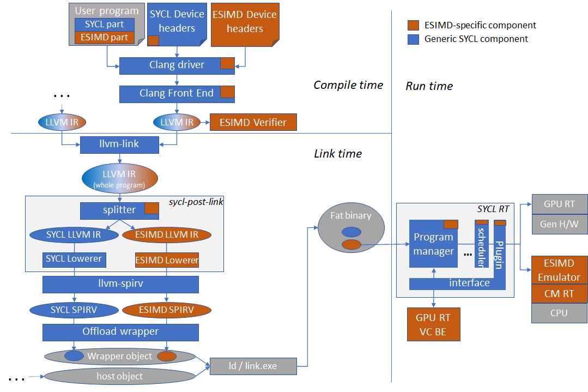

# Explicit SIMD design notes

This documents is a collection of notes describing design and/or implementation
of various parts of the ESIMD programming model support within the DPC++.

## Overview of ESIMD support in DPC++ components

ESIMD support is spread across a number of components in the oneAPI software
stack, spanning compile time, link time and runtime. The picture below shows
simplified view of the DPC++ compiler and runtime diagram and where ESIMD
(sub-)components fit in it.

### User program

User program can contain both SYCL and ESIMD kernels, either in the same or
different translation units. DPC++ ESIMD support will automatically split the
device code into SYCL and ESIMD parts to redirect them to different back-ends.
To facilitate this splitting, compiler will automatically identify markup and
clone parts of the ESIMD callgraph starting from kernels and functions
explicitly marked with the `intel::sycl_explicit_simd` attribute.

### Device headers

There are two distinct parts of ESIMD support in the SYCL device headers. The
first one is ESIMD-related "tweaks" within the usual SYCL headers, and the
second is the ESIMD APIs themselves.

#### ESIMD tweaks in SYCL device headers

The most important one is device-side definition of the sycl::accessor class
definition. It has different layout for SYCL and ESIMD (but the same size due
to padding), as well as different initialization function used to assemble
accessor object on the device side from incoming kernel arguments. For SYCL,
the function name is `sycl::accessor::__init`, for ESIMD it is
`sycl::accessor::__init_esimd`. The difference is caused by the ESIMD limitation
\- it does not support offset, memory and access range for an accessor object.

There are also couple ESIMD-specific proxy classes used by ESIMD API
implementation to access internals of ESIMD objects:

- `sycl::ext::intel::esimd::detail::AccessorPrivateProxy`
  this one is used by ESIMD memory APIs to access internals of `sycl::accessor`
  objects
- `sycl::ext::intel::esimd::detail::WrapperElementTypeProxy`
  used to access internals of SYCL types such as `sycl::detail::half_impl::half`

#### ESIMD API headers

These headers define ESIMD APIs to be used by ESIMD user kernels. For example,
the basic vector data type `sycl::ext::intel::esimd::simd`,
`sycl::ext::intel::esimd::gather` memory APIs

Source locations:

- `sycl/ext/intel/esimd`
- `sycl/ext/intel/experimental/esimd`

### Clang driver

TODO: describe driver modifications.

Source locations:

- `clang/lib/Driver/ToolChains/Clang.cpp`
- `clang/include/clang/Driver/Options.td`

### Clang front-end

#### Semantic analyzer, integration header generator

- Generation of ESIMD kernel signature and prolog code (which re-assembles
  objects such as accessors from incoming arguments) is tweaked for ESIMD
  kernels:
  - accessors generate fewer kernel arguments
  - accessor object is assembled in the prolog using `__init_esimd` function
    instead of `__init`. See function name definition and its usage
    [here](https://github.com/intel/llvm/blob/eb33bbcfbeab7af1a7f58fb4dc6b53bc47f73dba/clang/lib/Sema/SemaSYCL.cpp#L62).
- Defines `intel::sycl_explicit_simd` function and variable attribute to markup
  kernels top-level ESIMD external functions and "private globals".
- Performs various ESIMD-specific semantic analysis and diagnostics. All kinds
  of ESIMD error messages can be found in
  `clang/include/clang/Basic/DiagnosticSemaKinds.td`.
- Integration header generator inserts additional
  `static constexpr bool isESIMD()` function into kernel discriptor type, which
  is used by the host compiler to obtain compile-time details for the kernel via
  inclusion of the integration header generated by the generator. For ESIMD
  kernels `isESIMD()` returns true, and this is used in SYCL RT headers to
  distinguish ESIMD kernels from SYCL kernels, e.g. to customize kernel argument
  setting for accessors.
- defines `sycl_esimd_vectorize` attribute propagated to the VC BE, aimed at
  making it possible to call SIMT function from ESIMD code while vectorizing the
  former. Used internally to implement certain math functions in SYCL spec
  conformant manner (proper precision) via vectorizing scalar conformant
  implementations - see example
  [usage](https://github.com/intel/llvm/blob/sycl/sycl/include/sycl/ext/intel/esimd/detail/math_intrin.hpp#L199)

Source locations:

- `clang/lib/Sema/SemaSYCL.cpp`
- `clang/lib/Sema/SemaDecl.cpp`
- `clang/lib/Sema/SemaExpr.cpp`
- `clang/include/clang/Basic/Attr.td`
- `clang/include/clang/Basic/DiagnosticSemaKinds.td`

#### Code (LLVMIR) generator

ESIMD-specific code generator tweaks are mostly translations of internal FE
representation of variaous ESIMD attributes into LLVM IR attributes or metadata.

##### Kernel signature generation

For ESIMD kernels, a number of additional attributes are generated for the
kernel function itself as well as certain argument.

- Kernels are annotated with `sycl_explicit_simd` and
  `intel_reqd_sub_group_size` attributes. The latter must always be `1` for a
  ESIMD kernel or function.
- An argument which conveys accessor's pointer is assigned a
  `kernel_arg_accessor_ptr` attribute

##### Global variable code generation

ESIMD supports "private globals" - global variables which have one copy per
thread of execution (similar to C++ thread_local), normally allocated of Gen
register file. To make a global variable a "private global",
`__attribute__((opencl_private)) __attribute__((sycl_explicit_simd))`
attributes are used. Globals of this can be forced to a specific register using
the `__attribute__((register_num(n)))` attribute. The clang code generator
translates these to `genx_volatile` and `genx_byte_offset` LLVM IR attributes.

##### Function attributes translations

- `sycl_esimd_vectorize` -> `CMGenxSIMT`

Source locations:

- `clang/lib/CodeGen/CGSYCLRuntime.cpp`
- `clang/lib/CodeGen/CodeGenFunction.cpp`
- `clang/lib/CodeGen/CodeGenModule.cpp`

### Clang middle-end

#### ESIMD API restriction verifier

This component is an LLVM IR pass over a compiled translation unit. It checks
for presence of certain SYCL APIs which are disallowed within ESIMD code. For
exaple, SYCL reductions are not allowed in ESIMD. The verifier does this by
demangling all the call targets within ESIMD code and matching them with
internal sub-string filters. Invoked from `clang/lib/CodeGen/BackendUtil.cpp`.

Source locations:

- `llvm/lib/SYCLLowerIR/ESIMD/ESIMDVerifier.cpp`

### sycl-post-link transformations

As a part of the input device code module transformation pipeline, the
sycl-post-link tool splits the input module (or modules resulting from splitting
by other characteristics, such as aspects) into two - SYCL and ESIMD ones.
Shared functions invoked both from SYCL and ESIMD are cloned during the process.
This is necessary because SYCL and ESIMD parts must undergo different set of
transformations before generating resulting SPIR-V. ESIMD modules resulting from
splitting are marked with specific device binary property `isEsimdImage` (see
[source](https://github.com/intel/llvm/blob/9dc14a292f479880b5ab2e95f99a8414b31d1165/llvm/tools/sycl-post-link/sycl-post-link.cpp#L453)
.)

`sycl-post-link` is the post-link process driver, it invokes necessary
transformations as well as optimizations on fully linked device code. As a part
of the process it splits SYCL and ESIMD parts of the code into separate LLVM IR
modules and invokes different set or transformations on them. If a program has
an `invoke_simd` call in it, then sycl-post-link will link SYCL and ESIMD parts
back, cloning overlaping parts as needed.

Source locations:

- `llvm/tools/sycl-post-link/sycl-post-link.cpp`

#### ESIMD Lowerer

ESIMD part of device code undergoes a set of ESIMD-specific transformations.
First, intrinsic lowering and metadata generation phase happens. It is
implemented in the `SYCLLowerESIMDPass` LLVM IR Module pass. Its primary
purposes are:

- translate `__esimd_*` intrinsic calls into corresponding `genx.*` intrinsics
  known to the VC BE
  - in some cases, there is no direct equivalent (for example,
    `__esimd_pack_mask`), in which case the lowerer generates LLVM IR with
    desired semantics
- translate some of the `__spirv.*` intrinsics to something acceptable by VC
  BE

Source locations:

- `LowerESIMD.cpp`
- `ESIMDOptimizeVecArgCallConv.cpp`
- `LowerESIMDVecArg.cpp`
- `LowerESIMDVLoadVStore.cpp`

#### Genx SPIR-V writer adaptor

`(part of vc-intrinsics repo)`

### SYCL Runtime

SYCL runtime (RT) has a few places where ESIMD is handled specially:

- When setting kernel invocation arguments corresponding to an accessor, RT will
  skip setting offset, memory and access ranges arguments (normally set for
  usual SYCL kernels), because ESIMD does not support these. In other words, an
  accessors used within kernel (and captured in kernel lambda) is translated to
  4 SPIR-V kernel arguments for a normal SYCL kernel, and just to 1 argument for
  a ESIMD kernel.
  [Link](https://github.com/intel/llvm/blob/d7a7de79f8a6498bae52331f4789adcac76b8e8c/sycl/source/handler.cpp#L373).
- When creating JIT compilation options, SYCL runtime checks if the device
  binary image to be JIT-compiled has "isESIMDImage" property, in which case it
  adds `-vc-codegen` JIT options, which makes Intel GPU runtime use the vector
  backend (aka 'VC BE') to JIT-compile the device binary (SPIR-V).
  [Link](https://github.com/intel/llvm/blob/d7a7de79f8a6498bae52331f4789adcac76b8e8c/sycl/source/detail/program_manager/program_manager.cpp#L412).

## TODOs

This section lists current major ESIMD gaps/TODOs.

1. Move all APIs out of the experimental namespace. One of the major APIs there
   is LSC memory accesses. The main roadblock for making it stable API is
   absense of specification for cache hints, which should be shared between SYCL
   and ESIMD.
1. Architecture specific APIs should be explicitly marked as such in the user
   documentation with references to the
   [list of architectures](https://github.com/intel/llvm/blob/sycl/sycl/doc/extensions/experimental/sycl_ext_oneapi_device_architecture.asciidoc)
   known to oneAPI.
1. Properly markup architecture-specific APIs, such as `dpas`, with required
   aspects, according to the "optional device features"
   [design](https://github.com/intel/llvm/blob/sycl/sycl/doc/design/OptionalDeviceFeatures.md).
   This might require splitting implementations into per-architecture variants.
   `if_device_has`
   [feature](https://github.com/intel/llvm/blob/sycl/sycl/doc/extensions/proposed/sycl_ext_oneapi_device_if.asciidoc)
   may help avoid duplication of common parts and dispatch to
   architecture-dependent code at fine-grained level from within a function.
1. As VC BE moves away from `genx.*` intrinsics replacing them with `__spirv_*`
   ones defined in various extensions, ESIMD should catch up.
1. Unification of common `simd_view`/`simd` interfaces in fact leads to
   significant complication of implementation rather than its intended
   simplification via avoiding code duplication, might make sense to have
   separate implementations.

## Directions

This section lists possible directions for ESIMD improvements.

1. Support `std::simd`. This is the standard C++ way for explicit SIMD
   programming. Can help run (subsest of ESIMD) on CPU efficiently in the
   future.
1. Clear (via namespace?) separation of ESIMD APIs into portable and
   architecture-specific parts.
1. Standardizing `simd_view` or equivalent. This is effectively a reference
   to a *subset* of `esimd::simd` vector object's elements. The subset is
   defined in a regular way via starting offset, stride and number of elements
   in the subset. This proved to be very useful and loved by users. Missing in
   `std::simd`.
1. Design something like `invoke_spmd` (similar to `invoke_simd` extension) to
   be able to invoke SPMD functions from ESIMD code while vectorizing the calls
   in the back-end. This would replace `sycl_esimd_vectorize` and make this
   concept usable by all users, not only internal ESIMD implementation.
1. Create a specification for ESIMD kernel ABI and stand-alone kernel
   declaration rules to make ESIMD kernels callable by arbitrary host offload
   runtimes, such as Level Zero.
