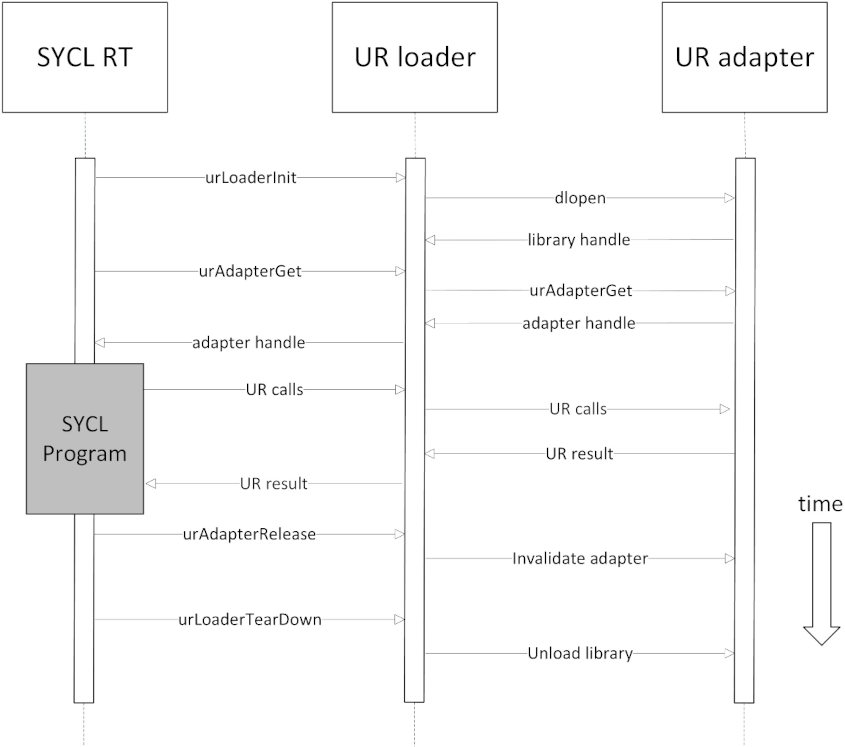

# Global objects in DPC++ runtime

## Intro

C++ standard does not specify the order in which global objects are constructed
or destroyed. If global objects somehow interact with each other, there's a
chance, that one of the objects has not been initialized or has been destroyed
by the time of interaction. This problem is also refered to as 
[static initialization order fiasco].

The only two things C++ guarantees is that global objects are constructed before
program enters `main` and within one translation unit objects will be 
constructed in the same order as they occur in code. Initialization order 
between translation units is undefined.

At the same time, SYCL users may want to construct some SYCL objects globally,
like in example below:

```
#include <sycl/sycl.hpp>

sycl::queue Queue;

int main() {
  Queue = sycl::queue{sycl::default_selector_v};

  return 0;
}
```

While the above piece of code is syntactically correct, it is still an undefined
behavior from C++ standard point of view. There are a few places in the runtime,
where global objects arise: scheduler, program manager, plugins, low-level
runtimes. To prevent crashes in such scenarios, the DPC++ runtime must ensure
global objects lifetime is long enough.

## DPC++ runtime

### General idea

Different platforms may handle global initialization and deinitialization
differently (for example, see [Itanium ABI]). So, handling global objects
lifetime is platform-dependent. However, there's a common idea behind those
approaches.

DPC++ wraps all complex global objects in a special structure, called 
`GlobalHandler`. The runtime stores a global pointer to that structure, and
initializes it on first call to `GlobalHandler::instance()` method (singleton
pattern). The `GlobalHandler` provides getter methods to access different
objects. Those objects are stored in `std::unique_ptr`s, that are initialized
on first call to getter member function. This way DPC++ runtime ensures, that
no unwanted initialization happens before object is requested.

Deinitialization is platform-specific. Upon application shutdown, the DPC++
runtime frees memory pointed by `GlobalHandler` global pointer, which triggers
destruction of nested `std::unique_ptr`s.

### Shutdown Tasks and Challenges

As the user's app ends, the SYCL runtime is responsible for releasing any UR
adapters that have been gotten, and teardown the plugins/adapters themselves.
Additionally, we need to stop deferring any new buffer releases and clean up
any memory whose release was deferred. 

To this end, the shutdown occurs in two phases: early and late. The purpose
for early shutdown is primarily to stop any further deferring of memory release.
This is because the deferred memory release is based on threads and on Windows
the threads will be abandoned. So as soon as possible we want to stop deferring
memory and try to let go any that has been deferred.  The purpose for late 
shutdown is to hold onto the handles and adapters longer than the user's
application. We don't want to initiate late shutdown until after all the users 
static and thread local vars have been destroyed, in case those destructors are 
calling SYCL. 

In the early shutdown we stop deferring, tell the scheduler to prepare for release, and
try releasing the memory that has been deferred so far.  Following this, if 
the user has any global or static handles to sycl objects, they'll be destroyed.
Finally, the late shutdown routine is called the last of the UR handles and 
adapters are let go, as is the GlobalHandler itself.


#### Threads
The deferred memory marshalling is built on a thread pool, but there is a
challenge here in that on Windows, once the end of the users `main()` is reached
and their app is shutting down, the Windows OS will abandon all remaining 
in-flight threads. These threads can be `.join()` but they simply return instantly,
the threads are not completed. Further any thread specific variables
(or `thread_local static` vars) will NOT have their destructors called.  Note
that the standard while-loop-over-condition-var pattern will cause a hang - 
we cannot "wait" on abandoned threads. 
On Windows, short of adding some user called API to signal this, there is 
no way to detect or avoid this. None of the "end-of-library" lifecycle events
occurs before the threads are abandoned.  ( not `std::atexit()`, not globals or 
`static`, or `static thread_local` var destruction, not `DllMain(DLL_PROCESS_DETACH)` )
This means that on Windows, once we arrive at `shutdown_early()` we cannot wait on
host events or the thread pool. 

For the deferred memory itself, there is no issue here. The Windows OS will
reclaim the memory for us. The issue of which we must be wary is placing UR 
handles (and similar) in host threads. The RAII mechanism of unique and 
shared pointers will not work in any thread that is abandoned on Windows. 

One last note about threads. It is entirely the OS's discretion when to
start or schedule a thread. If the main process is very busy then it is 
possible that threads the SYCL library creates (`host_tasks`/`thread_pool`)
won't even be started until AFTER the host application `main()` function is done. 
This is not a normal occurrence, but it can happen if there is no call to `queue.wait()`


### Linux

On Linux, the `early_shutdown()` is begun by the destruction of a static
`StaticVarShutdownHandler` object, which is initialized by 
`platform::get_platforms()`.

`late_shutdown()` timing uses `__attribute__((destructor))` property with low
priority value 110. This approach does not guarantee, that `GlobalHandler`
destructor is the last thing to run, as user code may contain a similar function
with the same priority value. At the same time, users may specify priorities
within [101, 109] range in order to run destructor after SYCL runtime has been
de-initialized. A destructor without specific priority value is going to be
executed before runtime shutdown mechanisms.

Another approach would be to leak global objects. This would guarantee user,
that global objects live long enough. But some global objects allocate heap
memory. If user application uses `dlopen` and `dlclose` on `libsycl.so` many
times, the memory leak may impact code performance.

### Windows

Differing from Linux, on Windows the `early_shutdown()` is begun by 
`DllMain(PROCESS_DETACH)`, unless statically linked. 

The `late_shutdown()` is begun by the destruction of a 
static `StaticVarShutdownHandler` object, which is initialized by 
`platform::get_platforms()`.  ( On linux, this is when we do `early_shutdown()`. 
Go figure.)  This is as late as we can manage, but it is later than any user 
application global, `static`, or `thread_local` variable destruction.

### Recommendations for DPC++ runtime developers

There are a few things to keep in mind, when developing DPC++ runtime:

- It is fine to have global objects with trivial constructor and destructor.
These objects can be zero initialized, and there's no deinitialization procedure
for such objects. This is why `int`, `bool`, and other objects of trivial types
are not wrapped with `GlobalHandler`.
- `std::mutex` is not guaranteed to be trivial. Either wrap it with
`GlobalHandler` or consider using `sycl::detail::SpinLock`, which has trivial
constructor and destructor.

## Adapters

Adapter lifetime is managed in two ways: on a per-adapter basis with
`urAdapterGet`/`urAdapterRelease`, and on a global basis with
`urLoaderInit`/`urLoaderTearDown`. A call to `urAdapterRelease` will make any
subsequent use of the adapter in question invalid, but it **does not** call the
`dlclose` equivalent on the adapter library. A call to `urLoaderTearDown` once
all initialized adapters have been released will unload all the adapter
libraries at once.

`GlobalHandler::unloadPlugins` calls both of these APIs in sequence in a pattern
something like this (pseudo code):

```
for (adapter in initializedAdapters) {
  urAdapterRelease(adapter);
}
urLoaderTearDown();
```

Which in turn is called by `shutdown_late()`.



## Low-level runtimes

Generally, DPC++ runtime has no control over its dependencies. Such libraries
can have global objects of their own. If you observe problems with dependency
library, please, report it to library maintainers.

[static initialization order fiasco]: https://isocpp.org/wiki/faq/ctors#static-init-order
[Itanium ABI]: https://itanium-cxx-abi.github.io/cxx-abi/abi.html#dso-dtor
