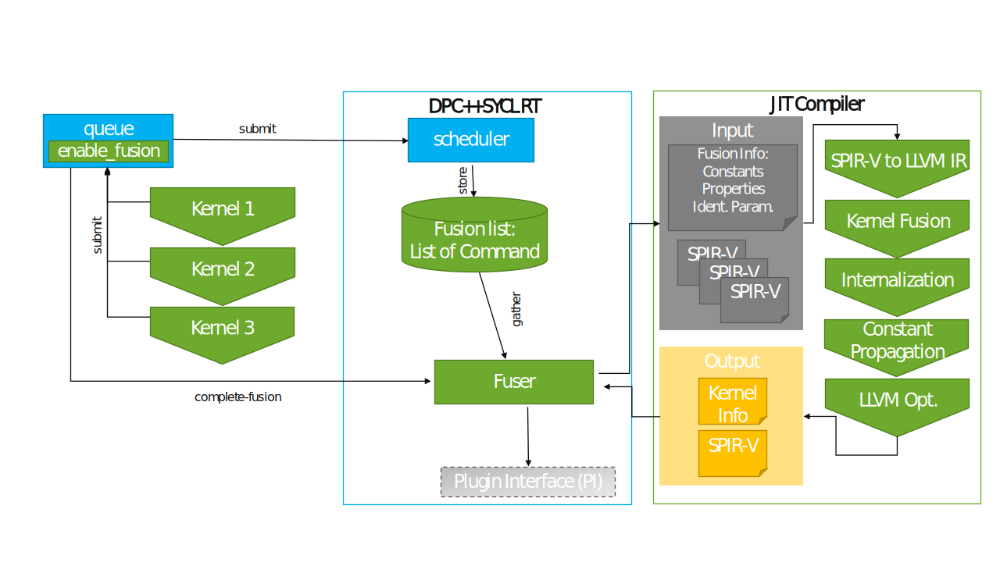

# User driven Kernel Fusion

## Context

To support the [user driven kernel fusion extension](https://github.com/intel/llvm/pull/7098) (a presentation can be found [here](https://github.com/oneapi-src/oneAPI-tab/blob/main/language/presentations/oneAPI-TAB-20220727-Kernel-Fusion.pdf)).

The basic workflow is shown in the diagram below

During the SYCL program execution, kernels to be fused are collected in a list in the queue (see [Scheduler Integration](#scheduler-integration) section).
When the fusion of kernels is requested, the SPIR-V modules containing them are passed to the JIT that will perform the fusion process (see [Fusion Process](#fusion-process)).
The fusion JIT will generate a new entry point containing all kernels to fuse and run the optimization pipeline.
The result is a new SPIR-V module that is injected back into the SYCL runtime for execution.

The feature is a pure runtime process, no action at compile time is required at the moment.

### Fusion JIT integration

The JIT is integrated into the SYCL runtime via a companion library to `libsycl.so` (Fusion plugin box).
The runtime communicates with the JIT via 2 main entry points: a context object (`JITContext`) and a `fuseKernels` function.

## Scheduler Integration

### Tasks

The integration of kernel fusion into the scheduling process needs to fulfill three main tasks:
1. Maintain the list of kernels submitted for fusion (the *fusion list*) for each queue.
2. Make sure that the kernel(s) submitted at the end of the fusion process, i.e., either the individual kernels (in case fusion is aborted or `cancel_fusion` is called) or the fused kernel (in case of `complete_fusion`), have the correct requirements & dependencies.
3. Synchronization - the extension proposal outlines a number of scenarios in which kernel fusion must be aborted early for synchronization and to avoid circular dependencies in the SYCL RT execution graph.

To achieve these tasks, the command graph gained a new command node (`KernelFusionCommand`) and the behavior of the queue is modified accordingly.

### KernelFusionCommand

A part of the necessary functionality is implemented as part of a new `KernelFusionCommand` as a sub-class of the `Command` class. This class fulfills two of the tasks listed above, as it maintains the fusion list for a queue (1) and allows the detection of scenarios in the scheduler where synchronization is necessary (3), as set out by the kernel fusion extension proposal.

For each `queue` for which `start_fusion` has been called, the `GraphBuilder` maintains one `KernelFusionCommand` in a map, with the map key being the unique numeric ID introduced for each `queue_impl`.

The execution of the `KernelFusionCommand` (`enqueueImp`) is similar to the `EmptyCommand`, as it simply waits for all its dependencies and then completes.

### Behavior on `queue::ext_codeplay_start_fusion`

On a call to `ext_codeplay_start_fusion`, a new `KernelFusionCommand` with status `ACTIVE` is created and inserted into the map maintained by the `GraphBuilder`, effectively putting the queue into fusion mode.
If a previous `KernelFusionCommand` for this queue is still present, its status is now set to `DELETE` and it is processed for clean-up (more details on why this is necessary can be found in the section on event handling).

### Behavior on `queue::submit`

If the queue is not in fusion mode, the behavior of this call remains unchanged. In case the submitted command is not a device kernel, the synchronization rules detailed below and in the kernel fusion extension proposal apply.

In all other cases, the kernel is added to the graph as usual, setting up the necessary dependency edges for all requirements, adding the kernel to the leaves of the memory records, and connecting event dependencies specified for the kernel. However, in contrast to the regular process, the kernel command and potential auxiliary commands (e.g., connection commands for event dependencies across different contexts) are **not** passed to the `GraphProcessor` for enqueueing right away, but rather stored in the fusion list of the `KernelFusionCommand`. Also, an event dependency between the `KernelFusionCommand` and the newly added kernel command is added to the graph.

### Behavior on `queue::ext_codeplay_cancel_fusion`

If the queue is not in fusion mode, a warning is printed if `SYCL_RT_WARNING_LEVEL` is set to 1 otherwise nothing needs to be done.

Otherwise, as the individual kernels which need to be executed after `ext_codeplay_cancel_fusion` are already correctly added to the graph with all their requirements and event dependencies, the process for `ext_codeplay_cancel_fusion` is comparably simple: The fusion command's status is changed to `CANCELLED` and the fusion command, all the kernels in the fusion list and all the auxiliary commands associated with them are enqueued to the `GraphProcessor`.

### Behavior on `queue::ext_codeplay_complete_fusion`

If the queue is not in fusion mode (this might be due to an earlier cancellation on a synchronization event, see section on [synchronization](#synchronization-behavior)), `ext_codeplay_complete_fusion` still needs to return a valid event. More details on how this case is handled can be found in the section on event handling.

If the queue is still in fusion mode, the `GraphBuilder` will call into the `jit_compiler` to try and fuse the fusion list associated with the fusion command (but not the auxiliary commands) into a single command-group.

In case the fusion process in the JIT compiler fails, the fusion will be aborted by calling `ext_codeplay_cancel_fusion`, with the effects described in the corresponding section above.

If the fusion process completes successfully, the event dependencies of the kernels in the fusion list are filtered to remove any event dependencies that are internal to the fused kernel, i.e., dependencies from one kernel in the fusion list to another kernel in the fusion list.

After that, a new `ExecCGCommand` is constructed and placed in the graph instead of the individual kernels in the fusion list. This is implemented by first removing all the individual kernels from the graph, including their requirement and dependency edges, and restoring the leaves for all memory records that the individual kernels had requirements on. Now that the graph state is restored, the new fused kernel command can be added to the graph, using the union of the requirements and event dependencies of the individual kernels, to create all necessary requirements and dependency edges.
Additionally, an event dependency between the `KernelFusionCommand` and the fused kernel `ExecCGCommand` is added to the graph before all auxiliary commands.
The fused kernel and the `KernelFusionCommand` are eventually enqueued to the `GraphProcessor`.
The `KernelFusionCommand` status is set to `COMPLETED`.

### Internalization Behavior

Users can provide hints to perform local and private promotion of arguments when performing fusion. On local promotion, arguments become _local internal_, meaning memory is shared between work-items of the same work-group. On the other hand, on private promotion, they become _private internal_, meaning memory is private to each work-item.

Local internalization is implemented by replacing the pointer to global memory corresponding to the argument to be promoted with a new argument being a pointer to local memory. The size of the local memory region will be `original_size / num_work_groups`, being `original_size` the number of elements in the accessor argument. Note that an ND-range kernel (parametrized by a `sycl::nd_range`) has to be used to perform local internalization.

Private internalization is implemented by dropping the pointer to global memory corresponding to the argument to be promoted and using a pointer to a private memory allocation instead. The size of the private memory allocation will be `original_size / global_size`. Note that a basic kernel (parametrized by a `sycl::range`) can be used to perform private internalization.

As the promoted address space will be potentially smaller than the original one, each access has to be remapped accordingly. Our current approach is to replace each access `ptr + offset` to `ptr + offset % new_size`. Users should be aware of this transformation and write their code carefully, making sure the resulting memory access pattern is legal and respects the original program semantics.

As kernel fusion supports fusing kernel with different ND-ranges, in some cases, internalization will be affected. For both local and private internalization, internalization when fusing kernels with different ND-ranges is allowed as long as the size of the memory allocations replacing the original argument are the same for all kernels using the argument to be promoted. Meaning:

- For local internalization: all kernels specify a local size and `original_size / num_work_groups` is the same for all kernels;
- For private internalization: `original_size / global_size` is the same for all kernels.

### Synchronization Behavior

As described in the [kernel fusion extension proposal](https://github.com/intel/llvm/pull/7098), several scenarios require aborting the fusion early to avoid semantic violations or circular dependencies in the execution graph. Essentially, this affects all commands that do not become part of the fusion process, e.g., kernels on other queues, host tasks, or explicit memory operations, that have a dependency on at least one of the kernels in the current fusion list due to a requirement or event dependency.

The `GraphProcessor` is able to detect such scenarios. Independent of the actual command requiring synchronization, all execution paths end up enqueueing the command itself and/or its dependencies to  `GraphProcessor::enqueueCommand` . This member function is responsible for detecting if any of the commands enqueued is associated with an active `KernelFusionCommand`. If that is the case, the enqueue process is paused and the fusion on the queue associated with the `KernelFusionCommand` is canceled, identical to an explicit call to `queue::ext_codeplay_cancel_fusion` as described above.

The detection at this stage is possible because even if the queue is in fusion mode, the individual kernels in the fusion list are added to the graph (and the leaves of memory records) such that other commands not part of the fusion process can correctly register them in their dependencies.

Special case treatment and earlier detection during graph-construction in the `GraphBuilder` are necessary for the case where commands submitted to one queue have requirements or dependencies on commands submitted to another queue in fusion mode.

If the fusion for a queue is aborted early, a warning can be printed to inform the user. This warning can be enabled by setting the environment variable `SYCL_RT_WARNING_LEVEL` to a value of  `1` or higher.

### Event Handling

The calls to `queue::submit` as well as to `queue::ext_codeplay_complete_fusion` need to return an event to allow synchronization with the execution of submitted kernels or the fused kernel.

Returning the event associated with the individual kernels (`ExecCGCommand`) from `queue::submit` while in fusion mode would mean that these events become useless if the fusion mode is later on completed successfully because the individual kernels are removed from the graph and never executed in this case.

To overcome this problem, a call to `queue::submit` while in fusion mode will instead return the event associated with the `KernelFusionCommand`.
This event will always remain valid and allow for synchronization, independent of whether the fusion mode was terminated through early cancellation, `ext_codeplay_cancel_fusion`, or `ext_codeplay_complete_fusion`, as the `KernelFusionCommand` in all these scenarios has event dependencies on all relevant commands.

Another important scenario is a call to `ext_codeplay_complete_fusion` after the fusion for this queue has been aborted early (see section on [Synchronization Behavior](#synchronization-behavior)).
In this case, the individual kernels and the `KernelFusionCommand` could have been enqueued and even executed long ago, but the call to `ext_codeplay_complete_fusion` still needs to return a valid event for synchronization.
To handle this case, the `KernelFusionCommand` for each queue remains in the fusion map until the next `ext_codeplay_start_fusion` on the same queue and does not undergo the cleanup process until its status has been set to `DELETE` by `ext_codeplay_start_fusion`.
This way, the lifetime of the event associated with the `KernelFusionCommand` is extended such that it is still valid for synchronization when returned from a later call to `ext_codeplay_complete_fusion`.

Note that even though the `KernelFusionCommand` is associated with a particular queue and context, the associated event does not have an underlying PI event, i.e., it is essentially a host event.

## Fusion Process

To fuse kernels, a small LLVM based JIT compiler (later just JIT for brevity) is responsible to perform the following tasks:

 - Load input modules in LLVM IR format (translate SPIR-V module to LLVM IR for now)
 - Fuse kernels in a new module
 - Perform fusion specific optimization
 - Finalize for the target (emit SPIR-V module for now)

The pipeline is triggered by the SYCL runtime by calling the `fuseKernels` function and its result is then injected into the runtime as a kernel bundle.

The fusion specific optimization is composed of new LLVM passes we wrote for this task.

The rest of the code is just plumbing code to build the pipeline. The SPIR-V loading and emission are done by the LLVM-SPIRV-Translator.

### Kernel fusion pipeline

The kernel fusion process is triggered by the `fuseKernels` function from the fusion JIT module.
It takes as parameters the information required for the fusion: a context, a list of information about kernels to be fused, an ordered list of kernels to fuse (the same kernel may appear more than once), the name of the fused kernel, a list of identical parameters, and a list of buffers to promote to private or local memory and constant from the runtime to inject into the module.

The function creates a new LLVM module with a stub function that will become the fused kernel and adds the kernels to fuse and their dependencies into this module.
In the case the original module is SPIR-V, the module is first translated to LLVM IR and then added to the module.
Information about the fusion is registered within the module by attaching metadata to the stub function (see section [Passing information to the fusion pipeline](#passing-information-to-the-fusion-pipeline)) and runs the fusion and optimization pipeline.

The pipeline currently consists of the following passes (in order):

  - `SYCLKernelFusion` performs the actual fusion process by inlining kernels to fuse inside the fused kernel. In case not all kernels being fused share the same nd-range, it also handles work-items remapping ([see](#fusing-kernels-with-different-nd-ranges))
  - Generic optimization passes: `IndVarSimplifyPass`, `LoopUnrollPass`, `SROAPass`, `InferAddressSpacesPass` to remove pointers to the generic address-space
    - These optimizations are important to help the internalizer, see note below.
  - `SYCLInternalizer` promotes buffer to local or private memory
  - `SYCLCP` propagates runtime information as constant in the kernel
  - Generic optimization passes post-fusion: `SROAPass`, `SCCPPass`, `InstCombinePass`, `SimplifyCFGPass`, `SROAPass`, `InstCombinePass`, `SimplifyCFGPass`, `ADCEPass`, `EarlyCSEPass`

Note: ideally the `InferAddressSpacesPass` task should be done by the static compiler.
However, to help the inference and (in fine) the internalizer passes in general, we need to run optimizations more aggressively than the static currently does.
The main barrier that could prevent the internalization of buffers is the presence of generic pointers.
As we need to change a pointer to generic to a pointer to private / local, if it is casted to generic we need to ensure that any casts back
to global can be safely changed to the proper address space.
A more precise inference pass and memory analysis will be required to lift this workaround.

Once the pipeline is finished, the module is translated into a SPIR-V module and encapsulated into a `SYCLKernelInfo` object containing metadata required for its injection into the runtime.

### Passing information to the fusion pipeline

Most of the information passed from the runtime into the JIT is stored as metadata inside the LLVM module the JIT creates.
This eases lit testing as all the information is self-contained in the module.

The metadata is attached to a function that will become the fused kernel:

- `sycl.kernel.fused`: declare the kernels to fuse. Contains a list of kernel names to fuse.
- `sycl.kernel.param`: declare identical parameters. Contains a list of tuples, each tuple represents identical arguments and each element of that tuple contains a pair of indexes referencing the kernel index in `sycl.kernel.fused` and the parameter index of that kernel (0 indexed). For instance ((0,1),(2,3)) means the second argument of the first kernel is identical to the fourth argument of the third kernel.
- `sycl.kernel.promote`: declare identical parameters to be promoted. Contains a list of strings specifying promotion hints for each argument: `none` for no promotion and `local`/`private` for local/private promotion.
- `sycl.kernel.promote.localsize`: declare the address space size for the promoted memory. Contains a list specifying the number of elements in the replacement memory allocation for each argument or `""` when no promotion needs to be performed.
- `sycl.kernel.promote.elemsize`: declare the element size for the promoted memory. Contains a list specifying the element size for each promoted argument or `""` when no promotion needs to be performed.
- `sycl.kernel.constants`: declare the value of a scalar or aggregate to be used as constant values. Contains a list of indexes (of the fused kernel, after identical arguments elision) and the value as a string. Note: the string is used to store the value, the string is read as a buffer of char and reinterpreted into the value of the argument's type.
- `sycl.kernel.nd-range`: declare the nd-range to be used by the fused kernel in case work-item remapping was needed. It is a tuple with 4 elements:
   - `num_dims`: scalar integer representing the number of dimensions of the nd-range;
   - `global_size`: triple representing nd-range global size, an element for each dimension, using `0` for unused dimensions;
   - `local_size`: triple representing nd-range local size, an element for each dimension, using `0` for unused dimensions. If the local size is not specified, all elements will be 0;
   - `offset`: triple representing nd-range offset, an element for each dimension, using `0` for unused dimensions.
- `sycl.kernel.nd-ranges`: declare the nd-ranges of each original kernels. This information is used by the `SYCLKernelFuson` pass to perform work-item remapping. It is a list with references to tuples as the one contained in `sycl.kernel.nd-range`. Constraints on the legal combinations of nd-ranges are described in [the corresponding section](#fusing-kernels-with-different-nd-ranges).

### Fusing kernels with different nd-ranges

This section explains actions performed by the kernel fusion JIT compiler when fusing kernels with different nd-ranges. Throughout this section, we refer to "work-item components". A comprehensive list of these components mentioned in this document is:

- `global_size`
- `local_size`
- `num_work_groups`
- `global_id`
- `local_id`
- `group_id`
- `global_offset`

The meaning of each of these is self-explainatory for the SYCL user.

#### Restrictions

Following kernel fusion principles, SYCL constraints and technical decisions, some basic constraints are set for valid combinations of nd-ranges:

1. The fused kernel should perform no more visible work than the union of the unfused kernels;
2. The fused kernel should perform no less visible work than the union of the unfused kernels;
3. If two work items belong to the same work-group in one of the unfused grids, they must also belong to the same work-group in the fused grid;
4. Either none or all of the work-items of a work-group must execute barriers inserted by the kernel fusion process;
5. The fused kernel must not launch more work-items than the maximum number of work-items launched by the original kernels.
6. All work-groups will be the same size, [as per the SYCL 2020 rev 7. 3.9.4](https://registry.khronos.org/SYCL/specs/sycl-2020/html/sycl-2020.html#_work_group_data_parallel_kernels).
7. `global_id(i) = group_id(i) * local_size(i) + local_id(i)` [as per OpenCL 3.0 3.2.1](https://registry.khronos.org/OpenCL/specs/3.0-unified/html/OpenCL_API.html#_mapping_work_items_onto_an_ndrange).
8. A work-item will have the same global linear id in the fused grid as in the unfused grid;
9. All the fused nd-ranges must have the same offset.

These restrictions can be simplified to:

- No two local sizes specified by the nd-ranges will be different;
- No global id remapping is needed ([see](#work-item-remapping)) or all input offsets are 0;
- All the fused nd-ranges must have the same offset.

As we can see, there is no restrictions in the number of dimensions or global sizes of the input nd-ranges.

#### Work-item remapping

Work-item remapping is performed at the input kernel level, i.e., a different remapping is performed for each input kernel, as different input nd-ranges will result in different remappings.

This remapping consists on an inter-procedural pass replacing each built-in querying components of a work-item, e.g., the global id or the local size, with a JIT-generated value.

First of all, work-item remapping will always be performed when the list of input nd-ranges is heterogeneous. Additional remapping conditions are present for the following work-item components. For each input kernel:

- `num_work_groups` and `local_size`: Only performed if the input nd-range has an explicit local size, may result in better performance, as this replaces built-in calls with constants;
- `global_id`, `local_id` and `group_id`: Only needed if the number of dimensions differ w.r.t. that of the fused kernel or any component of the global size in the range [2, `num_dims`] differs.

Once this rules are set, also taking into account remapping constraints, the remapping is performed as follows for each input kernel:

- `global_id`:
  - `global_id(0) = GLID / (global_size(1) * global_size(2))`
  - `global_id(1) = (GLID / global_size(2)) % global_size(1)`
  - `global_id(2) = GLID % global_size(2)`
- `local_id`:
  - `local_id(x) = global_id(x) % local_size(x)`
- `group_id`:
  - `group_id(x) = global_id(x) / local_size(x)`
- `num_work_groups`:
  - `num_work_groups(x) = global_size(x) / local_size(x)`
- `global_size`:
  - `global_size(x) = GS(x)`
- `local_size`:
  - `local_size(x) = LS(x)`
- `global_offset`:
  - `global_offset(x) = GO(x)`

On the RHS of the expressions, component names refer to the remapped values and upper case `GS`, `LS` and `GO` values refer to each of the components of the original nd-range (global size, local size and global offset), whereas `GLID` refers to the global linear id, which is an invariant during the fusion process.

Special care needs to be taken when handling elements from the original nd-range, as the input index needs to be remapped to take into account different array subscript ordering of the underlying API w.r.t. SYCL. See [SYCL 2020 rev. 7 C.7.7](https://registry.khronos.org/SYCL/specs/sycl-2020/html/sycl-2020.html#sec:opencl:kernel-conventions-sycl) for more information on this index remapping.

**Note**: As there is no `global_id` counterpart for PTX, global id is specified as `global_id(i) = group_id(i) * local_size(i) + local_id(i) + global_offset(i)`. This way, when targetting PTX, `local_size`, `local_id` and `group_id` will need special treatment **when no explicit local size is provided**. In this particular case, remapping will take place as follows (also respecting original constraints):

- `num_work_groups`:
  - `num_work_groups(x) = 1`
- `group_id`:
  - `group_id(x) = 0`
- `local_size`:
  - `local_size(x) = GS(x)`
- `local_id`:
  - `local_id(x) = global_id(x)`

##### Remapped SPIR-V built-ins

Following [OpenCL SPIR-V Environment Specification 3.0 2.9](https://registry.khronos.org/OpenCL/specs/3.0-unified/html/OpenCL_Env.html#_built_in_variables):

- `global_size`: `GlobalSize`
- `local_size`: `WorkgroupSize` 
- `num_work_groups`: `NumWorkgroups`
- `global_id`: `GlobalInvocationId`
- `local_id`: `LocalInvocationId`
- `group_id`: `WorkgroupId`
- `global_offset`: `GlobalOffset`

##### Remapped PTX intrinsics

Following [User Guide for NVPTX](https://llvm.org/docs/NVPTXUsage.html#llvm-nvvm-read-ptx-sreg) and [Compiler and runtime design #global-offset-support](https://github.com/intel/llvm/blob/sycl/sycl/doc/design/CompilerAndRuntimeDesign.md#global-offset-support).

- `local_id`: `llvm.nvvm.read.ptx.sreg.tid.*`
- `group_id`: `llvm.nvvm.read.ptx.sreg.ctaid.*`
- `local_size`: `llvm.nvvm.read.ptx.ntid.*`
- `num_work_groups`: `llvm.nvvm.read.ptx.nctaid.*`
- `global_offset`: `llvm.nvvm.implicit.offset`

### Support for non SPIR-V targets

Fusion is currently supported for the NVPTX/CUDA and HIP backend.

As this backend cannot ingest a SPIR-V module, additional changes to the
compilation flow are necessary. During static compilation the LLVM module for
this backend is stored in addition to the finalized binary. 

This behavior is controlled by the `-fsycl-embed-ir` flag to avoid binary
inflation in case kernel fusion is not used. If users want to use kernel fusion
at runtime on the NVPTX/HIP backend, they need to pass the `-fsycl-embed-ir`
flag during static compilation. 

During the fusion process at runtime, the JIT will load the LLVM IR and
finalize the fused kernel to the final target. More information is available
[here](./CompilerAndRuntimeDesign.md#kernel-fusion-support).

### Interaction with `parallel_for` range rounding

DPCPP's [range rounding](./ParallelForRangeRounding.md) transformation is
transparent for fusion, meaning the generated wrapper kernel with the rounded up
range will be used.

[Private internalization](#internalization-behavior) is supported when fusing
such kernels. We use the original, unrounded global size when computing the
private memory size. As range rounding only applies to basic kernels
(parametrized by a `sycl::range`), local internalization is not affected by the
range rounding transformation.

### Unsupported SYCL constructs

The following SYCL API constructs are currently not officially supported for
kernel fusion and should be considered untested/unsupported: 

- Reductions
- `sycl::stream`
- Specialization constants and `sycl::kernel_handler`
- Images (`sycl::unsampled_image` and `sycl::sampled_image`)
