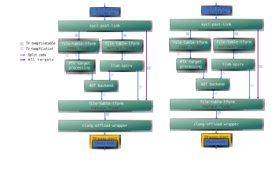
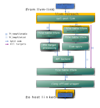

# Non-Reusable Device Code

## Overview
By default, SYCL allows device code to be reusable, where function calls outside
of the current translation unit are allowed using the `SYCL_EXTERNAL` attribute.
To implement this, the compiler linkes all device code together, resolving all
dependencies during the device linking process. This results in one large LLVM
module that subsequent steps of device linking use. For more information,
see [Compiler And Runtime Design](https://github.com/intel/llvm/blob/sycl/sycl/doc/design/CompilerAndRuntimeDesign.md).

The tradeoff with this apporach is that having a single module may increase
memory usage or run time of the compiler.

In the case where device code does not have any `SYCL_EXTERNAL` functions,
the `-fno-sycl-rdc` flag may be useful. With this flag specified, the compiler
will not link all device code into one large module. Instead, it will link
device code on a per-translation-unit basis,
which may improve runtime and memory usage of the compiler.

## Device code linking with source files
Let's take an example where the device compiler has two input files:
a.cpp and b.cpp, both containing device code. In this case,
the device linking flow will look like the following:

Diagram 1. No-RDC Device object file link flows.

Device code is not linked together,
and is processed seperately by the device linking backend

## Device code linking with fat static archives
Next, let's consider the case where the device compiler has a single input file,
a fat static archive which itself contains a.o and b.o,
both containing device code.
In this case, the device linking flow will look like the following:

Diagram 2. No-RDC Device fat static archive link flows.

Each object file inside the static archive is processed seperately.
`llvm-foreach` calls `sycl-post-link` once per object file. Since `llvm-spirv`
is only called once, its input needs to be a single `TY_tempfilelist` containing
all modules. Since `sycl-post-link` can output multiple modules per-run and
it is called multiple times, the output of `sycl-post-link` is actually a
`TY_tempfilelist` where each entry is the path to another `TY_tempfilelist`.
A `file-table-tform` merge option is run to create the desired input
