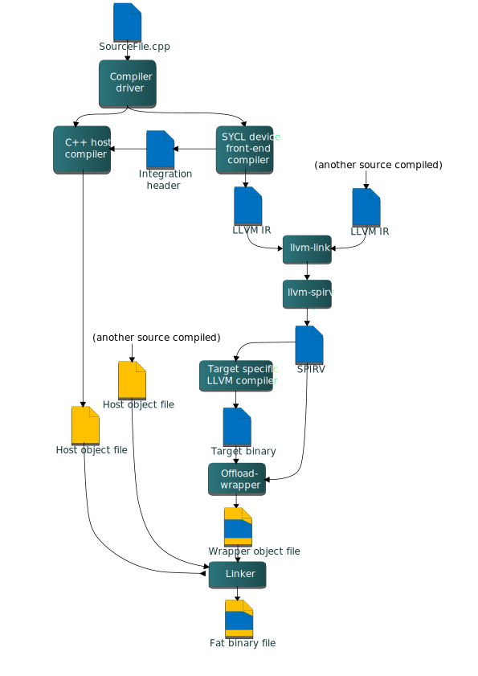
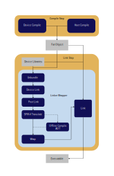

# SYCL Offload Model: Old vs New

DISCLAIMER: LLM has been extensively used for generating this document. Mistakes may be present.

## Table of Contents

1. [Introduction](#introduction)
2. [Old Offload Model (Driver-Based)](#old-offload-model-driver-based)
   - [Architecture Overview](#architecture-overview)
   - [Key Tools and Components](#key-tools-and-components)
   - [Compilation Flow](#compilation-flow)
   - [Fat Binary Creation](#fat-binary-creation)
   - [Device Code Processing](#device-code-processing)
   - [Limitations](#limitations)
3. [New Offload Model (Linker-Wrapper Based)](#new-offload-model-linker-wrapper-based)
   - [Architecture Overview](#new-architecture-overview)
   - [Key Tools and Components](#new-key-tools-and-components)
   - [Compilation Flow](#new-compilation-flow)
   - [Fat Binary Creation](#new-fat-binary-creation)
   - [Device Code Processing](#new-device-code-processing)
   - [Advantages](#advantages)
4. [Key Differences Summary](#key-differences-summary)
5. [Migration Path](#migration-path)
6. [Detailed Tool Descriptions](#detailed-tool-descriptions)
7. [References](#references)

---

## Introduction

The DPC++ compiler is evolving from a **driver-centric offload model** to a more flexible **linker-wrapper-based offload model**. This document provides a comprehensive comparison of both approaches to help developers understand the architecture, tools, and workflows involved in SYCL device code compilation.

**Reasons of transition to NewOffloadModel:**
- Much simpler way to upstream DPC++
- Less customized workarounds, more unified LLVM functionality
- More possible parallel optimizations by using thin-LTO and parallel processing. The current old offload model is known as very slow.

**Purpose of this document:**
- Explain the old offload model's design and limitations
- Introduce the new offload model and its benefits
- Help developers understand the transition between models
- Provide reference material for toolchain developers and contributors

---

## Old Offload Model (Driver-Based)

### Architecture Overview

In the old model, the **Clang driver** is responsible for orchestrating all aspects of heterogeneous compilation, including:
- Host and device compilation
- Device code linking
- Device code post-processing
- Fat binary generation
- Final linking

This centralized approach means the driver must know about all stages of the compilation pipeline and coordinate them through a static action graph.

Note: Old model may contain functionality or reference to FPGA functionality in both code and documentation. As of today, this is not relevant after the separation of Altera.



### Key Tools and Components

#### 1. **clang-offload-bundler (Community tool)**

**Code:** `clang/tools/clang-offload-bundler/ClangOffloadBundler.cpp`

**Purpose:** Bundles and unbundles device code into/from host objects during separate compilation.

**Functionality:**
- Creates "fat objects" by bundling host and device code together
- Stores device code in sections named `__CLANG_OFFLOAD_BUNDLE__<kind>-<triple>`
- Extracts device code during linking for further processing

**Usage Example:**
```bash
clang-offload-bundler \
  --type=o \
  --targets=host-x86_64-unknown-linux-gnu,sycl-spir64-unknown-unknown \
  --inputs=host.o,device.bc \
  --outputs=fat.o
```

**File Format:**
- ELF/COFF objects with special sections
- Each section labeled with offload kind and target triple
- Simple but inflexible format

#### 2. **sycl-post-link (Intel tool)**

**Code:** `llvm/tools/sycl-post-link/sycl-post-link.cpp`, `llvm/lib/SYCLPostLink/*`

**Purpose:** Post-link processing tool for linked device LLVM IR before SPIR-V translation.

**Functionality:**
- **Device code splitting:** Divides large modules into smaller ones
  - `per_source`: One module per translation unit
  - `per_kernel`: One module per kernel
  - `off`: No splitting (single module)
- **ESIMD Handling:** Separates ESIMD kernels from SYCL and lowers ESIMD intrinsics.
- **Symbol table generation:** Creates lists of kernels for each module
- **Specialization constants lowering:** Transforms spec constant intrinsics
- **Device requirements analysis:** Extracts aspects, sub-group sizes, etc.
- **Property set generation:** Creates metadata for runtime consumption

**Command Line:**
```bash
sycl-post-link \
  -o output.table \
  -split=per_kernel \
  -symbols \
  -spec-const=default \
  input.bc
```

**Output:**
- File table (`.table`) with columns: `[Code|Symbols|Properties]`
- Multiple `.bc` files (if splitting enabled)
- `.sym` files (symbol tables)
- `.props` files (property sets)

**Example File Table:**
```
[Code|Symbols|Properties]
module_0.bc|module_0.sym|module_0.props
module_1.bc|module_1.sym|module_1.props
```

#### 3. **file-table-tform (Intel tool)**

**Code:** `llvm/tools/file-table-tform/file-table-tform.cpp`

**Purpose:** Transforms file tables to support multiple input/output clusters in the driver.

**Why it exists:**
The clang driver's action graph assumes single input → single output relationships. When `sycl-post-link` splits device code into N modules, we need a way to represent this in the driver. File tables solve this by treating multiple files as a single logical entity.

**Operations:**
- **Extract:** Pull out a specific column (e.g., just the `.bc` files)
- **Replace:** Swap one column with another (e.g., replace `.bc` with `.spv`)
- **Merge:** Combine file lists back into tables

**Usage Example:**
```bash
# Extract code column for AOT compilation
file-table-tform -extract=Code -o code.list input.table

# After AOT, replace .bc with .bin files
file-table-tform -replace=Code,code.bin.list -o output.table input.table
```

#### 4. **llvm-foreach (Intel tool)**

**Code:** `llvm/tools/llvm-foreach/llvm-foreach.cpp`

**Purpose:** Execute a command for each file in a file list.

**Why it exists:**
The driver doesn't know at compile time how many files `sycl-post-link` will produce (depends on split mode and code structure). `llvm-foreach` allows the driver to apply transformations to an unknown number of files.

**Usage Example:**
```bash
# Translate each LLVM IR file to SPIR-V
llvm-foreach --in-file-list=modules.list \
             --out-file-list=spirv.list \
             -- llvm-spirv -o {out} {in}
```

**Note:** This is essentially a workaround for the driver's static action graph limitations.

#### 5. **clang-offload-wrapper (Community tool with many intel customizations. Today is removed from llvm-project)**

**Code:** `clang/tools/clang-offload-wrapper/*`

**Purpose:** Wraps device binaries into a host object file for final linking.

**Functionality:**
- SYCL Offload Wrapping differs from one used in LLVM.
- Creates wrapper object with embedded device binaries
- Generates offload descriptor data structure. The format is a part of ABI and is established with SYCL Runtime.
- Inserts registration/unregistration functions

**Output:**
- Host object file (`.o`) with embedded device code
- Can be linked with standard linker (`ld`, `link.exe`)

#### 6. **llvm-link (Community tool)**

**Code:** `llvm/tools/llvm-link/llvm-link.cpp`

**Purpose:** Links multiple LLVM IR modules into a single module.

**Usage in SYCL:**
- Links device object files (`.bc`) from different translation units
- Links device libraries (libdevice)
- Produces single module for post-link processing

#### 7. **llvm-spirv (Khronos tool that is pulled into intel/llvm. Maintained by Intel and others)**

**Code:** https://github.com/KhronosGroup/SPIRV-LLVM-Translator

**Purpose:** Translates LLVM IR to SPIR-V and vice versa.

**Functionality:**
- Converts LLVM IR bitcode to SPIR-V format
- Supports SYCL-specific extensions and patterns.
- Supports both forward (IR→SPIR-V) and reverse (SPIR-V→IR) translation

**Upstreaming Note:**
- It has been refused to be used in llvm-project as a part of SYCL pipeline.
- The replacement for this is going to be a LLVM SPIRV Backend located in `llvm/lib/Target/SPIRV/`.

### Compilation Flow

#### Full Compilation (Source to Executable)

```
┌─────────────────────────────────────────────────────────────────┐
│                         CLANG DRIVER                            │
│                   (Orchestrates Everything)                     │
└─────────────────────────────────────────────────────────────────┘
                                │
                ┌───────────────┴───────────────┐
                │                               │
                ▼                               ▼
        ┌───────────────┐              ┌────────────────┐
        │ HOST COMPILER │              │ DEVICE COMPILER│
        │    (clang)    │              │    (clang)     │
        └───────┬───────┘              └────────┬───────┘
                │                               │
                │ host.o                        │ device.bc (LLVM IR)
                │                               │
                │                               ▼
                │                      ┌─────────────────┐
                │                      │   llvm-link     │
                │                      │  (Link device   │
                │                      │    modules)     │
                │                      └────────┬────────┘
                │                               │
                │                               │ linked.bc
                │                               │
                │                               ▼
                │                      ┌─────────────────┐
                │                      │ sycl-post-link  │
                │                      │  • Split code   │
                │                      │  • Gen symbols  │
                │                      │  • Lower spec   │
                │                      │    constants    │
                │                      └────────┬────────┘
                │                               │
                │                               │ .table file
                │                               │ (multiple .bc files)
                │                               │
                │                               ▼
                │                      ┌─────────────────┐
                │                      │ file-table-tform│
                │                      │  (Extract code  │
                │                      │    column)      │
                │                      └────────┬────────┘
                │                               │
                │                               │ .list file
                │                               │
                │                               ▼
                │                      ┌─────────────────┐
                │                      │  llvm-foreach   │
                │                      │  + llvm-spirv   │
                │                      │  (IR → SPIR-V)  │
                │                      └────────┬────────┘
                │                               │
                │                               │ .spv files
                │                               │
                │                               ▼
                │                      ┌─────────────────┐
                │                      │ file-table-tform│
                │                      │  (Replace code  │
                │                      │   with SPIR-V)  │
                │                      └────────┬────────┘
                │                               │
                │                               │ updated .table
                │                               │
                │      ┌────────────────────────┘
                │      │ (Optional: AOT compilation)
                │      │
                │      ▼
                │   ┌─────────────────┐
                │   │ file-table-tform│
                │   │  (Extract code) │
                │   └────────┬────────┘
                │            │
                │            ▼
                │   ┌─────────────────┐
                │   │  llvm-foreach   │
                │   │  + ocloc/ptxas  │
                │   │  (AOT compile)  │
                │   └────────┬────────┘
                │            │
                │            │ native binaries
                │            │
                │            ▼
                │   ┌─────────────────┐
                │   │ file-table-tform│
                │   │  (Replace with  │
                │   │   native bins)  │
                │   └────────┬────────┘
                │            │
                └────────────┴────────────┐
                                          │
                                          ▼
                                 ┌──────────────────┐
                                 │clang-offload-    │
                                 │   wrapper        │
                                 │ (Wrap device     │
                                 │  binaries)       │
                                 └────────┬─────────┘
                                          │
                                          │ wrapper.o
                                          │
                                          ▼
                                 ┌──────────────────┐
                                 │   HOST LINKER    │
                                 │  (ld/link.exe)   │
                                 │  host.o +        │
                                 │  wrapper.o       │
                                 └────────┬─────────┘
                                          │
                                          ▼
                                 ┌──────────────────┐
                                 │  FAT BINARY      │
                                 │  (executable)    │
                                 └──────────────────┘
```

#### Separate Compilation and Linking

When using `-c` (compile only):

```
Source File (app.cpp)
        │
        ▼
    ┌───────┐
    │ Clang │ -fsycl -c
    └───┬───┘
        │
        ├─ host.o (host object)
        │
        └─ device.bc (device LLVM IR)
             │
             ▼
    ┌─────────────────────┐
    │ clang-offload-bundler│
    │  (Bundle together)   │
    └──────────┬──────────┘
               │
               ▼
         fat_object.o
    (sections: host code + device code)
```

When linking multiple fat objects:

```
fat_obj1.o  fat_obj2.o  fat_obj3.o
    │           │           │
    └───────────┴───────────┘
                │
                ▼
    ┌─────────────────────┐
    │ clang-offload-bundler│
    │  (Unbundle device    │
    │   code from all)     │
    └──────────┬──────────┘
               │
               ├─ host1.o, host2.o, host3.o
               │
               └─ device1.bc, device2.bc, device3.bc
                        │
                        ▼
                 ┌────────────┐
                 │ llvm-link  │
                 └──────┬─────┘
                        │
                        │ (Continue as in full compilation)
                        ▼
                  sycl-post-link
                        │
                        ⋮
```

### Fat Binary Creation

**Old Model Process:**

1. **Bundler creates fat objects** during compilation (`-c`)
   - Embeds device IR in special sections
   - Format: `__CLANG_OFFLOAD_BUNDLE__<kind>-<triple>`

2. **Unbundler extracts during link**
   - Driver invokes unbundler to pull out device code
   - Device code goes through post-link pipeline
   - Host code set aside for final link

3. **Wrapper embeds processed device code**
   - After all device processing complete
   - Creates wrapper object with descriptors
   - Includes registration functions

4. **Final link combines everything**
   - Host linker links host objects + wrapper object
   - Result: Executable with embedded device binaries

### Device Code Processing

#### Device Code Splitting Workflow

```
                    ┌──────────────────┐
                    │  Linked Module   │
                    │  (All kernels)   │
                    └────────┬─────────┘
                             │
                             ▼
                    ┌──────────────────┐
                    │ sycl-post-link   │
                    │  -split=per_kernel│
                    └────────┬─────────┘
                             │
            ┌────────────────┼────────────────┐
            │                │                │
            ▼                ▼                ▼
    ┌──────────────┐  ┌──────────────┐  ┌──────────────┐
    │  kernel_A.bc │  │  kernel_B.bc │  │  kernel_C.bc │
    │  kernel_A.sym│  │  kernel_B.sym│  │  kernel_C.sym│
    │ kernel_A.props│  │kernel_B.props│  │kernel_C.props│
    └──────────────┘  └──────────────┘  └──────────────┘
```

**Why split?**
1. **JIT Performance:** Loading only needed kernels reduces JIT time
2. **Device Compatibility:** Different kernels may need different device features


#### File Table Format

File tables (`.table` files) are simple text files:

```
[Code|Symbols|Properties]
code_0.bc|symbols_0.sym|properties_0.props
code_1.bc|symbols_1.sym|properties_1.props
code_2.bc|symbols_2.sym|properties_2.props
```

**Columns:**
- **Code:** Device binary (.bc, .spv, .bin)
- **Symbols:** Kernel/function names in this module
- **Properties:** Metadata (requirements, spec constants, etc.)

### Limitations

1. **Tight Coupling to Driver:**
   - All offload logic embedded in driver
   - Hard to modify or extend compilation pipeline
   - Driver must understand all target-specific behaviors

2. **Static Action Graph:**
   - Driver builds fixed action graph at startup
   - Can't adapt to runtime discoveries (e.g., number of split modules)
   - Workarounds needed (file-table-tform, llvm-foreach)

3. **Limited Parallelism:**
   - Driver handles one compilation at a time per target
   - Difficult to parallelize device binary processing

4. **Complex Separate Compilation:**
   - Fat objects use custom bundler format
   - Not standard ELF/COFF offload sections
   - Mixing old and new formats not supported

5. **Tool Proliferation:**
   - Many helper tools exist only to work around driver limitations
   - Each tool adds overhead and complexity

6. **Limited LTO Support:**
   - No device-side LTO in old model
   - Must use custom dependency tracking (clang-offload-deps)

---

## New Offload Model (Linker-Wrapper Based)

### New Architecture Overview

The new model **decentralizes** offload compilation by moving most device code processing out of the driver and into a dedicated **linker-wrapper** tool. The driver becomes much simpler—it only handles:
- Host/device compilation
- Creating offload binaries (packaging)
- Invoking the linker-wrapper for the link step

The **clang-linker-wrapper** takes over:
- Device binary extraction
- Device linking
- Post-link processing
- AOT compilation
- Device binary wrapping
- Final host linking

This separation provides flexibility, enables new features, and simplifies the driver.



### New Key Tools and Components

#### 1. **llvm-offload-binary** (Community Tool, ex clang-offload-packager)

**Code:** `llvm/tools/llvm-offload-binary/llvm-offload-binary.cpp`

**Purpose:** Packages device binaries in a standard format for embedding in host objects.

**Functionality:**
- Creates "offload binaries" in standardized format
- Supports multiple device binaries for different targets
- Stores binaries in standard sections (`.llvm.offloading` for COFF, `LLVM_OFFLOADING` type for ELF)
- Replaces `clang-offload-bundler`

**Format Benefits:**
- Standard LLVM format (used by CUDA/HIP/OpenMP offload)
- Self-describing (contains triple, kind, architecture info)
- More extensible than bundler format

**Usage Example:**
```bash
llvm-offload-binary \
  --image=file=device.bc,triple=spir64-unknown-unknown,kind=sycl \
  -o offload.bin
```

**Binary Format:**
```
OffloadBinary {
  uint32_t Magic;           // 0x10FF10AD
  uint32_t Version;
  uint64_t Size;
  uint64_t EntryOffset;
  uint64_t EntrySize;
  StringTable strings;
  // ... device binary data
}
```

**Code:** `llvm/Object/OffloadBinary.h`

#### 2. **clang-linker-wrapper** (Community Tool, Enhanced for SYCL)

**Code:** `clang/tools/clang-linker-wrapper/ClangLinkerWrapper.cpp`, `llvm/lib/Frontend/Offloading/*`.

**Purpose:** Central tool for orchestrating device code linking and processing.

**Functionality:**
- **Extraction:** Pull device binaries from fat objects
- **Device Linking:** Link device LLVM IR modules
- **Post-Link:** Invoke `sycl-post-link` for transformations
- **SPIR-V Translation:** Run `llvm-spirv` on modules
- **AOT Compilation:** Invoke target-specific compilers (ocloc, ptxas, etc.)
- **Wrapping:** Embed device binaries in wrapper object
- **Host Linking:** Perform final host link with wrapper

**Key Features:**
- **Dynamic Pipeline Construction:** Builds compilation steps at runtime based on discovered binaries
- **Parallelism:** Can process multiple device binaries in parallel. That is possible to perform many SYCL processing steps in parallel.
- **LTO Support:** Opens a way to integrate device-side LTO (thin-LTO)
- **Target Flexibility:** Easier to add new targets

**Upstreaming Note:**
- SYCL functionality diverges from the initial LLVM Offloading design
- Therefore, we were asked to extract SYCL specific processing from clang-linker-wrapper to clang-sycl-linker.

**Command Line Interface:**
```bash
clang-linker-wrapper \
  --sycl-device-libraries=libsycl-crt.bc,libsycl-complex.bc \
  --sycl-device-library-location=/path/to/libs \
  --sycl-post-link-options="..." \
  --llvm-spirv-options="..." \
  --gpu-tool-arg="-device pvc" \
  -- \
  <linker command line>
```

**SYCL-Specific Options:**

| Option | Description |
|--------|-------------|
| `--sycl-device-libraries=<libs>` | Comma-separated list of device libraries to link |
| `--sycl-device-library-location=<path>` | Directory containing device libraries |
| `--sycl-post-link-options=<opts>` | Options for sycl-post-link invocation |
| `--llvm-spirv-options=<opts>` | Options for llvm-spirv invocation |
| `--gpu-tool-arg=<arg>` | Arguments for GPU AOT compiler (ocloc) |
| `--cpu-tool-arg=<arg>` | Arguments for CPU AOT compiler (opencl-aot) |


#### 3. **clang-sycl-linker** (New SYCL-Specific Tool, upstreamed to llvm-project)

**Code:** `clang/tools/clang-sycl-linker/*`

**Purpose:** Specialized linker for SYCL device code that integrates with new offload model.

**Functionality:**
- Performs SYCL-specific device linking steps
- Integrates with `clang-linker-wrapper`
- Handles SYCL device libraries
- Supports creation of SYCLBIN files

**Usage:**
Typically invoked by `clang-linker-wrapper` or driver, not directly by users. It is going to contain all SYCL specific offload processing.

**Key Responsibilities:**
- Device bitcode linking
- Module splitting
- Spec const lowering
- ESIMD processing
- SPIRV compilation
- AOT compilation (optional)
- Device library resolution
- Metadata propagation
- Symbol table generation

#### 4. **Reused Tools from Old Model**

The following tools are still used but now invoked by the linker-wrapper:

- **sycl-post-link:** Same functionality, now called by linker-wrapper
- **llvm-spirv:** Same translator, now called by linker-wrapper
- **llvm-link:** Still used for device IR linking

**Key Difference:** These tools no longer need file tables and llvm-foreach workarounds. The linker-wrapper handles multiple files natively.

### New Compilation Flow

#### Full Compilation (Source to Executable)

```
┌────────────────────────────────────────────────────────────────┐
│                      CLANG DRIVER                              │
│              (Simplified Role)                                 │
│  • Compile host/device code                                    │
│  • Package device binaries                                     │
│  • Invoke linker-wrapper                                       │
└────────────────────────────────────────────────────────────────┘
                              │
              ┌───────────────┴────────────────┐
              │                                │
              ▼                                ▼
      ┌────────────────┐              ┌─────────────────┐
      │ HOST COMPILER  │              │ DEVICE COMPILER │
      │   (clang)      │              │    (clang)      │
      └────────┬───────┘              └────────┬────────┘
               │                               │
               │ host.o                        │ device.bc
               │                               │
               │                               ▼
               │                      ┌──────────────────┐
               │                      │ llvm-offload-    │
               │                      │    packager      │
               │                      │ (Package device  │
               │                      │   binary)        │
               │                      └────────┬─────────┘
               │                               │
               │                               │ offload.bin
               │                               │
               │◄──────────────────────────────┘
               │ (Embed in host object)
               │
               ▼
        ┌──────────────┐
        │  fat_obj.o   │
        │ (Host + pkg  │
        │  device bin) │
        └──────┬───────┘
               │
               ▼
┌──────────────────────────────────────────────────────────────┐
│                   CLANG-LINKER-WRAPPER                       │
│         (Replaces most old driver functionality)             │
└──────────────────────────────────────────────────────────────┘
               │
   ┌───────────┴──────────────┐
   │                          │
   ▼                          │
┌──────────────────┐          │
│ Extract Device   │          │
│ Binaries from    │          │
│ Objects          │          │
└────────┬─────────┘          │
         │                    │
         │ device.bc          │
         │                    │
         ▼                    │
┌──────────────────┐          │
│  llvm-link       │          │
│ (Link device     │          │
│  modules + libs) │          │
└────────┬─────────┘          │
         │                    │
         │ linked.bc          │
         │                    │
         ▼                    │
┌──────────────────┐          │
│ sycl-post-link   │          │
│ (Split, symbols, │          │
│  metadata gen)   │          │
└────────┬─────────┘          │
         │                    │
         │ Multiple .bc files │
         │                    │
         ▼                    │
┌──────────────────┐          │
│  Loop over output│          │
│  (no llvm-       │          │
│   foreach needed)│          │
└────────┬─────────┘          │
         │                    │
   ┌─────┴─────┬──────┐       │
   │           │      │       │
   ▼           ▼      ▼       │
┌──────┐  ┌──────┐ ┌──────┐  │
│llvm- │  │llvm- │ │llvm- │  │
│spirv │  │spirv │ │spirv │  │
└──┬───┘  └──┬───┘ └──┬───┘  │
   │         │        │       │
   │ .spv    │ .spv   │ .spv  │
   │         │        │       │
   ▼         ▼        ▼       │
┌────────────────────────┐    │
│  Optional: AOT         │    │
│  Loop over output      │    │
│  (ocloc/ptxas/etc)     │    │
└──────────┬─────────────┘    │
           │                  │
           │ Native binaries  │
           │ (.bin)           │
           │                  │
           ▼                  │
  ┌──────────────────┐        │
  │ Wrapper Object   │        │
  │ Generation       │        │
  │ (Embed all       │        │
  │  device bins)    │        │
  └────────┬─────────┘        │
           │                  │
           │ wrapper.o        │
           │                  │
           └──────────────────┤
                              │
                              ▼
                     ┌──────────────────┐
                     │   HOST LINKER    │
                     │  (Final link)    │
                     │  host.o +        │
                     │  wrapper.o       │
                     └────────┬─────────┘
                              │
                              ▼
                     ┌──────────────────┐
                     │   FAT BINARY     │
                     │  (executable)    │
                     └──────────────────┘
```

**Key Differences from Old Model:**
1. **Driver is simpler:** Just compiles and packages
2. **Linker-wrapper does the heavy lifting:** All device processing in one tool
3. **No file tables needed:** Linker-wrapper handles multiple files natively
4. **Parallel processing built-in:** Can process split modules in parallel (Not implemented today)

#### Separate Compilation and Linking

**Compilation with `-c`:**

```
Source File (app.cpp)
        │
        ▼
    ┌───────────────────────┐
    │ Clang Driver          │
    │ -fsycl -c             │
    │ --offload-new-driver  │
    └───────┬───────────────┘
            │
    ┌───────┴────────┐
    │                │
    ▼                ▼
┌─────────┐    ┌──────────────┐
│host.o   │    │  device.bc   │
└─────────┘    └──────┬───────┘
                      │
                      ▼
             ┌──────────────────┐
             │ llvm-offload-    │
             │   packager       │
             └────────┬─────────┘
                      │
                      │ offload.bin
                      │
        ┌─────────────┴────────────┐
        │ Embed in host object     │
        │ (.llvm.offloading section)│
        └──────────────┬───────────┘
                       │
                       ▼
                ┌────────────┐
                │ fat_obj.o  │
                └────────────┘
```

**Linking:**

```
fat_obj1.o  fat_obj2.o  lib.a
     │          │         │
     └──────────┴─────────┘
                │
                ▼
       ┌────────────────────┐
       │ clang-linker-wrapper│
       │ (Extracts, links,  │
       │  processes, wraps) │
       └──────────┬─────────┘
                  │
                  ▼
            Final Executable
```

### New Fat Binary Creation

**Improved Process:**

1. **Packaging during compilation:**
   - `llvm-offload-packager` creates offload binary
   - Standard format (compatible with CUDA/HIP/OpenMP)
   - Embedded in standard sections

2. **Linker-wrapper extracts automatically:**
   - Recognizes standard offload sections
   - Also supports old bundler format (for compatibility)
   - Extracts from objects, archives, bitcode

3. **Dynamic pipeline construction:**
   - Linker-wrapper discovers device binaries at runtime
   - Builds processing pipeline based on what it finds
   - No need for file tables or llvm-foreach

4. **Parallel processing:**
   - Multiple device binaries processed simultaneously
   - Possible effective utilization of multi-core systems

### New Device Code Processing

#### No File Tables Needed

In the new model, `sycl-post-link` still splits modules, but the linker-wrapper handles the resulting files directly:

```
Linked Module
      │
      ▼
┌─────────────────┐
│ sycl-post-link  │
└────────┬────────┘
         │
         ├─ module_0.bc + module_0.sym + module_0.props
         ├─ module_1.bc + module_1.sym + module_1.props
         └─ module_2.bc + module_2.sym + module_2.props
                │
                ▼
  ┌───────────────────────────────────┐
  │ clang-linker-wrapper              │
  │ (Processes each inside a process) │
  └───────────────────────────────────┘
```

**Benefits:**
- No file table manipulation needed
- No `file-table-tform` or `llvm-foreach`
- Simpler, more maintainable code
- Better error handling

#### LTO Support

The new model opens a way to support device-side Link-Time Optimization (LTO):

```
device1.bc  device2.bc  device3.bc
        │        │         │
        └────────┴─────────┘
                 │
                 ▼
          ┌────────────┐
          │ Device LTO │
          │ (Thin-LTO) │
          └──────┬─────┘
                 │
                 │ Optimized IR
                 ▼
          sycl-post-link
                 │
                 ⋮
```

**Advantages:**
- Whole-program optimization across translation units
- Better inlining and dead code elimination
- No need for `clang-offload-deps` workaround
- Leverages LLVM's mature LTO infrastructure

### Advantages

1. **Separation of Concerns:**
   - Driver handles compilation
   - Linker-wrapper handles linking/processing
   - Each tool has clear responsibilities

2. **Flexibility:**
   - Easier to extend with new targets
   - Simpler to add new processing steps
   - Can customize pipeline without modifying driver

3. **Better Parallelism:**
   - Native parallel processing of split modules
   - Utilizes multi-core systems
   - Faster builds

4. **Standard Format:**
   - Uses LLVM community offload binary format
   - Compatible with other offload models (CUDA, HIP, OpenMP)
   - Better tooling support

5. **Simplified Toolchain:**
   - No need for file-table-tform
   - No need for llvm-foreach
   - Fewer moving parts

6. **LTO Support:**
   - Device-side LTO (thin-LTO)
   - Better optimization opportunities
   - No dependency tracking hacks

7. **Better Error Handling:**
   - Centralized error reporting in linker-wrapper
   - Easier debugging
   - More informative error messages

8. **External Compiler Support:**
   - Cleaner integration with non-clang host compilers
   - Linker-wrapper can be called standalone

---

## Key Differences Summary

| Aspect | Old Model | New Model |
|--------|-----------|-----------|
| **Orchestration** | Clang driver | clang-linker-wrapper |
| **Fat Object Format** | clang-offload-bundler (custom sections) | llvm-offload-packager (standard sections) |
| **Device Extraction** | clang-offload-bundler | clang-linker-wrapper (native) |
| **Multiple Files** | File tables + file-table-tform + llvm-foreach | Native handling in linker-wrapper |
| **Parallelism** | Limited, driver-sequential | Native parallel processing |
| **LTO** | No device LTO | Device thin-LTO supported |
| **Pipeline** | Static action graph | Dynamic runtime construction |
| **Post-Link** | Driver invokes via file tables | Linker-wrapper invokes directly |
| **Wrapping** | clang-offload-wrapper (separate step) | Integrated in linker-wrapper |
| **Complexity** | Many helper tools needed | Fewer tools, cleaner design |
| **Standard Compliance** | Custom SYCL format | LLVM community standard |
| **Extensibility** | Hard to add new targets | Easy to extend |
| **Error Handling** | Distributed across tools | Centralized |
| **Activation** | Default (old) | `--offload-new-driver` flag |

---

## Migration Path

### Current State

As of now, **both models coexist** in the DPC++ compiler:

- **Old model (default):** Active without any flags
- **New model (opt-in):** Activated with `--offload-new-driver` flag

### Using the New Model

To use the new offload model:

```bash
clang++ -fsycl --offload-new-driver app.cpp -o app
```

This flag:
- Switches driver to new offload pipeline
- Uses `llvm-offload-packager` instead of bundler
- Invokes `clang-linker-wrapper` for linking
- Enables new features (LTO, parallel processing, etc.)

### Compatibility Considerations

**Binary Compatibility:**
- Old and new fat object formats are **incompatible**
- Cannot mix old bundler objects with new packager objects in same archive
- Linker-wrapper can read old format (for transition period)
- New format is forward path

**Source Compatibility:**
- No source code changes required
- Same `-fsycl` compilation model
- Same runtime API
- Same SYCL standard compliance

**Build System Changes:**
- For full new model benefits, rebuild all objects with `--offload-new-driver`
- Can't link old fat objects with new fat objects
- Archives must be homogeneous (all old or all new)

### Transition Timeline

1. **Current:** Both models available, old is default
2. **Near Future:** New model becomes default, old still available
3. **Long Term:** Old model deprecated and removed

**Recommendation:** Start using `--offload-new-driver` in development to prepare for transition.

### SYCLBIN Format

The new model also introduces the **SYCLBIN** format for separately compiled device code:

**Purpose:**
- Package device binaries with metadata
- Enable dynamic loading of device code
- Support modular SYCL applications

**Creation:**
```bash
clang++ -fsycl -fsyclbin --offload-new-driver device.cpp -o device.syclbin
```

**Benefits:**
- Load device code at runtime
- Avoid recompiling entire application
- Better modularity
- Standard format for device-only compilation

---

## References

### Documentation

- [CompilerAndRuntimeDesign.md](CompilerAndRuntimeDesign.md) - Overall architecture
- [OffloadDesign.md](OffloadDesign.md) - New offload model design
- [SYCLBINDesign.md](SYCLBINDesign.md) - SYCLBIN format specification
- [NonRelocatableDeviceCode.md](NonRelocatableDeviceCode.md) - `-fno-sycl-rdc` mode
- [KernelParameterPassing.md](KernelParameterPassing.md) - How parameters are passed

### LLVM Community Documents

- [ClangOffloadPackager.rst](https://github.com/intel/llvm/blob/sycl/clang/docs/ClangOffloadPackager.rst) - Offload packager documentation
- [ClangLinkerWrapper.rst](https://github.com/intel/llvm/blob/sycl/clang/docs/ClangLinkerWrapper.rst) - Linker wrapper documentation
- [OffloadingDesign.rst](https://github.com/intel/llvm/blob/sycl/clang/docs/OffloadingDesign.rst) - General offloading architecture

### Source Code

**Old Model:**
- `clang/tools/clang-offload-bundler/` - Bundler tool
- `clang/tools/clang-offload-wrapper/` - Wrapper tool
- `llvm/tools/sycl-post-link/` - Post-link tool
- `clang/tools/file-table-tform/` - File table transformer
- `clang/tools/llvm-foreach/` - Foreach tool

**New Model:**
- `clang/tools/clang-linker-wrapper/` - Linker wrapper
- `clang/tools/clang-sycl-linker/` - SYCL linker
- `llvm/tools/llvm-offload-packager/` - Offload packager
- `llvm/lib/Object/OffloadBinary.cpp` - Offload binary format

**Driver:**
- `clang/lib/Driver/ToolChains/SYCL.cpp` - SYCL toolchain
- `clang/lib/Driver/Driver.cpp` - Main driver logic

### Build Commands

**Old Model:**
```bash
# Compile
clang++ -fsycl -c app.cpp -o app.o

# Link
clang++ -fsycl app.o -o app
```

**New Model:**
```bash
# Compile
clang++ -fsycl --offload-new-driver -c app.cpp -o app.o

# Link
clang++ -fsycl --offload-new-driver app.o -o app

# Create SYCLBIN
clang++ -fsycl -fsyclbin --offload-new-driver device.cpp -o device.syclbin
```

---

## Conclusion

The transition from the **old driver-based offload model** to the **new linker-wrapper-based model** represents a significant architectural improvement for the DPC++ compiler:

**Key Improvements:**
- Cleaner separation of concerns
- Better parallelism and performance
- Simpler toolchain (fewer helper tools)
- Standard offload binary format
- Device LTO support
- Easier extensibility

**Migration:**
- The SYCL specific functionality is extracted from Old tools to LLVM Libraries such as `llvm/SYCLPostLink/` and `llvm/SYCLLowerIR/`.
- Use `--offload-new-driver` flag to opt-in
- Rebuild projects with new flag for full benefits
- Old and new models cannot mix binaries

**Upstreaming:**
- clang-sycl-linker contains minimal required functionality for SYCL offloading
- Module splitting was upstreamed without many SYCL-specific features (`llvm/Transforms/Utils/SplitModuleByCategory.h`)
- SYCL Offload Wrapping was upstreamed (`llvm/Frontend/Offloading/OffloadWrapper.h`). It differs from standard LLVM wrapping significantly.

**Future:**
- New model will become default
- Old model will be deprecated
- SYCLBIN format enables new use cases

This document serves as a reference for understanding both models and successfully transitioning to the new architecture.
