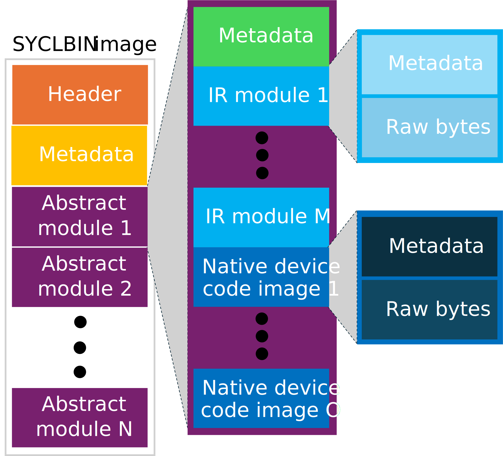

# SYCLBIN - A format for separately compiled SYCL device code

This design document details the SYCLBIN binary format used for storing SYCL
device binaries to be loaded dynamically by the SYCL runtime. It also details
how the toolchain produces, links and packages these binaries, as well as how
the SYCL runtime library handles files of this format.

## SYCLBIN binary format

The files produced by the new compilation path will follow the format described
in this section. The intention of defining a new format for these is to give
the DPC++ implementation an extendable and lightweight wrapper around the
multiple modules and corresponding metadata captured in the SYCLBIN file.
The content of the SYCLBIN may be contained as an entry in the offloading binary
format produced by the clang-offload-packager, as described in
[ClangOffloadPackager.rst](https://github.com/intel/llvm/blob/sycl/clang/docs/ClangOffloadPackager.rst).

The following illustration gives an overview of how the file format is
structured.

### Header

The header segment appears as the first part of the SYCLBIN file. Like many
other file-formats, it defines a magic number to help identify the format, which
is 0x53594249 (or "SYBI".) Immediately following the magic number is the version
number, which is used by SYCLBIN consumers when parsing data in the rest of the
file.

| Type       | Description                                                        | Value variable |
| ---------- | ------------------------------------------------------------------ | -------------- |
| `uint32_t` | Magic number. (0x53594249)                                         |                |
| `uint32_t` | SYCLBIN version number.                                            |                |

#### Global metadata

Immediately after the header is the global metadata segment of the SYCLBIN,
containing information about the contained SYCLBIN file.

| Type       | Description                                                        | Value variable |
| ---------- | ------------------------------------------------------------------ | -------------- |
| `uint8_t`  | `sycl::bundle_state` corresponding to the contents of the SYCLBIN. |                |

The `sycl::bundle_state` is an integer with the values as follows:

| `sycl::bundle_state` | Value |
| -------------------- | ----- |
| `input`              | 0     |
| `object`             | 1     |
| `executable`         | 2     |

### Body

Following the global metadata is the body of the SYCLBIN file. The body consists
of a list of abstract modules.

| Type       | Description                                | Value variable |
| ---------- | ------------------------------------------ | -------------- |
| `uint64_t` | Byte size of the list of abstract modules. | `B`            |
| `B`        | List of abstract modules.                  |                |

#### Abstract module

An abstract module is a collection of device binaries that share properties,
including, but not limited to: kernel names, imported symbols, exported symbols,
aspect requirements, and specialization constants.

The device binaries contained inside an abstract module must either be an IR
module or a native device code image. IR modules contain device binaries in some
known intermediate representation, such as SPIR-V, while the native device code
images can be an architecture-specific binary format. There is no requirement
that all device binaries in an abstract module is usable on the same device or
are specific to a single vendor.

| Type       | Description                                     | Value variable |
| ---------- | ----------------------------------------------- | -------------- |
| `uint64_t` | Byte size of the list of the metadata.          | `M`            |
| `M`        | Module metadata.                                |                |
| `uint64_t` | Byte size of list of IR modules.                | `IR`           |
| `IR`       | List of IR modules.                             |                |
| `uint64_t` | Byte size of list of native device code images. | `ND`           |
| `ND`       | List of native device code images.              |                |

##### Module metadata

The module metadata contains the following information about the contents of the
module.

| Type       | Description                                                    | Value variable |
| ---------- | -------------------------------------------------------------- | -------------- |
| `uint32_t` | Byte size of property set data.                                | `P`            |
| `P`        | Property set data.                                             |                |

*NOTE:* Optional features used is embedded in the property set data.
*TODO:* Consolidate and/or document the property set data in this document.

##### IR module

An IR module contains the binary data for the corresponding module compiled to a
given IR representation, identified by the IR type field.

| Type       | Description                    | Value variable |
| ---------- | ------------------------------ | -------------- |
| `uint8_t`  | IR type.                       |                |
| `uint32_t` | Byte size of the raw IR bytes. | `IB`           |
| `IB`       | Raw IR bytes.                  |                |

*TODO:* Do we need a target-specific blob inside this structure? E.g. for CUDA
        we may want to embed the SM version.

##### IR types

The IR types must be one of the following values:

| IR type | Value |
| ------- | ----- |
| SPIR-V  | 0     |
| PTX     | 1     |
| AMDGCN  | 2     |

##### Native device code image

An native device code image contains the binary data for the corresponding
module AOT compiled for a specific device, identified by the architecture
string.

| Type       | Description                                      | Value variable |
| ---------- | ------------------------------------------------ | -------------- |
| `uint32_t` | Byte size of the architecture string.            | `A`            |
| `A`        | Architecture string.                             |                |
| `uint32_t` | Byte size of the native device code image bytes. | `NB`           |
| NB         | Native device code image bytes.                  |                |

### SYCLBIN version changelog

The SYCLBIN format is subject to change, but any such changes must come with an
increment to the version number in the header and a subsection to this section
describing the change.

#### Version 1

 * Initial version of the layout.

## Clang driver changes

The clang driver needs to accept the following new flags:

<table>
<tr>
<th>Option</th>
<th>Description</th>
</tr>
<tr>
<td>`-fsyclbin`</td>
<td>
If this option is set, the output of the invocation is a SYCLBIN file with the
.syclbin file extension. This skips the host-compilation invocation of the typical
`-fsycl` pipeline, instead passing the output of the clang-offload-packager
invocation to clang-linker-wrapper together with the new `--syclbin` flag.

Setting this option will override `-fsycl` and `-fsycl-device-only`.

This option currently requires `--offload-new-driver` to be set.
</td>
</tr>
<tr>
<td>`--offload-ir`</td>
<td>*TODO*</td>
</tr>
<tr>
<td>`--offload-rdc`</td>
<td>This is an alias of `-fgpu-rdc`.</td>
</tr>
</table>

Additionally, `-fsycl-link` should work with .syclbin files. Semantics of how
SYCLBIN files are linked together is yet to be specified.

## clang-linker-wrapper changes

The clang-linker-wrapper is responsible for doing post-processing and linking of
device binaries, as described in [OffloadDesign.md](OffloadDesign.md).
However, to support SYCLBIN files, the clang-linker-wrapper must be able to
unpack an offload binary (as described in
[ClangOffloadPackager.rst](https://github.com/intel/llvm/blob/sycl/clang/docs/ClangOffloadPackager.rst))
directly, instead of extracting it from a host binary. This should be done when
a new flag, `--syclbin`, is passed. In this case, the clang-linker-wrapper is
responsible to package the resulting device binaries and produced metadata into
the format described in [SYCLBIN binary format section](#syclbin-binary-format).
Additionally, in this case the clang-linker-wrapper will skip the wrapping of
the device code and the host code linking stage, as there is no host code to
wrap the device code in and link.

*TODO:* Describe the details of linking SYCLBIN files.

## SYCL runtime library changes

Using the interfaces from the
[sycl_ext_oneapi_syclbin](../extensions/proposed/sycl_ext_oneapi_syclbin.asciidoc)
extension, the runtime must be able to parse the SYCLBIN format, as described in
the [SYCLBIN binary format section](#syclbin-binary-format). To avoid large
amounts of code duplication, the runtime uses the implementation of SYCLBIN
reading and writing implemented in LLVM.

When creating a `kernel_bundle` from a SYCLBIN file, the runtime reads the
contents of the SYCLBIN file and creates the corresponding data structure from
it. In order for the SYCL runtime library's existing logic to use the binaries,
the runtime then creates a collection of `sycl_device_binary_struct` objects and
its constituents, pointing to the data in the parsed SYCLBIN object. Passing
these objects to the runtime library's `ProgramManager` allows it to reuse the
logic for compiling, linking and building SYCL binaries.

In the other direction, users can request the "contents" of a `kernel_bundle`.
When this is done, the runtime library must ensure that a SYCLBIN file is
available for the contents of the `kernel_bundle` and must then write the
SYCLBIN object to the corresponding binary representation in the format
described in the [SYCLBIN binary format section](#syclbin-binary-format). In cases
where the `kernel_bundle` was created with a SYCLBIN file, the SYCLBIN
representation is immediately available and can be serialized directly. In other
cases, the runtime library creates a new SYCLBIN object from the binaries
associated with the `kernel_bundle`, then serializes it and returns the result.

