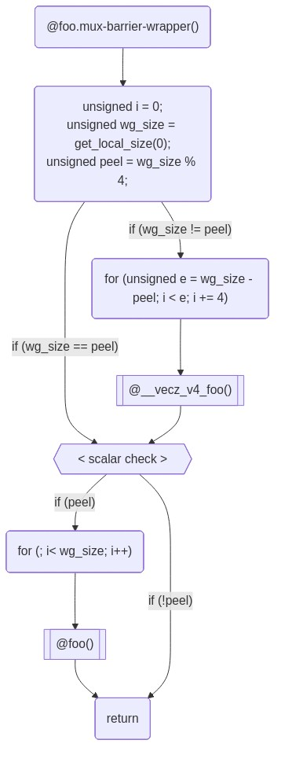

# SYCL Native CPU Pipeline Overview

## Introduction

This document serves to introduce users to the Native CPU compiler pipeline. The
compiler pipeline performs several key transformations over several phases that
can be difficult to understand for new users. The pipeline is constructed and
run in `llvm::sycl::utils::addSYCLNativeCPUBackendPasses`. All of the compiler
pipeline code can be found under
[llvm/lib/SYCLNativeCPUUtils](https://github.com/intel/llvm/tree/sycl/llvm/lib/SYCLNativeCPUUtils),
with the code which originated from the [oneAPI Construction
Kit](https://github.com/uxlfoundation/oneapi-construction-kit), under
`compiler_passes` in that directory.


## Objective and Execution Model

The compiler pipeline's objective is to compile incoming LLVM IR
modules containing one or more kernel functions to object code ready for
execution when invoked by the host-side runtime. The assumptions placed
on the input and output kernels is as follows:

1. The original kernel is assumed to adhere to an implicit **SIMT**
   execution model; it runs once per each *work-item* in an
   **NDRange**.
2. It is passed a state struct which contains information about the scheduling.
3. All builtins which do not relate to scheduling have been processed and we are
   left with some scheduling related calls to "mux builtins".
4. The final compiled kernel is assumed to be invoked from the
   host-side runtime once per *work-group* in the **NDRange**.

The inner-most function is the original input kernel, which is *wrapped*
by new functions in successive phases, until it is ready in a form to be
executed by the Native CPU driver.

The [WorkItemLoopsPass](SYCLNativeCPUPipelinePasses.md#workitemloopspass)
is the key pass which makes some of the implicit parallelism
explicit. By introducing *work-item loops* around each kernel function,
the new kernel entry point now runs on every work-group in an
**NDRange**.

## Compiler Pipeline Overview

With the overall execution model established, we can start to dive
deeper into the key phases of the compilation pipeline.

1. InputIR
2. Handling SpecConstants
3. Adding Metadata / Attributes
4. Vectorization
5. Work item loops and barriers
6. Define builtins and tidy up.

### Input IR

The program begins as an LLVM module. Kernels in the module are assumed
to obey a **SIMT** programming model, as described earlier in [Objective
& Execution Model](#objective-and-execution-model).

Simple fix-up passes take place at this stage: the IR is massaged to
conform to specifications or to fix known deficiencies in earlier
representations. The input IR at this point will contains special
builtins, called `mux builtins` for ndrange or subgroup
style operations e.g. `mux_get_global_id`. Many of these
later passes will refer to these `mux builtins`.

### Adding Metadata/Attributes

Native CPU IR metadata and attributes are attached to kernels. This
information is used by following passes to identify certain aspects of
kernels which are not otherwise attainable or representable in LLVM IR.

[TransferKernelMetadataPass and
EncodeKernelMetadataPass](SYCLNativeCPUPipelinePasses.md#transferkernelmetadatapass-and-encodekernelmetadatapass)
are responsible for adding this information.

### Whole Function Vectorization

The [Vecz](SYCLNativeCPUVecz.md) whole-function vectorizer is optionally run.

Note that Vecz may perform its own scalarization, depending on the
options passed to it, potentially undoing the work of any previous
optimization passes, although it is able to preserve or even widen
pre-existing vector operations in many cases.

### Work-item Scheduling & Barriers

The work-item loops are added to each kernel by the [WorkItemLoopsPass](SYCLNativeCPUPipelinePasses.md#workitemloopspass).

The kernel execution model changes at this stage to replace some of the
implicit parallelism with explicit looping, as described earlier in
[Objective & Execution Model](#objective-and-execution-model).

[Barrier Scheduling](#barrier-scheduling) takes place at this stage, as
well as [Vectorization Scheduling](#vectorization-scheduling) if the
vectorizer was run.


#### Barrier Scheduling

The fact that the
[WorkItemLoopsPass](SYCLNativeCPUPipelinePasses.md#workitemloopspass) handles
both work-item loops and barriers can be confusing to newcomers. These two
concepts are in fact linked. Taking the kernel code below, this section will
show how the `WorkItemLoopsPass` lays out and schedules a kernel's work-item
loops in the face of barriers.

```C
kernel void foo(global int *a, global int *b) {
  // pre barrier code - foo.mux-barrier-region.0()
  size_t id = get_global_id(0);
  a[id] += 4;
  // barrier
  barrier(CLK_GLOBAL_MEM_FENCE);
  // post barrier code - foo.mux-barrier-region.1()
  b[id] += 4;
}
```

The kernel has one global barrier, and one statement on either side of
it. The `WorkItemLoopsPass` conceptually breaks down the kernel into
*barrier regions*, which constitute the code following the control-flow
between all barriers in the kernel. The example above has two regions:
the first contains the call to `get_global_id` and the read/update/write
of global memory pointed to by `a`; the second contains the
read/update/write of global memory pointed to by `b`.

To correctly observe the barrier's semantics, all work-items in the
work-group need to execute the first barrier region before beginning the
second. Thus the `WorkItemLoopsPass` produces two sets of work-item
loops to schedule this kernel:


#### Live Variables

Note also that `id` is a *live variable* whose lifetime traverses the
barrier. The `WorkItemLoopsPass` creates a structure of live variables
which are passed between the successive barrier regions, containing data
that needs to be live in future regions.

In this case, however, calls to certain builtins like `get_global_id`
are treated specially and are materialized anew in each barrier region
where they are used.

#### Vectorization Scheduling

The [WorkItemLoopsPass](SYCLNativeCPUPipelinePasses.md#workitemloopspass) is
responsible for laying out kernels which have been vectorized by the
[Vecz](SYCLNativeCPUVecz.md) whole-function vectorizer.

The vectorizer creates multiple versions of the original kernel.
Vectorized kernels on their own are generally unable to fulfill
work-group scheduling requirements, as they operate only on a number of
work-items equal to a multiple of the vectorization factor. As such, for
the general case, several kernels must be combined to cover all
work-items in the work-group; the `WorkItemLoopsPass` is responsible for
this.

The following diagram uses a vectorization width of 4.

For brevity, the diagram below only details in inner-most work-item
loops. Most kernels will in reality have 2 outer levels of loops over
the full *Y* and *Z* work-group dimensions.



In the above example, the vectorized kernel is called to execute as many
work-items as possible, up to the largest multiple of the vectorization
less than or equal to the work-group size.

In the case that there are work-items remaining (i.e., if the work-group
size is not a multiple of 4) then the original scalar kernel is called
on the up to 3 remaining work-items. These remaining work-items are
typically called the 'peel' iterations.

### PrepareSYCLNativeCPU Pass

This pass will add a pointer to a `native_cpu::state` struct as kernel argument to all the kernel functions, and it will replace all the uses of SPIRV builtins with the return value of appropriately defined functions, which will read the requested information from the `native_cpu::state` struct. The `native_cpu::state` struct is defined in the [native_cpu UR adapter](https://github.com/oneapi-src/unified-runtime/blob/main/source/adapters/native_cpu/nativecpu_state.hpp) and the builtin functions are defined in the [native_cpu device library](https://github.com/intel/llvm/blob/sycl/libdevice/nativecpu_utils.cpp).


For a simple kernel of the form:

```cpp
    auto kern = [=](cl::sycl::id<1> wiID) {
      c_ptr[wiID] = a_ptr[wiID] + b_ptr[wiID];
    };
```

with original incoming IR of:

```llvm
define weak_odr dso_local spir_kernel void @_Z6Sample(ptr noundef align 4 %_arg_c_ptr, ptr noundef align 4 %_arg_a_ptr, ptr noundef align 4 %_arg_b_ptr) local_unnamed_addr #1 comdat !srcloc !74 !kernel_arg_buffer_location !75 !kernel_arg_type !76 !sycl_fixed_targets !49 !sycl_kernel_omit_args !77 {
entry:
  %0 = load i64, ptr @__spirv_BuiltInGlobalInvocationId, align 32, !noalias !78
  %arrayidx.i = getelementptr inbounds i32, ptr %_arg_a_ptr, i64 %0
  %1 = load i32, ptr %arrayidx.i, align 4, !tbaa !72
  %arrayidx4.i = getelementptr inbounds i32, ptr %_arg_b_ptr, i64 %0
  %2 = load i32, ptr %arrayidx4.i, align 4, !tbaa !72
  %add.i = add nsw i32 %1, %2
  %cmp.i8.i = icmp ult i64 %0, 2147483648
  tail call void @llvm.assume(i1 %cmp.i8.i)
  %arrayidx6.i = getelementptr inbounds i32, ptr %_arg_c_ptr, i64 %0
  store i32 %add.i, ptr %arrayidx6.i, align 4, !tbaa !72
  ret void
}
```

The resulting IR from a typical kernel with a `sycl::range` of dimension 1 is:

```llvm
define weak dso_local void @_Z6Sample.NativeCPUKernel(ptr noundef align 4 %0, ptr noundef align 4 %1, ptr noundef align 4 %2, ptr %3) local_unnamed_addr #3 !srcloc !74 !kernel_arg_buffer_location !75 !kernel_arg_type !76 !sycl_fixed_targets !49 !sycl_kernel_omit_args !77 {
entry:
  %ncpu_builtin = call ptr @_Z13get_global_idmP15nativecpu_state(ptr %3)
  %4 = load i64, ptr %ncpu_builtin, align 32, !noalias !78
  %arrayidx.i = getelementptr inbounds i32, ptr %1, i64 %4
  %5 = load i32, ptr %arrayidx.i, align 4, !tbaa !72
  %arrayidx4.i = getelementptr inbounds i32, ptr %2, i64 %4
  %6 = load i32, ptr %arrayidx4.i, align 4, !tbaa !72
  %add.i = add nsw i32 %5, %6
  %cmp.i8.i = icmp ult i64 %4, 2147483648
  tail call void @llvm.assume(i1 %cmp.i8.i)
  %arrayidx6.i = getelementptr inbounds i32, ptr %0, i64 %4
  store i32 %add.i, ptr %arrayidx6.i, align 4, !tbaa !72
  ret void
}
```

This (scalar) IR was generated by this pass from the input IR by adding the state struct pointer, substituting the builtins to reference the state struct, and adapt the kernel name.

This pass will also set the correct calling convention for the target, and handle calling convention-related function attributes, allowing to call the kernel from the runtime.

This kernel function is then wrapped again with a `subhandler` function, which receives the kernel arguments from the SYCL runtime (packed in a vector), unpacks them, and forwards only the used ones to the actual kernel and looks like: 

```llvm
define weak void @_Z6Sample(ptr %0, ptr %1) #4 {
entry:
  %2 = getelementptr %0, ptr %0, i64 0
  %3 = load ptr, ptr %2, align 8
  %4 = getelementptr %0, ptr %0, i64 3
  %5 = load ptr, ptr %4, align 8
  %6 = getelementptr %0, ptr %0, i64 4
  %7 = load ptr, ptr %6, align 8
  %8 = getelementptr %0, ptr %0, i64 7
  %9 = load ptr, ptr %8, align 8
  call void @_ZTS10SimpleVaddIiE.NativeCPUKernel(ptr %3, ptr %5, ptr %7, ptr %9, ptr %1)
  ret void
}
```

As you can see, the `subhandler` steals the kernel's function name, and receives two pointer arguments: the first one points to the kernel arguments from the SYCL runtime, and the second one to the `nativecpu::state` struct.

The subhandler calls the function generated by the WorkItemLoopsPass, which calls the vectorized kernel and the scalar kernel if peeling is needed as described above.

There is also some tidying up at the end such as deleting unused functions or
replacing the scalar kernel with the vectorized one.


Any remaining materialization of builtins are handled by
[DefineMuxBuiltinsPass](https://github.com/intel/llvm/blob/sycl/llvm/lib/SYCLNativeCPUUtils/compiler_passes/compiler_pipeline/source/define_mux_builtins_pass.cpp),
such as `__mux_mem_barrier`. The use of this pass should probably be phased
out in preference to doing it all in one place.

Some builtins may rely on others to complete their function. These
dependencies are handled transitively.

Pseudo C code:

```C
struct MuxWorkItemInfo { size_t[3] local_ids; ... };
struct MuxWorkGroupInfo { size_t[3] group_ids; ... };

// And this wrapper function
void foo.mux-sched-wrapper(MuxWorkItemInfo *wi, MuxWorkGroupInfo *wg) {
  size_t id = __mux_get_global_id(0, wi, wg);
}

// The DefineMuxBuiltinsPass provides the definition
// of __mux_get_global_id:
size_t __mux_get_global_id(uint i, MuxWorkItemInfo *wi, MuxWorkGroupInfo *wg) {
  return (__mux_get_group_id(i, wi, wg) * __mux_get_local_size(i, wi, wg)) +
         __mux_get_local_id(i, wi, wg) + __mux_get_global_offset(i, wi, wg);
}

// And thus the definition of __mux_get_group_id...
size_t __mux_get_group_id(uint i, MuxWorkItemInfo *wi, MuxWorkGroupInfo *wg) {
  return i >= 3 ? 0 : wg->group_ids[i];
}

// and __mux_get_local_id, etc
size_t __mux_get_local_id(uint i, MuxWorkItemInfo *wi, MuxWorkGroupInfo *wg) {
  return i >= 3 ? 0 : wi->local_ids[i];
}
```
