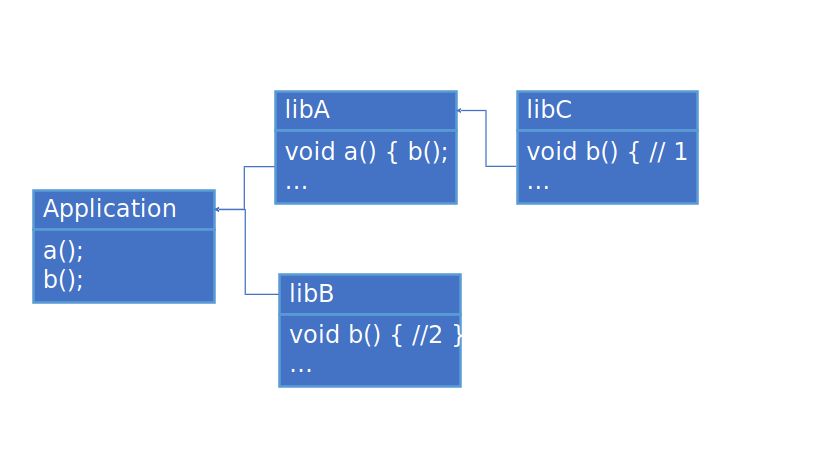
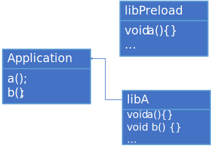

# Dynamic linking of device code

This document describes purpose and design of dynamic linking of device code
feature.

**NOTE**: This is not a final version. The document is still in progress.

## Background

Sometimes users want to link device code dynamically at run time. One possible
use case for such linkage - providing device functions via shared libraries.
The example below shows how device function `LibDeviceFunc` can be dynamically
linked to a SYCL app:

```C++
// app.cpp
SYCL_EXTERNAL int LibDeviceFunc(int i);

/* ... */
Q.submit([&](sycl::handler &CGH) {
CGH.parallel_for(/* ... */ [=](sycl::item i) {
  out[i] = LibDeviceFunc(i.get_id(0));
}); /* ... */
std::cout << out[i] << " ";

// lib.cpp
SYCL_EXTERNAL int LibDeviceFunc(int i) {
  return i * 2;
}
```

```bash
; Commands
clang++ -fsycl lib.cpp -shared -o libhelpers.so
clang++ -fsycl app.cpp -L. -lhelpers -o a.out
./a.out
Output: 0 2 4 6 ...
```

The first invocation of `clang++` driver will create a "fat" shared library
which contains both host code and device code. The second invocation of
`clang++` driver will create a "fat" application binary that also contains
embedded device code. Host part of the application and library will be linked
automatically by standard C++ toolchain and system linker, while linking of
device part of the application and library requires new functionality which is
described in this document.

It is possible to manually create `sycl::program` in both app and shared
library, then use `link` SYCL API to get a single program and launch kernels
using it. But this approach is a noticeable deviations from regular C/C++
workflow and requires some amount of source code boilerplate.

Another possible scenario - use functions defined in a pre-compiled device image
provided by the user. Example:

```C++
// a.cpp
SYCL_EXTERNAL void LibDeviceFunc();
...
Q.submit([&](sycl::handler &CGH) {
  CGH.parallel_for([]() { LibDeviceFunc(); });
});

// b.cpp
/*no SYCL_EXTERNAL*/ void LibDeviceFunc() { ... }
```

We have a `SYCL_EXTERNAL` function `LibDeviceFunc` called from a kernel, but the
application defined only host version of this function. Then user adds device
image with definition of `LibDeviceFunc` to the fat object via special compiler
option (like `-fsycl-add-targets`).

The main purpose of this feature is to provide a user-friendly mechanism which
allows to link device code dynamically at runtime, such as in the scenarios
above.

## Requirements

User's device code can be compiled into some form and not linked statically with
device code of application. It can be embedded as a device image into a shared
library or supplied as a separate device image with attached properties. This
code is linked dynamically at run time with device image of a user's application
in order to resolve dependencies. The requirements listed below must be
satisfied to enable such use case.

The presented dynamic device code linkage mechanism must:

- Allow to link device code represented as device binary image dynamically at
  runtime with other device binary images. In order to use this functionality
  the user can create and supply device binary image to DPC++ Runtime library
  via following ways:
  - Create a "fat" shared library by standard SYCL compiler driver invocation
  - Supply host binary or shared object with device binary image using manual
    invocations of SYCL tools such as `clang-offload-wrapper` and linker
  - Load device binary image into memory via dlopen-like API
    - This is a TODO item, since SYCL standard doesn't define such API yet.
    Example how such API may look like:

    ```C++
    // suppose, mylib.spv defines SYCL_EXTERNAL function foo, then this call:
    device_image img = device_dlopen("mylib.spv");
    // will make foo available for dynamic symbol resolution. If any subsequent
    // JIT compilations try to compile device code with external reference to
    // foo, it can now be resolved following the resolution mechanism described
    // in this doc, and JIT compilation will succeed.
    ```

- Allow different format for device code - e.g. it can be SPIR-V or native
  device binary
- Provide automatic runtime resolution of `SYCL_EXTERNAL` function references
  within the SYCL app to their definitions (if found) within any suitable
  dynamically linked device binary image
- Support pointers to `SYCL_EXTERNAL` functions across the dynamic linkage
  boundaries within the device code - taking a pointer, call through a pointer.
- Specific code changes are not required, i.e. the mechanism of linking works
  as close as possible to host shared libraries.

## Design

The overall idea:

- Each device image is supplied with a list of imported and exported symbol
  names through device image properties mechanism
- In order to create a program executable from device image DPC++ RT will check
  if this device image has a list of imported symbols and if it has, then RT
  will search for device images which define required symbols using lists of
  exported symbols.
  - Besides symbol names, additional attributes are taken into account (like
    device image format: SPIR-V or native device binary)
  - No logical binding between host module and export/import lists, i.e.
    resolution is performed w/o regard to containing host modules
- All found device images are used to create program objects and then these
  programs are linked together.
- Actual linking is performed by underlying backend (OpenCL/L0/etc.)
  - Underlying backend is the backend used by DPC++ RT to create program
    from device binary image, perform JIT compilation (if required for chosen
    device image format) and linking with other programs in order to resolve
    symbols.

Next sections describe details of changes in each component.

### DPC++ front-end changes

Now during device code split process `SYCL_EXTERNAL` functions are
considered as entry points (as well as kernels).
For this purpose DPC++ front-end generates `module-id` attribute on each
`SYCL_EXTERNAL` function.

### sycl-post-link changes

In order to support dynamic linking of device code, `sycl-post-link` performs
2 main tasks:

- Supplies device images containing exports with an information about exported
  symbols
- Supplies device images with an information about imported symbols

In addition, `SYCL_EXTERNAL` functions as well as kernels are considered as entry
points during device code split.
If device code split is enabled `SYCL_EXTERNAL` functions defined in shared
libraries and used within it can be duplicated.
Example:

```C++
// Shared library

// A.cpp
SYCL_EXTERNAL int LibDeviceFunc(int i) {
  return i * 2;
}

// B.cpp
/* ... */
Q.submit([&](sycl::handler &CGH) {
CGH.parallel_for(/* ... */ [=](sycl::item i) {
  out[i] = LibDeviceFunc(i.get_id(0));
} /* ... */
```

If user requested per-source device code split, then for this shared library
`sycl-post-link` will create two device images and both of them will define
`LibDeviceFunc` function. However `LibDeviceFunc` won't be exported from device
image that corresponds to source file `B.cpp` and it will be exported only from
device image that corresponds to source file where `LibDeviceFunc` was defined,
i.e. `A.cpp`.

Such duplication is needed for two reasons:

- We aim to make device images with kernels self-contained so no JIT linker
  invocations would be needed if we have definitions of all called functions.
- We could export `SYCL_EXTERNAL` functions from device images with kernels,
  but it would mean that when user's app calls `SYCL_EXTERNAL` function, it has
  to link a whole kernel and all its dependencies - so we leave a possibility
  for user to arrange code on per-source basis.

Non-`SYCL_EXTERNAL` functions used by `SYCL_EXTERNAL` functions are copied to
device images corresponding to those `SYCL_EXTERNAL` functions to make them
self-contained - in the same way as it is done when splitting kernels across
device images.
In case one `SYCL_EXTERNAL` function uses another `SYCL_EXTERNAL` function
with different value in `sycl-module-id` attribute, the second one is not copied
to the device image with the first function, but dependency between those device
images is recorded instead.

After device code split, all non-`SYCL_EXTERNAL` functions and copied
`SYCL_EXTERNAL` functions left in device images with kernels marked with
internal linkage to avoid multiple definition errors during runtime linking.
After that `sycl-post-link` records list of names of exported functions, i.e.
functions with `sycl-module-id` attribute and external linkage.

In order to collect information about imported symbols `sycl-post-link` looks
through LLVM IR and for each declared but not defined symbol records its
name, except the following cases:

- Declarations with `__` prefix in demangled name are not recorded as imported
  functions
  - Declarations with `__spirv_*` prefix should not be recorded as dependencies
    since they represent SPIR-V operations and will be transformed to SPIR-V
    instructions during LLVM->SPIR-V translation.
- Based on some attributes (which could be defined later) we may want to avoid
  listing some functions as imported ones
  - This is needed to have possibility to call device-specific builtins not
    starting with `__` by forward-declaring them in DPC++ code

**NOTE**: If device code split is enabled, imports collection is performed after
split and it is performed on separated images.

All collected information is attached to a device image via properties
mechanism.

Each device image is supplied with an array of property sets:

```C++
struct pi_device_binary_struct {
...
  // Array of property sets
  pi_device_binary_property_set PropertySetsBegin;
  pi_device_binary_property_set PropertySetsEnd;
};
```

Each property set is represented by the following struct:

```C++
// Named array of properties.
struct _pi_device_binary_property_set_struct {
  char *Name;                                // the name
  pi_device_binary_property PropertiesBegin; // array start
  pi_device_binary_property PropertiesEnd;   // array end
};
```

It contains name of property set and array of properties. Each property is
represented by the following struct:

```C++
struct _pi_device_binary_property_struct {
  char *Name;       // null-terminated property name
  void *ValAddr;    // address of property value
  uint32_t Type;    // _pi_property_type
  uint64_t ValSize; // size of property value in bytes
};
```

List of imported symbols is represented as a single property set with name
`SYCL/imported symbols` recorded in the `Name` field of property set.
Each property in this set holds name of the particular imported symbol recorded
in the `Name` field of the property.
List of exported symbols is represented in the same way, except the
corresponding set has the name `SYCL/exported symbols`.

### DPC++ runtime changes

DPC++ RT performs *device images collection* task by grouping all device
images required to execute a kernel based on the list of exports/imports, creates
programs using collected images and links them together using PI API.
Resulting program is then added to the cache to avoid repetition of symbol
resolution, compilation, and linking processes for any future attempts to invoke
kernels defined by this program.

#### DPC++ runtime plugin interface (PI) changes

During *device images collection* process RT considers modules as available for
linking using information about ability of chosen device backend to compile
and link programs created from particular device image format. The information
about ability to compile and link particular format of device code is provided
by PI plugin implementation for concrete backend. For this purpose
`piDeviceGetInfo` API is used. For each device image format supported by DPC++
RT PI device extension is defined. Each extension is a string that can be
returned by `piDeviceGetInfo` call with query `PI_DEVICE_INFO_EXTENSIONS`.
Mapping of extension strings and formats that can be linked:
| Device image format | Extension string | Meaning |
|---------------------|------------------|---------|
| `__SYCL_PI_DEVICE_BINARY_TARGET_SPIRV64` | "pi_ext_spirv64_linking" | Linking of SPIR-V 64-bit programs is supported|
| `__SYCL_PI_DEVICE_BINARY_TARGET_SPIRV64_X86_64` | "pi_ext_spirv64_x86_64_linking" | Linking of 64-bit programs that were AOT compiled for CPU device is supported|
| `__SYCL_PI_DEVICE_BINARY_TARGET_SPIRV64_GEN` | "pi_ext_spirv64_gen_linking" | Linking of 64-bit programs that were AOT compiled for GPU device is supported|
| `__SYCL_PI_DEVICE_BINARY_TARGET_SPIRV64_FPGA` | "pi_ext_spirv64_fpga_linking" | Linking of 64-bit programs that were AOT compiled for FPGA device is supported|

To link several device images together `piProgramLink` API will be used.
Depending on concrete plugin implementation and set of device image formats that
can be linked at run-time, `piProgramLink` API may receive programs made from
device images in different formats as inputs (including SPIR-V and native code).

##### Support of runtime linking in backends

- The initial implementation will support dynamic linking of device code in SPIR-V
  format on OpenCL backend:
  - OpenCL plugin will use the existing OpenCL `clLinkProgram()` API to online
  link the SPIR-V modules together.
  - A new Level Zero API to online link programs on SPIR-V level is required for
  better performance.
  - While there is no Level Zero API to link programs on SPIR-V level, existing
  `zeModuleDynamicLink()` can be used as fallback.

- In order to support dynamic linking of AOT compiled device code the
  following should be implemented on backends site:
  - AOT compilers must allow to compile SPIR-V modules with unresolved symbols
  and produce device code in format that can be linked in run time and allows
  to reduce JIT overhead
  - OpenCL program binary type `CL_PROGRAM_BINARY_TYPE_[COMPILED_OBJECT/LIBRARY]`
  should have native code format or any other format that can be emitted by AOT
  compiler and allows to reduce JIT overhead

#### Device images collection and linking

Device images collection and linking of programs is performed by DPC++ Runtime
class named `ProgramManager`.

When the program manager gets a request to create a program object using device
image, it examines its list of imported symbols and finds device images which
export those symbols, then program manager creates programs for each required
device image and links them all together.

All needed device images are found by iterating through all available OS modules
without predefined order and searching for first unresolved symbol in list of
imports of target device image. During search device image format is taken
into account, i.e. only device images that have the same format as target device
image will be considered as suitable ones. Once suitable device image that
contains first symbol is met, remaining exported symbols are checked in found
image. If they match some imported symbols then these matched symbols will be
marked as resolved. The procedure repeats until all imported symbols are marked
as resolved. In case all available device images are viewed, but some imported
symbols remain unresolved, exception will be thrown.

The following assumption is made: each device image represents some combination
of defined symbols (kernels or `SYCL_EXTERNAL` functions) and different
device images either contain exactly the same symbols or not overlapping list
of defined symbols. If this assumption is not correct, there can be two cases:

- Same symbols have the same definitions. In this case it doesn't matter which
  device image is taken to use duplicated symbol
- Same symbols have different definitions. In this case ODR violation takes
  place, such situation leads to undefined behaviour. For more details refer
  to [ODR violations](#odr-violations) section.
  - The situation when two device images of different formats define the same
    symbols with two different definitions is not considered as ODR violation.
    In this case the suitable device image will be picked.

So, it is valid to pick the met first device image which defines required symbol
during search.

#### Program caching

Existing support for device code caching can be re-used to cache
dynamically linked programs with slight changes.

##### In-memory cache

The existing mechanism of caching can be re-used in presence of dynamic
linking. Example of code when caching mechanism is successfully re-used for
dynamically linked code:

```C++
// Application
SYCL_EXTERNAL void LibFunc();

Q.submit([&](sycl::handler &CGH) {
  CGH.parallel_for<InternalKernel>( ... )
}); // 1. Program is compiled, linked and saved in cache
    // 2. Prepared program is used to enqueue kernel

Q.submit([&](sycl::handler &CGH) {
  handler.parallel_for([] { LibFunc(); }); // Prepared program is used to enqueue kernel
});

// Library
SYCL_EXTERNAL void LibFunc() {
// ...
}
```

In current cache structure the programs map's key consists of four components:
kernel set id, specialization constants values, the device this program is built
for, build options id. In this example Id of kernel set where application's
kernels can be used to access program cache. However when shared library
defines kernels and these kernels are run by the application unchanged cache
structure may lead to double compilation of the same code. Example of code
that leads to double compilation of library code:

```C++
// Application
SYCL_EXTERNAL void LibFunc();

Q.submit([&](sycl::handler &CGH) {
  handler.parallel_for([] { LibFunc(); });  // Device code for library is
                                            // compiled and linked together with
                                            // device code for application, i.e.
                                            // LibFunc1 and ExternalKernel exist
                                            // in prepared state
});
// ...
EnqueueLibraryKernel(Q); // If cache mechanism is not changed, this line will
                         // lead to second compilation of ExternalKernel and
                         // LibFunc

// Library
SYCL_EXTERNAL void LibFunc() {
// ...
}

EnqueueLibraryKernel(queue) {
  queue.submit(parallel_for<ExternalKernel>(...));
}
```

Such case can be optimized by bringing nesting into cache keys structure.
Kernel set id can be found for each kernel using its name and OS module it is
coming from. In presence of dynamic linking resulting program can be combined
out of device images which come from different OS modules. So, it should be
possible to find needed program by kernel name and any OS module that was
involved in this program. The new mapping structure is:

```
{kernel name} =>
  {OSModuleHandle, spec const, opts, dev} => program
```

I.e. each kernel name is mapped to a set of tuples that consists of OS module,
spec constant values, JIT compiler options and device. Then concrete tuple is
mapped to a program object. Several tuples can be mapped to the same program
object. These tuples are created during process of compilation and symbols
resolution for concrete device image.
When some program is a result of linking several programs from device images
with different OS modules, a tuple is created for each OS module ID.
These tuples are used as nested cache entries after kernel name.
Example of modified cache structure when dynamic linking is involved:

```C++
// Application
// OSModule = 1

SYCL_EXTERNAL void LibFunc();
queue.submit(parallel_for<InternalKernel>( ... ));

Q.submit([&](sycl::handler &CGH) {
  CGH.parallel_for([] { LibFunc(); });
});

EnqueueLibraryKernel(q);

// Library
// OSModule = 2

SYCL_EXTERNAL LibFunc();

EnqueueLibraryKernel(queue) {
  queue.submit(parallel_for<ExternalKernel>(...));
}
```

```
Program cache will have the following structure:
 "InternalKernel" =>
   {1, ...} => program 1
 "ExternalKernel" =>
   {1, ...} => program 1
   {2, ...} => program 1
```

However the library code will be compiled twice if kernel from the library
was enqueued before kernels from the application, i.e. in such case:

```C++
// Application
SYCL_EXTERNAL void LibFunc();

EnqueueLibraryKernel(Q); // First, library code is compiled alone since it
                         // doesn't have any dependencies
// ...
Q.submit([&](sycl::handler &CGH) {
  handler.parallel_for([] { LibFunc(); });  // Second, library code is compiled
                                            // and linked together with code of
                                            // the application
});
```

The kernel caching mechanism is re-used without changes.

##### Persistent cache

The documented approach to persistent cache needs to be expanded in presence
of dynamic linking support. One of the identifiers for built image hash is
hash made out of device image used as input for the JIT compilation.
In case when "main" image have imports information, device image hash should be
created from all device images that are necessary to build it, i.e. hash out
of "main" device image and set of images that define all
symbols imported by "main" device image.
The hash string is a result of appending device images. To make order of device
images defined and persistent across runs of the same application, device images
are sorted before they are used to create hash string.
A string made out of names of defined symbols defined by a device image is used
to compare device images during sorting process.

## Corner cases and limitations

It is not guaranteed that behaviour of host shared libraries and device shared
libraries will always match. There are several cases when behaviours don't match,
the next sections will cover details of such cases.

### ODR violations

C++ standard defines One Definition Rule as:
> Every program shall contain exactly one definition of every non-inline
  function or variable that is odr-used in that program outside of a discarded
  statement; no diagnostic required.
  The definition can appear explicitly in the program, it can be found in the
  standard or a user-defined library, or (when appropriate) it is implicitly
  defined.

Here is an example:



Both libraries libB and libC provide two different definitions of function
`b()`, so this example illustrates ODR violation. Technically this case has
undefined behaviour, however it is possible to run and compile this example on
Linux and Windows. Whereas on Linux only function `b()` from library libB is
called, on Windows both versions of function `b()` are used.
Most of backends online linkers act like static linkers, i.e. just merge
device code from different programs, so it is not possible to correctly imitate
Windows behaviour in device code linking because attempts to do it will result
in multiple definition errors.

Given that, it is not guaranteed that behaviour of shared host libraries and
shared device libraries will always match in case of such ODR violations.

#### LD_PRELOAD

Another way to violate ODR is `LD_PRELOAD` environment variable on Linux. It
allows to load specified shared library before any other shared libraries so it
will be searched for symbols before other shared libraries. It allows to
substitute functions from regular shared libraries by functions from preloaded
library.
Device code registration is implemented using global constructors. Order of
global constructors calling is not defined across different translation units,
so with current design of device shared libraries and device code registration
mechanism it is not possible to understand which device code comes from
preloaded library and which comes from regular shared libraries.

Here is an example:



"libPreload" library is preloaded using `LD_PRELOAD` environment variable.
In this example, device code from "libPreload" might be registered after
device code from "libA".

To implement basic support, for each device image we can record name of the
library where this device image comes from and parse content of `LD_PRELOAD`
environment variable to choose the proper images. However such implementation
will only allow to substitute a whole device image and not an arbitrary
function (unless it is the only function in a device image), because partial
substitution will cause multiple definition errors during runtime linking.

### Run-time libraries loading

It is possible to load shared library during run-time. Both Linux and Windows
provide a way to do so (for example `dlopen()` on Linux or `LoadLibrary` on
Windows).
In case run-time loading is used to load some shared library, the symbols from
this shared library do not appear in the namespace of the main program. It means
that even though shared library is loaded successfully in run-time, it is not
possible to use symbols from it directly. The symbols from run-time loaded
library can be accessed by address which can be obtained using corresponding
OS-dependent API (for example `dlsym()` on Linux).

The problem here is that even though symbols from run-time loaded shared
library are not part of application's namespace, the library is loaded through
standard mechanism, i.e. its global constructors are invoked which means that
device code from it is registered, so it is not possible to
understand whether device code comes from run-time loaded library or not.
If such run-time loaded library exports device symbols and they
somehow match with symbols that actually directly used in device code
somewhere, it is possible that symbols from run-time loaded library
will be unexpectedly used.

To resolve this problem we need to ensure that device code registered from
run-time loaded library appears at the end of symbols search list, however
having that device code registration is triggered by global constructors, it
doesn't seem possible.

One more possible mitigation would be to record name of the library from which
each symbol should be imported, but it still won't resolve all potential
issues with run-time library loading, because user can load the library with the
same name as one of the explicitly linked libraries.

## Related links

1. Test plan for this feature
https://github.com/intel/llvm/blob/sycl/sycl/test-e2e/TestPlans/DynamicLinkingTestPlan.md
