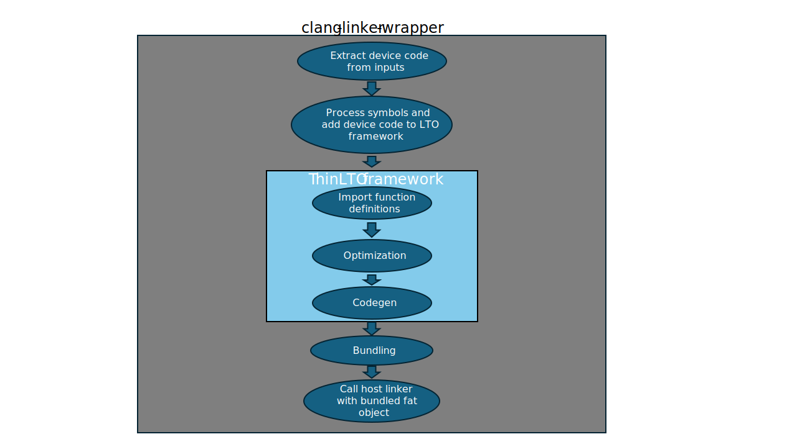
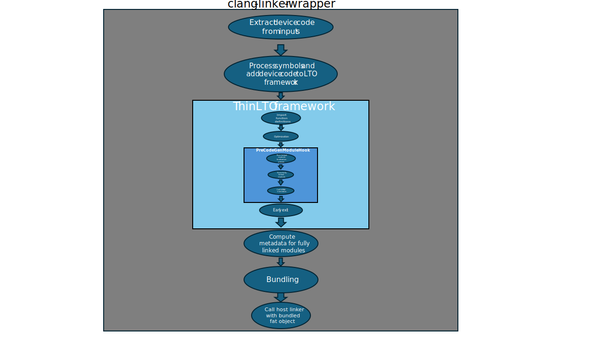
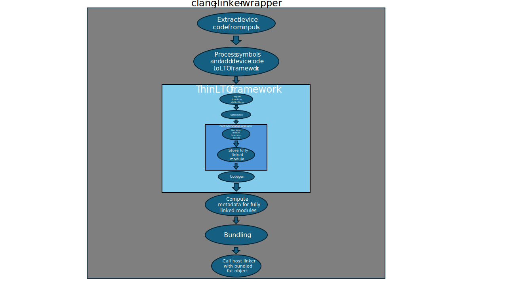

# ThinLTO for SYCL

This document describes the purpose and design of ThinLTO for SYCL.

**NOTE**: This is not the final version. The document is still in progress.

## Background

With traditional SYCL device code linking, all user code is linked together
along with device libraries into a single huge module and then split and
processed by `sycl-post-link`. This requires sequential processing, has a large
memory footprint, and differs from the linking flow for AMD and NVIDIA devices.

## Summary

SYCL ThinLTO will hook into the existing community mechanism to run LTO as part
of device linking inside `clang-linker-wrapper`. We split the device images
early at compilation time, and at link time we use ThinLTO's function importing
feature to bring in the definitions for referenced functions. Only the new
offload model is supported.

## Device code compilation time changes

Most of the changes for ThinLTO occur during device link time, however there is
one major change during compilation (-c) time: we now run device code split
during compilation instead of linking. The main reason for doing this is
increased parallelization. Many compilation jobs can be run at the same time,
but linking happens once total for the application. Device code split is
currently a common source of performance issues.

Splitting early means that the resulting IR after splitting is not complete, it
still may contain calls to functions (user code and/or the SYCL device
libraries) defined in other translation units.

We rely on the assumption that all function definitions matching a declaration
will be the same and we can let ThinLTO pull in any one.

For example, let's start with user device code that defines a `SYCL_EXTERNAL`
function `foo` in translation unit `tu_foo`. There is also another translation
unit `tu_bar` that references `foo`. During the early device code splitting run
of `tu_foo`, we may find that more than one of the resultant device images
contain a definition for `foo`.

We assert that any function definition for `foo` that is deemed a match by the
ThinLTO infrastructure during the processing of `tu_bar` is valid.

As a result of running early device code split, the fat object file generated as
part of device compilation may contain multiple device code images.

## Device code link time changes

Before we go into the link time changes for SYCL, let's understand the device
linking flow for AMD/NVIDIA devices:

SYCL has two differentiating requirements:

1) The SPIR-V backend is not production ready and the SPIR-V translator is used.
2) The SYCL runtime requires metadata (module properties and module symbol
table) computed from device images that will be stored along the device images
in the fat executable.

The effect of requirement 1) is that instead of letting ThinLTO call the SPIR-V
backend, we add a callback that runs right before CodeGen would run. In that
callback, we call the SPIR-V translator and store the resultant file path for
use later, and we instruct the ThinLTO framework to not perform CodeGen.

An interesting additional fact about requirement 2) is that we actually need to
process fully linked module to accurate compute the module properties. One
example where we need the full module is to [compute the required devicelib
mask](https://github.com/intel/llvm/blob/sycl/llvm/lib/SYCLLowerIR/SYCLDeviceLibReqMask.cpp).
If we only process the device code that was included in the original fat object
input to `clang-linker-wrapper`, we will miss devicelib calls in referenced
`SYCL_EXTERNAL` functions.

The effect of requirement 2) is that we store the fully linked device image for
metadata computation in the SYCL-specific handing code after the ThinLTO
framework has completed. Another option would be to try to compute the metadata
inside the ThinLTO framework callbacks, but this would require SYCL-specific
arguments to many caller functions in the stack and pollute community code.

Here is the current ThinLTO flow for SYCL:

We add a `PreCodeGenModuleHook` function to the `LTOConfig` object so that we
can process the fully linked module without running the backend.

However, the flow is not ideal for many reasons:

1) We are relying on the external `llvm-spirv` tool instead of the SPIR-V
backend. We could slightly improve this issue by using a library call to the
SPIR-V translator instead of the tool, however the library API requires setting
up an object to represent the arguments while we only have strings, and it's
non-trivial to parse the strings to figure out how to create the argument
object. Since we plan to use the SPIR-V backend in the long term, this does not
seem to be worth the effort.

2) We manually run passes inside `PreCodeGenModuleHook`. This is because we
don't run CodeGen, so we can't take advantage of the `PreCodeGenPassesHook`
field of `LTOConfig` to run some custom passes, as those passes are only run
when we actually are going to run CodeGen.

3) We have to store the fully linked module. This is needed because we need a
fully linked module to accurately compute metadata, see the above explanation of
SYCL requirement 2). We could get around storing the module by computing the
metadata inside the LTO framework and storing it for late use by the SYCL
bundling code, but doing this would require even more SYCL-only customizations
including even more new function arguments and modifications of the
`OffloadFile` class. There are also compilations because the LTO framework is
multithreaded, and not all LLVM data structures are thread safe.

The proposed long-term SYCL ThinLTO flow is as follows:

The biggest difference here is that we are running CodeGen using the SPIR-V
backend.

Also, instead of using a lambda function in the `PreCodeGenModuleHook` callback
to run SYCL finalization passes, we can take advantage of the
`PreCodeGenPassesHook` field to add passes to the pass manager that the LTO
framework will run.

It is possible that the number of device images in the fat executable and which
device image contains which kernel is different with ThinLTO enabled, but we do
expect this to have any impact on correctness or performance, nor we do expect
users to care.

## Current limitations

`-O0`: Compiling with `-O0` prevent clang from generating ThinLTO metadata
during the compilation phase. In the current implementation, this is an error.
In the final version, we could either silently fall back to full LTO or generate
ThinLTO metadata even for `-O0`.

SYCL libdevice: Current all `libdevice` functions are explicitly marked to be
weak symbols. The ThinLTO framework does not consider a definition of function
with weak linkage as it cannot be sure that this definition is the correct one.
Ideally we could remove the weak symbol annotation.

No binary linkage: The SPIR-V target does not currently have a production
quality binary linker. This means that we must generate a fully linked image as
part of device linkage. At least for AMD devices, this is not a requirement as
`lld` is used for the final link which can resolve any unresolved symbols.
`-fno-gpu-rdc` is default for AMD, so in that case it can call `lld` during
compile, but if `-fno-gpu-rdc` is passed, the lld call happens as part of
`clang-linker-wrapper` to resolve any symbols not resolved by ThinLTO.
