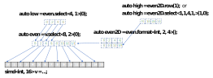

# Explicit SIMD Programming Extension for DPC++

Note:
_This document describes current design and API for the Intel Explicit SIMD
extension to DPC++. This is initial experimental version to try out functionality
and performance. We are going to work with the community on incrementally improving
the APIs to bring them closer to std C++ and SYCL in the next several months._

## Introduction

The main motivation for introducing the Explicit SIMD Programming (ESP) DPC++
extension is enabling low-level efficient programming for Intel Gen
architectures. More specifically, Explicit SIMD provides the following
additional features:
- Manual vectorization of device code using the `simd` class mapped to Gen's
  general register file. This allows to write efficient code not relying on
  further widening by the compiler, as with traditional SPMD programming.
- Low-level APIs efficiently mapped to Gen architecture, such as block reads.

## Explicit SIMD execution model

Explicit SIMD execution model is basically an equivalent of the base SYCL
execution model with subgroup size restricted to 1. Which means each subgroup
maps to a single hardware thread. All standard SYCL APIs continue to work,
including `sycl::intel::sub_group` ones, which become either a no-op or
trivial. E.g. a barrier becomes just a memory fence for a compiler, collectives
just return the value in the single work-item. Another consequences of the unit
subgroup size is guaranteed independent forward progress between work-items on
some Gen architecture generations.

## Explicit SIMD extension APIs

Explicit SIMD APIs can be used only in code to be executed on Intel Gen
architecture devices and the host device for now. Attempt to run such code on
other devices will result in error. 

All the ESIMD APIs are defined in the `sycl::ext::intel::experimental::esimd` namespace.

Kernels and `SYCL_EXTERNAL` functions using ESP must be explicitly marked with
the `[[intel::sycl_explicit_simd]]` attribute. Subgroup size query within such
functions will always return `1`.

*Functor kernel*
```cpp
using AccTy = sycl::accessor<int, 1, sycl::access::mode::read_write,
                                 sycl::access::target::global_buffer>;
class Functor {
public:
  Functor(int X, AccTy &Acc) : X(X), Acc(Acc) {}

  void operator()() [[intel::sycl_explicit_simd]] { Acc[0] += X; }

private:
  int X;
  AccTy Acc;
};
```

*Lambda kernel and function*
```cpp
using namespace sycl::ext::intel::experimental::esimd;
SYCL_EXTERNAL
void sycl_device_f(sycl::global_ptr<int> ptr, simd<float, 8> X) [[intel::sycl_explicit_simd]] {
  flat_block_write(*ptr.get(), X);
}
...
  Q.submit([&](sycl::handler &Cgh) {
    auto Acc1 = Buf1.get_access<sycl::access::mode::read>(Cgh);
    auto Acc2 = Buf2.get_access<sycl::access::mode::read_write>(Cgh);

    Cgh.single_task<class KernelID>([=] () [[intel::sycl_explicit_simd]] {
      simd<float, 8> Val = flat_block_read(Acc1.get_pointer());
      sycl_device_f(Acc2, Val);
    });
  });
}
```

## Implementation restrictions

Current ESP implementation does not support using certain standard SYCL features
inside explicit SIMD kernels and functions. Most of them will be eventually
dropped. What's not supported today:
- Explicit SIMD kernels can co-exist with regular SYCL kernels in the same
  translation unit and in the same program. However, interoperability between
  them is not yet supported, e.g. currently it's not allowed to invoke an ESIMD
  kernel from a regular SYCL kernel and vice-versa.
- Local accessors. Local memory is allocated and accessed via explicit
device-side API
- 2D and 3D accessors
- Constant accessors
- `sycl::accessor::get_pointer()`. All memory accesses through an accessor are
done via explicit APIs; e.g. `sycl::ext::intel::experimental::esimd::block_store(acc, offset)`
- Few others (to be documented)

## Core Explicit SIMD programming APIs

The DPC++ Explicit SIMD library defines the following classes to enhance the
expressiveness for explicit SIMD data-parallel programming while enabling
efficient mapping to SIMD vector operations on Intel GPU architectures.

### SIMD vector class

The `simd` class is a vector templated on some element type.
The element type must be vectorizable type. The set of vectorizable types is the
set of fundamental SYCL arithmetic types (C++ arithmetic types or `half` type)
excluding `bool`. The length of the vector is the second template parameter.

ESIMD compiler back-end does the best it can to map each `simd` class object to a consecutive block
of registers in the general register file (GRF).

Every specialization of `simd` class shall be a complete type. The term
simd type refers to all supported specialization of the simd class template.
To access the i-th individual data element in a simd vector, Explicit SIMD supports the
standard subscript operator ```[]```, which returns by value.

For simd type object, Explicit SIMD supports the following simd vector operations:
- Unary operators: ++ (*pre-/post-increment*), -- (*pre-/post-decrement*)
- Binary operators: +, -, *, /, &, |, ^, <<, >>
- Compound assignments: +=, -=, *=, /=, &=, |=, ^=, <<=, >>=
- Compare operators: >, >=, <, <=, ==, !=

These are all element-wise operations, which apply a specified operation to the
elements of one or more simd objects and should follow the standard C++ rules for
the corresponding scalar data element computation. Each such application is
unsequenced with respect to the others.

To reference a subset of the elements in simd vector object, Explicit SIMD provides ```select```
function, which returns a `simd` or `simd_view` object (*described below*) representing
the selected sub-vector starting from the i-th element. The number of selected
elements is specified by the template parameter **Size**, while the distance
between two adjacent elements is specified by the template parameter **Stride**.

```cpp
  simd<int, 8> a;
  simd<int, 4> b;
  // ...
  b = a.select<4, 2>(1);  // size=4, stride=2, offset=1 (elements a(1),
                          // a(3), a(5) and a(7) are copied to b)
```

<p align="center">

</p>

```cpp
a.select<4, 2>(0) = b;  // selected elements of a are replaced
                        // with elements of b (all elements of b are
                        // copied to elements a(0), a(2), a(4), a(6))
```

<p align="center">

</p>


Gen ISA provides powerful register region addressing modes to facilitate cross-lane
SIMD vector operation. To exploit this feature Explicit SIMD provides ```replicate``` functions
to allow programmer to implement any native Gen ISA region in the following forms:
- ```replicate<REP>()```: replicate a simd vector object **REP** times and return a new simd
vector of **REP** * Width, where Width specifies the original vector size.
- ```replicate_w<REP, W>(uint16_t i)```: replicate **W** consecutive elements starting at the
i-th element from the simd vector object **REP** times, and return a new simd vector of **REP** * **W** length.
- ```replicate_vs_w<REP, VS, W>(uint16_t i)```: replicate **REP** blocks of **W** consecutive
elements starting at the i-th from the simd vector object with each block strided by **VS**
elements, and return a new vector of **REP** * **W** length. Selected blocks of **W**
elements will overlap if **VS** < **W**.
- ```replicate_vs_w_hs<REP, VS, W, HS>(uint16_t i=0 )```: replicate **REP** blocks of **W** sequential
elements with a stride of **HS** starting at the i-th element from the simd vector object with
each block strided by **VS** elements, and return a new vector of **REP** * **W** length.
Selected blocks of **W** elements will overlap if **VS** < **W**.

To avoid explicit type cast and the resulting move instructions for large vectors, Explicit SIMD allows
programmer to reinterpret the fundamental data element type of a simd vector object and change
its shape to 1D or 2D object through the ```bit_cast_view``` function:
- ```bit_cast_view<EltTy>( )```: returns a reference to the calling simd object interpreted as a new
simd vector with the size determined by the template **EltTy** parameter.
- ```bit_cast_view<EltTy, Height, Width>( )```: returns a reference to the calling simd object interpreted
as a new 2D simd_view object with the shape determined by the template parameters **Height** and**Width**. The size of the new 2D block must not exceed the size of the original object.

```cpp
  simd<int, 16> v1;
   // ...
  auto v2 = v1.bit_cast_view<short>;
  // v2 is a reference to the location of v1
  // interpreted as a vector of 32 shorts.
  // ...
  auto m1 = v1.bit_cast_view<int, 4, 4>;
  // m1 is a reference to the location of v1
  // interpreted as a matrix 4x4 of ints.
  // ...
  auto m2 = v1.bit_cast_view<char, 4, 16>( );
  // m2 is a reference to the location of v1
  // interpreted as a matrix 4x16 of chars.
```

To model predicated move, Explicit SIMD provides the following merge functions:
- ```merge(value_type Val, mask_type Mask)```: this merge operation takes one source operand **Val** and a mask **Mask** defined as unsigned short vector of the same length. The semantic is that if the LSB of an element of **Mask** is set, then the corresponding data element of **Val** is copied to the corresponding position in the calling simd object.

```cpp
  simd<int, 4>   m, src;
  simd<unsigned short, 4> mask;
  // ...
  m.merge(src, mask);
  // m           src         mask      --->  m
  // 2 2 2 2     4 4 4 4     1 1 0 1         4 4 2 4
```

- ```merge(value_type Val1, value_type Val2, mask_type Mask)```: this merge operation takes two source operands **Val1** and **Val2** as well as a simd mask. The semantic is that if the LSB of an element of **Mask** is set, then the corresponding data element of **Val1** is copied to the corresponding position in the calling simd object. Otherwise the corresponding data element of **Val2** is copied to the corresponding position in the calling simd object.

```cpp
  simd<int,4>   m, src1, src2;
  simd<unsigned short, 4> mask;
  // ...
  m.merge(src1, src2, mask);
  // m           src1        src2         mask        --->  m
  // 2 2 2 2     4 4 4 4     3 3 3 3      1 1 0 1           4 4 3 4
```
### `simd_view` class

The `simd_view` represents a "window" into existing simd object,
through which a part of the original object can be read or modified. This is a
syntactic convenience feature to reduce verbosity when accessing sub-regions of
simd objects. **RegionTy** describes the window shape and can be 1D or 2D,
**BaseTy** is the original simd object type, which can be a ```simd_view```
itself.

```simd_view``` allows to model hierarchical "views" of the parent ```simd```
object's parts, read/modify its elements through the views. Views can be of
different shapes and dimensions as illustrated below (`auto` resolves to a
`simd_view` instantiation):

<p align="center">

</p>

`simd_view` class supports all the element-wise operations and
other utility functions defined for `simd` class. It also
provides region accessors and more generic operations tailored for 2D regions,
such as row/column operators and 2D select/replicate/bit_cast_view/merge operations.

```cpp
  simd<float, 32> v1;
  auto m1 = v1.bit_cast_view<float, 4, 8>();
  simd<float, 4> v2;
  auto m2 = v2.bit_cast_view<float, 2, 2>();

  // ...
  m2 = m1.select<2, 2, 2, 4>(1, 2);  // v_size = 2, v_stride = 2,
                                     // h_size = 2, h_stride = 4,
                                     // v_offset = 1, h_offset = 2.
```
<p align="center">

</p>

```cpp
  m1.select<4, 1, 4, 2>(0, 0) = 0.0f; // selected elements of m1
                                      // are replaced with 0.0f
```

<p align="center">

</p>

### Reduction functions

Explicit SIMD provides the following reduction functions for simd objects.
Compiler will produce optimal code sequence on the target device to apply the
specified operation to all scalar elements in the input simd vector. Note that
the order of element-wise operations is not guaranteed and the correctness of
result should not depend on a particular computation order.
- ```reduce(simd<T1, SZ> v, std::plus<>())```: returns a scalar value of type
**T0** that's equal to the sum of all data elements of type **T1** in simd vector
**v** of length **SZ**.
- ```reduce(simd<T1, SZ> v, std::multiplies<>())```: returns a scalar value of
type **T0** that's equal to the product of all data elements of type **T1** in simd
vector **v** of length **SZ**.
- ```hmax(simd<T1, SZ> v)```: returns a scalar value of type **T0**
that's equal to the maximum value of all data elements of type **T1** in simd
vector **v** of length **SZ**.
- ```hmin(simd<T1, SZ> v)```: returns a scalar value of type **T0**
that's equal to the minimum value of all data elements of type **T1** in simd
vector **v** of length **SZ**.

```cpp
template <typename T0, typename T1, int SZ, typename BinaryOperation>
T0 reduce(simd<T1, SZ> v, BinaryOperation op);

template <typename T0, typename T1, int SZ> T0 hmax(simd<T1, SZ> v);
template <typename T0, typename T1, int SZ> T0 hmin(simd<T1, SZ> v);
```

### Memory access APIs

Currently the variety of memory objects supported by the Explicit SIMD extension
implementation is limited to the following:
- USM pointers (aka 'flat address')
- 1D global accessors
- 2D image accessors

The implementation further limits the set of memory access operations
which a kernel can perform through those memory objects. Basically, all of them
are special intrinsic APIs described below rather than standard SYCL accessor or
pointer operations. Examples of unsupported features include
`accessor::get_pointer()`, accessor's `operator []`, C/C++ dereference of an
USM pointer, local accessors, 2D and 3D accessors.
Those are temporary restrictions, to be dropped in future.

See auto-generated documentation for the complete list of APIs here. (TBD)

#### USM pointer-based memory access
##### Flat-address gather/scatter
perform scattered read/write for the given starting pointer **p** and
**offsets**.

```cpp
template <typename T, int n, int ElemsPerAddr = 1,
	  CacheHint L1H = CacheHint::Default,
          CacheHint L3H = CacheHint::Default>
typename std::enable_if<((n == 16 || n == 32) &&
    (ElemsPerAddr == 1 || ElemsPerAddr == 2 || ElemsPerAddr == 4)),
    simd<T, n*ElemsPerAddr>>::type
flat_load(T *p, simd<uint32_t, n> offsets, simd<uint16_t, n> pred = 1);

template <typename T, int n, int ElemsPerAddr = 1,
	  CacheHint L1H = CacheHint::Default,
          CacheHint L3H = CacheHint::Default>
typename std::enable_if<((n == 16 || n == 32) &&
    (ElemsPerAddr == 1 || ElemsPerAddr == 2 || ElemsPerAddr == 4)),
    void>::type
flat_store(T *p, simd<T, n*ElemsPerAddr> vals, simd<uint32_t, n> offsets,
           simd<uint16_t, n> pred = 1);
```
##### Flat-address block load/store
read or write a consecutive block of data for the memory location specified by
**addr**.

```cpp
template <typename T, int n, CacheHint L1H = CacheHint::Default,
          CacheHint L3H = CacheHint::Default>
simd<T, n> flat_block_load(const T *const addr);

template <typename T, int n, CacheHint L1H = CacheHint::Default,
          CacheHint L3H = CacheHint::Default>
void flat_block_store(T *p, simd<T, n> vals);
```

##### Flat-address load4/store4
perform scattered read/write for the given starting pointer **p** and
**offsets**. Up to 4 data elements may be accessed at each address depending on
the enabled channel **Mask**.

```cpp
template <typename T, int n, ChannelMaskType Mask,
          CacheHint L1H = CacheHint::Default,
          CacheHint L3H = CacheHint::Default>
    typename std::enable_if<(n == 16 || n == 32),
                            simd<T, n * NumChannels(Mask)>>::type
    gather_rgba(T *p, simd<uint32_t, n> offsets, simd<uint16_t, n> pred = 1);

template <typename T, int n, ChannelMaskType Mask,
          CacheHint L1H = CacheHint::Default,
          CacheHint L3H = CacheHint::Default>
typename std::enable_if<(n == 16 || n == 32), void>::type
    scatter_rgba(T *p, simd<T, n * NumChannels(Mask)> vals,
            simd<uint32_t, n> offsets, simd<uint16_t, n> pred = 1);
```

##### Flat-address atomic inc/dec
perform atomic memory access operation with zero source operand.

```cpp
template <CmAtomicOpType Op, typename T, int n,
          CacheHint L1H = CacheHint::Default,
          CacheHint L3H = CacheHint::Default>
    typename std::enable_if<check_atomic<Op, T, n, 0>(), simd<T, n>>::type
    flat_atomic(T *p, simd<unsigned, n> offset, simd<ushort, n> pred);
```

- ```Flat-address atomic add/sub/min/max/etc.```: perform atomic memory
access operation with one source operand.

```cpp
template <CmAtomicOpType Op, typename T, int n,
          CacheHint L1H = CacheHint::Default,
          CacheHint L3H = CacheHint::Default>
    typename std::enable_if<check_atomic<Op, T, n, 1>(), simd<T, n>>::type
    flat_atomic(T *p, simd<unsigned, n> offset, simd<T, n> src0,
                simd<ushort, n> pred);
```

- ```Flat-address atomic CMPXCHG```: perform atomic memory access operation
with two source operands.

```cpp

template <CmAtomicOpType Op, typename T, int n,
          CacheHint L1H = CacheHint::Default,
          CacheHint L3H = CacheHint::Default>
    typename std::enable_if<check_atomic<Op, T, n, 2>(), simd<T, n>>::type
    flat_atomic(T *p, simd<unsigned, n> offset, simd<T, n> src0,
                simd<T, n> src1, simd<ushort, n> pred);
```

#### Accessor-based memory access

Examples:
##### 1D surface block store.
T - element type, n - vector length, acc - SYCL global buffer accessor,
offset - byte offset in the buffer, vals - vector value to store
```cpp
template <typename T, int n, typename AccessorTy>
void block_store(AccessorTy acc, uint32_t offset, simd<T, n> vals);
```
##### 2D media block load.
T - element type, m and n - block dimensions, acc - SYCL image2D accessor,
x and y - image coordinates
```cpp
template <typename T, int m, int n, typename AccessorTy, unsigned plane = 0>
simd<T, m * n> media_block_load(AccessorTy acc, unsigned x, unsigned y);
```

#### Local address space allocation and access
Examples:

##### SLM scatter.
T - element type, n - vector length (16 or 32), vals - vector value to store,
offsets - byte offsets in the local memory, pred - store mask
```cpp
template <typename T, int n>
typename std::enable_if<(n == 16 || n == 32), void>::type
slm_store(simd<T, n> vals, simd<uint32_t, n> offsets, simd<uint16_t, n> pred = 1);
```
<br>

### Private Global Variables.

Explicit SIMD extension supports "private global" variables - file scope
variables in private address space (similar to thread-local variables on host).
These variables have 1 copy per work-item (which maps to a single SIMD thread in
ESP) and are visible to all functions in the translation unit. Conceptually they
map to SPIR-V variable with private storage class. Private globals can be bound
to a specific byte offset within the GRF. To mark a file scope variable as
private global, the `INTEL_GPU_PRIVATE` attribute is used,
`INTEL_GPU_REGISTER` is used to bind it the register file:

```cpp
INTEL_GPU_PRIVATE INTEL_GPU_REGISTER(32) simd<int, 16> vc;
```
<br>

## Examples
### Vector addition (USM)
```cpp
#include <iostream>
#include <CL/sycl.hpp>
#include <sycl_esimd.hpp>

using namespace sycl;

int main(void) {
  constexpr unsigned Size = 128;
  constexpr unsigned VL = 32;
  constexpr unsigned GroupSize = 2;

  queue q;
  auto dev = q.get_device();
  std::cout << "Running on " << dev.get_info<info::device::name>() << "\n";
  auto ctxt = q.get_context();
  float* A = static_cast<float*>(malloc_shared(Size*sizeof(float), dev, ctxt));
  float* B = static_cast<float*>(malloc_shared(Size*sizeof(float), dev, ctxt));
  float* C = static_cast<float*>(malloc_shared(Size*sizeof(float), dev, ctxt));

  for (auo i = 0; i != Size; i++) {
    A[i] = B[i] = i;
  }

  // iteration space
  nd_range<1> Range(range<1>(Size/VL), range<1>(GroupSize));

  auto e = q.submit([&](handler &cgh) {
    cgh.parallel_for<class Test>(
      Range, [=](nd_item<1> i) [[intel::sycl_explicit_simd]] {
      using namespace sycl::ext::intel::experimental::esimd;
      auto offset = i.get_global_id(0) * VL;
      simd<float, VL> va = flat_block_load<float, VL>(A + offset);
      simd<float, VL> vb = flat_block_load<float, VL>(B + offset);
      simd<float, VL> vc = va + vb;
      flat_block_store<float, VL>(C + offset, vc);
    });
  });
  e.wait();
  return 0;
}
```

### Open questions
- Vectorization controls (e.g. enforcing vector length generated by the
  compiler) for vector/matrix operations.
- Enabling loop vectorizer on inner loops in a Explicit SIMD kernel or function.

### TODOs

- Design interoperability with SPMD context - e.g. invocation of ESIMD functions
  from a standard SYCL code
- Generate `sycl::ext::intel::experimental::esimd` API documentation from sources
- Section covering 2D use cases
- A bridge from `std::simd` to `sycl::ext::intel::experimental::esimd::simd`
- Describe `simd_view` class restrictions
- Support OpenCL and L0 interop for ESIMD kernels
- Consider auto-inclusion of sycl_explicit_simd.hpp under -fsycl-explicit-simd option
- Add example showing the mapping between an ND-range and the number of
thread-groups and EU threads, and showing the usage of explicit SIMD together
with work-group barriers and SLM.

### Discussion topics
1. Inter-relation with `std::simd`.

- @rolandschulz suggests __not__ to imeplement `std::simd` for Intel GPU based on
`sycl::intel::gpu`, but directly on top of clang vectors.
> Implementing it on top of `gpu::simd` is the strategy which requires a reimplementation
> of `std::simd` features missing from `gpu::simd`. On the other hand there is an existing
> implementation directly on top of gcc/clang vector: https://github.com/VcDevel/std-simd.
> We should explore how we can reuse most of that implementation also for the GPU.

- @mattkretz suggests to consider making `std::simd` good enough for GPU programming
 instead of creating a highly specific extension.
> A SIMD type that doesn't allow you to reach full performance is a failure
> (or hopefully just buggy and needs to be fixed). Performance is the reason why we use it.

...

> I guess what I'd like to discuss is: If you deviate from the Parallelism TS 2, why?
> Is it to simplify your implementation, is it because of missing functionality, is it
> because of performance, or? This is important feedback to the C++ committee when merging
> the TS into the IS is discussed.


2. Invocation API
`Cgh.single_task<class KernelID>([=] () EXPLICIT_SIMD`
- @Ruyk suggests to use different handler API to invoke ESIMD kernels rather
  than using attributes to mark lambda/functor type:
> Well we could have a single "parallel_for" for everything but sometimes is
> better to distinguish entry points, specially if the programming model is very
> different. That macro in the lambda is easy to miss, specially if the kernel
> lambda is defined elsewhere.

...

> One of my concerns is that you could have the kernel separated from the
> single_task point of entry, and you may not even know what kind of kernel is
> that you are dispatching, just a SYCL kernel. Without a way for a C++
> developer to identify the usage of this different API inside, they will be
> reduced to random runtime errors if the wrong kernel is used in the wrong device.

- @keryell suggests to use kernel properties and avoid macros:
https://www.youtube.com/watch?v=Fp8DuVWesT4 and https://gitlab.khronos.org/sycl/Specification/issues/296

- @kbobrovs mentioned that there was another suggestion from @rolandschulz to
  use some extra "executor" template parameter, which would be set to "ESIMD"
  for ESIMD kernels.

3. Enabling this extension for other architectures, such as x86, with extracting
  and clearly marking generic and target-dependent API portions

