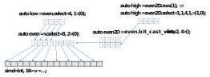

# Explicit SIMD Programming Extension for DPC++

## Introduction

The main motivation for introducing the Explicit SIMD Programming (ESP) DPC++
extension is enabling low-level efficient programming for Intel graphics
architectures. More specifically, Explicit SIMD provides the following
additional features:
- Manual vectorization of device code using the `simd` class mapped to Intel GPU's
  general register file. This allows to write efficient code not relying on
  further widening by the compiler, as with traditional SPMD programming.
- Low-level APIs efficiently mapped to Intel GPU architecture, such as block reads.

## Explicit SIMD execution model

Explicit SIMD execution model is basically an equivalent of the base SYCL
execution model with subgroup size restricted to 1 and few other restrictions.
Which means each subgroup maps to a single hardware thread. All standard SYCL
APIs continue to work, including `sycl::intel::sub_group` ones, which become
either a no-op or trivial. E.g. a barrier becomes just a memory fence for a
compiler, collectives just return the value in the single work-item. Another
consequence of the unit subgroup size is guaranteed independent forward
progress between work-items on many Intel GPU architecture generations.

## Explicit SIMD extension APIs

Explicit SIMD APIs can be used only in code to be executed on Intel graphics
architecture devices and the host device for now. Attempt to run such code on
other devices will result in error. 

All the ESIMD APIs are defined in the `sycl::ext::intel::experimental::esimd`
namespace.

Kernels and `SYCL_EXTERNAL` functions using ESP must be explicitly marked with
the `[[intel::sycl_explicit_simd]]` attribute. Subgroup size query within such
functions will always return `1`.

*Functor kernel*
```cpp
#include <CL/sycl.hpp>
#include <sycl/ext/intel/experimental/esimd.hpp>

using AccTy = sycl::accessor<int, 1, sycl::access::mode::read_write,
  sycl::target::device>;
class KernelID {
public:
  KernelID(int X, AccTy &Acc) : X(X), Acc(Acc) {}

  [[intel::sycl_explicit_simd]] void operator()() { Acc[0] += X; }

private:
  int X;
  AccTy Acc;
};
```

*Lambda kernel and function*
```cpp
#include <CL/sycl.hpp>
#include <sycl/ext/intel/experimental/esimd.hpp>

#include <iostream>

using namespace sycl::ext::intel::experimental::esimd;
using namespace sycl::ext::intel::experimental;
using namespace sycl;
using AccTy = accessor<float, 1, access::mode::read_write, target::device>;

void sycl_device_f(AccTy Acc, simd<float, 8> X) {
  esimd::block_store(Acc, 0, X);
}

int main(void) {
  sycl::queue Q;
  auto Dev = Q.get_device();
  std::cout << "Running on " << Dev.get_info<info::device::name>() << "\n";
  constexpr int Size = 8 * sizeof(float);
  sycl::buffer<float> Buf1(Size);
  sycl::buffer<float> Buf2(Size);

  Q.submit([&](sycl::handler &Cgh) {
    auto Acc1 = Buf1.get_access<sycl::access::mode::read>(Cgh);
    auto Acc2 = Buf2.get_access<sycl::access::mode::read_write>(Cgh);

    Cgh.single_task<class KernelID>([=]() [[intel::sycl_explicit_simd]] {
      simd<float, 8> Val = esimd::block_load<float, 8>(Acc1, 0);
      sycl_device_f(Acc2, Val);
    });
  });
}
```

## Implementation restrictions

Current ESP implementation does not support using certain standard SYCL features
inside explicit SIMD kernels and functions. Most of them will be eventually
dropped. What's not supported today:
- Explicit SIMD kernels can co-exist with regular SYCL kernels in the same
  translation unit and in the same program. However, interoperability between
  them is not yet supported, e.g. currently it's not allowed to invoke an ESIMD
  function from a regular SYCL kernel and vice-versa.
- Local accessors. Local memory is allocated and accessed via explicit
device-side API
- 2D and 3D accessors
- Constant accessors
- `sycl::accessor::get_pointer()`. All memory accesses through an accessor are
done via explicit APIs; e.g. `sycl::ext::intel::experimental::esimd::block_store(acc, offset)`
- Accessors with offsets and/or access range specified
- `sycl::sampler` and `sycl::stream` classes


## Core Explicit SIMD programming APIs

The DPC++ Explicit SIMD library defines the following classes to enhance the
expressiveness for explicit SIMD data-parallel programming while enabling
efficient mapping to SIMD vector operations on Intel graphics architectures.

### SIMD vector class

The `simd` class is a vector templated on some element type.
The element type must either be a vectorizable type. or the `sycl::half` type.
The set of vectorizable types is the
set of fundamental SYCL arithmetic types excluding `bool`. The length of the
vector is the second template parameter.
See the complete [API reference](https://intel.github.io/llvm-docs/doxygen/classcl_1_1sycl_1_1ext_1_1intel_1_1experimental_1_1esimd_1_1simd.html) for the `simd` class for more details.

ESIMD compiler back-end does the best it can to map each `simd` class object to a
contiguous block of registers in the general register file (GRF).

Every specialization of `simd` class shall be a complete type. The term
"simd type" refers to all supported specialization of the `simd` class template.
To access the i-th individual data element in a simd vector, Explicit SIMD supports the
standard subscript operator ```[]```, which can be used for both reading and writing
a specific element.

For simd type object, Explicit SIMD supports the following simd vector operations:
- Unary operators: `-`, `+`, `~` (bitwise negation), `!` (logical negation) `++`
  (*pre-/post-increment*), `--` (*pre-/post-decrement*)
- Binary operators: `+`, `-`, `*`, `/`, `%`, `&`, `|`, `^`, `<<`, `>>`, `||`, `&&`
- Compound assignments: `+=`, `-=`, `*=`, `/=`, `&=`, `|=`, `^=`, `<<=`, `>>=`
- Comparison operators: `>`, `>=`, `<`, `<=`, `==`, `!=`

_Note: some of the operations are not available for certain element types_

These are all element-wise operations, which apply a specified operation to the
elements of one or two simd objects and follow the standard C++ rules for
type promotion to define result vector element type.

To reference a subset of the elements in a simd vector object, Explicit SIMD provides
```select``` function, which returns a `simd_view` object (*described below*)
representing the selected sub-vector starting from certain element. The number of
selected elements is specified by the template parameter **Size**, the distance
between two adjacent elements is specified by the template parameter **Stride** and
the offset of the first selected element is the function parameter.

```cpp
  simd<int, 8> a;
  simd<int, 4> b;
  // ...
  b = a.select<4, 2>(1);  // size=4, stride=2, offset=1 (elements a(1),
                          // a(3), a(5) and a(7) are copied to b)
```

<p align="center">

</p>

```cpp
a.select<4, 2>(0) = b;  // selected elements of a are replaced
                        // with elements of b (all elements of b are
                        // copied to elements a(0), a(2), a(4), a(6))
```

<p align="center">

</p>


Intel GPU ISA provides powerful register region addressing modes to facilitate cross-lane
SIMD vector operation. To exploit this feature Explicit SIMD provides a family of ```replicate*```
functions to allow programmer to implement any native Intel GPU ISA region in the following forms:
- ```replicate<REP>()```: replicate a simd vector object **REP** times and return a new simd
vector of **REP** * Width, where Width specifies the original vector size.
- ```replicate_w<REP, W>(uint16_t i)```: replicate **W** consecutive elements starting at the
i-th element from the simd vector object **REP** times, and return a new simd vector of **REP** * **W** length.
- ```replicate_vs_w<REP, VS, W>(uint16_t i)```: replicate **REP** blocks of **W** consecutive
elements starting at the i-th from the simd vector object with each block strided by **VS**
elements, and return a new vector of **REP** * **W** length. Selected blocks of **W**
elements will overlap if **VS** < **W**.
- ```replicate_vs_w_hs<REP, VS, W, HS>(uint16_t i=0 )```: replicate **REP** blocks of **W** sequential
elements with a stride of **HS** starting at the i-th element from the simd vector object with
each block strided by **VS** elements, and return a new vector of **REP** * **W** length.
Selected blocks of **W** elements will overlap if **VS** < **W**.

To avoid explicit type cast and the resulting move instructions for large vectors, Explicit SIMD allows
programmer to reinterpret the fundamental data element type of a simd vector object and change
its shape to 1D or 2D object through the ```bit_cast_view``` function:
- ```bit_cast_view<EltTy>( )```: returns a view into the calling simd object which reinterprets
the element type according to the **EltTy** template parameter, and the number of elements in the view
is also re-calculated so that total byte size of all view's elements equals to the size of the
original object.
- ```bit_cast_view<EltTy, Height, Width>( )```: returns a reference to the calling simd object interpreted
as a new 2D simd_view object with the shape determined by the template parameters **Height** and**Width**.
The size of the new 2D block must be equal to the size of the original object.

```cpp
simd<int, 16> v1;
// ...
auto v2 = v1.bit_cast_view<short>();
// v2 is a reference to the location of v1
// interpreted as a vector of 32 shorts.
// ...
auto m1 = v1.bit_cast_view<int, 4, 4>();
// m1 is a reference to the location of v1
// interpreted as a matrix 4x4 of ints.
// ...
auto m2 = v1.bit_cast_view<char, 4, 16>();
// m2 is a reference to the location of v1
// interpreted as a matrix 4x16 of chars.
```

To model a predicated move into a simd object, Explicit SIMD provides a family
of `merge` functions:
- ```merge(value_type Val, simd_mask Mask)```: this merge operation takes
  one source operand **Val** and a mask **Mask** of the same length. For
  each non-zero mask element, it assigns the corrsponding input vector's element
  to the corresponding element of the receiver object.

```cpp
  simd<int, 4>   m, src;
  simd<unsigned short, 4> mask;
  // ...
  m.merge(src, mask);
  // m           src         mask      --->  m
  // 2 2 2 2     4 4 4 4     1 1 0 1         4 4 2 4
```

- ```merge(value_type Val1, value_type Val2, simd_mask Mask)```: this merge
operation takes two source operands **Val1** and **Val2** as well as a simd mask.
For element of the **Mask**, depending on whether it is zero or not, it assigns
the corresponding element of either **Val1** (if mask's element is non-zero) or
**Val2** (if the mask's element is zero) to the corresponding element of the
receiver simd object.

```cpp
  simd<int,4>   m, src1, src2;
  simd<unsigned short, 4> mask;
  // ...
  m.merge(src1, src2, mask);
  // m           src1        src2         mask        --->  m
  // 2 2 2 2     4 4 4 4     3 3 3 3      1 1 0 1           4 4 3 4
```
### `simd_view` class

The `simd_view` represents a "window" into existing simd object,
through which a part of the original object can be read or modified. This is a
syntactic convenience feature to reduce verbosity when accessing sub-regions of
simd objects. **RegionTy** describes the window shape and can be 1D or 2D,
**BaseTy** is the original simd object type, which can be the ```simd_view```
itself.

```simd_view``` allows to model hierarchical "views" of the parent ```simd```
object's parts, read/modify its elements through the views. Views can be of
different shapes and dimensions as illustrated below (`auto` resolves to a
`simd_view` instantiation):

<p align="center">

</p>

`simd_view` class supports all the element-wise operations and
other utility functions defined for `simd` class. It also
provides region accessors and more generic operations tailored for 2D regions,
such as row/column operators and 2D select/replicate/bit_cast_view/merge operations.
A 2D simd_view can be used to conveniently model an in-register tile of a matrix.

```cpp
  simd<float, 32> v1;
  auto m1 = v1.bit_cast_view<float, 4, 8>();
  simd<float, 4> v2;
  auto m2 = v2.bit_cast_view<float, 2, 2>();

  // ...
  m2 = m1.select<2, 2, 2, 4>(1, 2);  // v_size = 2, v_stride = 2,
                                     // h_size = 2, h_stride = 4,
                                     // v_offset = 1, h_offset = 2.
```
<p align="center">

</p>

```cpp
  m1.select<4, 1, 4, 2>(0, 0) = 0.0f; // selected elements of m1
                                      // are replaced with 0.0f
```

<p align="center">

</p>

### Reduction functions

Explicit SIMD provides the reduction functions below for simd objects.
Compiler will produce optimal code sequence on the target device to apply the
specified operation to all scalar elements in the input simd vector. Note that
the order of element-wise operations is not guaranteed and the correctness of
result should not depend on a particular computation order. The following
reduction operations are supported:
- add
- multiply
- maximum
- minimum

See more details on the API documentation [page TODO](https://intel.github.io/llvm-docs/doxygen).

### Memory access APIs

Explicit SIMD memory access interface is quite different from the standard SYCL
memory access interface. It supports main SYCL's device memory representations:
- USM pointers
- 1D global accessors
- 2D image accessors

but does not `support sycl::accessor` APIs other than constructors. E.g.
`accessor::get_pointer()`, `accessor::operator []` are not supported and must
not be used within ESIMD code. Instead, ESIMD
provides special APIs to access memory through these memory objects.

C/C++ dereference of an USM pointer is guaranteed to work for primitive types
only, but not for `simd` types. The following code below will compile and might
work, but is an undefined behavior:
```cpp
  T *A = sycl::malloc_shared<T>(N, Q);
  T *B = sycl::malloc_shared<T>(N, Q);
  ...
  *reinterpret_cast<simd<T, N>*>(B) = *reinterpret_cast<simd<T, N>*>(A);
```
instead, the the proper way of reading/writing simd objects (when alignment is
unknown) is:
```cpp
  simd<T, N> Val(B);
  Val.copy_to(A);
```

Some of these restrictions are not enforced by the
compiler and violating them will lead to undefined behavior.

#### APIs overview

A variety of ESIMD-specific APIs are provided to access memory through the memory
objects described above. The minimal access granularity is usually a `simd`
object, except in special scalar access cases. Note that `simd<T,1>` are valid
simd objects and can be used in most memory access APIs. They fall into few main
categories:
- Block access - `block_load`, `block_store`. This is an efficient way to
access memory which can be used when data is contiguous in memory and is properly
aligned.
- Scattered access - `gather`, `scatter`. These APIs allow to specify individual
memory locations for vector elements and do not impose any extra restrictions on
alignment (except the standard C++ requirement for element-size alignment). Memory
location are calculated as common base plus individual offset per element. Offsets
are passed as a single vector argument. Access to individual elements can be
enabled or disabled by the additional mask argument.
- Pixel scattered access - `gather_rgba`, `scatter_rgba`. These are similar to
usual `gather` and `scatter`, but allow to access the most memory in one call -
4 elements (as if they were RGBA channels of a pixel) per each offset in the
offsets vector. Per-offset masking is also support, plus per-channel compile-time
constant mask can be specified to further refine masking.
- Media block access - `media_block_load` , `media_block_store`. These are the
most efficient memory accesses on Intel GPU architectures up to Gen9 generation.
The go through extra layer of faster cache.
- Scalar access - `scalar_load`, `scalar_store`. These can be used to access
load/store scalar values through accessors. In case of USM pointers, usual
C++ dereference operator can be used. SLM versions are also available.


#### Shared local memory access

The above APIs are available for the global memory as well as shared local
memory (SLM). SLM is a faster memory shared between work items in a workgroup -
basically it is ESIMD variant of the SYCL `local` memory. For SLM variants,
'slm_' prefix is added to API names. Before SLM memory access functions can be
used in a ESIMD kernel, SLM chunk must be requested with the
`simd_init(uint32_t size)` function, where `size` must be a compile-time
constant.

#### Atomics

ESIMD also supports a variety of atomic memory update operations. They are all
represented by the `atomic_update` (to access global memory) and
`slm_atomic_update` (to access SLM) functions, templated by the operation ID.
One atomic update call updates entire vector in memory (if all elements are
unmasked), but the atomicity is ensured only on per-element basis. The table
below shows which operations are supported for which element type.

|           | uint16|uint32|uint64|int16|int32|int64|half|float|
|-----------|:-----:|:----:|:----:|:---:|:---:|:---:|:--:|:---:|
|increment  |   +   |  +   |  +   |     |     |     |    |     |
|decrement  |   +   |  +   |  +   |     |     |     |    |     |
|addition   |   +   |  +   |  +   |     |     |     |    |     |
|subtraction|   +   |  +   |  +   |     |     |     |    |     |
|minimum    |   +   |  +   |  +   |  +  |  +  |  +  | +  |  +  |
|maximum    |   +   |  +   |  +   |  +  |  +  |  +  | +  |  +  |
|swap       |   +   |  +   |  +   |     |     |     |    |     |
|bit and    |   +   |  +   |  +   |     |     |     |    |     |
|bit or     |   +   |  +   |  +   |     |     |     |    |     |
|bit xor    |   +   |  +   |  +   |     |     |     |    |     |
|cmpxchg    |   +   |  +   |  +   |     |     |     | +  |  +  |

Many memory access APIs accept offsets as arguments, which are used to determine
actual memory location for the access. Offsets are always expressed in bytes
rather than element units.

See more details in the API documentation
[page TODO](https://intel.github.io/llvm-docs/doxygen).

### Math operations

#### Extended math
ESIMD supports what is known as "extended math" set of math operations,
providing correponding API in the `sycl::ext::intel::experimental::esimd`
namespace. Those operations are mapped to efficient hardware instructions and
thus have accuracy provided by hardware, which often does not match one required
by the SYCL specification. The table below shows the supported extended math
operations and element data types they can be invoked with.

|         |half|float|double|Definition
|---------|:--:|:---:|:----:|-------
|inv      | +  |  +  |      | 1/x
|log2     | +  |  +  |      | base 2 logarithm
|exp2     | +  |  +  |      | base 2 exponent
|sqrt     | +  |  +  |      |
|sqrt_ieee|    |  +  |   +  | IEEE754-compatible version of square root
|rsqrt    | +  |  +  |      | 1/sqrt(x)
|sin      | +  |  +  |      |
|cos      | +  |  +  |      |
|pow      | +  |  +  |      |
|div_ieee |    |  +  |   +  | IEEE754-compatible version of division

**TODO** specify accuracy guarantees.

For some of the extended math functions versions guaranteeing SYCL accuracy are
provided, they all reside in the `sycl` namespace: `sin`, `cos`, `exp`, `log`.

#### Other standard math

Other math functions, such as inverse trigonometric functions, base `e`
logarithm and exponent are software emulated.
The following usual math functions are supported for all element types:
- Absolute value - `abs`.
- Maximum value - `max`.
- Minimum value -`min`.
- Rounding down, up, to even, to zero - `rndd` (aka `floor`), `rndu`
  (aka `ceil`), `rnde`, `rndz` (aka `trunc`).


#### Other non-standard math functions

ESIMD supports the following non-standard math functions implemented in hardware:
- Dot product (various flavors) - `dp2`, `dp3`, `dp4`, `dph`, `dp4a`
  (with accumulator).
- Linear equation - `line`. Solves a component-wise line equation
  `v = p * u + q` (where `u`, `v` are vectors and `p`, `q` are scalars)
- Fraction - `frc`,  extracts the fractional parts of the input vector elements.
- Count leading zeroes - `lzd`.
- Linear interpolation - `lrp`. Basically computes `src1 * src0 + src2 * (1.0f - src0)`
- Plane equation - `plane`. Solves a component-wise plane equation 
  `w = p*u + q*v + r` where `u`, `v`, `w` are vectors and `p`, `q`, `r` are scalars.


See more details in the API documentation
[page TODO](https://intel.github.io/llvm-docs/doxygen).


### Other APIs

There are other useful miscellaneous APIs provided by ESIMD.
- Saturation - `saturate`. Converts between vectors with different element data
  types with saturation.
- Conversion - `convert`. Converts between vectors with different element data
  types.
- Reverse bits - `bf_reverse`. 
- Insert bit field - `bf_insert`.
- Extract bit field - `bf_extract`.
- Convert mask to integer and back - `pack_mask`, `unpack_mask`.
- Ballot - `ballot`. Returns a bitfield where 1 marks corresponding non-zero
  element in the input vector.
- Count bits - `cbit`.
- Find least significant set bit - `fbl`.
- Find most significant set bit - `fbh`.

See more details in the API documentation
[page TODO](https://intel.github.io/llvm-docs/doxygen).

<br>

### Private Global Variables.

Explicit SIMD extension supports "private global" variables - file scope
variables in private address space (similar to thread-local variables on host).
These variables have 1 copy per work-item (which maps to a single SIMD thread in
ESP) and are visible to all functions in the translation unit. Conceptually they
map to SPIR-V variable with private storage class. Private globals can be bound
to a specific byte offset within the GRF. To mark a file scope variable as
private global, the `ESIMD_PRIVATE` attribute is used,
`ESIMD_REGISTER(n)` is used to bind it the register file, where `n` is a byte
offset within the register file.

```cpp
ESIMD_PRIVATE ESIMD_REGISTER(32) simd<int, 16> vc;
```
<br>

### `__regcall` Calling convention.

ESIMD supports `__regcall` calling convention (CC) in addition to the default
SPIR CC. This makes compiler try generate more efficient calls where arguments
of aggregate types (classes, structs, unions) are passed and values returned via
registers rather than memory. This matters most for external functions linked on
binary level, such as functions called via `invoke_simd`. Arguments and return
values ("ARV") are still passed or returned ("communicated") via a pointer if
their type is either of the following:
- a class or struct with deleted copy constructor
- an empty class or struct
- a class or struct ending with a flexible array member. For example:
`class A { int x[]; }`

ARVs of all other aggregate types are communicated by value or "per-field". Some
fields can be replaced with 1 or 2 integer elements with total size being equal
or exceeding the total size of fields. The rules for communicating ARVs of these
types are part of the SPIR-V level function call ABI, and are described below.
This part of the ABI is defined in terms of LLVM IR types - it basically
tells how a specific source aggregate type is represented in resulting LLVM IR
when it (the type) is part of a signature of a function with linkage defined.

Compiler uses aggregate type "unwrapping process" for communicating ARVs.
Unwarapping a structure with a single field results in the unwrapped type of
that field, so unwrapping is a recursive process. Unwrapped primitive type is
the primitive type itself. Structures with pointer fields are not unwrapped.
For example, unwrapping `Y` defined as
```cpp
struct X { int x; };
struct Y { X x; };
```
results in `i32`. Unwrapping `C4` defind as
```cpp
struct A4 { char x; };
struct B4 { A4 a; };
struct C4 {
  B4 b;
  int *ptr;
};
```
results in { `%struct.B4`, `i32 addrspace(4)*` } pair of types. Thus,
unwraping can result in a set of a structure, primitive or pointer types -
the "unwrapped type set".

- If the unwrapped type set has only primitive types, then compiler will "merge"
  the resulting types if their total size is less or equal to 8 bytes. The total
  size is calculated as `sizeof(<top aggregate type>)`, and structure field
  alignment rules can make it greater then the simple sum of `sizeof` of all
  the types resulted from unwrapping. [Total size] to [merged type]
  correspondence is as follows:
    * 1-2 bytes - short
    * 3-4 bytes - int
    * 5-8 bytes - array of 2 ints
  Floating point types are not merged. Structure field alignment rules can
  increase the calculated size compared to simple sum of `sizeof` of all the
  types. If the total size exceeds 8, then:
    * a source parameter of this type is broken down into multiple parameters
      with types resulted from unwrapping
    * a source return value of this type keeps it (the type)
- If the unwrapped type set has non-primitive types, then merging does not
  happen, in this case unwrapping for the return value does not happen as well.

More examples of the unwrap/merge process:

- For `C5` in
    ```cpp
    struct A5a { char x; char y; };
    struct A5b { char x; char y; };
    struct B5 { A5a a; A5b b; };
    struct C5 {
      B5 b1;
      B5 b2;
    };
    ```
    The result is `[2 x i32]`. It is not `i32` because of padding rules, as
    sizeof(C5) is 8 for the SPIRV target.
- For `C6`
    ```cpp
    struct B6 { int *a; int b; };
    struct C6 {
      B6 b;
      char x;
      char y;
    
      C6 foo() { return *this; }
    };
    ```
    the result depends whether this is a type of an argument or a return value.
    * Argument: { `%struct.B6`, `i8`, `i8` } type set
    * Return value:  `%struct.C6` type. Where the struct LLVM types are defined
      as:
      ```
      %struct.C6 = type { %struct.B6, i8, i8 }
      %struct.B6 = type { i32 addrspace(4)*, i32 }
      ``` 

Note that `__regcall` does not guarantee passing through registers in the final
generated code. For example, compiler will use a threshold for argument or
return value size, which is implementation-defined. Values larger than the
threshold will still be passed by pointer (memory).

Example declaration of a `__regcall` function:
```cpp
simd<float, 8> __regcall SCALE(simd<float, 8> v);
```
The parameter and the return type in the ABI form will be `<8 x float>`.
<br>

## Examples
### Vector addition (USM)
```cpp
#include <CL/sycl.hpp>
#include <sycl/ext/intel/experimental/esimd.hpp>

#include <iostream>

using namespace sycl;
using namespace sycl::ext::intel::experimental::esimd;

inline auto createExceptionHandler() {
  return [](exception_list l) {
    for (auto ep : l) {
      try {
        std::rethrow_exception(ep);
      } catch (sycl::exception &e0) {
        std::cout << "sycl::exception: " << e0.what() << std::endl;
      } catch (std::exception &e) {
        std::cout << "std::exception: " << e.what() << std::endl;
      } catch (...) {
        std::cout << "generic exception\n";
      }
    }
  };
}

struct usm_deleter {
  queue q;

  void operator()(void *ptr) {
    if (ptr) {
      sycl::free(ptr, q);
    }
  }
};

int main(void) {
  constexpr unsigned Size = 128;
  constexpr unsigned VL = 32;
  int err_cnt = 0;

  try {
    queue q(gpu_selector{}, createExceptionHandler());
    auto dev = q.get_device();
    std::cout << "Running on " << dev.get_info<info::device::name>() << "\n";

    float *A = malloc_shared<float>(Size, q);
    std::unique_ptr<float, usm_deleter> guardA(A, usm_deleter{ q });
    float *B = malloc_shared<float>(Size, q);
    std::unique_ptr<float, usm_deleter> guardB(B, usm_deleter{ q });
    float *C = malloc_shared<float>(Size, q);
    std::unique_ptr<float, usm_deleter> guardC(C, usm_deleter{ q });

    for (unsigned i = 0; i != Size; i++) {
      A[i] = B[i] = i;
    }
    q.submit([&](handler &cgh) {
      cgh.parallel_for<class Test>(
        Size / VL, [=](id<1> i)[[intel::sycl_explicit_simd]]{
        auto offset = i * VL;
        // pointer arithmetic, so offset is in elements:
        simd<float, VL> va(A + offset);
        simd<float, VL> vb(B + offset);
        simd<float, VL> vc = va + vb;
        vc.copy_to(C + offset);
      });
    }).wait_and_throw();

    for (unsigned i = 0; i < Size; ++i) {
      if (A[i] + B[i] != C[i]) {
        if (++err_cnt < 10) {
          std::cout << "failed at index " << i << ": " << C[i] << " != " << A[i]
            << " + " << B[i] << "\n";
        }
      }
    }
  }
  catch (sycl::exception &e) {
    std::cout << "SYCL exception caught: " << e.what() << "\n";
    return 1;
  }
  if (err_cnt > 0) {
    std::cout << "  pass rate: "
              << ((float)(Size - err_cnt) / (float)Size) * 100.0f << "% ("
              << (Size - err_cnt) << "/" << Size << ")\n";
  }
  std::cout << (err_cnt > 0 ? "FAILED\n" : "Passed\n");
  return err_cnt > 0 ? 1 : 0;
}
```
more examples can be found in the
[ESIMD test suite](https://github.com/intel/llvm-test-suite/tree/intel/SYCL/ESIMD) on github.
