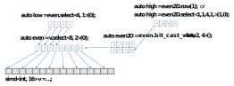

# Explicit SIMD Programming Extension for DPC++

## Table of content
- [Introduction](#introduction)
- [Explicit SIMD execution model](#explicit-simd-execution-model)
- [Explicit SIMD extension APIs](#explicit-simd-extension-apis)
- [Core Explicit SIMD programming APIs](#core-explicit-simd-programming-apis)
  - [SIMD vector class](#simd-vector-class)
  - [simd_view class](#simd_view-class)
  - [Reduction functions](#reduction-functions)
  - [Memory access APIs](#memory-access-apis)
    - [APIs overview](#apis-overview)
    - [SLM - Shared local memory access](#shared-local-memory-access)
      - [Static allocation of SLM using slm_init function](#static-allocation-of-slm-using-slm_init-function)
      - [Semi-dynamic allocation of SLM](#semi-dynamic-allocation-of-slm)
      - [Local accessors](#local-accessors)
    - [Atomics](#atomics)
  - [Math operations](#math-operations)
    - [Extended math](#extended-math)
    - [Other standard math](#other-standard-math)
    - [Other non-standard math functions](#other-non-standard-math-functions)
  - [Dot Product Accumulate Systolic - `DPAS` API](#dot-product-accumulate-systolic---dpas-api)
    - [DPAS API definition](#dpas-api-definition)
    - [Example of DPAS usage](#example-of-dpas-usage)
    - [Possible type combinations for `xmx::dpas()`](#possible-type-combinations-for-xmxdpas)
    - [Input and output matrices representation as simd vectors](#input-and-output-matrices-representation-as-simd-vectors)
    - [Horizontal packing](#horizontal-packing-for-a-c-and-result)
    - [Vertical packing](#vertical-packing)
  - [Other APIs](#other-apis)
  - [Private Global Variables](#private-global-variables)
  - [__regcall Calling convention](#__regcall-calling-convention)
  - [Inline assembly](#inline-assembly)
  - [Device aspect](#device-aspect)
- [Device queries and conditional dispatching of the code](#device-queries-and-conditional-dispatching-of-the-code)
- [Implementation restrictions](#implementation-restrictions)
  - [Features not supported with the ESIMD extension](#features-not-supported-with-the-esimd-extension)
  - [Unsupported standard SYCL APIs](#unsupported-standard-sycl-apis)
  - [Other restrictions](#other-restrictions)

## Other content:
* [ESIMD API/doxygen reference](https://intel.github.io/llvm-docs/doxygen/group__sycl__esimd.html)
* [Examples](./examples/README.md)
* [ESIMD LIT tests - working code examples](https://github.com/intel/llvm/blob/sycl/sycl/test-e2e/ESIMD/)

---

## Introduction

The main motivation for introducing the "Explicit SIMD" SYCL extension
(or simply "ESIMD") is enabling efficient low-level programming for Intel graphics
architectures. It provides APIs close to the Intel GPU ISA
and allows writing explicitly vectorized device code.

Explicit SIMD provides the following key features complementary to SYCL:
- Manual vectorization of device code using the `simd` class mapped to Intel GPU's
  general register file. This allows to write efficient code not relying on
  further widening by the compiler, as with traditional SPMD programming.
- Low-level APIs efficiently mapped to the Intel GPU architecture, such as block loads/stores/gathers/scatters, explicit cache hints, GPU inline assembly, etc.
- Regular SYCL and ESIMD kernels can co-exist in the same translation unit and in
the same application. For more details, see [SYCL and ESIMD interoperability](./README.md#sycl-and-esimd-interoperability)

Explicit SIMD has some [restrictions](#implementation-restrictions) as well.

**IMPORTANT NOTE: _Some parts of this extension are under active development. The APIs in the
`sycl::ext::intel::experimental::esimd` namespace are subject to change or removal._**

---

## Explicit SIMD execution model

Explicit SIMD execution model is basically an equivalent of the base SYCL
execution model with subgroup size restricted to 1 and few other restrictions.
Which means each subgroup maps to a single hardware thread. All standard SYCL
APIs continue to work, including `sycl::intel::sub_group` ones, which become
either a no-op or trivial. E.g. a barrier becomes just a memory fence for a
compiler, collectives just return the value in the single work-item. Another
consequence of the unit subgroup size is guaranteed independent forward
progress between work-items on many Intel GPU architecture generations.

Explicit SIMD APIs must be executed on Intel graphics architecture devices.
Attempting to run such code on other devices will result in an error.

Also, most of ESIMD APIs require the corresponding HW support in the target GPU.
It is user's responsibility to manage corresponding compile- and/or runtime-checks to avoid
undefined behavior caused by using ESIMD APIs on GPUs that don't support it.
See [this section](#device-queries-and-conditional-dispatching-of-the-code) for device query/dispatch machanisms usable to avoid undefined behavior.

## Explicit SIMD extension APIs

All the ESIMD APIs are defined in the `sycl::ext::intel::esimd`
namespace.

Kernels and `SYCL_EXTERNAL` functions using ESIMD must be explicitly marked with
the `[[intel::sycl_explicit_simd]]` attribute. Subgroup size query within such
functions will always return `1`.

*Functor kernel*
```cpp
#include <sycl/sycl.hpp>
#include <sycl/ext/intel/esimd.hpp>

using AccTy = sycl::accessor<int, 1, sycl::access::mode::read_write,
  sycl::target::device>;
class KernelID {
public:
  KernelID(int X, AccTy &Acc) : X(X), Acc(Acc) {}

  [[intel::sycl_explicit_simd]] void operator()() { Acc[0] += X; }

private:
  int X;
  AccTy Acc;
};
```

*Lambda kernel and function*
```cpp
#include <sycl/sycl.hpp>
#include <sycl/ext/intel/esimd.hpp>

#include <iostream>

using namespace sycl::ext::intel::esimd;
using namespace sycl::ext::intel;
using namespace sycl;
using AccTy = accessor<float, 1, access::mode::read_write, target::device>;

void sycl_device_f(AccTy Acc, simd<float, 8> X) {
  esimd::block_store(Acc, 0, X);
}

int main(void) {
  sycl::queue Q;
  auto Dev = Q.get_device();
  std::cout << "Running on " << Dev.get_info<info::device::name>() << "\n";
  constexpr int Size = 8 * sizeof(float);
  sycl::buffer<float> Buf1(Size);
  sycl::buffer<float> Buf2(Size);

  Q.submit([&](sycl::handler &Cgh) {
    auto Acc1 = Buf1.get_access<sycl::access::mode::read>(Cgh);
    auto Acc2 = Buf2.get_access<sycl::access::mode::read_write>(Cgh);

    Cgh.single_task([=]() [[intel::sycl_explicit_simd]] {
      simd<float, 8> Val = esimd::block_load<float, 8>(Acc1, 0);
      sycl_device_f(Acc2, Val);
    });
  }).wait();
}
```

## Core Explicit SIMD programming APIs

The DPC++ Explicit SIMD library defines the following classes to enhance the
expressiveness for explicit SIMD data-parallel programming while enabling
efficient mapping to SIMD vector operations on Intel graphics architectures.

### SIMD vector class

The `simd` class is a vector templated on some element type.
The element type must either be a vectorizable type or the `sycl::half` type.
The set of vectorizable types is the
set of fundamental SYCL arithmetic types excluding `bool`. The length of the
vector is the second template parameter.
See the complete [API reference](https://intel.github.io/llvm-docs/doxygen/classcl_1_1____ESIMD__NS_1_1simd.html#details) for the `simd` class for more details.

ESIMD compiler back-end does the best it can to map each `simd` class object to a
contiguous block of registers in the general register file (GRF).

Every specialization of `simd` class shall be a complete type. The term
"simd type" refers to all supported specialization of the `simd` class template.
To access the i-th individual data element in a simd vector, Explicit SIMD supports the
standard subscript operator ```[]```, which can be used for both reading and writing
a specific element.

For simd type object, Explicit SIMD supports the following simd vector operations:
- Unary operators: `-`, `+`, `~` (bitwise negation), `!` (logical negation) `++`
  (*pre-/post-increment*), `--` (*pre-/post-decrement*)
- Binary operators: `+`, `-`, `*`, `/`, `%`, `&`, `|`, `^`, `<<`, `>>`, `||`, `&&`
- Compound assignments: `+=`, `-=`, `*=`, `/=`, `&=`, `|=`, `^=`, `<<=`, `>>=`
- Comparison operators: `>`, `>=`, `<`, `<=`, `==`, `!=`

_Note: some of the operations are not available for certain element types_

These are all element-wise operations, which apply a specified operation to the
elements of one or two simd objects and follow the standard C++ rules for
type promotion to define result vector element type.

To reference a subset of the elements in a simd vector object, Explicit SIMD provides
```select``` function, which returns a `simd_view` object (*described below*)
representing the selected sub-vector starting from certain element. The number of
selected elements is specified by the template parameter **Size**, the distance
between two adjacent elements is specified by the template parameter **Stride** and
the offset of the first selected element is the function parameter.

```cpp
  simd<int, 8> a;
  simd<int, 4> b;
  // ...
  b = a.select<4, 2>(1);  // size=4, stride=2, offset=1 (elements a(1),
                          // a(3), a(5) and a(7) are copied to b)
```

<p align="center">

</p>

```cpp
a.select<4, 2>(0) = b;  // selected elements of a are replaced
                        // with elements of b (all elements of b are
                        // copied to elements a(0), a(2), a(4), a(6))
```

<p align="center">

</p>


Intel GPU ISA provides powerful register region addressing modes to facilitate cross-lane
SIMD vector operation. To exploit this feature Explicit SIMD provides a family of ```replicate*```
functions to allow programmer to implement any native Intel GPU ISA region in the following forms:
- ```replicate<REP>()```: replicate a simd vector object **REP** times and return a new simd
vector of **REP** * Width, where Width specifies the original vector size.
- ```replicate_w<REP, W>(uint16_t i)```: replicate **W** consecutive elements starting at the
i-th element from the simd vector object **REP** times, and return a new simd vector of **REP** * **W** length.
- ```replicate_vs_w<REP, VS, W>(uint16_t i)```: replicate **REP** blocks of **W** consecutive
elements starting at the i-th from the simd vector object with each block strided by **VS**
elements, and return a new vector of **REP** * **W** length. Selected blocks of **W**
elements will overlap if **VS** < **W**.
- ```replicate_vs_w_hs<REP, VS, W, HS>(uint16_t i=0 )```: replicate **REP** blocks of **W** sequential
elements with a stride of **HS** starting at the i-th element from the simd vector object with
each block strided by **VS** elements, and return a new vector of **REP** * **W** length.
Selected blocks of **W** elements will overlap if **VS** < **W**.

To avoid explicit type cast and the resulting move instructions for large vectors, Explicit SIMD allows
programmer to reinterpret the fundamental data element type of a simd vector object and change
its shape to 1D or 2D object through the ```bit_cast_view``` function:
- ```bit_cast_view<EltTy>( )```: returns a view into the calling simd object which reinterprets
the element type according to the **EltTy** template parameter, and the number of elements in the view
is also re-calculated so that total byte size of all view's elements equals to the size of the
original object.
- ```bit_cast_view<EltTy, Height, Width>( )```: returns a reference to the calling simd object interpreted
as a new 2D simd_view object with the shape determined by the template parameters **Height** and**Width**.
The size of the new 2D block must be equal to the size of the original object.

```cpp
simd<int, 16> v1;
// ...
auto v2 = v1.bit_cast_view<short>();
// v2 is a reference to the location of v1
// interpreted as a vector of 32 shorts.
// ...
auto m1 = v1.bit_cast_view<int, 4, 4>();
// m1 is a reference to the location of v1
// interpreted as a matrix 4x4 of ints.
// ...
auto m2 = v1.bit_cast_view<char, 4, 16>();
// m2 is a reference to the location of v1
// interpreted as a matrix 4x16 of chars.
```

To model a predicated move into a simd object, Explicit SIMD provides a family
of `merge` functions:
- ```merge(value_type Val, simd_mask Mask)```: this merge operation takes
  one source operand **Val** and a mask **Mask** of the same length. For
  each non-zero mask element, it assigns the corrsponding input vector's element
  to the corresponding element of the receiver object.

```cpp
  simd<int, 4>   m, src;
  simd<unsigned short, 4> mask;
  // ...
  m.merge(src, mask);
  // m           src         mask      --->  m
  // 2 2 2 2     4 4 4 4     1 1 0 1         4 4 2 4
```

- ```merge(value_type Val1, value_type Val2, simd_mask Mask)```: this merge
operation takes two source operands **Val1** and **Val2** as well as a simd mask.
For element of the **Mask**, depending on whether it is zero or not, it assigns
the corresponding element of either **Val1** (if mask's element is non-zero) or
**Val2** (if the mask's element is zero) to the corresponding element of the
receiver simd object.

```cpp
  simd<int,4>   m, src1, src2;
  simd<unsigned short, 4> mask;
  // ...
  m.merge(src1, src2, mask);
  // m           src1        src2         mask        --->  m
  // 2 2 2 2     4 4 4 4     3 3 3 3      1 1 0 1           4 4 3 4
```
### `simd_view` class

The `simd_view` represents a "window" into existing simd object,
through which a part of the original object can be read or modified. This is a
syntactic convenience feature to reduce verbosity when accessing sub-regions of
simd objects. **RegionTy** describes the window shape and can be 1D or 2D,
**BaseTy** is the original simd object type, which can be the ```simd_view```
itself.

```simd_view``` allows to model hierarchical "views" of the parent ```simd```
object's parts, read/modify its elements through the views. Views can be of
different shapes and dimensions as illustrated below (`auto` resolves to a
`simd_view` instantiation):

<p align="center">

</p>

`simd_view` class supports all the element-wise operations and
other utility functions defined for `simd` class. It also
provides region accessors and more generic operations tailored for 2D regions,
such as row/column operators and 2D select/replicate/bit_cast_view/merge operations.
A 2D simd_view can be used to conveniently model an in-register tile of a matrix.

```cpp
  simd<float, 32> v1;
  auto m1 = v1.bit_cast_view<float, 4, 8>();
  simd<float, 4> v2;
  auto m2 = v2.bit_cast_view<float, 2, 2>();

  // ...
  m2 = m1.select<2, 2, 2, 4>(1, 2);  // v_size = 2, v_stride = 2,
                                     // h_size = 2, h_stride = 4,
                                     // v_offset = 1, h_offset = 2.
```
<p align="center">

</p>

```cpp
  m1.select<4, 1, 4, 2>(0, 0) = 0.0f; // selected elements of m1
                                      // are replaced with 0.0f
```

<p align="center">

</p>

### Reduction functions

Explicit SIMD provides the reduction functions below for simd objects.
Compiler will produce optimal code sequence on the target device to apply the
specified operation to all scalar elements in the input simd vector. Note that
the order of element-wise operations is not guaranteed and the correctness of
result should not depend on a particular computation order. The following
reduction operations are supported:
- add
- multiply
- maximum
- minimum

See more details on the API documentation [page TODO](https://intel.github.io/llvm-docs/doxygen).

### Memory access APIs

Explicit SIMD memory access interface is quite different from the standard SYCL
memory access interface. It supports main SYCL device memory representations:
- USM pointers
- SYCL accessors
  - 1D global accessors
  - 1D local accessors
  - 2D image accessors

Only small subset of `sycl::accessor` APIs is supported in ESIMD context:
- accessor::accessor();
- accessor::get_pointer(); // Supported only with the `-fsycl-esimd-force-stateless-mem` switch (turned ON by default).
- accessor::operator[]; // Supported only with the `-fsycl-esimd-force-stateless-mem` switch (turned ON by default).

ESIMD provides special APIs to access memory through accessors. Those APIs
accept an accessor object as a base reference to the addressed memory and
additional offset operand(s) to work with accessed buffer or image.

C/C++ dereference of an USM pointer is guaranteed to work for primitive types
only, but not for `simd` types. The following code below will compile and might
work, but is an undefined behavior:
```cpp
  T *A = sycl::malloc_shared<T>(N, Q);
  T *B = sycl::malloc_shared<T>(N, Q);
  ...
  *reinterpret_cast<simd<T, N>*>(B) = *reinterpret_cast<simd<T, N>*>(A);
```
instead, the the proper way of reading/writing simd objects (when alignment is
unknown) is:
```cpp
  simd<T, N> Val(B);
  Val.copy_to(A);
```

Some of these restrictions are not enforced by the
compiler and violating them will lead to undefined behavior.

#### APIs overview

A variety of ESIMD-specific APIs are provided to access memory through the memory
objects described above. The minimal access granularity is usually a `simd`
object, except in special scalar access cases. Note that `simd<T,1>` are valid
simd objects and can be used in most memory access APIs. They fall into few main
categories:
- Block access - `block_load`, `block_store`. This is an efficient way to
access memory which can be used when data is contiguous in memory and is
properly aligned.
- Scattered access - `gather`, `scatter`. These APIs allow to specify individual
memory locations for vector elements and do not impose any extra restrictions on
alignment (except the standard C++ requirement for element-size alignment). Memory
location are calculated as common base plus individual offset per element. Offsets
are passed as a single vector argument. Access to individual elements can be
enabled or disabled by the additional mask argument.
- Pixel scattered access - `gather_rgba`, `scatter_rgba`. These are similar to
usual `gather` and `scatter`, but allow to access the most memory in one call -
4 elements (as if they were RGBA channels of a pixel) per each offset in the
offsets vector. Per-offset masking is also support, plus per-channel
compile-time constant mask can be specified to further refine masking.
- Media block access - `media_block_load` , `media_block_store`. These are the
most efficient memory accesses on Intel GPU architectures up to Gen9 generation.
They go through extra layer of faster cache.
- Scalar access - `scalar_load`, `scalar_store`. These can be used to access
load/store scalar values through accessors. In case of USM pointers, usual
C++ dereference operator can be used. SLM versions are also available.

See a more detailed list of available memory APIs [here](./sycl_ext_intel_esimd_functions.md).


#### Shared local memory access

The above APIs are available for the global memory as well as shared local
memory (SLM). SLM is allocated in cache memory and thus is much faster.
This memory is shared between work items in a workgroup - basically
it is ESIMD variant of the SYCL `local` memory.

SLM variants of APIs have 'slm_' prefix in their names,
e.g. ext::intel::esimd::slm_block_load() or ext::intel::esimd::slm_gather().

SLM memory must be explicitly allocated before it is read or written.

There are 3 different ways of SLM allocation in ESIMD:
* static allocation using `slm_init<SLMByteSize>()` and `slm_init(SpecializationConstSLMByteSize)`
* semi-dynamic allocation using `slm_allocator<SLMByteSize>` class
* SYCL local accessors

##### Static allocation of SLM using slm_init function.
Static allocation is done with help of one of two `slm_init` functions shown
below. The SLM byte size passed to `slm_init` must be either a compilation time
constant or a specialization constant.

```cpp
// Static allocation of `size` bytes of SLM memory.
// Can be used together with slm_allocator() class for
// semi-dynamic SLM allocation of extra SLM.
template <uint32_t size> void slm_init();

// This function is recommended ONLY when 'size' is a specialization constant.
// It cannot be used together with slm_allocator() class.
void slm_init(uint32_t size);
```
Restrictions:
* There must be only 1 call site of `slm_init` per kernel.
* The call of `slm_init` must be placed in the beginning of the kernel.
If `slm_init` is called in some function 'F' called from kernel, then inlining
of 'F' to the kernel must be forced/guaranteed.
* `slm_init` cannot be used together with `local_accessor` in the same kernel.

##### Semi-dynamic allocation of SLM.
The class `slm_allocator` is designed to be used in basic blocks or functions
where extra SLM is needed locally.
```cpp
template <int SLMAmount> class slm_allocator {
  ...
public:
  // Allocates SLMAmount of SLM.
  slm_allocator() { offset = __esimd_slm_alloc(SLMAmount); }

  // Returns the allocated chunk's offset in bytes.
  int get_offset() const { return offset; }

  // Releases the SLM chunk allocated in the constructor.
  ~slm_allocator() { __esimd_slm_free(offset); }
```

`slm_allocator` can be used together with `slm_init`. The blocks/functions using
`slm_allocator` must be reachable from ESIMD kernel through the call-graph at
compile-time.

Restrictions:
* `slm_allocator` cannot be used together with non-compile-time constant
version of `slm_init` - slm_init(NumBytes);
* `slm_allocator` cannot be used in ESIMD functions called via `invoke_simd()`
or functions not reachable from ESIMD kernel at compilation time.

Example:
```cpp
    // main kernel
    q.parallel_for(Size, [=](id<1> i)[[intel::sycl_explicit_simd]]{
      slm_init<SLMBaseSize>();
      {
        // Use the first SLMBaseSize bytes of SLM here
      }
      foo();
      bar();
      {
        // Continue using the first SLMBaseSize bytes of SLM here.
      }
    }).wait_and_throw();```
    ...


void foo() {
  slm_allocator<SLM_FOO> foo_slm; // allocate extra SLM_FOO bytes of SLM
  unsigned slm_offset = foo_slm.get_offset();
  /* Work with SLM memory: [slm_offset : slm_offset + SLM_FOO - 1] */
}
void bar() {
  slm_allocator<SLM_BAR> bar_slm; // allocate extra SLM_BAR bytes of SLM
  unsigned slm_offset = bar_slm.get_offset();
  /* Work with SLM memory: [slm_offset : slm_offset + SLM_BAR - 1] */
}
```
The actual amount of SLM memory allocated for the kernel above would be:
`SLM_BASE_SIZE + max(SLM_FOO, SLM_BAR)`.


##### Local accessors
Regular SYCL local accessors can be passed from HOST to an ESIMD kernel, be used
in ESIMD kernel and functions called from kernel. It can also be passed from
SYCL context to ESIMD using `invoke_simd()` API. Similar to regular SYCL
kernels, more than 1 local accessor can be passed to an ESIMD kernel.

Please note that currently the local accessor can be passed through
`invoke_simd()` only as a uniform pointer. Passing the local accessor by-value
is not yet supported in the GPU driver.

Restrictions:
* `local_accessor` must NOT be used together with `slm_init` or `slm_allocator`.

Example:
```cpp
    Q.submit([&](handler &CGH) {
       auto LocalAcc = local_accessor<T, 1>(LocalRange * VL, CGH);

       CGH.parallel_for(NDRange, [=](nd_item<1> Item) SYCL_ESIMD_KERNEL {
         uint32_t GID = Item.get_global_id(0);
         uint32_t LID = Item.get_local_id(0);
         uint32_t LocalAccOffset = static_cast<uint32_t>(
             reinterpret_cast<std::uintptr_t>(LocalAcc.get_pointer()));
         if constexpr (TestSubscript) {
           for (int I = 0; I < VL; I++)
             LocalAcc[LID * VL + I] = GID * 100 + I;
         } else {
           simd<int, VL> IntValues(GID * 100, 1);
           simd<T, VL> ValuesToSLM = IntValues;
           slm_block_store(LocalAccOffset + LID * VL * sizeof(T), ValuesToSLM);
         }

         Item.barrier();

         if (LID == 0) {
           for (int LID = 0; LID < LocalRange; LID++) {
             if constexpr (TestSubscript) {
               for (int I = 0; I < VL; I++)
                 Out[(GID + LID) * VL + I] = LocalAcc[LID * VL + I];
             } else {
               simd<T, VL> ValuesFromSLM =
                   slm_block_load<T, VL>(LocalAccOffset + LID * VL * sizeof(T));
               ValuesFromSLM.copy_to(Out + (GID + LID) * VL);
             }
           } // end for (int LID = 0; LID < LocalRange; LID++)
         }   // end if (LID == 0)
       });
     }).wait();
```


#### Atomics

ESIMD also supports a variety of atomic memory update operations. They are all
represented by the `atomic_update` (to access global memory) and
`slm_atomic_update` (to access SLM) functions, templated by the operation ID.
One atomic update call updates entire vector in memory (if all elements are
unmasked), but the atomicity is ensured only on per-element basis. The table
below shows which operations are supported for which element type.

|           | uint16|uint32|uint64|int16|int32|int64|half|float|
|-----------|:-----:|:----:|:----:|:---:|:---:|:---:|:--:|:---:|
|increment  |   +   |  +   |  +   |     |     |     |    |     |
|decrement  |   +   |  +   |  +   |     |     |     |    |     |
|addition   |   +   |  +   |  +   |     |     |     |    |     |
|subtraction|   +   |  +   |  +   |     |     |     |    |     |
|minimum    |   +   |  +   |  +   |  +  |  +  |  +  | +  |  +  |
|maximum    |   +   |  +   |  +   |  +  |  +  |  +  | +  |  +  |
|swap       |   +   |  +   |  +   |     |     |     |    |     |
|bit and    |   +   |  +   |  +   |     |     |     |    |     |
|bit or     |   +   |  +   |  +   |     |     |     |    |     |
|bit xor    |   +   |  +   |  +   |     |     |     |    |     |
|cmpxchg    |   +   |  +   |  +   |     |     |     | +  |  +  |

Many memory access APIs accept offsets as arguments, which are used to determine
actual memory location for the access. Offsets are always expressed in bytes
rather than element units.

See more details in the API documentation
[page TODO](https://intel.github.io/llvm-docs/doxygen).

### Math operations

#### Extended math
ESIMD supports what is known as "extended math" set of math operations,
providing correponding API in the `sycl::ext::intel::esimd`
namespace. Those operations are mapped to efficient hardware instructions and
thus have accuracy provided by hardware, which often does not match one required
by the SYCL specification. The table below shows the supported extended math
operations and element data types they can be invoked with.

|         |half|float|double|Definition
|---------|:--:|:---:|:----:|-------
|inv      | +  |  +  |      | 1/x
|log2     | +  |  +  |      | base 2 logarithm
|exp2     | +  |  +  |      | base 2 exponent
|sqrt     | +  |  +  |      |
|sqrt_ieee|    |  +  |   +  | IEEE754-compatible version of square root
|rsqrt    | +  |  +  |      | 1/sqrt(x)
|sin      | +  |  +  |      |
|cos      | +  |  +  |      |
|pow      | +  |  +  |      |
|div_ieee |    |  +  |   +  | IEEE754-compatible version of division

**TODO** specify accuracy guarantees.

For some of the extended math functions versions guaranteeing SYCL accuracy are
provided, they all reside in the `sycl` namespace: `sin`, `cos`, `exp`, `log`.

#### Other standard math

Other math functions, such as inverse trigonometric functions, base `e`
logarithm and exponent are software emulated.
The following usual math functions are supported for all element types:
- Absolute value - `abs`.
- Maximum value - `max`.
- Minimum value -`min`.
- Rounding down, up, to even, to zero - `rndd` (aka `floor`), `rndu`
  (aka `ceil`), `rnde`, `rndz` (aka `trunc`).


#### Other non-standard math functions

ESIMD supports the following non-standard math functions implemented in hardware:
- Fraction - `frc`,  extracts the fractional parts of the input vector elements.
- Count leading zeroes - `lzd`.
- Plane equation - `plane`. Solves a component-wise plane equation
  `w = p*u + q*v + r` where `u`, `v`, `w` are vectors and `p`, `q`, `r` are scalars.


See more details in the API documentation
[page TODO](https://intel.github.io/llvm-docs/doxygen).

### Dot Product Accumulate Systolic - `DPAS` API

DPAS is the matrix multiply-add-and-accumulate operation performed on limited size matrices/tiles.
This API requires XMX (Xe Matrix eXtension) to be supported by the target GPU.

The input and output matrix/tile dimensions are parametrizable to certain extent and depend on the element types of operands and the target device.   
The operands and returns of DPAS API may require vertical or horizontal packing or unpacking. Please see [more details](#input-and-output-matrices-representation-as-simd-vectors) below.

#### DPAS API definition

As a member XMX (Xe Matrix eXtension) family of GPU operations it is included into `sycl::ext::intel::esimd::xmx` namespace:

```cpp
/// Describes the element types in the input matrices.
/// Used as template parameter to dpas() and may be omitted when
/// it is deducible from the element types of input matrices.
enum class dpas_argument_type {
  Invalid = 0,
  u1 = 1, // unsigned 1 bit: this type is reserved - not suppoted
  s1 = 2, // signed 1 bit: this type is reserved - not suppoted
  u2 = 3, // unsigned 2 bits
  s2 = 4, // signed 2 bits
  u4 = 5, // unsigned 4 bits
  s4 = 6, // signed 4 bits
  u8 = 7, // unsigned 8 bits
  s8 = 8, // signed 8 bits
  bf16 = 9, // bfloat 16
  fp16 = 10, // half float
  tf32 = 12, // tensor float 32
};

/// Computes the result of matrix operations: Result = A x B + C;
template <
    int SystolicDepth, int RepeatCount,
    typename T, typename CT, typename CT, typename BT, typename AT,
    dpas_argument_type BPrecision = detail::dpas_precision_from_type<BT>(),
    dpas_argument_type APrecision = detail::dpas_precision_from_type<AT>(),
    int N, int BN, int AN>
simd<T, N> dpas(simd<CT, N> C, simd<BT, BN> B, simd<AT, AN> A);

/// Computes the result of matrix operations: Result = A x B;
template <
    int SystolicDepth, int RepeatCount, typename T, typename BT, typename AT,
    dpas_argument_type BPrecision = detail::dpas_precision_from_type<BT>(),
    dpas_argument_type APrecision = detail::dpas_precision_from_type<AT>(),
    int BN, int AN>
auto dpas(simd<BT, BN> B, simd<AT, AN> A);
```

#### Example of DPAS usage

Such `xmx::dpas()` call may be translated into such matrix operations:
```cpp
constexpr int M = 4; // aka RepeatCount. It is in range 1 to 8.
constexpr int N = 8; // aka ExecutionSize, It must be 8 for ATS and 16 for PVC.
constexpr int K = 8; // K is computed as (SystolicDepth * OperationsPerChannel), gets values from {8,16,32,64}
                     // where:
                     //     SystolicDepth is 8 for all known target devices.
                     //     OperationsPerChannel is min(32 / MaxBitSizeOfElement(A, B), 8), and gets values from {1,2,4,8}.
                     // Examples for K:
                     //     A - tf32, B - tf32 ==> K = 8
                     //     A - fp16, B - fp16  ==> K = 16
                     //     A - s8, B - s8      ==> K = 32
                     //     A - u4, B - u2      ==> K = 64
                     //     A - s2, B - s2      ==> K = 64
simd<ext::intel::experimental::esimd::tfloat32, M*K> A = initA();
simd<ext::intel::experimental::esimd::tfloat32, K*N> B = initB();
simd<float, M*N> C = initC();

simd<float, M*N> Result = xmx::dpas<8,4>(C, B, A); // Result = AxB + C
```
<table><tr>
<td><table>A (MxK)
<tr><td>1</td><td>2</td><td>1</td><td>1</td><td>1</td><td>1</td><td>1</td><td>1</td></tr>
<tr><td>0</td><td>1</td><td>0</td><td>1</td><td>1</td><td>1</td><td>1</td><td>1</td></tr>
<tr><td>2</td><td>3</td><td>4</td><td>1</td><td>1</td><td>1</td><td>1</td><td>1</td></tr>
<tr><td>1</td><td>1</td><td>1</td><td>1</td><td>1</td><td>1</td><td>1</td><td>1</td></tr>
</table></td>
<td>*</td>
<td><table>B (KxN)
<tr><td>2</td><td>5</td><td>1</td><td>1</td><td>1</td><td>1</td><td>1</td><td>1</td></tr>
<tr><td>6</td><td>7</td><td>1</td><td>1</td><td>1</td><td>1</td><td>1</td><td>1</td></tr>
<tr><td>1</td><td>8</td><td>1</td><td>1</td><td>1</td><td>1</td><td>1</td><td>1</td></tr>
<tr><td>1</td><td>1</td><td>1</td><td>1</td><td>1</td><td>1</td><td>1</td><td>1</td></tr>
<tr><td>1</td><td>1</td><td>1</td><td>1</td><td>1</td><td>1</td><td>1</td><td>1</td></tr>
<tr><td>1</td><td>1</td><td>1</td><td>1</td><td>1</td><td>1</td><td>1</td><td>1</td></tr>
<tr><td>1</td><td>1</td><td>1</td><td>1</td><td>1</td><td>1</td><td>1</td><td>1</td></tr>
<tr><td>1</td><td>1</td><td>1</td><td>1</td><td>1</td><td>1</td><td>1</td><td>1</td></tr>
</table></td>
<td>+</td>
<td><table>C (MxN)
<tr><td>1</td><td>0</td><td>0</td><td>0</td><td>0</td><td>0</td><td>0</td><td>0</td></tr>
<tr><td>0</td><td>0</td><td>0</td><td>0</td><td>0</td><td>0</td><td>0</td><td>0</td></tr>
<tr><td>2</td><td>0</td><td>0</td><td>0</td><td>0</td><td>0</td><td>0</td><td>0</td></tr>
<tr><td>0</td><td>0</td><td>0</td><td>0</td><td>0</td><td>0</td><td>0</td><td>0</td></tr>
</table></td>
<td>=</td>
<td><table>R (MxN)
<tr><td>21</td><td>32</td><td>9</td><td>9</td><td>9</td><td>9</td><td>9</td><td>9</td></tr>
<tr><td>11</td><td>12</td><td>6</td><td>6</td><td>6</td><td>6</td><td>6</td><td>6</td></tr>
<tr><td>32</td><td>68</td><td>14</td><td>14</td><td>14</td><td>14</td><td>14</td><td>14</td></tr>
<tr><td>14</td><td>25</td><td>8</td><td>8</td><td>8</td><td>8</td><td>8</td><td>8</td></tr>
</table></td>
</tr></table>

#### Possible type combinations for `xmx::dpas()`

The element types of input `C`, `A`, `B` matrices and the type of `Result` matrix can
vary but only certain combinations are permitted

If the target device is DG2 (`N` aka `execution size` must be 8):

| Result | C | B | A |
|--------|---|---|---|
| float | float | half | half |
| float | float | bfloat16 | bfloat16 |
| unsigned int, int | unsigned int, int | u8,s8,u4,s4,u2,s2 | u8,s8,u4,s4,u2,s2 |


If the target device is PVC (`N` aka `execution size` must be 16):

| Result | C | B | A |
|--------|---|---|---|
| float, half | float, half | half | half
| float, bfloat16 | float, bfloat16 | bfloat16 | bfloat16
| float | float | tfloat32 | tfloat32
| unsigned int, int | unsigned int, int | u8,s8,u4,s4,u2,s2 | u8,s8,u4,s4,u2,s2 |

#### Input and output matrices representation as simd vectors

The input operands and return of `xmx::dpas()` are represented as `simd` vectors
containing elements of linearized packed 2 dimensional matrix.
They also may require horizontal packing or unpacking for `A`, `C`, `Result` before/after usage in `xmx::dpas()` or vertical packing for `B` before passing to `xmx::dpas()`.

#### Horizontal packing for `A`, `C`, and `Result`

The operands `A`, `C` and the `result` of `xmx::dpas()` are horizontally packed into 32-bit elements.
For input elements with bit-size 8-bit or more, the packing is automatic and any explicit actions on it may be omitted. For example, 4x8 matrix `A` with `sycl::half` elements:
|||||||||
|--- |--- |--- |--- |--- |--- |--- |--- |
| a0 | a1	| a2 | a3 | a4 | a5	| a6 | a7 |
| b0 | b1	| b2 | b3 | b4 | b5	| b6 | b7 |
| c0 | c1	| c2 | c3 | c4 | c5	| c6 | c7 |
| d0 | d1	| d2 | d3 | d4 | d5	| d6 | d7 |

has the corresponding input `simd` operand (or output `simd` result) represented as simple as {a0, a1, a2, a3, a4, a5, a6, a7, a8, b0, b1, ..., b7, c0, c1, ..., c7, d0, ..., d7}.  
Matrices with elements smaller than 8-bit are packed to 1-,2-,or 4-byte elements. For example, the operand `A` representing a 4x64 `unpacked` matrix of 4-bit unsigned integers:
|||||||
|--- |--- |--- |--- |---  |--- |
| a0 | a1	| a2 | a3 | ... | a63 |
| b0 | b1	| b2 | b3 | ... | b63 |
| c0 | c1	| c2 | c3 | ... | c63 |
| d0 | d1	| d2 | d3 | ... | d63 |

actually stored as 4x32 matrix of `uint8_t` packed elements (1 uint8_t holds 2 4-bit unsigned integer):

|||||
|--- |--- |--- |--- |
| (a1<<4) \| a0 | (a3<<4) \| a2 | ... | (a63<<4) \| a62 |
| (b1<<4) \| b0 | (b3<<4) \| b2 | ... | (b63<<4) \| b62 |
| (c1<<4) \| c0 | (c3<<4) \| c2 | ... | (c63<<4) \| c62 |
| (d1<<4) \| d0 | (d3<<4) \| d2 | ... | (d63<<4) \| d62 |

which then linearized to `simd<uint8_t, 4*32>` as {((a1<<4) | a0), ((a3<<4) | a2), ..., ((a63<<4) | a62), ((b1<<4) | b0), ..., ..., ((d63<<4) | d62)}

The same matrix of 4-bit unsigned elements can be passed to `xmx::dpas` as uint32_t elements. In this case the packed 4x16 matrix of uint32_t elements can be shown as:
|||||
|--- |--- |--- |--- |
| (a7<<28) \| (a6<<24 \| (a5<<20) \| ... \| a0), | ..., | (a63<<28) \| (a62<<24 \| (a61<<20) \| ... \| a55), |
| (b7<<28) \| (b6<<24 \| (b5<<20) \| ... \| b0), | ..., | (b63<<28) \| (b62<<24 \| (b61<<20) \| ... \| b55), |
| (c7<<28) \| (c6<<24 \| (c5<<20) \| ... \| a0), | ..., | (c63<<28) \| (c62<<24 \| (c61<<20) \| ... \| c55), |
| (d7<<28) \| (d6<<24 \| (d5<<20) \| ... \| d0), | ..., | (d63<<28) \| (d62<<24 \| (d61<<20) \| ... \| d55) |


#### Vertical packing

The operand `B` is vertically packed into 32-bit elements. This packing is also known as *VNNI*.
The unpacked 16x8 matrix with `sycl::half` elements:
|||||||||
|--- |--- |--- |--- |--- |--- |--- |--- |
| a0 | a1	| a2 | a3 | a4 | a5	| a6 | a7 |
| b0 | b1	| b2 | b3 | b4 | b5	| b6 | b7 |
| c0 | c1	| c2 | c3 | c4 | c5	| c6 | c7 |
| d0 | d1	| d2 | d3 | d4 | d5	| d6 | d7 |
| ... | ...	| ... | ... | ... | ...	| ... | ... // 10 rows hidden here
| o0 | o1	| o2 | o3 | o4 | o5	| o6 | o7 |
| p0 | p1	| p2 | p3 | p4 | p5	| p6 | p7 |

looks as below if packed as 8x8 matrix with `uint32_t` elements:
|||||||||
|--- |--- |--- |--- |--- |--- |--- |--- |
| (b0<<16)\|a0, | (b1<<16)\|a1, | (b2<<16)\|a2, | (b3<<16)\|a3, | (b4<<16)\|a4, | (b5<<16)\|a5,	| (b6<<16)\|a6, | (b7<<16)\|a7 |
| (d0<<16)\|c0, | (d1<<16)\|c1, | (d2<<16)\|c2, | (d3<<16)\|c3, | (d4<<16)\|c4, | (d5<<16)\|c5,	| (d6<<16)\|c6, | (d7<<16)\|c7 |
| ... | ...	| ... | ... | ... | ...	| ... | ... // 5 rows hidden here
| p0<<16\|o0, | p1<<16\|o1, | p2<<16\|o2, | p3<<16\|o3, | p4<<16\|o4, | p5<<16\|o5,	| p6<<16\|o6, | p7<<16\|o7 |

and is passed to `xmx::dpas()` as simd<uint32_t, 8*8> {(b0<<16)|a0, | (b1<<16)|a1, ..., (b7<<16)|a7, (d0<<16)|c0, ..., ..., p7<<16\|o7}.

Some more examples can be found in test for `xmx::dpas()` in [LIT tests](https://github.com/intel/llvm/tree/sycl/sycl/test-e2e/ESIMD/dpas).

### Other APIs

There are other useful miscellaneous APIs provided by ESIMD.
- Saturation - `saturate`. Converts between vectors with different element data
  types with saturation.
- Conversion - `convert`. Converts between vectors with different element data
  types.
- Reverse bits - `bf_reverse`.
- Insert bit field - `bf_insert`.
- Extract bit field - `bf_extract`.
- Convert mask to integer and back - `pack_mask`, `unpack_mask`.
- Ballot - `ballot`. Returns a bitfield where 1 marks corresponding non-zero
  element in the input vector.
- Count bits - `cbit`.
- Find least significant set bit - `fbl`.
- Find most significant set bit - `fbh`.

See more details in the API documentation
[page TODO](https://intel.github.io/llvm-docs/doxygen).

<br>

### Private Global Variables.

Explicit SIMD extension supports "private global" variables - file scope
variables in private address space (similar to thread-local variables on host).
These variables have 1 copy per work-item (which maps to a single SIMD thread in
ESP) and are visible to all functions in the translation unit. Conceptually they
map to SPIR-V variable with private storage class. Private globals can be bound
to a specific byte offset within the GRF. To mark a file scope variable as
private global, the `ESIMD_PRIVATE` attribute is used,
`ESIMD_REGISTER(n)` is used to bind it the register file, where `n` is a byte
offset within the register file.

```cpp
ESIMD_PRIVATE ESIMD_REGISTER(32) simd<int, 16> vc;
```
<br>

### `__regcall` Calling convention.

ESIMD supports `__regcall` calling convention (CC) in addition to the default
SPIR CC. This makes compiler try generate more efficient calls where arguments
of aggregate types (classes, structs, unions) are passed and values returned via
registers rather than memory. This matters most for external functions linked on
binary level, such as functions called via `invoke_simd`. Arguments and return
values ("ARV") are still passed or returned ("communicated") via a pointer if
their type is either of the following:
- a class or struct with deleted copy constructor
- an empty class or struct
- a class or struct ending with a flexible array member. For example:
`class A { int x[]; }`

ARVs of all other aggregate types are communicated by value or "per-field". Some
fields can be replaced with 1 or 2 integer elements with total size being equal
or exceeding the total size of fields. The rules for communicating ARVs of these
types are part of the SPIR-V level function call ABI, and are described below.
This part of the ABI is defined in terms of LLVM IR types - it basically
tells how a specific source aggregate type is represented in resulting LLVM IR
when it (the type) is part of a signature of a function with linkage defined.

Compiler uses aggregate type "unwrapping process" for communicating ARVs.
Unwrapping a structure with a single field results in the unwrapped type of
that field, so unwrapping is a recursive process. Unwrapped primitive type is
the primitive type itself. Structures with pointer fields are not unwrapped.
For example, unwrapping `Y` defined as
```cpp
struct X { int x; };
struct Y { X x; };
```
results in `i32`. Unwrapping `C4` defined as
```cpp
struct A4 { char x; };
struct B4 { A4 a; };
struct C4 {
  B4 b;
  int *ptr;
};
```
results in { `%struct.B4`, `i32 addrspace(4)*` } pair of types. Thus,
unwrapping can result in a set of a structure, primitive or pointer types -
the "unwrapped type set".

- If the unwrapped type set has only primitive types, then compiler will "merge"
  the resulting types if their total size is less than or equal to 8 bytes. The total
  size is calculated as `sizeof(<top aggregate type>)`, and structure field
  alignment rules can make it greater than the simple sum of `sizeof` of all
  the types resulted from unwrapping. [Total size] to [merged type]
  correspondence is as follows:
    * 1-2 bytes - short
    * 3-4 bytes - int
    * 5-8 bytes - array of 2 ints
  If the total size exceeds 8, then:
    * a source parameter of this type is broken down into multiple parameters
      with types resulted from unwrapping
    * a source return value of this type keeps it (the type)
- If the unwrapped type set has non-primitive types, then merging does not
  happen, in this case unwrapping for the return value does not happen as well.

More examples of the unwrap/merge process:

- For `C5` in
    ```cpp
    struct A5a { char x; char y; };
    struct A5b { char x; char y; };
    struct B5 { A5a a; A5b b; };
    struct C5 {
      B5 b1;
      B5 b2;
    };
    ```
    The result is `[2 x i32]`. It is not `i32` because of padding rules, as
    sizeof(C5) is 8 for the SPIRV target.
- For `C6`
    ```cpp
    struct B6 { int *a; int b; };
    struct C6 {
      B6 b;
      char x;
      char y;

      C6 foo() { return *this; }
    };
    ```
    the result depends whether this is a type of an argument or a return value.
    * Argument: { `%struct.B6`, `i8`, `i8` } type set
    * Return value:  `%struct.C6` type. Where the struct LLVM types are defined
      as:
      ```
      %struct.C6 = type { %struct.B6, i8, i8 }
      %struct.B6 = type { i32 addrspace(4)*, i32 }
      ```

Note that `__regcall` does not guarantee passing through registers in the final
generated code. For example, compiler will use a threshold for argument or
return value size, which is implementation-defined. Values larger than the
threshold will still be passed by pointer (memory).

Example declaration of a `__regcall` function:
```cpp
simd<float, 8> __regcall SCALE(simd<float, 8> v);
```
The parameter and the return type in the ABI form will be `<8 x float>`.
<br>

### Inline assembly
Inline assembly is supported with ESIMD classes `simd`, `simd_mask` and `simd_view`. `simd_view` only supports read operations.
In order the access the raw underlying vector required for inline assembly, the `data` function can be used for read-only access and
the `data_ref` function can be used for write access. The `data_ref` function only exists for `simd` and `simd_mask`, and should only be used in inline assembly.

Example of inline GEN assembly:
```cpp
simd<float, 16> va;
simd<float, 16> vb;
simd<float, 16> vc;

__asm__("add (M1, 16) %0 %1 %2"
                    : "=r"(vc.data_ref())
                    : "r"(va.data()), "r"(vb.data()));
```

### Device aspect
This extension adds the following new value to the SYCL `aspect` enum:

```
namespace sycl {
enum class aspect {
  ...
  ext_intel_esimd
};
} // namespace sycl
```

The new aspect has the following behavior when queried via `device::has()`:

| Aspect | Description |
|--------|-------------|
|`aspect::ext_intel_esimd` | Indicates that the device supports the `sycl_ext_intel_esimd` extension as defined in this document. |

## Examples
### Vector addition (USM)
```cpp
#include <sycl/sycl.hpp>
#include <sycl/ext/intel/esimd.hpp>

#include <iostream>

using namespace sycl;
using namespace sycl::ext::intel::esimd;

inline auto createExceptionHandler() {
  return [](exception_list l) {
    for (auto ep : l) {
      try {
        std::rethrow_exception(ep);
      } catch (sycl::exception &e0) {
        std::cout << "sycl::exception: " << e0.what() << std::endl;
      } catch (std::exception &e) {
        std::cout << "std::exception: " << e.what() << std::endl;
      } catch (...) {
        std::cout << "generic exception\n";
      }
    }
  };
}

struct usm_deleter {
  queue q;

  void operator()(void *ptr) {
    if (ptr) {
      sycl::free(ptr, q);
    }
  }
};

int main(void) {
  constexpr unsigned Size = 128;
  constexpr unsigned VL = 32;
  int err_cnt = 0;

  try {
    queue q(gpu_selector_v, createExceptionHandler());
    auto dev = q.get_device();
    std::cout << "Running on " << dev.get_info<info::device::name>() << "\n";

    float *A = malloc_shared<float>(Size, q);
    std::unique_ptr<float, usm_deleter> guardA(A, usm_deleter{ q });
    float *B = malloc_shared<float>(Size, q);
    std::unique_ptr<float, usm_deleter> guardB(B, usm_deleter{ q });
    float *C = malloc_shared<float>(Size, q);
    std::unique_ptr<float, usm_deleter> guardC(C, usm_deleter{ q });

    for (unsigned i = 0; i != Size; i++) {
      A[i] = B[i] = i;
    }
    q.parallel_for(Size / VL, [=](id<1> i) [[intel::sycl_explicit_simd]] {
      auto offset = i * VL;
      // pointer arithmetic, so offset is in elements:
      simd<float, VL> va(A + offset);
      simd<float, VL> vb(B + offset);
      simd<float, VL> vc = va + vb;
      vc.copy_to(C + offset);
    }).wait_and_throw();

    for (unsigned i = 0; i < Size; ++i) {
      if (A[i] + B[i] != C[i]) {
        if (++err_cnt < 10) {
          std::cout << "failed at index " << i << ": " << C[i] << " != " << A[i]
            << " + " << B[i] << "\n";
        }
      }
    }
  }
  catch (sycl::exception &e) {
    std::cout << "SYCL exception caught: " << e.what() << "\n";
    return 1;
  }
  if (err_cnt > 0) {
    std::cout << "  pass rate: "
              << ((float)(Size - err_cnt) / (float)Size) * 100.0f << "% ("
              << (Size - err_cnt) << "/" << Size << ")\n";
  }
  std::cout << (err_cnt > 0 ? "FAILED\n" : "Passed\n");
  return err_cnt > 0 ? 1 : 0;
}
```
more examples can be found in the
[ESIMD test suite](https://github.com/intel/llvm/tree/sycl/sycl/test-e2e/ESIMD) on github.

## Device queries and conditional dispatching of the code

ESIMD API provides access to low level GPU hardware API. At ESIMD program
compilation time it is not known what target device is going to be used to run the program.
The ESIMD programming model relies on the user to manage the corresponding compile- and/or
runtime-checks to prevent ESIMD API from running on a GPU that does not support the API.

One of the most trivial ways to manage such checks is to have them on the HOST. This variant
includes a) calling device detect query to understand what device is being used
b) depending on the device run one or another version of the kernel.
For example, [this test](https://github.com/intel/llvm/blob/sycl/sycl/test-e2e/ESIMD/dpas/dpas_int.cpp#L8) is designed to be run on DG2 and PVC even though those two devices have
different `execution sizes`. This is done via usage of [device query on the HOST](https://github.com/intel/llvm/blob/sycl/sycl/test-e2e/ESIMD/dpas/dpas_common.hpp#L430) and a subsequent
call of the corresponding supported variant of the [DG2 kernel](https://github.com/intel/llvm/blob/sycl/sycl/test-e2e/ESIMD/dpas/dpas_common.hpp#L446) or [PVC kernel](https://github.com/intel/llvm/blob/sycl/sycl/test-e2e/ESIMD/dpas/dpas_common.hpp#L438).

There may also be JIT-compile time checks via usage of [specialization constants](https://registry.khronos.org/SYCL/specs/sycl-2020/html/sycl-2020.html#_specialization_constants) or [if_architecture_is](../../experimental/sycl_ext_oneapi_device_architecture.asciidoc) extension.

## Implementation restrictions

This section contains a list of the main restrictions that apply when using the ESIMD
extension.
> **Note**: Some restrictions are not enforced by the compiler, which may lead to
> undefined program behavior if violated.

### Features not supported with the ESIMD extension:
- The [C and C++ Standard libraries support](../C-CXX-StandardLibrary.rst)
- The [Device library extensions](../../../design/DeviceLibExtensions.rst)

### Unsupported standard SYCL APIs:

The current ESIMD implementation does not support certain standard SYCL features
inside ESIMD kernels and functions. Most of missing SYCL features listed below
must be supported eventually:
- 2D and 3D target::device accessor and local_accessor;
- Constant accessors;
- `sycl::accessor::get_pointer()` and `sycl::accessor::operator[]` are not supported with with `-fno-sycl-esimd-force-stateless-mem` compilation switch.
- Accessors with non-zero offsets to accessed buffer;
- Accessors with access/memory range specified;
- `sycl::image`, `sycl::sampler` and `sycl::stream` classes.

### Other restrictions:

- Only Intel GPU devices are supported.
- Interoperability between regular SYCL and ESIMD kernels is only supported one way.
  Regular SYCL kernels can call ESIMD functions, but not vice-versa. Invocation of SYCL code from ESIMD is not supported yet.
