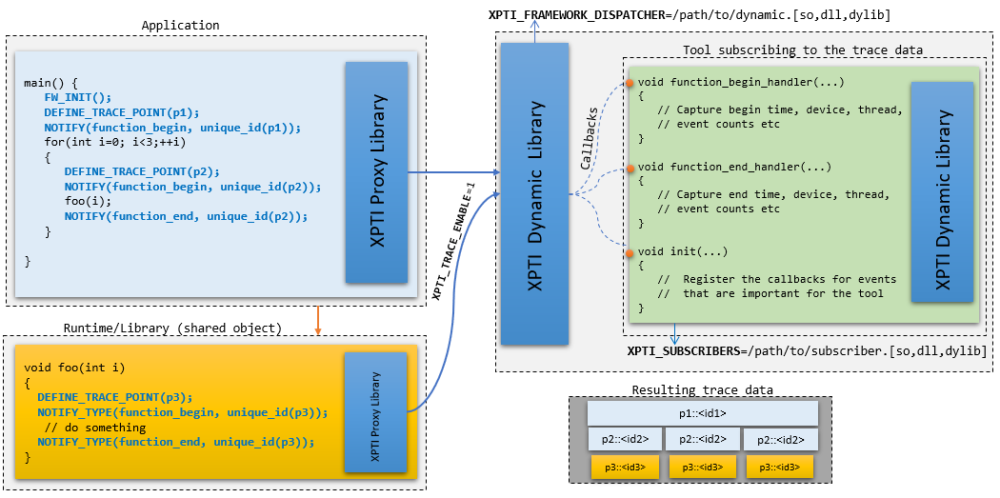

# XPTI Tracing Framework
<!-- TOC -->
- [XPTI Tracing Framework](#xpti-tracing-framework)
  - [Overview](#overview)
  - [Architecture](#architecture)
    - [The Dispatcher](#the-dispatcher)
    - [The Subscriber](#the-subscriber)
    - [Using the Reference Dispatcher and Subscriber](#using-the-reference-dispatcher-and-subscriber)
  - [Tracing Framework and Callback APIs](#tracing-framework-and-callback-apis)
    - [Brief API Concepts](#brief-api-concepts)
    - [`xptiInitialize`](#xptiinitialize)
    - [`xptiFinalize`](#xptifinalize)
    - [`xptiTraceEnabled`](#xptitraceenabled)
    - [APIs and Data Structures Exported by the Tracing Framework](#apis-and-data-structures-exported-by-the-tracing-framework)
    - [Trace Point Event](#trace-point-event)
      - [Creating the Payload](#creating-the-payload)
      - [Creating an Event that Represents the Trace Point](#creating-an-event-that-represents-the-trace-point)
      - [`xptiRegisterUserDefinedTracePoint`](#xptiregisteruserdefinedtracepoint)
      - [`xptiRegisterUserDefinedEventType`](#xptiregisteruserdefinedeventtype)
      - [`xptiMakeEvent`](#xptimakeevent)
      - [Notifying the registered listeners](#notifying-the-registered-listeners)
      - [`xptiNotifySubscribers`](#xptinotifysubscribers)
  - [Performance of the Framework](#performance-of-the-framework)
  - [Modeling and projection](#modeling-and-projection)
    - [Computing the cost incurred in the framework](#computing-the-cost-incurred-in-the-framework)

## Overview

In order to understand different parts of an application or library, the
ability to capture information about the application or library is needed.
Using such information, one can create meaningful representations such as
call-graphs, execution trace views etc. XPTI tracing framework is one such
framework that allows developers to instrument their code with XPTI API and
forward interesting or useful events during the application's execution, as
determined by the developer.

The XPTI tracing framework is a lightweight tracing framework that provides a
simple API for instrumenting code, which allows developers to capture
relationships through nodes and edges and track the execution of the
aforementioned nodes and other functions that may be of interest. The API also
provides the ability to associate each trace point with end-user source code
information such as source file, function name and line number, for example.
The goal of this framework is to provide a low overhead solution that tools
can use to build performance analytical models. This document describes the
different components of this framework and a testing methodology to determine
the cost of using this framework in your applications.

Current implementation of the framework uses std containers by default and is
thread-safe

> **NOTE:** This document is best viewed with [Markdown Reader](https://chrome.google.com/webstore/detail/markdown-reader/gpoigdifkoadgajcincpilkjmejcaanc)
> plugin for Chrome or the [Markdown Preview Extension]() for Visual Studio Code.

## Architecture

The framework consists of a proxy library that is a static library for use
within your applications. However, the proxy library consists of stubs that
forward calls to a dynamic component, if available and if tracing has been
enabled.  If tracing has not been enabled or the dynamic component not found at
run time, the stub implementations return immediately.

The framework currently employs environment variables to determine if tracing
has been enabled and where to find the dynamic component. Both of these must be set for it to successfully dispatch event streams.

1. The environment variable that indicates tracing has been enabled for the
   run is defined by `XPTI_TRACE_ENABLE`.

    To enable tracing, the possible values are `XPTI_TRACE_ENABLE=1` or
    `XPTI_TRACE_ENABLE=true` and to disable, the possible values are
    `XPTI_TRACE_ENABLE=0` or `XPTI_TRACE_ENABLE=false`.

    Currently, if the variable is not defined, it is assumed to be `true`.

2. The environment variable `XPTI_FRAMEWORK_DISPATCHER` points to the XPTI
   dispatcher or the dynamic component that allows the static library to load
   the shared object into memory and dispatch the event streams to subscribers
   of the event streams. The dispatcher or the dynamic component manages the
   subscribers to the event streams through an environment variable
   `XPTI_SUBSCRIBERS`, but this variable has no bearing on the functionality
   supported by the static library portion of the framework.



The above diagram describes the dependencies and/or the interactions between a
sample application or library that has been instrumented with XPTI API, the
XPTI dispatcher and the subscriber loaded by the dispatcher. All API calls
made by the application and the library go to the static library in this
diagram and if `XPTI_TRACE_ENABLE` is not enabled or if the path to the
dispatcher is not provided in the environment variable
`XPTI_FRAMEWORK_DISPATCHER`, then the calls to the static library
`xptiTraceEnabled()` return immediately.

In the case both these variables are enabled, then the calls will be forwarded
to the dynamic library which will attempt to load the subscribers pointed to by
the environment variable `XPTI_SUBSCRIBERS`. The hypothetical trace data
captured by the subscriber is shown as well under the `Resulting trace data`
part of the above diagram.

### The Dispatcher

The dispatcher is a dynamic library that implements the XPTI API and is
dynamically loaded by the static proxy library, if the static library is used to
link with the application or library. Linking with the dynamic library instead
of the static library is also an option, however the dynamic library will now
have to be shipped with the application. Using the static library allows
instrumented applications or libraries to get around this problem.

### The Subscriber

A subscriber in XPTI is a shared object that is dynamically loaded by the
dispatcher. Events generated by an instrumented application or library are
forwarded to the subscriber by the dispatcher through a callback mechanism. The
ownership of the subscriber is controlled by tools or applications that consume
the generated event streams and **must** follow the protocol or handshake
defined for an event stream.

There are three important things that a subscriber must implement to be
functional: (1) `xptiTraceInit`, (2) `xptiTraceFinish` and (3) callback
handlers. The `xptiTraceInit` and `xptiTraceFinish` API calls are used by the
dispatcher loading the subscriber dynamically to determine if the subscriber
is a valid subscriber. If these entry points are not present, then the
subscriber is not loaded.

The `xptiTraceInit` callback is called by the dispatcher when the generator of
a new stream of data makes a call to `xptiInitialize` for the new stream. The
implementation of the `xptiTraceInit` function is where the subscriber would
follow the specification or protocol defined for the stream to subscribe to
events from various trace  point types. The code snippet below shows an example
of such an implementation for the stream `"foo"`.

```cpp
#include "xpti_data_types.h"

XPTI_CALLBACK_API void xptiTraceInit
(
    unsigned int  major_version,  ///< Major version
    unsigned int  minor_version,  ///< Minor version
    const char   *version_str,    ///< Version as a string
    const char   *stream_name     ///< Stream name
) {
  if (stream_name) {
    // Only register callbacks if the major version is the
    // expected version and the stream is the stream type
    // you care about
    if(std::string("foo") != stream_name  &&
       major_version > 0 && major_version < 3)
      return;
    g_stream_id = xptiRegisterStream(stream_name);
    xptiRegisterCallback(g_stream_id, graph_create, graph_create);
    xptiRegisterCallback(g_stream_id, node_create, node_create);
    xptiRegisterCallback(g_stream_id, edge_create, edge_create);
    xptiRegisterCallback(g_stream_id, region_begin, algorithm_begin);
    xptiRegisterCallback(g_stream_id, region_end, algorithm_end);
    xptiRegisterCallback(g_stream_id, task_begin, trace_point_begin);
    xptiRegisterCallback(g_stream_id, task_end, trace_point_end);
    ...
  }
  else {
    // handle the case when a bad stream name has been provided
  }
}

XPTI_CALLBACK_API void xptiTraceFinish(const char *stream_name) {
  // Free any dynamically allocated memory for the stream
  // and any additional cleanup operation
  ...
}
```

The above code snippet shows the `xptiTraceFinish` call as well and this
function is used to clean up memory and any other data structures that were
allocated to handle the stream. The `xptiTraceFinish` call is made by the
dispatcher when the instrumented code is winding down a data stream by calling
 `xptiFinalize` for the stream.

The implementation of the callbacks is where attention needs to be given to the
handshake protocol or specification for a given stream the subscriber wants to
attach to and consume the data. The instrumented library may send additional
user data during the notification of each trace point and this data could be of
a different type for each trace point notification.

```cpp
XPTI_CALLBACK_API void trace_point_begin(
    xpti_trace_point_type_t  trace_type,
    xpti_trace_event_data_t *parent,
    xpti_trace_event_data_t *event,
    uint64_t                 instance,
    const void              *user_data)
{
    /// Capture time here
    my_time_t begin = get_my_time();
    // Capture thread id or cpu or whatever else
    my_device_t dev = get_my_device_instance();

    /// If access to the payload is required, it can be done like this.
    auto p = xptiQueryPayload(event);

    // Send the data off to some serializing buffer asynchronously
    emit_data(begin, dev,...);
}

```

For example, the specification for a given event stream, the trace point type
`graph_create` might send a data structure of a certain type as user_data and
`task_begin` might send a character string. Resolving the `user_data` parameter
requires strict conformance to the specification for the stream.

In addition to the `user_data`, the unique id that describes the event is
available under `event->unique_id`. This value will be unique for any given
tracepoint as it is created for each instance. Version 1.0.0 onwards, XPTI 
user a 128-bit key to resolve a tracepoint to guarantee uniqueness. In order to
support backward compatibility, a 64-bit universal ID is returned as well. This
64-bit universal ID or key is a uniqueue mapping from the 128-bit key to a 
64-bit value. The payload information for a given tracepoint will always remain
invariant across all instances of that tracepoint. 

> **NOTE:** A subscriber **must** implement the `xptiTraceInit` and
> `xptiTraceFinish` APIs for the dispatcher to successfully load the subscriber.

> **NOTE:** The specification for a given event stream **must** be consulted
> before implementing the callback handlers for various trace types.

### Using the Reference Dispatcher and Subscriber

The XPTI framework package provides a reference implementation of the XPTI
dispatcher and a sample subscriber that can be used to see what is being emitted
by any stream generated using XPTI. If you wish to skip the rest of the
document and inspect the generated stream, you can follow the steps outlined
below.

1. **Build the XPTI framework dispatcher:** The instructions below show how to
   build the library with standard containers.

    ```bash
    % cd xptifw
    % cmake -DXPTI_SOURCE_DIR=$SYCL_HOME/xpti ./
    % make
    ```

   The binaries will be built and installed in `lib/Release`. These include the
   dispatcher, a sample subscriber that prints the contents of the stream, the
   unit test and a performance characterization application for the framework.

2. **Run an instrumented SYCL application:**
   To enable the dispatcher and subscriber, set the following environment
   variables. The commands for enabling the environment variables are provided
   for Linux environments in the example below:

   ```bash
   % export XPTI_TRACE_ENABLE=1
   % export XPTI_FRAMEWORK_DISPATCHER=/path/to/libxptifw.so
   % export XPTI_SUBSCRIBERS=/path/to/libbasic_collector.so
   ```

   You can now run a SYCL application that has been linked with a runtime that
   supports the XPTI instrumentation and inspect the resulting stream. An
   example collector that subscribes to a specific stream is also provided under
   `xptifw/samples/syclpi_collector`.  This example demonstrates how a tool can
   selectively subscribe to a known stream and ignore all other traces. All
   trace notifications for the streams that have no callbacks registered will
   return immediately.

3. **Running the unit tests:** The unit tests included cover the exported API
   and incorporate some correctness tests.

   ```bash
   % <xptifw-dir>/lib/Release/xpti_tests
   ```
4. **Understanding the throughput of the framework:** This document discusses
   the performance of the framework in detail in the sections [Performance of the Framework](#performance-of-the-framework) and  [Modeling and projection](#modeling-and-projection). For details on the command line arguments,
   please refer to these sections.

   > **NOTE:** These tests rely on the availability of TBB for creating the
   multi-threaded tests and will not be created if TBB has not been enabled
   during the build process.

   ```bash
   % <xptifw-dir>/lib/Release/run_test --trace-points 1000 --type performance --overhead 1.5 --num-threads 0,1,2,3 --test-id 1,2 --tp-frequency 50
   ```

   The above command will run the performance tests in which 1000 trace points
   are created and each trace point visited twice. The trace point creation and
   notification costs are measured in single thread and multi-threaded
   scenarios and the output shows the throughput projection of the framework
   using the events/sec metric at 1.5% overheads to the application runtime.

## Tracing Framework and Callback APIs

The current version of the instrumentation API adopts a model where traces are
generated in pairs for a give trace scope and a scoped class is made available
that assists developers instrumenting their code. The APIs are divided into two
parts: (1) the public API exported by the tracing framework which are
implemented by the static library and the dispatcher and (2) the callback API
that tools will implement to create a subscriber.

### Brief API Concepts

The XPTI framework exports a small set of API functions that are a part of the
static library and dispatcher exports and deemed sufficient for the uses-cases
that have been considered so far. Since the primary goal is to gather execution
traces of compute elements in an application, the APIs address this scope for
now. Currently, they allow developers to capture relationship information as
nodes and edges in a graph, where the nodes represent a compute element or an
action with a latency associated with it and the edges represent the
dependencies between the compute elements which may be events or memory
objects. In addition to such relationship events, the API allows to you trace
arbitrary regions of code similar to conventional tracing methods.

For each interesting trace point in an application, a notification can be sent
out by the framework. However, if there are no subscribers to consume this
notification event, the framework returns immediately. This allows developers
that want to instrument applications or run-times to limit the overheads
considerably.

The API is documented in the file `xpti_trace_framework.h` that can be found
under `xpti/doc`. Some of the API functions and concepts that warrant
additional insight are discussed further.

### Universal ID

The framework is built on the concept of an universal ID that represents each
trace point uniquely. All notifications regarding a trace point will involve
the universal ID and gives software tools obseving the trace data an easy and
consistent mechanism to diferentiate between various trace points. Version
1.0.0 onwards, XPTI framework employs a 128-bit key to represent every trace
point in the code. Since each trace point is a location in the code, the 
universal ID is constructed from the `source file`, `function`, `line number`
and `column number` information for that trace point. This is sufficient to
guarantee uniqueness that the downstream componenets can rely on to attach
additional meaningful metadata with the trace point. In order to support 
legacy API usage and backward compatibility, a 64-bit universal ID is also 
generated from the 128-bit key and also guarantees uniqueness. The document
uses `universal ID` and `unique_id` interchangeably with the former representing
the concept and the latter, a variable that is the 64-bit representation of the
`universal ID`.

### `xptiInitialize`

When instrumenting an application, developers can decide how many streams they
want to generate. In some cases, organizing trace data by streams may be
preferable. The `xptiInitialize` function facilitates the organization of data
streams by allowing each component that generates a stream of data to make a
call to `xptiInitialize`. The types of events captured by the instrumentation
and the protocol for the handshake between the trace generation for a given
stream must be defined for a given stream as a contract or specification.
This allows subscribers to rely on this specification to implement a tool that
can consume this data and do something useful with it.

The `xptiIntialize` function reports to all the subscribers that a new stream
of data is about to be generated and the name of the stream along with some
version information of the stream is sent to the subscriber.

The version information is primarily provided to ensure that subscribers to the
event stream can choose not to handle an event stream if it is an unsupported
version. The up-to-date documentation of the XPTI API is always maintained in
the `xpti_trace_framework.h` header file. The application that is instrumented
**must** attempt to send the initialization only once, but the subscriber must
be prepared to handle the case when multiple initialization callbacks occur for
a given stream.

### `xptiFinalize`

The application or library being instrumented to generate a stream of data must
attempt to finalize the stream by making this call. This allows the dispatcher
to notify all the subscribers that a stream is about to end.

### `xptiTraceEnabled`

To recap some of the discussion in the [Architecture](#architecture) section,
this API call returns `true` in the following situations:

1. When `XPTI_TRACE_ENABLE` is not set, but the `XPTI_FRAMEWORK_DISPATCHER`
and `XPTI_SUBSCRIBERS` variables are set to valid libraries. This assumes that
a tool has been created and pointed to by `XPTI_SUBSCRIBERS` and the tool has
been linked against the dynamic component or dispatcher. In general, the
dynamic component or the dispatcher and the tool component or the subscriber
are owned by the tool attempting to listen to the instrumented stream of data.

2. When using the static library for linking in the instrumented application
or library, this call returns `true` only if `XPTI_FRAMEWORK_DISPATCHER` is
set to a valid library and `XPTI_TRACE_ENABLE` is not set to `false`.

### APIs and Data Structures Exported by the Tracing Framework

We will begin our discussion by detailing the various public APIs that are
exported by the framework and when they are meant to be used. The framework API
is what will be used by developers instrumenting their code. The primary goal
of the API is to support the instrumentation of code that may or may not fall
into function boundaries.

* First, the places in the code where instrumentation is warranted should be
  identified. Each trace point is unique and will be associated with a
  `payload` data structure that encapsulates: (1) a unique name, such as a
  function or kernel name or something meaningful if the trace point marks a
  section of code, (2) the source file it is located in, (3) the line number
  where this interesting event occurs and (4) the column number of the
  interesting event. Compilers such as `gcc`, `clang` and the Intel compilers
  can generate all of this information easily through builtin functions.
* Secondly, an event must be created for this trace point region and this
  process of creating an event will use the `payload` information and create
  an event. If the payload has already been registered, then the previously
  registered and associated event will be returned. This process will also
  create a `unique_id` for the event.
* Thirdly, the scope of this trace point must be determined and for a given
  scope, as in a related pair of events, the `unique_id` created at the
  begin trace point **must** be preserved and used for the end trace point as
  well.
* Finally, the callbacks registered for these types of events must be notified.

### Trace Point Event

The trace point event describes the event used to notify the subscriber and is
usually associated with a payload that describes the event. Since application
code is being instrumented with XPTI, the payload may consist of a `function`
`name`, `source file name` and `line number`, which forms a unique combination
of strings and numbers that is used to create the `unique_id` associated with
an event. Using the `event` or the `unique_id`, one should be able to query the
`payload` information. When a notification occurs for a trace point, the trace
point event and trace point type information is sent to the subscriber. A given
event may be used to notify subscribers as multiple trace point types. For
example, a node may represent a computational entity and an event created for
the node may be emitted as `node_create`, `task_begin` and `task_end`
notifications to record the creation, the beginning of the execution of an
instance of the node and when the execution of that instance has completed.

#### Creating the Payload

We will first look at the `xpti::trace_point_payload_t` data structure that
is defined in `xpti_data_types.h`.

```cpp

xpti::payload_t p("function1", "main.cpp", 104, 5, function1);

```

The payload data structure can be created with a set of unique descriptors for
the region of code being instrumented, such as a function name, source file
name and line number, for example. However, it can also take in a function
name and pointer to the function or just a pointer to the function that
uniquely describes the payload that will be used to create a trace point
event. This information is used by the `xptiMakeEvent` function to create a
`unique_id` for the trace point event.

The next section looks at using the payload information to create a trace point
event. Each trace point is unique, from a language or code section standpoint.
A trace point maybe visited multiple times, but the payload and the event
describing the trace point will always be the same. The tracing framework must
guarantee that when a trace point is visited, the same `unique_id` is
retrieved for it. For frequent visits to the same trace point site, we must be
able to look up the `unique_id` of the payload efficiently or we cache the
information at the trace point location.

#### Creating an Event that Represents the Trace Point

Once a payload structure has been created, it is used to associate the trace
point that this payload represents to an event that captures additional
information about the trace point. The framework has a list of predefined trace
point types that may be used to mark various trace points with an appropriate
type. They are declared in the header file `xpti_data_types.h` and are used to
describe the creation of a graph, node, edges or the instantiation of a node as
`task_begin` and `task_end` pair of trace point notifications.
These trace points represent the types of actions commonly associated with
instrumenting a library or application. However, in cases where there is no
direct mapping from the predefined trace point types to a language structure or
if one needs to describe an action that is orthogonal to code structure such as
diagnostic information for executing code, the framework allows each
instrumentation stream to extend the available trace point types with new trace
point types that map to these unsupported constructs.

#### `xptiRegisterUserDefinedTracePoint`

This API allows streams to extend the existing trace point types and generate
new types that map to the action about to be described by this API. The
description of the API is followed by a code example that shows the use of
this API.

```cpp
   uint16_t xptiRegisterUserDefinedTracePoint(
                  const char *vendor_name,
                  uint8_t user_defined_tp);
```

| Argument          | Description                                                                                                                                                                                                                                                                                            |
| ----------------- | ------------------------------------------------------------------------------------------------------------------------------------------------------------------------------------------------------------------------------------------------------------------------------------------------------ |
| `vendor_name`     | The name of the tool or vendor implementing the tool that is describing this extension to the trace points.                                                                                                                                                                                            |
| `user_defined_tp` | The user defined trace point which is of type `uint16_t`. The 8 most significant bits of the 16-bit value encodes the `vendor_name` and 8 least significant bits are used to encode the extensions for this tool. A maximum of **128** new user defined trace points can be created per `vendor_name`. |

The code example of extending the default or pre-defined trace point types is
shown below. As you can see in the example, the user defined trace point types
are initialized in the `enum` using the macros `XPTI_TRACE_POINT_BEGIN` and
`XPTI_TRACE_POINT_END` for the same trace point type `0`. By default, the
trace point types are designed to define the scope of the action be described.
This requires 1-bit to represent begin or end, which leaves the remaining
7-bits to describe 128 unique trace point extensions for a given `tool_name`.

```cpp
typedef enum {
  my_read_begin = XPTI_TRACE_POINT_BEGIN(0),
  my_read_end = XPTI_TRACE_POINT_END(0),
  my_allocate_begin = XPTI_TRACE_POINT_BEGIN(1),
  my_allocate_end = XPTI_TRACE_POINT_END(1)
}tp_extension_t;
...
uint16_t tp1_start = xptiRegisterUserDefinedTracePoint("myTest",
                      my_read_begin);
uint16_t tp1_end = xptiRegisterUserDefinedTracePoint("myTest",
                      my_read_end);
uint16_t tp2_start = xptiRegisterUserDefinedTracePoint("myTest",
                      my_allocate_begin);
uint16_t tp2_end = xptiRegisterUserDefinedTracePoint("myTest",
                      my_allocate_end);
...
xptiNotifySubscribers(stream_id, tp1_start, parent, event, instance,
                      nullptr);
```

If the callback handler for this stream needs to know if this is an extension
or a predefined type, they can use the following macros to decipher the trace
point type.

```cpp
uint8_t tool_vendor_id = XPTI_TOOL_ID(tp1_start);
uint8_t tp_type = XPTI_EXTRACT_USER_DEFINED_ID(tp1_start);

if(tool_vendor_id == 0) {
    // Default pre-defined type
}
else {
    // User-defined trace type
    // Here: tp_type will be tp_extension_t::my_read_begin
}
```

This mechanism allows different kinds of information to be captured and the
trace point type describes the type of information expected by the
notification. The trace point type is only used when notifying the subscribers
of an event with the trace point type acting as a qualifier for the event.

#### `xptiRegisterUserDefinedEventType`

This API allows streams to extend the existing trace point event types and
generate new types that map to the semantic description of the trace event
being created. The description of the API is followed by a code example that
shows the use of this API.

```cpp
   uint16_t xptiRegisterUserDefinedTracePoint(
                  const char *vendor_name,
                  uint8_t user_defined_event);
```
| Argument             | Description                                                                                                                                                                                                                                                                                     |
| -------------------- | ----------------------------------------------------------------------------------------------------------------------------------------------------------------------------------------------------------------------------------------------------------------------------------------------- |
| `vendor_name`        | The name of the tool or vendor implementing the tool that is describing this extension to the event types.                                                                                                                                                                                      |
| `user_defined_event` | The user defined event which is of type `uint16_t`. The 8 most significant bits of the 16-bit value encodes the `vendor_name` and 8 least significant bits are used to encode the extensions for this tool. A maximum of **128** new user defined event types can be created per `vendor_name`. |

Similar to trace point types, the `xpti::trace_event_type_t` can also be
extended. The events that are predefined by the framework fall under `{graph,`
`algorithm, barrier, scheduler, async, lock, offload_read, offload_write,`
`user_defined}`. Let's take the example of having to extend the event types to include a diagnostic category.

```cpp
typedef enum {
  my_diagnostic_A = XPTI_EVENT(0),
  my_diagnostic_B = XPTI_EVENT(1)
} event_extension_t;
...
uint16_t my_ev1 = xptiRegisterUserDefinedEventType("myTest", my_diagnostic_A)
...
uint64_t InstanceNo;
MyEvent = xptiMakeEvent("application_foo", &Payload,
                        my_ev1, xpti::trace_activity_type_t::active,
                        &InstanceNo);
```

When this information is provided to the callback handlers in subscribers
through notifications, the handler can decide what it wants to do with the
extended types. If it is not designed to handle it, it can choose to ignore
the event. On the other hand, a subscriber that is designed to handle it must
conform to the specifications defined by the stream that is generating the
extended type events.

```cpp
uint8_t tool_vendor_id = XPTI_TOOL_ID(tp1_start);
uint8_t ev_type = XPTI_EXTRACT_USER_DEFINED_ID(tp1_start);

if(tool_vendor_id == 0) {
    // Default pre-defined type
}
else {
    // User-defined event type
    // Here: tp_type will be event_extension_t::my_diagnostic_A
}
```

#### `xptiMakeEvent`

The `xptiMakeEvent` combines the payload information with information about the trace point being defined to create an `xpti::trace_event_data_t`.

```cpp
   xpti::trace_event_data_t *xptiMakeEvent(const char *name,
                    xpti::payload_t *payload, uint16_t event,
                    xpti::trace_activity_type_t activity,
                    uint64_t *instance_no);
```

| Argument      | Description                                                                                                                                                                                                                                                                                                                                                    |
| ------------- | -------------------------------------------------------------------------------------------------------------------------------------------------------------------------------------------------------------------------------------------------------------------------------------------------------------------------------------------------------------- |
| `name`        | Name of the event, which is typically a function or kernel name.                                                                                                                                                                                                                                                                                               |
| `payload`     | The payload that this trace event represents. The payload in `XPTI` represents the source file, function name and line number, if available. If the source information is not available, it may contain a function name and code pointer virtual address or just the virtual address. This allows one to get the payload as meta-data for a given trace point. |
| `event`       | The event type this trace point represents. It could be one of the predefined types or an extended type.                                                                                                                                                                                                                                                       |
| `activity`    | Describes the activity type, as in active time or overhead time etc.                                                                                                                                                                                                                                                                                           |
| `instance_no` | If `xptiMakeEvent` is used each time this code location is visited to create or look up a previously created event, the `instance_no` parameter is incremented to indicate the instance ID of the current visit.                                                                                                                                               |

The created trace event data type is returned. In case the payload information
is the same, a previously created event is returned. If global `user_data`
needs to be specified for this trace event that may be used by tools, it can
be allocated and stored in `xpti::trace_event_data_t` structure under
`user_data`.

The code sample below shows a sample code snippet that creates such an trace
point event using a payload and uses the created event to notify all
subscribers of the event qualified by a trace point type.

```cpp
if ( xptiTraceEnabled() ) {
  // example
  uint64_t instance_no;
  auto stream_id = xptiRegisterStream("myStream");
  xptiInitialize("myStream", 1, 0, "myStream 1.0");
  xpti::payload_t p("application_graph");
  auto event = xptiMakeEvent( "app", &p,
                   xpti::trace_event_type_t::graph,
                   xpti::trace_activity_type_t::active,
                   &instance_no);
}
...
if (event && xptiTraceEnabled()) {
  // If the event has been created, then notify
  // all subscribers about the graph creation
  xptiNotifySubscribers(stream_id,
                        xpti::trace_point_type_t::graph_create,
                        nullptr, // no parent
                        event,
                        instance_no,
                        nullptr // no user data);
}

```

#### Notifying the registered listeners

As discussed in previous sections, creating a trace point is only one part of a trace point definition. The part that actually lets a tool know that such a trace event occurred is through a notification of the aforementioned event. In this section, we will describe the API and its use.

#### `xptiNotifySubscribers`

```cpp
   xpti::result_t xptiNotifySubscribers(uint8_t stream_id,
                      uint16_t trace_type,
                      xpti::trace_event_data_t *parent,
                      xpti::trace_event_data_t *event,
                      uint64_t instance,
                      const void *temporal_user_data);
```

| Argument             | Description                                                                                                                                                       |
| -------------------- | ----------------------------------------------------------------------------------------------------------------------------------------------------------------- |
| `stream_id`          | The stream that this notification belongs to. The stream ID is obtained from `xptiRegisterStream`.                                                                |
| `trace_type`         | The trace point type that describes the current notification. It could be one of the pre-defined types or a user-extension.                                       |
| `parent`             | A parent trace event, if present.                                                                                                                                 |
| `event`              | The current trace event for which the notification is being sent out.                                                                                             |
| `instance`           | This value indicates the instance of the current trace event. If this is being used to monitor functions, this value should indicate the call count at that time. |
| `temporal_user_data` | This is a field that holds per instance user data and is valid for just that value of `instance`                                                                  |

The code example below shows an example 'C' code that is instrumented with the
framework API and this will generate traces for the functions in the program.
However, in this example, we use the helper scoped class provided by the
framework to emit notifications for the begin and end of the scope through
the  `xpti::trace_point_type_t::task_begin` and
`xpti::trace_point_type_t::task_end` automatically. In this example, the per instance user data is not sent and the `scoped_notify` defaults that to `nullptr`.

```cpp
void function1() {
  uint64_t instance_id = 0;
  xpt::trace_event_data_t event;
  if (xptiTraceEnabled()) {
    xpti::payload_t p("function1","main.cpp",104, 2,function1);
    event = xptiMakeEvent("function1",&p,
            xpti::trace_event_type_t::algorithm,
            xpti::trace_activity_type_t::active, &instance_id);
  }
  xpti::framework::scoped_notify ev("myStream",
            xpti::trace_point_type_t::region_begin, nullptr, &event,
            instance_id);
  for(int i = 0; i < 5; ++i ) {
      function2();
  }
}
```

## Performance of the Framework

In order to estimate the overheads one could experience by using the framework,
this section will outline a couple of scenarios. Some of the key operations
that would result in overheads are listed below. For each of these operations,
we will construct scenarios that will provide us with measurements to determine
how many events/sec we can process before the overheads start to become a
problem. We will use an overhead limit of 1% as this data will be used to
build an analytical model in the future.

| Data structure    | Operation        | Description                                                                                                                                                                                                                                                                                                                                                          |
| ----------------- | ---------------- | -------------------------------------------------------------------------------------------------------------------------------------------------------------------------------------------------------------------------------------------------------------------------------------------------------------------------------------------------------------------- |
| String table      | String insert    | Every string that is exposed to the framework is registered with the string table and only the string IDs used                                                                                                                                                                                                                                                       |
|                   | String lookup    | The lookup of a string in the string table can be implicit or explicit. For example, when a previously defined payload is submitted again, the strings present will be registered. However, there is an early exit if the string already exists in the table due to an implicit lookup.                                                                              |
| Payload           | Creation         | A payload constructor may take in `function name`, `source file name`, line number, column number and an address or a `function name` and an address or just an address. Whenever strings are presented, they are first registered with the string table and the string IDs are used in the creation of a hash that is used to generate a `unique_id` for the event. |
| Trace point event | Metadata add     | One can add arbitrary number of <key, value> pairs to an event as strings. These strings will be registered with the string table and the metadata is maintained as a map of two string IDs.                                                                                                                                                                         |
|                   | Metadata lookup  | The metadata associated with a trace point event is looked up explicitly in the string table.                                                                                                                                                                                                                                                                        |
|                   | Creation         | Includes string table registration for the strings contained in the payload, the hash generation for a payload and insertion of the payload and event into a map.                                                                                                                                                                                                    |
|                   | Framework lookup | If a trace point has already been created, the event can be looked up using its `unique_id`.                                                                                                                                                                                                                                                                         |
|                   | Notification     | Events that are created are notified to all subscribers                                                                                                                                                                                                                                                                                                              |
| Subscriber        | Callback handler | When a notification is received by the subscriber, the event is handled. The callback handlers must be efficient to minimize the overheads.                                                                                                                                                                                                                          |

Using the operations described in the table above, a set of tests are designed
to evaluate the performance of these operations in near real-world scenarios.
The tests are present under `xptifw/basic_test` and report these results in
tabular form. The performance test in particular accepts various configuration
parameters from the command line. An example command is shown in the section
below.

```bash
run_test --trace-points 1000 --type performance --overhead 1.5 --num-threads 0,1,2,3 --test-id 1,2 --tp-frequency 50
```

The above command will run the test for 1000 trace points and compile the
performance measurements for the set of threads given as input with a maximum
overhead at 1.5% and for every trace point created, it will be visited twice.
A description of the command line arguments is provided in detail below:

> **--type, -y [`required`]**
>  - This flag takes in the type of tests that need to be run. The allowed
options are **[semantic, performance]**.
> - **semantic**: Runs semantic tests that test the correctness of the
framework operations and they are split into three separate tests.
>   1. Performs string table tests on a 1000 strings
>   2. Performs tests on trace point events by checking to see if the same
event is returned for the same payload and so on.
>   3. Performs notification tests to see if trace events are notified
correctly and record the instances of notifications per events.
> - **performance**: Runs performance tests on the provided input
configuration and these tests measure the cost of various operations used in
the framework. These tests are split into two separate tests.
>   1. Data structure tests that capture the average cost of string table
inserts, lookups, trace point event creation and lookup using the same
payload or `unique_id` for the event and notification.
>   2. Runs instrumentation tests and projects the number of events that can
be serviced per second using the configuration provided on the command line.
These tests are where the **--overhead** and **--tp-frequency** arguments are
used.

> **--trace-points, -t [`required`]**
> - Number of trace point events to create and use for the test. The expected
range is **[10-100000]**.

> **--test-id, -i [`required`]**
> - Takes in a list of tests that are comma separated and runs the requested
tests. This command line argument takes in a range as well and the format is
described below:
>   1. Comma separated sequence: --test-id 1,2,3
>   2. Range description: --test-id 1:3:1

> **--num-threads, -n [`required`]**
> - Takes in a list of thread counts to use for the requested tests.
>   1. Comma separated sequence: --num-threads 0,1,2,4,8,12,16
>   2. Range description: --num-threads 0:2:1,4:16:4

> **--tp-frequency, --f**
>  - The trace point creation frequency basically allows the test to
determine the total number of trace point visits to perform for every trace
point event that is created. If the trace point creation frequency is 10%,
then every trace point event that is created must be visited 10 times. Since
we know how many trace point events were requested from the command line
(**--trace-points N**), we multiply this value (N) by 100/f where f = trace
point frequency in percent to get the total number of trace point visits.
> - So, if number of trace points is 5000 and trace point frequency is 10%,
the total number of trace point visits the test is going to perform is 5000 x
1/0.1 = 50000

>**--overhead**
> - The overhead input allows the test framework to use the measured
performance of the trace point creation and notification to come up with an
estimate of how many events can be serviced per second with the given
configuration.
> - The default overheads for which the events/sec are computed is **1%**
> - If the overheads desired is 1%, then the following formula is used to
>   compute the events/sec:
>    <p><b>total cost</b> of instrumentation <b>(I)</b> = (cost of trace point
>    creation + cost of notification)</p>
>    <p>So, if --trace-points 5000 --tp-frequency 10, this will be:</p>
>    <p><b>I = 5000xCost(TP Create) + 50000xCost(Notify)</b></p>
>    <p><b>Average cost (A) = I/50000</b>,  for 50000 events notified</p>
>    <p> This cost A does not take into account the cost of the callback
>    handler. In our projections, we use a handler cost of 10ns, 100ns and
>    500ns to get the events/sec that can be serviced. On an average, the
>    handler costs for real-world cases will be somewhere between 80ns-400ns.
>    <p>So, if the average cost is A and this is 1% overhead, the total run
>    time must be <b>100xA</b> ns</p>
>    <p><b>Events/second E = 1000,000,000 ns/(100xA)ns</b></p>
>

Using the metrics described above, we run the tests with varying overheads and
trace point creation frequencies to determine the maximum number of events
that can be serviced for that configuration. Some sample configurations are
shown below:

- Configuration where each trace point event created is only visited **once**
    ```bash
    run_test --trace-points 5000 --type performance --num-threads 0,1,2,4   --test-id 1,2 --tp-frequency 100
    ```
- Configuration where each trace point event is visited **twice**
    ```bash
    run_test --trace-points 5000 --type performance --num-threads 0,1,2,4   --test-id 1,2 --tp-frequency 50
    ```
- Configuration where each trace point event is visited **ten** times
    ```bash
    run_test --trace-points 5000 --type performance --num-threads 0,1,2,4   --test-id 1,2 --tp-frequency 10
    ```

## Modeling and projection

In order to determine the number of events that the framework can service in a
second, the performance tests use the following approach. If the total
instrumentation cost is 1&#181;s and for this cost to be under 1% total
overhead, the amount of work that needs to be accomplished for every trace
event would be 1&#181;s x 100 = 100&#181;s. In this case, the maximum number
of events that can be notified/serviced would be:

 1 sec/100&#181;s = 1000000&#181;s/100&#181;s = 10000 events/sec

The total instrumentation cost would include *some of the time in the
infrastructure in the framework* and the *cost of handling each notification
through callbacks* in the subscriber.

### Computing the cost incurred in the framework

On an average, some trace points are visited only once and others 10s-100s of
times. We assume that each trace point created will be visited at least 10
times. The command line arguments that would test such a configuration is
shown below.

    ```bash
    run_test --trace-points 10000 --type performance --num-threads 0,1,2,4   --test-id 1,2 --tp-frequency 10

We take average cost of a trace point event creation and the cost of 10
notifications for each such event as it is visited 10 times to form the basis
of the cost incurred within the framework. This information is reported by
the performance test. The total instrumentation cost as discussed in the
previous section comprises of a framework cost and a callback handler cost in
the subscriber.

Framework cost **FW**<sub>***cost***</sub> = Avg{TP<sub>*create*</sub> + 10 x
TP<sub>*notify*</sub>}

Subscriber cost **Callback**<sub>***cost***</sub> = **C<sub>*t*</sub>** which
could be anywhere in the range [10-10000]ns

Total cost **Cost**<sub>***total***</sub> = **FW**<sub>***cost***</sub> +
**C<sub>*t*</sub>**

Using the information from the report or one such instance captured in the
table above, we know that:

**FW**<sub>***cost***</sub> = ~55ns

Using different values for **C<sub>*t*</sub>** = [10, 100, 500, 1000]ns, we
get the table that shows the events/sec that can be serviced for total
instrumentation cost for the configuration. It can be noticed that as the
callback handler costs increase, the events/sec is inversely proportional to
the callback handler costs. The work unit cost for determining the number of
events/sec is given by:

**W**<sub>***cost***</sub> = **100** x [**FW**<sub>***cost***</sub> +
**C<sub>*t*</sub>**] for the configuration that limits overheads to 1%.

The more times a trace point event is visited, the more events per second can
be serviced by the framework as the cost of a trace point event creation can
be amortized over all the visits to the same trace point. However,
**C<sub>*t*</sub>** will eventually limit the events/sec when they get to be
significantly larger than **FW**<sub>***cost***</sub>.

> **NOTE:** All measurements reported in this document were measured on an NUC
> form-factor machine with Intel&reg;  Core&trade; i7-8559U @ 2.7 GHz processor
> running Ubuntu 18.04. The tests were compiled to use Threading Building
> Blocks concurrent containers for these runs.

| Operation                                                | Statistic                | Scenario                                                                                                                                                                                                                                                                                              | Count  | Framework Cost(ns) |
| -------------------------------------------------------- | ------------------------ | ----------------------------------------------------------------------------------------------------------------------------------------------------------------------------------------------------------------------------------------------------------------------------------------------------- | ------ | ------------------ |
| String table insertion                                   | Cost/insertion           | Create a large number of strings (>1000) and insert them into the table. Measure the average cost of multi-threaded insertion.                                                                                                                                                                        | 10000  | ~**150-500**ns     |
| String table lookup                                      | Cost/lookup              | Look up the strings added in the insertion test in random order and measure the average cost of the lookup.                                                                                                                                                                                           | 20000  | ~**40**ns          |
| String table insert/lookup                               | Cost of insert/lookup    | Strings that are added to the string table may be looked up multiple times. On an average, we assume that ever string added to the string table is looked up twice. If strings are looked up more often than the twice assumed in this test, then the average cost of insertion/lookup will be lower. | 30000  | ~**130**ns         |
| Trace point creation                                     | Cost/creation            | Create unique trace points and measure the average cost for each creation.                                                                                                                                                                                                                            | 10000  | ~**1100**ns        |
| Trace point creation                                     | Cost/creation            | Attempt to create previously created trace points again and measure the average cost for each creation. Since the payloads will be the same, there should be an early exit after it is determined that they are the same.                                                                             | 100000 | ~**275**ns         |
| Trace point lookup using `unique_id`(FW lookup)          | Cost/lookup              | This time will purely be the cost of lookup of finding the trace point event, given its `unique_id`.                                                                                                                                                                                                  | 100000 | ~**35**ns          |
| Trace point event caching                                | Cost/lookup              | If the trace point event is cached at the event site, then this cost is 0. This is the most efficient mode of using it and amortizes the cost od trace point event creation the best.                                                                                                                 | 100000 | ~**0**ns           |
| Trace event notification                                 | Cost/notification        | Measure the average cost of notification. Here the the callback handler registered will return immediately. The callback handler overheads are modeled separately when the maximum number of events that can be serviced per sec are computed.                                                        | 100000 | ~**10**ns          |
| Trace event composite cost [**FW**<sub>***cost***</sub>] | Average cost/trace point | Create N unique trace points and MxN trace point lookups + MxN notifications. Measure the total time and get the average using MxN as the denominator.                                                                                                                                                | 100000 | ~**55**ns          |

> **NOTE:** The trace point, as implemented in the code block in the previous
> section can lead to significant runtime overheads as the framework has to
> lookup the `unique_id` of the payload provided with the trace point and this
> lookup can be costly. It is recommended that events created for each trace
> point are cached locally for subsequent use. An example implementation of
> this optimization is is shown in the code block below using a static
> variable, for example. If the instrumentation is a part of a class, then the
> event can be saved as a member variable.

```c++
void function1() {
  uint64_t instance_id = 0;
  static xpti::trace_event_data_t *f1_event = nullptr;
  //  Only create the event if it hasn't already been created.
  //  When the data structure f1_event is initialized, the
  //  unique id is set to invalid_id.
  if (xptiTraceEnabled() && !f1_event) {
    xpti::payload_t p("function1","main.cpp",104, 2,function1);
    f1_event = xptiMakeEvent("function1", &p,
                             xpti::trace_event_type_t::algorithm,
                             xpti::trace_activity_type_t::active,
                             &instance_id);
  }
  xpti::framework::scoped_notify ev("myStream",
        xpti::trace_point_type_t::region_begin,
        nullptr, f1_event, instance_id);
  for(int i = 0; i < 5; ++i ) {
      function2();
  }
}
```

> **NOTE:** Using the framework cost, **FW**<sub>***cost***</sub> = ~55ns, and
> a set of callback handler costs, we get the following table that shows the
> events/sec that can be handled by XPTI for a given configuration.

| Trace points | Threads | Overhead | Events/sec @**C<sub>*t*</sub>**=10ns | Events/sec @ **C<sub>*t*</sub>**=100ns | Events/sec @ **C<sub>*t*</sub>**=500ns | Events/sec @ **C<sub>*t*</sub>**=1000 |
| ------------ | ------- | -------- | ------------------------------------ | -------------------------------------- | -------------------------------------- | ------------------------------------- |
| 10000        | Serial  | 1%       | ~150K                                | ~64K                                   | ~18K                                   | ~9.5K                                 |
|              | 4       | 1%       | ~150K                                | ~64K                                   | ~18K                                   | ~9.5K                                 |
|              | Serial  | 2%       | ~300K                                | ~127K                                  | ~36K                                   | ~19K                                  |
|              | 4       | 2%       | ~290K                                | ~125K                                  | ~36K                                   | ~19K                                  |
| 1000         | Serial  | 1%       | ~165K                                | ~66K                                   | ~18K                                   | ~9.5K                                 |
|              | 4       | 1%       | ~165K                                | ~66K                                   | ~18K                                   | ~9.5K                                 |
|              | Serial  | 2%       | ~360K                                | ~137K                                  | ~37K                                   | ~19K                                  |
|              | 4       | 2%       | ~345K                                | ~135K                                  | ~37K                                   | ~19K                                  |

The above data from the table is only provided as a guideline on what to
expect with the instrumentation. The events/second can be quite high if the
callback handlers are written efficiently. So the range of events that can be
serviced can be ~300,000 to 10000 per second depending on the cost of handling
the callbacks.
